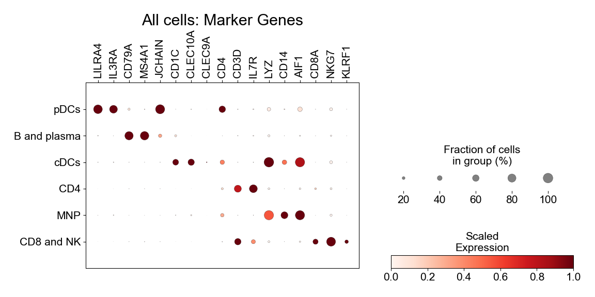

Extended 1
================

## Set up

Load R libraries

``` r
library(reticulate)
library(tidyverse)
library(rmarkdown)
library(rlang)
library(parameters)
library(RColorBrewer)
library(ComplexHeatmap)
library(circlize)
library(Matrix)
library(glue)
library(DESeq2)
library(fgsea)
library(ggforestplot)
library(ggbeeswarm)
library(patchwork)
library(lme4)
library(ggstance)
library(knitr)
library(grid)

wd <- '/projects/home/sramesh/github/myocarditis'
setwd(glue('{wd}/functions'))
source('de.R')
source('gsea.R')
source('masc.R')
source('plot_masc.R')
source('blood_abundance.R')
source('blood_troponin.R')

use_python("/projects/home/nealpsmith/.conda/envs/updated_pegasus/bin/python")
```

Load Python packages

``` python
import pandas as pd
import pegasus as pg
import os
import sys
import warnings
sys.path.append("/projects/home/sramesh/github/myocarditis/functions")
import python_functions as pyfun

wd = '/projects/home/sramesh/github/myocarditis'
warnings.filterwarnings('ignore')
```

Read in single-cell data and cluster names

``` python
adata = pg.read_input('/projects/home/sramesh/myo_final/blood/final/myo_blood_global.zarr')
cluster_annots = pd.read_excel('/projects/home/sramesh/myo_final/blood/other_stuff/cluster_annotations.xlsx')
name_dict = dict(zip(cluster_annots['lineage_cluster_mod'], cluster_annots['cluster_name_w_num']))
```

    ## 2024-02-05 20:33:19,845 - pegasusio.readwrite - INFO - zarr file '/projects/home/sramesh/myo_final/blood/final/myo_blood_global.zarr' is loaded.
    ## 2024-02-05 20:33:19,845 - pegasusio.readwrite - INFO - Function 'read_input' finished in 5.36s.

``` r
obs <- read_csv('/projects/home/sramesh/myo_final/blood/final/myo_blood_global_obs.csv')
cluster_annots <- readxl::read_excel('/projects/home/sramesh/myo_final/blood/other_stuff/cluster_annotations.xlsx')
```

## Extended Data 1H

``` python
cluster_order = ['pDCs', 'B and plasma', 'cDCs', 'CD4', 'MNP', 'CD8 and NK']
gene_order = ['LILRA4', 'IL3RA', 'CD79A', 'MS4A1', 'JCHAIN', 'CD1C', 'CLEC10A', 'CLEC9A', 'CD4', 'CD3D', 'IL7R', 'LYZ',
              'CD14', 'AIF1', 'CD8A', 'NKG7', 'KLRF1']
pyfun.make_gene_dotplot(adata.to_anndata(), cluster_order, gene_order, 'All cells', figsize=(5, 4), names='lineage')
```



## Extended Data 1I

``` r
# run masc for pre- vs post-steroid by lineage (or read in file if it exists)
if (!file.exists(glue('{wd}/output/masc_for_steroid_treatment_by_lineage.csv'))) {
  lineage_masc_res <- run_masc(obs,
                               c('steroid_treatment', 'post_steroid', 'pre_steroid'),
                               'lineage')
  write_csv(lineage_masc_res, glue('{wd}/output/masc_for_steroid_treatment_by_lineage.csv'))
} else {
  lineage_masc_res <- read_csv(glue('{wd}/output/masc_for_steroid_treatment_by_lineage.csv'))
}

lineage_masc_res$lineage <- str_replace_all(lineage_masc_res$lineage, '_', ' ')

masc_helper(obs,
            c('steroid_treatment', 'post_steroid', 'pre_steroid'),
            'lineage',
            masc_res = lineage_masc_res,
            colors = c('darkolivegreen4', 'darkolivegreen2'))
```

    ## Warning: The `groupOnX` argument of `position_quasirandom()` is deprecated as of ggbeeswarm 0.7.1.
    ## ℹ The axis to group on is now guessed from the data. To override, specify orientation="x" or "y".
    ## This warning is displayed once every 8 hours.
    ## Call `lifecycle::last_lifecycle_warnings()` to see where this warning was generated.

    ## Warning: Transformation introduced infinite values in continuous x-axis

    ## Warning: Using the `size` aesthetic with geom_rect was deprecated in ggplot2 3.4.0.
    ## ℹ Please use the `linewidth` aesthetic instead.
    ## This warning is displayed once every 8 hours.
    ## Call `lifecycle::last_lifecycle_warnings()` to see where this warning was generated.

    ## Warning: The following aesthetics were dropped during statistical transformation: x
    ## ℹ This can happen when ggplot fails to infer the correct grouping structure in the data.
    ## ℹ Did you forget to specify a `group` aesthetic or to convert a numerical variable into a factor?

    ## Warning: `position_quasirandom()` requires non-overlapping x intervals

    ## Warning: Using the `size` aesthetic with geom_segment was deprecated in ggplot2 3.4.0.
    ## ℹ Please use the `linewidth` aesthetic instead.
    ## This warning is displayed once every 8 hours.
    ## Call `lifecycle::last_lifecycle_warnings()` to see where this warning was generated.

    ## Warning: Using the `size` aesthetic with geom_polygon was deprecated in ggplot2 3.4.0.
    ## ℹ Please use the `linewidth` aesthetic instead.
    ## This warning is displayed once every 8 hours.
    ## Call `lifecycle::last_lifecycle_warnings()` to see where this warning was generated.

<!-- -->

## Extended Data 1J

``` r
#### first run de
if (!file.exists(glue('{wd}/output/lineage_de_by_steroid_treatment_all_results.csv'))) {
  counts <- read_counts(glue("{wd}/output/pb_counts_by_sample_id_and_lineage.csv"))
  meta <- read_meta(glue("{wd}/output/pb_meta_by_sample_id_and_lineage.csv"))
  meta <- meta %>%
    filter(steroid_treatment != "NA") %>%
    filter(!str_detect(lineage, "Doublet"))
  steroid_contrast_vec <- c('steroid_treatment', 'pre_steroid', 'post_steroid')
  steroid_lineage_results <- run_de_by_comp_var(counts, meta, glue('{wd}/output/lineage'), steroid_contrast_vec,
                                                deseq_formula = formula("~ steroid_treatment"))
} else {
  steroid_lineage_results <- read_csv(glue('{wd}/output/lineage_de_by_steroid_treatment_all_results.csv'))
}

#### now plot barplot
colors <- c('darkolivegreen2', 'darkolivegreen4')
cluster_order <- c('pDCs', 'B and plasma', 'cDCs', 'CD4', 'MNP', 'CD8 and NK')
res <- steroid_lineage_results %>%
  mutate(cluster = str_replace_all(cluster, '_', ' '))
res <- res[res$padj < 0.1, ]
ups <- downs <- numeric(length(cluster_order))

for (i in seq_along(cluster_order)) {
  clust <- cluster_order[i]
  up_genes <- res[res$cluster == clust & res$log2FoldChange > 0, ]
  down_genes <- res[res$cluster == clust & res$log2FoldChange < 0, ]
  ups[i] <- nrow(up_genes)
  downs[i] <- -nrow(down_genes)
}

df <- data.frame(cluster = cluster_order, up = ups, down = downs)
df <- df %>% mutate(cluster = factor(cluster, levels = rev(cluster_order)))

ggplot(df, aes(x = up, y = cluster)) +
  geom_bar(stat = "identity", fill = colors[1]) +
  geom_bar(stat = "identity", aes(x = down, y = cluster), fill = colors[2]) +
  geom_vline(xintercept = 0, color = "black", linetype = "solid", size = 0.5) +
  scale_x_continuous(breaks = scales::pretty_breaks()) +
  theme_bw() +
  theme(panel.grid.major = element_blank(),
        panel.grid.minor = element_blank(),
        legend.position = "none",
        plot.title = element_text(hjust = 0.5),
        text = element_text(size = 16),
        axis.text = element_text(color = 'black')) +
  labs(x = element_blank(),
       y = element_blank())
```

    ## Warning: Using `size` aesthetic for lines was deprecated in ggplot2 3.4.0.
    ## ℹ Please use `linewidth` instead.
    ## This warning is displayed once every 8 hours.
    ## Call `lifecycle::last_lifecycle_warnings()` to see where this warning was generated.

<!-- -->

## Extended Data 1K

``` python
bcells = pg.read_input('/projects/home/sramesh/myo_final/blood/final/myo_blood_bcells.h5ad')
bcells.obs['cluster_name_w_num'] = adata.obs['cluster_name_w_num']
bcells.obs[['umap_number', 'umap_name']] = bcells.obs['cluster_name_w_num'].str.split('\. ', expand=True)
bcells.obs['umap_number'] = bcells.obs['umap_number'].astype(int).astype('category')
bcells.obs['umap_name'] = bcells.obs['umap_name'].astype('category')
pyfun.plot_umap(bcells, 'Blood: B and Plasma Cells', pyfun.blood_b_pal, marker_multiplier=13)
```

    ## 2024-02-05 20:33:40,572 - pegasusio.readwrite - INFO - h5ad file '/projects/home/sramesh/myo_final/blood/final/myo_blood_bcells.h5ad' is loaded.
    ## 2024-02-05 20:33:40,572 - pegasusio.readwrite - INFO - Function 'read_input' finished in 2.19s.


## Extended Data 1L

``` python
cluster_order = [f'bcells_{i}' for i in [4, 5, 3, 2, 6, 1]]
cluster_order = [name_dict[i] for i in cluster_order]
gene_order = ['FOXP1', 'LINC01857', 'BACH2', 'CIB1', 'FGR', 'AIM2', 'COCH', 'XBP1', 'JCHAIN', 'TCL1A', 'CXCR4']
pyfun.make_gene_dotplot(bcells.to_anndata(), cluster_order, gene_order, 'B and plasma', figsize=(5, 4),
                        names='cluster_name_w_num')
```


## Extended Data 1M

``` r
# run masc for case vs control by cluster (or read in file if it exists)
if (!file.exists(glue('{wd}/output/masc_for_deg_case_control_by_cluster.csv'))) {
  cluster_masc_res <- run_masc(obs,
                               c('deg_case_control', 'control', 'case'),
                               'lineage_cluster',
                               fixed_effects = c('sex', 'ici_type'))
  write_csv(cluster_masc_res, glue('{wd}/output/masc_for_deg_case_control_by_cluster.csv'))
} else {
  cluster_masc_res <- read_csv(glue('{wd}/output/masc_for_deg_case_control_by_cluster.csv'))
}

# rename clusters
cluster_name_dict <- setNames(cluster_annots$cluster_name_w_num,
                              cluster_annots$lineage_cluster)
cluster_masc_res$cluster_name_w_num <- cluster_masc_res$lineage_cluster %>% recode(!!!cluster_name_dict)

# filter for only b and plasma clusters and plot
bcells_clusters <- obs %>%
  filter((lineage == 'B and plasma') & (lineage != 'Doublets and RBCs')) %>%
  pull(cluster_name_w_num) %>%
  unique()
masc_helper(obs,
            c('deg_case_control', 'control', 'case'),
            'cluster_name_w_num',
            fixed_effects = c('sex', 'ici_type'),
            group_subset = bcells_clusters,
            masc_res = cluster_masc_res,
            colors = c('slategray', 'tomato4'))
```

    ## Warning: Transformation introduced infinite values in continuous x-axis

    ## Warning: The following aesthetics were dropped during statistical transformation: x
    ## ℹ This can happen when ggplot fails to infer the correct grouping structure in the data.
    ## ℹ Did you forget to specify a `group` aesthetic or to convert a numerical variable into a factor?

    ## Warning: `position_quasirandom()` requires non-overlapping x intervals

<!-- -->
