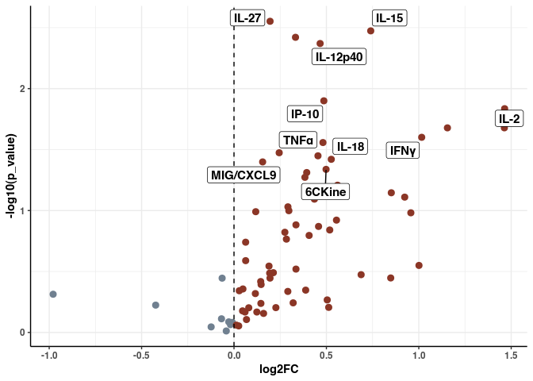
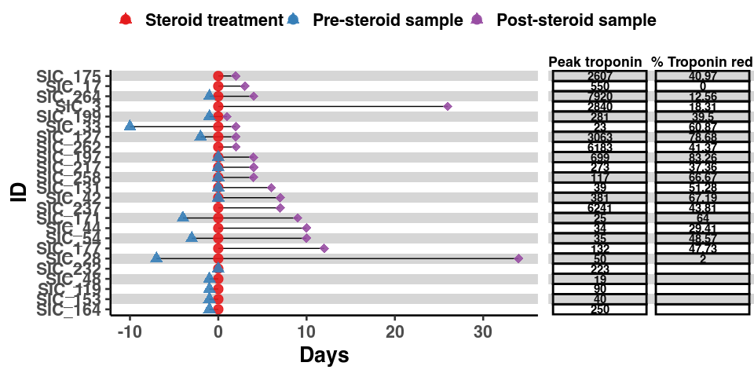

Supplemental Figure 1
================

## Set up

Load R libraries

``` r
library(reticulate)
library(tidyverse)
library(rmarkdown)
library(rlang)
library(parameters)
library(RColorBrewer)
library(ComplexHeatmap)
library(circlize)
library(Matrix)
library(glue)
library(fgsea)
library(ggforestplot)
library(ggbeeswarm)
library(patchwork)
library(lme4)
library(ggstance)
library(knitr)
library(grid)
library(readxl)
library(ggpubr)

setwd('/projects/home/ikernin/github_code/myocarditis/functions')
source('de.R')
source('gsea.R')
source('masc.R')
source('plot_masc.R')
source('blood_abundance.R')
source('blood_troponin.R')

use_python("/projects/home/nealpsmith/.conda/envs/updated_pegasus/bin/python")
wd = '/projects/home/sramesh/github/myocarditis'
```

Load Python packages

``` python
import pandas as pd
import pegasus as pg
import os
import sys
import warnings

sys.path.append("/projects/home/ikernin/github_code/myocarditis/functions")
import python_functions

sys.path.append("/projects/home/sramesh/github/myocarditis/functions")
import python_functions as pyfun

wd = '/projects/home/sramesh/github/myocarditis'
warnings.filterwarnings('ignore')
```

Read in single-cell data and cluster names

``` python
# read tissue data
tissue_global = pg.read_input('/projects/home/ikernin/projects/myocarditis/updated_datasets/tissue_all_with_dcs.zarr')

# read blood data
```

``` python
adata = pg.read_input('/projects/home/sramesh/myo_final/blood/final/myo_blood_global.zarr')
```

``` python
cluster_annots = pd.read_excel('/projects/home/sramesh/myo_final/blood/other_stuff/cluster_annotations.xlsx')
name_dict = dict(zip(cluster_annots['lineage_cluster_mod'], cluster_annots['cluster_name_w_num']))
```

``` r
# read tissue data
tissue_global_obs <- read_csv('/projects/home/ikernin/projects/myocarditis/updated_datasets/metadata/tissue_full_obs.csv')

# read blood data
obs <- read_csv('/projects/home/sramesh/myo_final/blood/final/myo_blood_global_obs.csv')
cluster_annots <- readxl::read_excel('/projects/home/sramesh/myo_final/blood/other_stuff/cluster_annotations.xlsx')
```

## Supplemental Figure 1A

``` python
python_functions.make_gene_dotplot(tissue_global.to_anndata(),
             cluster_order=['Endothelial cells', 'cDC', 'pDC',
                            'Myeloid cells', 'B and plasma cells',
                            'T and NK cells', 'Cardiomyocytes', 'Mural cells',
                            'Fibroblasts',
                            'Neuronal cells'
                            ],
             gene_order=['VWF', 'AQP1', 'CA4', 'HEY1', 'HLA-DQA1', 'CD1C',
                         'CLEC9A', 'LILRA4', 'IL3RA', 'CD14', 'CD68', 'C1QA', 'FCGR3A',
                         'CD79A', 'MZB1', 'MS4A1', 'CD3D', 'CD8A', 'KLRB1', 'TNNI3',
                         'MB', 'RGS5', 'MYH11', 'KCNJ8', 'ACTA2', 'DCN',
                         'PDGFRA', 'PLP1', 'NRXN1'],
             title='All Cells'
             )
```


## Supplemental Figure 1B

``` r
p_1b <- ggplot(tissue_global_obs, aes(y = umap_name, fill = institution)) +
  geom_bar(position = 'fill') +
  scale_fill_manual(values = c('#0273b5', '#e18728')) +
  scale_x_continuous(labels = scales::percent,
                     expand = c(0,0),
                     limits = c(0,1)) +
  theme_classic()
print(p_1b)
```

<!-- -->

## Supplemental Figure 1C

``` r
melanoma <- c("SIC_171",
              "SIC_182",
              "SIC_237",
              "SIC_319")

renal <- c("SIC_197",
           "SIC_199",
           "SIC_217",
           "SIC_232",
           "SIC_317")

other <- c("SIC_48",
           "SIC_153",
           "SIC_164",
           "SIC_175",
           "SIC_177",
           "SIC_258",
           "SIC_264",
           "SIC_333")
non_sanger <- unique(tissue_global_obs$donor)[!str_detect(unique(tissue_global_obs$donor), 'Sanger')]

p_1c <- tissue_global_obs %>%
  filter(donor %in% non_sanger) %>%
  filter(condition == 'myocarditis') %>%
  filter(on_steroids == 'False') %>%
  mutate(tumor_type = case_when(
    donor %in% melanoma ~ 'Melanoma',
    donor %in% renal ~ 'Renal Cell',
    donor %in% other ~ 'Other',
    TRUE ~ "N/A"
  )) %>%
  ggplot(aes(y = donor, fill = umap_name)) +
  geom_bar(position = 'fill') +
  scale_fill_manual(values = c(
    "#b3e900", # b and plasma
    "#ff7f00", # cardiomyocytes
    "#7f80cd", # cDC
    "#f781bf", # doublets
    "#ff0029", # endothelial
    "#00d2d5", # fibroblast
    "#377eb8", # mural
    "#984ea3", # mnp
    "#af8d00", # neuronal
    "#c42e60", # pdf
    '#66a61e' # t and nk

  )) +
  scale_x_continuous(labels = scales::percent,
                     expand = c(0,0),
                     limits = c(0,1)) +
  scale_y_discrete(position = "right") +
  facet_grid(tumor_type ~ ., scales = 'free_y', space = 'free', switch = 'y') +
  theme_classic() +
  labs(
    x = '% of donor cells',
    y = element_blank(),
    fill = 'Lineage'
  )
print(p_1c)
```

<!-- -->

## Supplemental Figure 1D

``` r
abund_data <- read_excel("/projects/home/nealpsmith/projects/myocarditis/data/updated_supplemental_tables/abundance_analysis_aggregated.xlsx",
                         sheet = "masc_res")

tissue_data <- abund_data %>%
  dplyr::filter(tissue == "heart")

withmets <- tissue_data %>%
  dplyr::filter(contrast == "irMyocarditis vs. control") %>%
  dplyr::select(cluster, OR) %>%
  `colnames<-`(c("cluster", "OR_mets"))

nomets <- tissue_data %>%
  dplyr::filter(contrast == "irMyocarditis vs. control without heart metastasis") %>%
  dplyr::select(cluster, OR) %>%
  `colnames<-`(c("cluster", "OR_nomets"))

plot_df <- left_join(withmets, nomets, by = "cluster") %>%
  dplyr::filter(cluster != "h-pDC: LILRA4 IRF8")

ggplot(plot_df, aes(x = OR_mets, y = OR_nomets)) +
  geom_point(size = 3) +
  scale_x_log10() +
  scale_y_log10() +
  geom_abline() +
  geom_vline(xintercept = 1) +
  geom_hline(yintercept = 1) +
  ylab("OR : without cardiac metastases") +
  xlab("OR : all samples") +
  theme_classic(base_size = 20)
```

<!-- -->

## Supplemental Figure 1E

``` r
all_data <- read.csv("/projects/home/nealpsmith/projects/myocarditis/data/supplemental_tables/all_degs_concatenated.csv")
tcell_no_mm <- read.csv("/projects/home/nealpsmith/projects/myocarditis/data/t_no_micromets_de_by_condition_all_results.csv")
tcell_no_mm$X <- NULL
tcell_no_mm$cluster <- NULL
colnames(tcell_no_mm) <- c(paste("no_mm", colnames(tcell_no_mm)[1:6], sep = "_"), "gene_symbol", "cluster")


### MNP ###
mnp_no_mm <- read.csv("/projects/home/nealpsmith/projects/myocarditis/data/myeloid_no_micromets_de_by_condition_all_results.csv")
mnp_no_mm$X <- NULL
mnp_no_mm$cluster <- NULL
colnames(mnp_no_mm) <- c(paste("no_mm", colnames(mnp_no_mm)[1:6], sep = "_"), "gene_symbol", "cluster")

### Non-immune ###
nonimmune_no_mm <- read.csv("/projects/home/nealpsmith/projects/myocarditis/data/nonimmune_no_micromets_de_by_condition_all_results.csv")
nonimmune_no_mm$X <- NULL
nonimmune_no_mm$cluster <- NULL
colnames(nonimmune_no_mm) <- c(paste("no_mm", colnames(nonimmune_no_mm)[1:6], sep = "_"), "gene_symbol", "cluster")

### How about one for all DEGs ###
no_mm_data_all <- rbind(tcell_no_mm, mnp_no_mm, nonimmune_no_mm)

plot_degs_all <- all_data %>%
  dplyr::filter(tissue == "heart", padj < 0.1) %>%
  dplyr::left_join(no_mm_data_all, by = c("gene_symbol", "cluster"))

ggplot(plot_degs_all, aes(x = log2FoldChange, y = no_mm_log2FoldChange)) +
  # geom_point(data = plot_degs_all %>% dplyr::filter(label == ""), color = "grey") +
  geom_point(data = plot_degs_all, fill = "black", pch = 21, size = 3) +
  geom_vline(xintercept = 0) +
  geom_hline(yintercept = 0) +
  geom_abline() +
  ylab("log2FC : without cardiac metastases") +
  xlab("log2FC : with cardiac metastases") +
  # geom_text_repel(aes(label = label), min.segment.length = 0.1, max.overlaps = 100) +
  theme_classic(base_size = 20)
```

    ## Warning: Removed 154 rows containing missing values (`geom_point()`).

<!-- -->

## Supplemental Figure 1F

``` r
# read in serum values per sample
serum_df <- read_csv('/projects/home/ikernin/projects/myocarditis/updated_datasets/metadata/tidy_serum.csv')

# get between condition statistics for log1p values
serum_model <- serum_df %>%
  dplyr::select(!c(patient, timepoint, Sample)) %>%
  pivot_longer(cols=!c(condition),
               names_to='protein',
               values_to='value') %>%
  mutate(log1p_value = log1p(value)) %>%
  group_by(condition, protein) %>%
  summarize(log1p_values = list(log1p_value)) %>%
  pivot_wider(names_from = condition,
              values_from = log1p_values) %>%
  group_by(protein) %>%
  summarize(mean_case = mean(unlist(myocarditis)),
            std_case = sd(unlist(myocarditis)),
            n_case = length(unlist(myocarditis)),
            mean_control = mean(unlist(control)),
            std_control = sd(unlist(control)),
            n_control = length(unlist(control)),
            p_value = t.test(unlist(control), unlist(myocarditis))$p.value,
            t_stat = t.test(unlist(control), unlist(myocarditis))$statistic,
            log2FC = log2(mean_case/mean_control))
kable(serum_model)

# proteins to annotate in figures
serum_annot <-  c('MIG/CXCL9', 'IP-10', 'TNFα','IFNγ', 'IL-2',
                  'IL-12p40', 'IL-15', 'IL-18', 'IL-27', '6CKine')

# make volcano plot
serum_plot_df <- serum_model %>%
  mutate(
    name = case_when(
      protein %in% serum_annot ~ protein,
      TRUE ~ ""
    ),
    t_stat = -t_stat
  )

ggplot(serum_plot_df, aes(y = -log10(p_value), x = log2FC)) +
  geom_point(data = serum_plot_df %>% filter(t_stat < 0), color =  'slategray', size = 2.5) +
  geom_point(data = serum_plot_df %>% filter(t_stat > 0), color =  'tomato4', size = 2.5) +
  geom_vline(xintercept = 0, lty=2) +
  ggrepel::geom_label_repel(aes(label = name), size = 4) +
  theme_bw() +
  theme(axis.line = element_line(colour = "black"),
        panel.border = element_blank(),
        panel.background = element_blank())
```

<!-- -->

| protein      | mean\_case | std\_case | n\_case | mean\_control | std\_control | n\_control |  p\_value |     t\_stat |      log2FC |
| :----------- | ---------: | --------: | ------: | ------------: | -----------: | ---------: | --------: | ----------: | ----------: |
| 6CKine       |  6.4363743 | 0.7101943 |      16 |     4.5567455 |    2.5437937 |         10 | 0.0459437 | \-2.2817143 |   0.4982444 |
| BCA-1        |  4.8896005 | 1.0394112 |      16 |     3.8822775 |    0.5560748 |         10 | 0.0037935 | \-3.2104880 |   0.3328134 |
| CTACK        |  7.3854061 | 0.3856017 |      16 |     7.0697631 |    0.6390623 |         10 | 0.1818264 | \-1.4097232 |   0.0630154 |
| EGF          |  5.2334156 | 0.7222864 |      16 |     4.7273420 |    1.7544192 |         10 | 0.4043610 | \-0.8673928 |   0.1467236 |
| ENA-78       |  6.4743338 | 0.6180568 |      16 |     6.7690392 |    0.8540781 |         10 | 0.3586866 |   0.9471231 | \-0.0642193 |
| Eotaxin      |  3.9514577 | 0.6351661 |      16 |     4.0296076 |    0.9319650 |         10 | 0.8187338 |   0.2334441 | \-0.0282544 |
| Eotaxin-2    |  6.3029821 | 0.8643721 |      16 |     6.0331097 |    0.2604114 |         10 | 0.2576432 | \-1.1670045 |   0.0631328 |
| Eotaxin-3    |  1.2128693 | 1.4846713 |      16 |     0.6737767 |    1.3778945 |         10 | 0.3573158 | \-0.9418352 |   0.8480817 |
| FGF-2        |  5.0137612 | 1.2062506 |      16 |     3.8426111 |    1.4997129 |         10 | 0.0533933 | \-2.0838641 |   0.3838063 |
| FLT-3L       |  3.8099334 | 0.7345215 |      16 |     3.3411918 |    1.1989049 |         10 | 0.2855658 | \-1.1127215 |   0.1894030 |
| Fractalkine  |  5.3353875 | 0.7747217 |      16 |     4.3582980 |    1.5767914 |         10 | 0.0932337 | \-1.8266092 |   0.2918282 |
| G-CSF        |  2.4111508 | 2.2985718 |      16 |     1.9313054 |    1.9185079 |         10 | 0.5716786 | \-0.5742302 |   0.3201456 |
| GM-CSF       |  4.1298428 | 1.4318275 |      16 |     3.5633644 |    1.3597476 |         10 | 0.3233776 | \-1.0124982 |   0.2128469 |
| GROα         |  3.4976916 | 0.7170439 |      16 |     3.0594765 |    1.2331317 |         10 | 0.3260535 | \-1.0210509 |   0.1931183 |
| I-309        |  1.7733368 | 0.5745722 |      16 |     1.2702573 |    0.4969847 |         10 | 0.0276843 | \-2.3628207 |   0.4813458 |
| IFN-α2       |  4.3034714 | 1.9341091 |      16 |     3.0050394 |    2.2079845 |         10 | 0.1443742 | \-1.5288179 |   0.5181170 |
| IFNγ         |  1.9435044 | 1.4059266 |      16 |     0.9612081 |    0.6652875 |         10 | 0.0250747 | \-2.3979847 |   1.0157397 |
| IL-10        |  2.7738412 | 1.7354165 |      16 |     1.2456889 |    1.3806524 |         10 | 0.0209809 | \-2.4827516 |   1.1549414 |
| IL-12p40     |  6.1262569 | 1.3028557 |      16 |     4.4349363 |    1.2923763 |         10 | 0.0042644 | \-3.2363434 |   0.4660925 |
| IL-12p70     |  2.3888904 | 2.1255133 |      16 |     1.2592322 |    0.9518119 |         10 | 0.0776223 | \-1.8497685 |   0.9237963 |
| IL-13        |  4.4144231 | 1.0829592 |      16 |     3.6266109 |    1.5080893 |         10 | 0.1716196 | \-1.4365869 |   0.2836030 |
| IL-15        |  3.7151701 | 1.0837076 |      16 |     2.2245260 |    1.1138127 |         10 | 0.0033590 | \-3.3545572 |   0.7399303 |
| IL-16        |  1.2938391 | 2.4059516 |      16 |     1.3318474 |    2.8292304 |         10 | 0.9722888 |   0.0352558 | \-0.0417706 |
| IL-17A       |  2.8404342 | 1.7656720 |      16 |     1.5745222 |    1.5799273 |         10 | 0.0714845 | \-1.8988200 |   0.8511974 |
| IL-17E/IL-25 |  5.7418729 | 2.6941808 |      16 |     3.9094564 |    2.8434321 |         10 | 0.1198353 | \-1.6310400 |   0.5545534 |
| IL-17F       |  2.9082138 | 0.9201737 |      16 |     2.3049660 |    1.6178459 |         10 | 0.3022050 | \-1.0754080 |   0.3353879 |
| IL-18        |  4.5529270 | 0.8469335 |      16 |     3.1609961 |    1.7582195 |         10 | 0.0379982 | \-2.3395791 |   0.5264150 |
| IL-1RA       |  3.9844177 | 1.3788921 |      16 |     2.9077550 |    1.0645687 |         10 | 0.0355673 | \-2.2345065 |   0.4544632 |
| IL-1α        |  3.7092153 | 1.7665737 |      16 |     2.7010582 |    1.5049316 |         10 | 0.1350191 | \-1.5527928 |   0.4575893 |
| IL-1β        |  3.7776029 | 1.6315738 |      16 |     2.5616238 |    1.4620230 |         10 | 0.0619753 | \-1.9722459 |   0.5604124 |
| IL-2         |  1.8627309 | 1.6871037 |      16 |     0.6756830 |    0.7037706 |         10 | 0.0209716 | \-2.4891432 |   1.4630008 |
| IL-20        |  2.5522352 | 3.1023734 |      16 |     1.2752235 |    2.7138124 |         10 | 0.2819649 | \-1.1039848 |   1.0010112 |
| IL-21        |  1.4868531 | 1.6123368 |      16 |     1.0480728 |    1.8236082 |         10 | 0.5409368 | \-0.6236353 |   0.5045232 |
| IL-22        |  3.0965614 | 2.0476407 |      16 |     2.7713745 |    2.0495117 |         10 | 0.6981034 | \-0.3937390 |   0.1600654 |
| IL-23        |  2.2091780 | 3.4142322 |      16 |     2.4069013 |    4.1287228 |         10 | 0.9006628 |   0.1267562 | \-0.1236673 |
| IL-27        |  8.1959283 | 0.4365125 |      16 |     7.1586560 |    0.8112040 |         10 | 0.0028027 | \-3.7208548 |   0.1952186 |
| IL-28A       |  1.9237581 | 2.8072062 |      16 |     1.3484567 |    2.8816697 |         10 | 0.6227331 | \-0.5001813 |   0.5126182 |
| IL-3         |  0.3936793 | 0.2708367 |      16 |     0.3364586 |    0.2951412 |         10 | 0.6257284 | \-0.4962530 |   0.2265919 |
| IL-33        |  1.5510885 | 1.9664495 |      16 |     2.0807321 |    2.6816080 |         10 | 0.5968677 |   0.5403444 | \-0.4238102 |
| IL-4         |  1.2619752 | 1.1323697 |      16 |     0.9644388 |    0.8338522 |         10 | 0.4496054 | \-0.7690763 |   0.3879219 |
| IL-5         |  2.6155659 | 0.9475224 |      16 |     1.9732390 |    1.1590662 |         10 | 0.1600244 | \-1.4718343 |   0.4065574 |
| IL-6         |  2.4841638 | 0.9811992 |      16 |     2.0299885 |    1.7216854 |         10 | 0.4607923 | \-0.7605674 |   0.2912888 |
| IL-7         |  2.4569886 | 1.0001989 |      16 |     1.8172582 |    0.7737255 |         10 | 0.0806058 | \-1.8286225 |   0.4351277 |
| IL-8         |  3.1816575 | 1.3405947 |      16 |     2.8762683 |    1.3367150 |         10 | 0.5778419 | \-0.5661131 |   0.1455803 |
| IL-9         |  2.3737289 | 1.3995452 |      16 |     0.8601500 |    1.3993118 |         10 | 0.0146041 | \-2.6830949 |   1.4644951 |
| IP-10        |  7.3232318 | 1.7088805 |      16 |     5.2281214 |    1.9587047 |         10 | 0.0125870 | \-2.7844134 |   0.4861878 |
| LIF          |  1.7842529 | 1.5358532 |      16 |     1.1075488 |    1.7872170 |         10 | 0.3358263 | \-0.9904071 |   0.6879499 |
| M-CSF        |  5.4138877 | 0.8799103 |      16 |     4.4735527 |    1.8044625 |         10 | 0.1506946 | \-1.5376150 |   0.2752439 |
| MCP-1        |  5.6576888 | 0.8842821 |      16 |     5.4289545 |    1.5628755 |         10 | 0.6797663 | \-0.4224752 |   0.0595385 |
| MCP-2        |  3.9274040 | 0.3776841 |      16 |     3.9516614 |    0.1769999 |         10 | 0.8270705 |   0.2209949 | \-0.0088833 |
| MCP-3        |  3.2201558 | 1.0213659 |      16 |     2.5523514 |    1.0656746 |         10 | 0.1310709 | \-1.5794558 |   0.3353036 |
| MCP-4        |  4.0842874 | 1.7666237 |      16 |     4.2803509 |    1.5920842 |         10 | 0.7726134 |   0.2927517 | \-0.0676447 |
| MDC          |  6.5570121 | 0.3519171 |      16 |     5.9321419 |    2.1367101 |         10 | 0.3822666 | \-0.9170513 |   0.1444855 |
| MIG/CXCL9    |  9.1631650 | 0.6288525 |      16 |     8.2298567 |    1.1837104 |         10 | 0.0399116 | \-2.2988098 |   0.1549787 |
| MIP-1α       |  4.3172488 | 1.1287316 |      16 |     3.2865776 |    1.2553439 |         10 | 0.0487888 | \-2.1161581 |   0.3935262 |
| MIP-1β       |  4.3389583 | 0.5230917 |      16 |     3.5320302 |    1.3570783 |         10 | 0.1003234 | \-1.7986546 |   0.2968510 |
| MIP-1δ       |  8.6986187 | 0.6016228 |      16 |     8.0169640 |    1.1240404 |         10 | 0.1022145 | \-1.7661075 |   0.1177303 |
| PDGF-AA      |  7.2625498 | 0.4149287 |      16 |     6.8714718 |    2.4434248 |         10 | 0.6275551 | \-0.5016323 |   0.0798570 |
| PDGF-AB/BB   |  9.8534586 | 0.2195944 |      16 |     9.5292300 |    1.2586629 |         10 | 0.4397492 | \-0.8069556 |   0.0482706 |
| RANTES       |  7.4055882 | 0.4235097 |      16 |     6.8356067 |    2.4265108 |         10 | 0.4798918 | \-0.7358396 |   0.1155449 |
| SCF          |  3.2519765 | 2.0302255 |      16 |     1.6751457 |    2.4194080 |         10 | 0.1043613 | \-1.7174330 |   0.9570302 |
| SDF-1α+β     |  8.8320183 | 0.5500243 |      16 |     8.6591937 |    0.5690661 |         10 | 0.4549002 | \-0.7631023 |   0.0285105 |
| TARC         |  4.5425314 | 0.5415717 |      16 |     4.6026783 |    0.9859257 |         10 | 0.8623928 |   0.1769515 | \-0.0189771 |
| TGFα         |  2.4649651 | 0.8532875 |      16 |     2.2624766 |    1.3603165 |         10 | 0.6798823 | \-0.4217117 |   0.1236643 |
| TNFα         |  5.0640180 | 0.7379993 |      16 |     4.2743596 |    0.9044013 |         10 | 0.0335644 | \-2.3201738 |   0.2445742 |
| TNFβ         |  2.8253295 | 0.9145280 |      16 |     2.4683577 |    0.9559061 |         10 | 0.3583456 | \-0.9418542 |   0.1948676 |
| TPO          |  5.6742710 | 1.0042720 |      16 |     5.4147425 |    2.8027303 |         10 | 0.7836404 | \-0.2817361 |   0.0675423 |
| TRAIL        |  3.7510727 | 0.4668613 |      16 |     3.7174592 |    0.5276374 |         10 | 0.8707802 | \-0.1650769 |   0.0129863 |
| TSLP         |  0.7325628 | 1.1914176 |      16 |     1.4436622 |    2.9711651 |         10 | 0.4859080 |   0.7214547 | \-0.9787090 |
| VEGF-A       |  5.2810634 | 0.6310147 |      16 |     5.1891024 |    1.8756073 |         10 | 0.8837901 | \-0.1498372 |   0.0253435 |
| sCD40L       |  8.4292255 | 0.4433345 |      16 |     8.1623234 |    1.8579870 |         10 | 0.6651690 | \-0.4463922 |   0.0464202 |

## Supplemental Figure 1G

``` r
# read in serum values per sample
serum_df <- read_csv('/projects/home/ikernin/projects/myocarditis/updated_datasets/metadata/tidy_serum.csv')

# get between condition statistics for log1p values
serum_model <- serum_df %>%
  select(!c(patient, timepoint, Sample)) %>%
  pivot_longer(cols=!c(condition),
               names_to='protein',
               values_to='value') %>%
  mutate(log1p_value = log1p(value)) %>%
  group_by(condition, protein) %>%
  summarize(log1p_values = list(log1p_value)) %>%
  pivot_wider(names_from = condition,
              values_from = log1p_values) %>%
  group_by(protein) %>%
  summarize(mean_case = mean(unlist(myocarditis)),
            std_case = sd(unlist(myocarditis)),
            n_case = length(unlist(myocarditis)),
            mean_control = mean(unlist(control)),
            std_control = sd(unlist(control)),
            n_control = length(unlist(control)),
            p_value = t.test(unlist(control), unlist(myocarditis))$p.value,
            t_stat = t.test(unlist(control), unlist(myocarditis))$statistic,
            log2FC = log2(mean_case/mean_control))
kable(serum_model)

# proteins to annotate in figures
serum_annot <-  c('MIG/CXCL9', 'IP-10', 'TNFα','IFNγ', 'IL-2',
                  'IL-12p40', 'IL-15', 'IL-18', 'IL-27', '6CKine')

micromet_donors <- c("SIC_136", "SIC_171", "SIC_232", "SIC_182")

# get data for ext fig 1e
ext_1e_df <- serum_df %>%
  select(!c(Sample, timepoint)) %>%
  pivot_longer(cols = !c(patient, condition),
               names_to='protein') %>%
  filter(protein %in% serum_annot) %>%
  left_join(serum_model %>% select(protein, p_value)) %>%
  mutate(
    protein = case_when(
      protein == '6CKine' ~ 'CCL21',
      protein == 'IP-10' ~ 'CXCL10',
      protein == 'MIG/CXCL9' ~ 'CXCL9',
      TRUE ~ protein),
    condition2 =
      case_when(
        patient %in% micromet_donors ~ 'micromet',
        TRUE ~ condition)
    )

ext_1e_labels <- ext_1e_df %>%
  select(protein, p_value) %>%
  mutate(facet_name = str_c(protein, str_c("p=", signif(p_value, 2)), sep = '\n')) %>%
  select(protein, facet_name) %>%
  distinct() %>%
  deframe()


p_1e <- ggplot(ext_1e_df, aes(x = condition, y = value + 1, fill = condition)) +
  geom_boxplot(alpha = 0.6,
               outlier.shape = NA) +
  geom_jitter(aes(fill = condition2,
                  size = condition2 == 'micromet'),
              shape=21) +
  scale_y_log10()+
  scale_color_manual(values = c('slategray', 'tomato4')) +
  scale_fill_manual(values = c('slategray', 'yellow', 'tomato4')) +
  scale_size_manual(values = c(1,3)) +
  theme_bw() +
  theme(panel.grid.minor = element_blank(),
        panel.grid.major = element_blank(),
        axis.text.x=element_blank(),
        axis.ticks.x=element_blank()) +
  guides(size = "none") +
  facet_wrap(~protein,
             labeller = labeller(protein = ext_1e_labels),
             scales = 'free_y',
             nrow=2) +
  labs(fill = 'Condition',
       color = 'Condition',
       x = element_blank(),
       y = "pg/mL + 1")
print(p_1e)
```

<!-- -->

| protein      | mean\_case | std\_case | n\_case | mean\_control | std\_control | n\_control |  p\_value |     t\_stat |      log2FC |
| :----------- | ---------: | --------: | ------: | ------------: | -----------: | ---------: | --------: | ----------: | ----------: |
| 6CKine       |  6.4363743 | 0.7101943 |      16 |     4.5567455 |    2.5437937 |         10 | 0.0459437 | \-2.2817143 |   0.4982444 |
| BCA-1        |  4.8896005 | 1.0394112 |      16 |     3.8822775 |    0.5560748 |         10 | 0.0037935 | \-3.2104880 |   0.3328134 |
| CTACK        |  7.3854061 | 0.3856017 |      16 |     7.0697631 |    0.6390623 |         10 | 0.1818264 | \-1.4097232 |   0.0630154 |
| EGF          |  5.2334156 | 0.7222864 |      16 |     4.7273420 |    1.7544192 |         10 | 0.4043610 | \-0.8673928 |   0.1467236 |
| ENA-78       |  6.4743338 | 0.6180568 |      16 |     6.7690392 |    0.8540781 |         10 | 0.3586866 |   0.9471231 | \-0.0642193 |
| Eotaxin      |  3.9514577 | 0.6351661 |      16 |     4.0296076 |    0.9319650 |         10 | 0.8187338 |   0.2334441 | \-0.0282544 |
| Eotaxin-2    |  6.3029821 | 0.8643721 |      16 |     6.0331097 |    0.2604114 |         10 | 0.2576432 | \-1.1670045 |   0.0631328 |
| Eotaxin-3    |  1.2128693 | 1.4846713 |      16 |     0.6737767 |    1.3778945 |         10 | 0.3573158 | \-0.9418352 |   0.8480817 |
| FGF-2        |  5.0137612 | 1.2062506 |      16 |     3.8426111 |    1.4997129 |         10 | 0.0533933 | \-2.0838641 |   0.3838063 |
| FLT-3L       |  3.8099334 | 0.7345215 |      16 |     3.3411918 |    1.1989049 |         10 | 0.2855658 | \-1.1127215 |   0.1894030 |
| Fractalkine  |  5.3353875 | 0.7747217 |      16 |     4.3582980 |    1.5767914 |         10 | 0.0932337 | \-1.8266092 |   0.2918282 |
| G-CSF        |  2.4111508 | 2.2985718 |      16 |     1.9313054 |    1.9185079 |         10 | 0.5716786 | \-0.5742302 |   0.3201456 |
| GM-CSF       |  4.1298428 | 1.4318275 |      16 |     3.5633644 |    1.3597476 |         10 | 0.3233776 | \-1.0124982 |   0.2128469 |
| GROα         |  3.4976916 | 0.7170439 |      16 |     3.0594765 |    1.2331317 |         10 | 0.3260535 | \-1.0210509 |   0.1931183 |
| I-309        |  1.7733368 | 0.5745722 |      16 |     1.2702573 |    0.4969847 |         10 | 0.0276843 | \-2.3628207 |   0.4813458 |
| IFN-α2       |  4.3034714 | 1.9341091 |      16 |     3.0050394 |    2.2079845 |         10 | 0.1443742 | \-1.5288179 |   0.5181170 |
| IFNγ         |  1.9435044 | 1.4059266 |      16 |     0.9612081 |    0.6652875 |         10 | 0.0250747 | \-2.3979847 |   1.0157397 |
| IL-10        |  2.7738412 | 1.7354165 |      16 |     1.2456889 |    1.3806524 |         10 | 0.0209809 | \-2.4827516 |   1.1549414 |
| IL-12p40     |  6.1262569 | 1.3028557 |      16 |     4.4349363 |    1.2923763 |         10 | 0.0042644 | \-3.2363434 |   0.4660925 |
| IL-12p70     |  2.3888904 | 2.1255133 |      16 |     1.2592322 |    0.9518119 |         10 | 0.0776223 | \-1.8497685 |   0.9237963 |
| IL-13        |  4.4144231 | 1.0829592 |      16 |     3.6266109 |    1.5080893 |         10 | 0.1716196 | \-1.4365869 |   0.2836030 |
| IL-15        |  3.7151701 | 1.0837076 |      16 |     2.2245260 |    1.1138127 |         10 | 0.0033590 | \-3.3545572 |   0.7399303 |
| IL-16        |  1.2938391 | 2.4059516 |      16 |     1.3318474 |    2.8292304 |         10 | 0.9722888 |   0.0352558 | \-0.0417706 |
| IL-17A       |  2.8404342 | 1.7656720 |      16 |     1.5745222 |    1.5799273 |         10 | 0.0714845 | \-1.8988200 |   0.8511974 |
| IL-17E/IL-25 |  5.7418729 | 2.6941808 |      16 |     3.9094564 |    2.8434321 |         10 | 0.1198353 | \-1.6310400 |   0.5545534 |
| IL-17F       |  2.9082138 | 0.9201737 |      16 |     2.3049660 |    1.6178459 |         10 | 0.3022050 | \-1.0754080 |   0.3353879 |
| IL-18        |  4.5529270 | 0.8469335 |      16 |     3.1609961 |    1.7582195 |         10 | 0.0379982 | \-2.3395791 |   0.5264150 |
| IL-1RA       |  3.9844177 | 1.3788921 |      16 |     2.9077550 |    1.0645687 |         10 | 0.0355673 | \-2.2345065 |   0.4544632 |
| IL-1α        |  3.7092153 | 1.7665737 |      16 |     2.7010582 |    1.5049316 |         10 | 0.1350191 | \-1.5527928 |   0.4575893 |
| IL-1β        |  3.7776029 | 1.6315738 |      16 |     2.5616238 |    1.4620230 |         10 | 0.0619753 | \-1.9722459 |   0.5604124 |
| IL-2         |  1.8627309 | 1.6871037 |      16 |     0.6756830 |    0.7037706 |         10 | 0.0209716 | \-2.4891432 |   1.4630008 |
| IL-20        |  2.5522352 | 3.1023734 |      16 |     1.2752235 |    2.7138124 |         10 | 0.2819649 | \-1.1039848 |   1.0010112 |
| IL-21        |  1.4868531 | 1.6123368 |      16 |     1.0480728 |    1.8236082 |         10 | 0.5409368 | \-0.6236353 |   0.5045232 |
| IL-22        |  3.0965614 | 2.0476407 |      16 |     2.7713745 |    2.0495117 |         10 | 0.6981034 | \-0.3937390 |   0.1600654 |
| IL-23        |  2.2091780 | 3.4142322 |      16 |     2.4069013 |    4.1287228 |         10 | 0.9006628 |   0.1267562 | \-0.1236673 |
| IL-27        |  8.1959283 | 0.4365125 |      16 |     7.1586560 |    0.8112040 |         10 | 0.0028027 | \-3.7208548 |   0.1952186 |
| IL-28A       |  1.9237581 | 2.8072062 |      16 |     1.3484567 |    2.8816697 |         10 | 0.6227331 | \-0.5001813 |   0.5126182 |
| IL-3         |  0.3936793 | 0.2708367 |      16 |     0.3364586 |    0.2951412 |         10 | 0.6257284 | \-0.4962530 |   0.2265919 |
| IL-33        |  1.5510885 | 1.9664495 |      16 |     2.0807321 |    2.6816080 |         10 | 0.5968677 |   0.5403444 | \-0.4238102 |
| IL-4         |  1.2619752 | 1.1323697 |      16 |     0.9644388 |    0.8338522 |         10 | 0.4496054 | \-0.7690763 |   0.3879219 |
| IL-5         |  2.6155659 | 0.9475224 |      16 |     1.9732390 |    1.1590662 |         10 | 0.1600244 | \-1.4718343 |   0.4065574 |
| IL-6         |  2.4841638 | 0.9811992 |      16 |     2.0299885 |    1.7216854 |         10 | 0.4607923 | \-0.7605674 |   0.2912888 |
| IL-7         |  2.4569886 | 1.0001989 |      16 |     1.8172582 |    0.7737255 |         10 | 0.0806058 | \-1.8286225 |   0.4351277 |
| IL-8         |  3.1816575 | 1.3405947 |      16 |     2.8762683 |    1.3367150 |         10 | 0.5778419 | \-0.5661131 |   0.1455803 |
| IL-9         |  2.3737289 | 1.3995452 |      16 |     0.8601500 |    1.3993118 |         10 | 0.0146041 | \-2.6830949 |   1.4644951 |
| IP-10        |  7.3232318 | 1.7088805 |      16 |     5.2281214 |    1.9587047 |         10 | 0.0125870 | \-2.7844134 |   0.4861878 |
| LIF          |  1.7842529 | 1.5358532 |      16 |     1.1075488 |    1.7872170 |         10 | 0.3358263 | \-0.9904071 |   0.6879499 |
| M-CSF        |  5.4138877 | 0.8799103 |      16 |     4.4735527 |    1.8044625 |         10 | 0.1506946 | \-1.5376150 |   0.2752439 |
| MCP-1        |  5.6576888 | 0.8842821 |      16 |     5.4289545 |    1.5628755 |         10 | 0.6797663 | \-0.4224752 |   0.0595385 |
| MCP-2        |  3.9274040 | 0.3776841 |      16 |     3.9516614 |    0.1769999 |         10 | 0.8270705 |   0.2209949 | \-0.0088833 |
| MCP-3        |  3.2201558 | 1.0213659 |      16 |     2.5523514 |    1.0656746 |         10 | 0.1310709 | \-1.5794558 |   0.3353036 |
| MCP-4        |  4.0842874 | 1.7666237 |      16 |     4.2803509 |    1.5920842 |         10 | 0.7726134 |   0.2927517 | \-0.0676447 |
| MDC          |  6.5570121 | 0.3519171 |      16 |     5.9321419 |    2.1367101 |         10 | 0.3822666 | \-0.9170513 |   0.1444855 |
| MIG/CXCL9    |  9.1631650 | 0.6288525 |      16 |     8.2298567 |    1.1837104 |         10 | 0.0399116 | \-2.2988098 |   0.1549787 |
| MIP-1α       |  4.3172488 | 1.1287316 |      16 |     3.2865776 |    1.2553439 |         10 | 0.0487888 | \-2.1161581 |   0.3935262 |
| MIP-1β       |  4.3389583 | 0.5230917 |      16 |     3.5320302 |    1.3570783 |         10 | 0.1003234 | \-1.7986546 |   0.2968510 |
| MIP-1δ       |  8.6986187 | 0.6016228 |      16 |     8.0169640 |    1.1240404 |         10 | 0.1022145 | \-1.7661075 |   0.1177303 |
| PDGF-AA      |  7.2625498 | 0.4149287 |      16 |     6.8714718 |    2.4434248 |         10 | 0.6275551 | \-0.5016323 |   0.0798570 |
| PDGF-AB/BB   |  9.8534586 | 0.2195944 |      16 |     9.5292300 |    1.2586629 |         10 | 0.4397492 | \-0.8069556 |   0.0482706 |
| RANTES       |  7.4055882 | 0.4235097 |      16 |     6.8356067 |    2.4265108 |         10 | 0.4798918 | \-0.7358396 |   0.1155449 |
| SCF          |  3.2519765 | 2.0302255 |      16 |     1.6751457 |    2.4194080 |         10 | 0.1043613 | \-1.7174330 |   0.9570302 |
| SDF-1α+β     |  8.8320183 | 0.5500243 |      16 |     8.6591937 |    0.5690661 |         10 | 0.4549002 | \-0.7631023 |   0.0285105 |
| TARC         |  4.5425314 | 0.5415717 |      16 |     4.6026783 |    0.9859257 |         10 | 0.8623928 |   0.1769515 | \-0.0189771 |
| TGFα         |  2.4649651 | 0.8532875 |      16 |     2.2624766 |    1.3603165 |         10 | 0.6798823 | \-0.4217117 |   0.1236643 |
| TNFα         |  5.0640180 | 0.7379993 |      16 |     4.2743596 |    0.9044013 |         10 | 0.0335644 | \-2.3201738 |   0.2445742 |
| TNFβ         |  2.8253295 | 0.9145280 |      16 |     2.4683577 |    0.9559061 |         10 | 0.3583456 | \-0.9418542 |   0.1948676 |
| TPO          |  5.6742710 | 1.0042720 |      16 |     5.4147425 |    2.8027303 |         10 | 0.7836404 | \-0.2817361 |   0.0675423 |
| TRAIL        |  3.7510727 | 0.4668613 |      16 |     3.7174592 |    0.5276374 |         10 | 0.8707802 | \-0.1650769 |   0.0129863 |
| TSLP         |  0.7325628 | 1.1914176 |      16 |     1.4436622 |    2.9711651 |         10 | 0.4859080 |   0.7214547 | \-0.9787090 |
| VEGF-A       |  5.2810634 | 0.6310147 |      16 |     5.1891024 |    1.8756073 |         10 | 0.8837901 | \-0.1498372 |   0.0253435 |
| sCD40L       |  8.4292255 | 0.4433345 |      16 |     8.1623234 |    1.8579870 |         10 | 0.6651690 | \-0.4463922 |   0.0464202 |

## Supplemental Figure 1H

``` r
serum_data <- read.csv("/projects/home/nealpsmith/projects/myocarditis/data/updated_supplemental_tables/all_serum_stats.csv")

withmets <- serum_data %>%
  dplyr::filter(contrast == "irMyocarditis vs. control with mets") %>%
  dplyr::select(protein, t_statistic) %>%
  `colnames<-`(c("protein", "t_stat_mets"))

nomets <- serum_data %>%
  dplyr::filter(contrast == "irMyocarditis vs. control without mets") %>%
  dplyr::select(protein, t_statistic) %>%
  `colnames<-`(c("protein", "t_stat_nomets"))

plot_df <- left_join(withmets, nomets, by = "protein")

ggplot(plot_df, aes(x = -t_stat_mets, y = -t_stat_nomets)) +
  geom_point(size = 3) +
  geom_vline(xintercept = 0) +
  geom_hline(yintercept = 0) +
  geom_abline() +
  ylab("T-statistic : without cardiac metastases") +
  xlab("T-statistic : all samples") +
  theme_classic(base_size = 20)
```

<!-- -->

## Supplemental figure 1I

``` python
cluster_order = ['pDCs', 'B and plasma', 'cDCs', 'CD4', 'MNP', 'CD8 and NK']
gene_order = ['LILRA4', 'IL3RA', 'CD79A', 'MS4A1', 'JCHAIN', 'CD1C', 'CLEC10A', 'CLEC9A', 'CD4', 'CD3D', 'IL7R', 'LYZ',
              'CD14', 'AIF1', 'CD8A', 'NKG7', 'KLRF1']
pyfun.make_gene_dotplot(adata.to_anndata(), cluster_order, gene_order, 'All cells', figsize=(5, 4), names='lineage')
```


## Supplemental Figure 1J

``` r
# run masc for pre- vs post-steroid by lineage (or read in file if it exists)
if (!file.exists(glue('{wd}/output/masc_for_steroid_treatment_by_lineage.csv'))) {
  lineage_masc_res <- run_masc(obs,
                               c('steroid_treatment', 'post_steroid', 'pre_steroid'),
                               'lineage')
  write_csv(lineage_masc_res, glue('{wd}/output/masc_for_steroid_treatment_by_lineage.csv'))
} else {
  lineage_masc_res <- read_csv(glue('{wd}/output/masc_for_steroid_treatment_by_lineage.csv'))
}

lineage_masc_res$lineage <- str_replace_all(lineage_masc_res$lineage, '_', ' ')

masc_helper(obs,
            c('steroid_treatment', 'post_steroid', 'pre_steroid'),
            'lineage',
            masc_res = lineage_masc_res,
            colors = c('darkolivegreen4', 'darkolivegreen2'))
```

<!-- -->

## Supplemental Figure 1K

``` r
#### first run de
if (!file.exists(glue('{wd}/output/lineage_de_by_steroid_treatment_all_results.csv'))) {
  counts <- read_counts(glue("{wd}/output/pb_counts_by_sample_id_and_lineage.csv"))
  meta <- read_meta(glue("{wd}/output/pb_meta_by_sample_id_and_lineage.csv"))
  meta <- meta %>%
    filter(steroid_treatment != "NA") %>%
    filter(!str_detect(lineage, "Doublet"))
  steroid_contrast_vec <- c('steroid_treatment', 'pre_steroid', 'post_steroid')
  steroid_lineage_results <- run_de_by_comp_var(counts, meta, glue('{wd}/output/lineage'), steroid_contrast_vec,
                                                deseq_formula = formula("~ steroid_treatment"))
} else {
  steroid_lineage_results <- read_csv(glue('{wd}/output/lineage_de_by_steroid_treatment_all_results.csv'))
}

#### now plot barplot
colors <- c('darkolivegreen2', 'darkolivegreen4')
cluster_order <- c('pDCs', 'B and plasma', 'cDCs', 'CD4', 'MNP', 'CD8 and NK')
res <- steroid_lineage_results %>%
  mutate(cluster = str_replace_all(cluster, '_', ' '))
res <- res[res$padj < 0.1, ]
ups <- downs <- numeric(length(cluster_order))

for (i in seq_along(cluster_order)) {
  clust <- cluster_order[i]
  up_genes <- res[res$cluster == clust & res$log2FoldChange > 0, ]
  down_genes <- res[res$cluster == clust & res$log2FoldChange < 0, ]
  ups[i] <- nrow(up_genes)
  downs[i] <- -nrow(down_genes)
}

df <- data.frame(cluster = cluster_order, up = ups, down = downs)
df <- df %>% mutate(cluster = factor(cluster, levels = rev(cluster_order)))

ggplot(df, aes(x = up, y = cluster)) +
  geom_bar(stat = "identity", fill = colors[1]) +
  geom_bar(stat = "identity", aes(x = down, y = cluster), fill = colors[2]) +
  geom_vline(xintercept = 0, color = "black", linetype = "solid", size = 0.5) +
  scale_x_continuous(breaks = scales::pretty_breaks()) +
  theme_bw() +
  theme(panel.grid.major = element_blank(),
        panel.grid.minor = element_blank(),
        legend.position = "none",
        plot.title = element_text(hjust = 0.5),
        text = element_text(size = 16),
        axis.text = element_text(color = 'black')) +
  labs(x = element_blank(),
       y = element_blank())
```

<!-- -->

## Supplemental figure 1L

## Supplemental figure 1M

``` r
plot_info <- read.csv("/projects/home/nealpsmith/projects/myocarditis/swimmer_plot/swimmer_plot_info.csv")

# Need to figure out how long to make the line for everyone
plot_info$end_line <- apply(plot_info, 1, function(d){
  if (!is.na(d[["post_steroid_samp_day"]])){
    return(as.numeric(d[["post_steroid_samp_day"]]) - as.numeric(d[["ici_start_day"]]))
  } else {
    return(as.numeric(d[["steroid_start_day"]]) - as.numeric(d[["ici_start_day"]]))
  }
})
plot_info$days_to_steroid <-  plot_info$steroid_start_day - plot_info$ici_start_day
plot_info$days_to_post_steroid <-plot_info$post_steroid_samp_day - plot_info$ici_start_day
plot_df <- plot_info %>%
  dplyr::select(ID, time_ici_to_pre_steroid_samp, time_pre_steroid_samp_to_steroid,
                time_steroid_start_to_post_steroid_samp,days_to_steroid, days_to_post_steroid, end_line)
# Lets get the rows ordered
fatal_ids <- c("SIC_3", "SIC_17", "SIC_175", "SIC_232", "SIC_264", "SIC_266")
plot_df$fatal <- ifelse(plot_df$ID %in% fatal_ids, "fatal", "non-fatal")
plot_df$has_pre <- ifelse(is.na(plot_df$time_ici_to_pre_steroid_samp), "no", "yes")

order <- plot_df %>%
  arrange(desc(has_pre), fatal) %>%
  .$ID
plot_df$ID <- factor(plot_df$ID, levels = rev(order))

brewer.pal(4, "Set1")

plot_info$steroid_to_pre_steroid <- plot_info$pre_steroid_samp_day - plot_info$steroid_start_day
# Time from steroid to post-steroid samp
plot_info$steroid_to_post_steroid <- plot_info$post_steroid_samp_day - plot_info$steroid_start_day

plot_df <- plot_info %>%
  dplyr::select(ID, steroid_to_pre_steroid, steroid_to_post_steroid) %>%
  mutate("steroid_start" = 0)
plot_df$start_point <- ifelse(is.na(plot_df$steroid_to_pre_steroid), 0, (plot_df$steroid_to_pre_steroid))
plot_df$end_point <- ifelse(is.na(plot_df$steroid_to_post_steroid), 0, (plot_df$steroid_to_post_steroid))

# Lets get the rows ordered
fatal_ids <- c("SIC_3", "SIC_17", "SIC_175", "SIC_232", "SIC_264", "SIC_266")
plot_df$fatal <- ifelse(plot_df$ID %in% fatal_ids, "fatal", "non-fatal")
plot_df$has_pre <- ifelse(is.na(plot_df$steroid_to_pre_steroid), "no", "yes")
plot_df$has_post <- ifelse(is.na(plot_df$steroid_to_post_steroid), "no", "yes")
order <- plot_df %>%
  arrange(desc(has_post), fatal,steroid_to_post_steroid ) %>%
  .$ID
plot_df$ID <- factor(plot_df$ID, levels = rev(order))

# Lets add a table next to it with peak troponin
trop_info <- read.csv("/projects/home/nealpsmith/projects/myocarditis/post_steroid_trop/data/post_steroid_trop_data.csv")
trop_info$ID <- sapply(trop_info$sample, function(x) paste(strsplit(x, "_")[[1]][1:2], collapse = "_"))
trop_info$sample <- NULL
trop_info$trop_fc <-((trop_info$Peak.troponin- trop_info$post_steroid_troponin)/ trop_info$Peak.troponin) * 100

# Get the missing ones as well
trop_no_post <- read.csv("/projects/home/nealpsmith/projects/myocarditis/post_steroid_trop/data/no_pre_steroid_peak_trop.csv")
trop_no_post$post_steroid_troponin <- NA
trop_no_post$trop_fc <- NA
trop_no_post <- trop_no_post %>%
  dplyr::select(colnames(trop_info))

trop_info <- rbind(trop_info, trop_no_post)
trop_info$ID <- factor(trop_info$ID, levels = levels(plot_df$ID))

p1 <- ggplot(plot_df, aes(x = value, y = ID)) +
  geom_stripes(aes(x = NULL), odd = "#ffffff00", even = "#33333333") +
  geom_segment(aes(x=start_point, xend=end_point, y=ID, yend=ID)) +
  geom_point(x = 0, size = 4, (aes(color = "Steroid treatment")), alpha = 0.9) +
  geom_point(x = plot_df$steroid_to_pre_steroid, size = 4, pch = 17,aes(color = "Pre-steroid sample"), alpha = 0.9) +
  geom_point(x = plot_df$steroid_to_post_steroid, size = 4, pch = 18, aes(color = "Post-steroid sample"), alpha = 0.9) +
  scale_color_manual(name = "",
                     values = c("Steroid treatment" = "#E41A1C", "Pre-steroid sample" = "#377EB8", "Post-steroid sample" = "#984EA3"),
                     breaks = c("Steroid treatment", "Pre-steroid sample", "Post-steroid sample")) +
  scale_shape_manual(name = "",
                   values = c("Steroid treatment" = 16, "Pre-steroid sample" = 17, "Post-steroid sample" = 18),
                   breaks = c("Steroid treatment", "Pre-steroid sample", "Post-steroid sample")) +
  xlab("Days") +
  theme_classic(base_size = 20)

all(levels(trop_info$ID) == levels(plot_df$ID))

p2 <- ggplot(trop_info, aes(x = 1, y = ID)) +
  geom_tile(fill = NA, color = "black", size = 1) +
  geom_text(aes(label = Peak.troponin)) +
  ggtitle("Peak troponin") +
  geom_stripes(odd = "#ffffff00", even = "#33333333") +
  theme_void()
p3 <- ggplot(trop_info, aes(x = 1, y = ID)) +
  geom_tile(fill = NA, color = "black", size = 1) +
  geom_text(aes(label = round(trop_fc, 2))) +
  ggtitle("% Troponin reduction") +
  geom_stripes(odd = "#ffffff00", even = "#33333333") +
  theme_void()

ggarrange(p1, p2, p3, widths = c(0.8, 0.15, 0.15), align = "h", nrow = 1, common.legend = TRUE)
```

<!-- -->

    ## [1] "#E41A1C" "#377EB8" "#4DAF4A" "#984EA3"
    ## [1] TRUE

## Supplemental figure 1N

``` r
mtx <- read.csv("/projects/home/sramesh/github/myocarditis/output/pb_counts_by_sample_id_and_lineage.csv",
                row.names = 1)

norm_counts <- apply(mtx, 2, function(c){
  n_total <- sum(c)
  per_100k <- (c * 1000000) / n_total
  return(per_100k)
})

norm_counts <- log1p(norm_counts)

meta <- read.csv("/projects/home/sramesh/github/myocarditis/output/pb_meta_by_sample_id_and_lineage.csv",
                 row.names = 1)
meta$donor <- sapply(meta$sample, function(x) paste(strsplit(x, "_")[[1]][1:2], collapse = "_"))

trop_meta <- read.csv("/projects/home/nealpsmith/projects/myocarditis/post_steroid_trop/data/post_steroid_trop_data.csv")
trop_meta$trop_fc <-(trop_meta$Peak.troponin- trop_meta$post_steroid_troponin)/ trop_meta$Peak.troponin
trop_meta$trop_logfc <- log1p(trop_meta$trop_fc)

# Also need to add time from steroid start to post-steroid sample
time_info <- read.csv("/projects/home/nealpsmith/projects/myocarditis/swimmer_plot/swimmer_plot_info.csv")
time_info %<>%
  dplyr::select(ID, time_steroid_start_to_post_steroid_samp) %>%
  dplyr::rename(donor = ID)

meta %<>%
  rownames_to_column() %>%
  dplyr::left_join(trop_meta, by = "sample") %>%
  dplyr::left_join(time_info, by = "donor") %>%
  column_to_rownames("rowname")
meta$log_time_steroid_start_to_post_steroid_samp <- log1p(meta$time_steroid_start_to_post_steroid_samp)
# Need to fix SIC_3
rownames(meta)[grepl("SIC_3_", rownames(meta))] <- sub("-", ".", rownames(meta)[grepl("SIC_3_", rownames(meta))])
ps_meta <- meta %>%
  dplyr::filter(sample %in% trop_meta$sample)
ps_mtx <- mtx[,rownames(ps_meta)]

if (!file.exists("/projects/home/nealpsmith/projects/myocarditis/post_steroid_trop/data/all_deg_res.csv")){
  # Iterate across lineages
  gene_sets <-  gmtPathways( "/projects/home/nealpsmith/projects/medoff/data/msigdb_symbols.gmt")
  n_gene_df <- data.frame()
  deg_res <- data.frame()
  gsea_res <- data.frame()

  for(lin in unique(ps_meta$lineage)){

    if (lin == "Doublets_and_RBCs"){
      next()
    }

    meta_temp <- ps_meta[ps_meta$lineage == lin,]
    meta_temp$post_steroid_fatal <- factor(meta_temp$post_steroid_fatal, levels = c("non_fatal", "fatal"))
    count_temp <- ps_mtx[,rownames(meta_temp)]

    # Make sure the genes are detected in enough samples
    n_samp <- rowSums(count_temp != 0)
    count_temp <- count_temp[n_samp > round(nrow(meta_temp) / 2),]

    models <- c(as.formula("~log_time_steroid_start_to_post_steroid_samp+trop_logfc"),
                as.formula("~trop_logfc+log_time_steroid_start_to_post_steroid_samp"),
                as.formula("~post_steroid_fatal"))
    for (m in models){
      test_var <- tail(strsplit(as.character(m), "+", fixed = TRUE)[[2]], n = 1)
      test_var <- gsub(" ", "", test_var)

      dds <- DESeqDataSetFromMatrix(countData = count_temp,
                                colData = meta_temp,
                                design = m)
      dds <- DESeq(dds)
      res <- as.data.frame(results(dds))
      res <- res[!is.na(res$padj),]
      res$contrast <- test_var
      res$lin <- lin
      res$gene <- rownames(res)
      deg_res <- rbind(deg_res, res)

      n_up <- nrow(res[res$padj < 0.1 & res$log2FoldChange > 0,])
      n_down <- nrow(res[res$padj < 0.1 & res$log2FoldChange < 0,])
      df <- data.frame(lin = lin, contrast = test_var, n_up = n_up, n_down = n_down)
      n_gene_df <- rbind(n_gene_df, df)

      ## GSEA ##
      order_genes <- res %>%
        dplyr::select(gene, stat) %>%
        na.omit() %>%
        distinct() %>%
        group_by(gene) %>%
        summarize(stat=mean(stat))
      ranks <- deframe(order_genes)

      for (geneset in c("BIOCARTA", "HALLMARK", "KEGG")){
        gsets <- gene_sets[grep(geneset, names(gene_sets))]
        fgseaRes <- fgsea(pathways=gsets, stats=ranks, nperm=10000)
        fgseaResTidy <- fgseaRes %>%
          as_tibble() %>%
          arrange(desc(NES))
        fgseaResTidy$contrast <- test_var
        fgseaResTidy$lin <- lin
        fgseaResTidy$library <- geneset
        gsea_res <- rbind(gsea_res, fgseaResTidy)

        }
      }
    }
    gsea_res$leadingEdge <- as.character(gsea_res$leadingEdge)

    # Write the results
    write.csv(deg_res, "/projects/home/nealpsmith/projects/myocarditis/post_steroid_trop/data/all_deg_res.csv")
    write.csv(gsea_res, "/projects/home/nealpsmith/projects/myocarditis/post_steroid_trop/data/all_gsea_res.csv")

} else {
  deg_res <- read.csv("/projects/home/nealpsmith/projects/myocarditis/post_steroid_trop/data/all_deg_res.csv",
                      row.names = 1)
  gsea_res <- read.csv("/projects/home/nealpsmith/projects/myocarditis/post_steroid_trop/data/all_gsea_res.csv",
                       row.names = 1)
}

var <- "log_time_steroid_start_to_post_steroid_samp"
plot_df <-deg_res %>%
  dplyr::filter(contrast == var, padj < 0.1) %>%
  mutate(variable = ifelse(log2FoldChange > 0, "n_up", "n_down")) %>%
  group_by(lin, variable) %>%
  summarise(value = n()) %>%
  mutate(value = ifelse(variable == "n_down", -value, value))

ggplot(plot_df, aes(x = lin, y = value, group = variable, fill = variable)) +
  geom_bar(stat = "identity") + coord_flip() +
  scale_fill_manual(values = c("#FF0000", "#0000FF")) +
  scale_y_continuous(labels = abs, limits = c(-1500, 1750)) +
  ylab("# of DE genes") + xlab("") +
  ggtitle(glue("model by {var}")) +
  theme_classic(base_size = 15)
```

<!-- -->

``` r
pathways <- c('KEGG_ALLOGRAFT_REJECTION', 'KEGG_ANTIGEN_PROCESSING_AND_PRESENTATION',
              'KEGG_CELL_ADHESION_MOLECULES_CAMS', 'KEGG_DNA_REPLICATION',
              'HALLMARK_INTERFERON_GAMMA_RESPONSE',
              'KEGG_VIRAL_MYOCARDITIS')
pathway_abbrevs <- c('KEGG: Allo', 'KEGG: AP', 'KEGG: CAMS', 'KEGG: DNA', 'HALLMARK: IFNG', 'KEGG: Viral Myo')
abbrev_dict <- setNames(pathway_abbrevs, pathways)
lineage_order <- c('pDCs', 'cDCs', 'B and plasma', 'MNP', 'CD4', 'CD8 and NK')
c <- "log_time_steroid_start_to_post_steroid_samp"
c_data <- gsea_res %>%
dplyr::filter(contrast == c)

heatmap_df <- c_data %>%
complete(pathway, lin) %>%
replace_na(list(log2FoldChange = 0, padj = 1)) %>%
dplyr::select(pathway, lin, NES, padj) %>%
filter(pathway %in% pathways) %>%
mutate(cluster = str_replace_all(lin, '_', ' ')) %>%
mutate(pathway = abbrev_dict[pathway])

nes_mtx <- heatmap_df %>%
dplyr::select(c(pathway, cluster, NES)) %>%
pivot_wider(names_from = cluster, values_from = NES) %>%
column_to_rownames('pathway') %>%
dplyr::select(all_of(lineage_order)) %>%
as.matrix()
nes_mtx <- nes_mtx[pathway_abbrevs,] %>% t()

# define cell color range
heatmap_col_fun <- colorRamp2(c(floor(min(nes_mtx, na.rm = T)), 0, ceiling(max(nes_mtx, na.rm = T))),
                            brewer.pal(5, 'PiYG')[c(5,3,1)])

fdr_mtx <- heatmap_df %>%
dplyr::select(c(pathway, cluster, padj)) %>%
pivot_wider(names_from = cluster, values_from = padj) %>%
column_to_rownames('pathway') %>%
dplyr::select(all_of(lineage_order)) %>%
as.matrix()
fdr_mtx <- fdr_mtx[pathway_abbrevs,] %>% t()

# make function for plotting fdr value (this function returns a function)
fdr_func <- function(mtx) {
function(j, i, x, y, width, height, fill) {
  if (!is.na(mtx[i, j]) & (mtx[i,j] < 0.1)) {
    grid.circle(x = x, y = y, r = unit(1.5, 'mm'),
                gp = gpar(fill = 'black', col = NA))
  }
}
}

# make sure columns are the same
stopifnot(colnames(fdr_mtx) == colnames(nes_mtx))
stopifnot(rownames(fdr_mtx) == rownames(nes_mtx))

gsea_lgd <- Legend(col_fun = heatmap_col_fun, title = 'NES', direction = 'horizontal')
fdr_lgd <- Legend(pch = 16, type = "points", labels = "FDR < 0.1")
na_lgd <- Legend(labels = 'N/A', legend_gp = gpar(fill = 'grey'))
pd <- packLegend(gsea_lgd, fdr_lgd, na_lgd, direction = 'horizontal')

ht_gsea <- Heatmap(nes_mtx,
                 col = heatmap_col_fun,
                 cell_fun = fdr_func(fdr_mtx),
                 column_order = colnames(nes_mtx),
                 top_annotation = NULL, column_title = c,
                 name = 'NES', show_heatmap_legend = FALSE,
                 cluster_columns = FALSE, column_names_side = "top",
                 show_column_names = T, column_names_rot = 45,
                 cluster_rows = FALSE, row_names_side = "left",
                 row_title_rot = 0, row_title_gp=gpar(fontface='bold'),
                 row_gap = unit(2, "mm"), border = TRUE,
                 width = ncol(nes_mtx)*unit(6, "mm"),
                 height = nrow(nes_mtx)*unit(6, "mm"))

draw(ht_gsea,
   heatmap_legend_list = pd,
   heatmap_legend_side = 'bottom',
   merge_legends = FALSE)
```

<!-- -->
