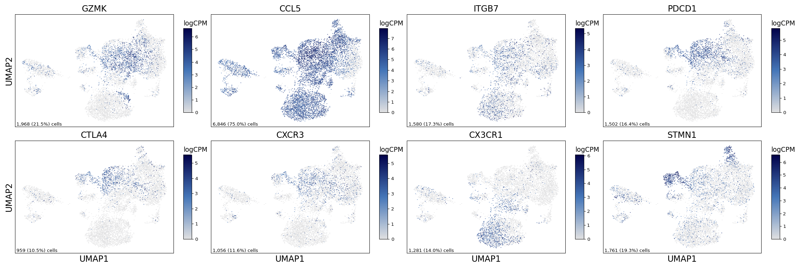
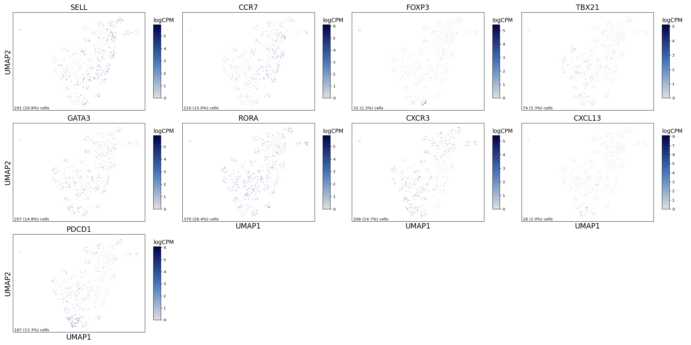
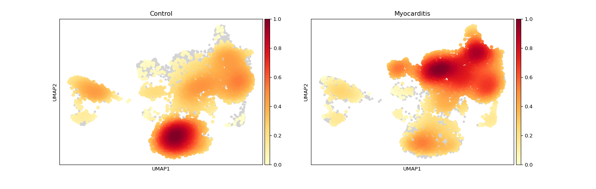
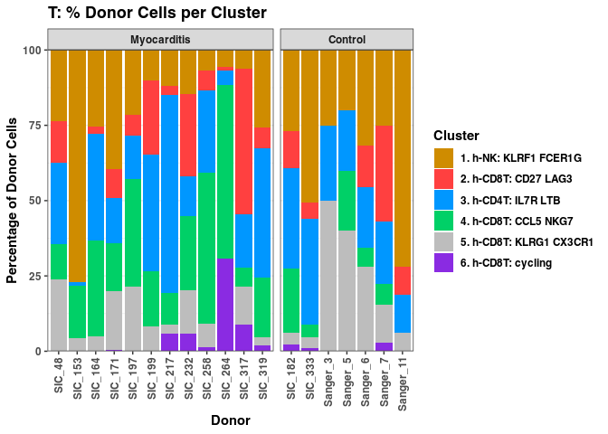
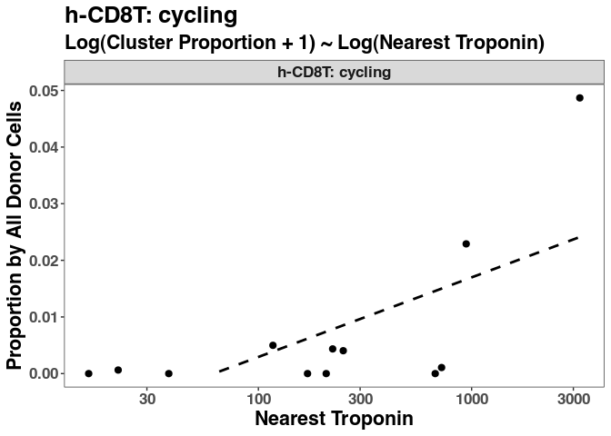
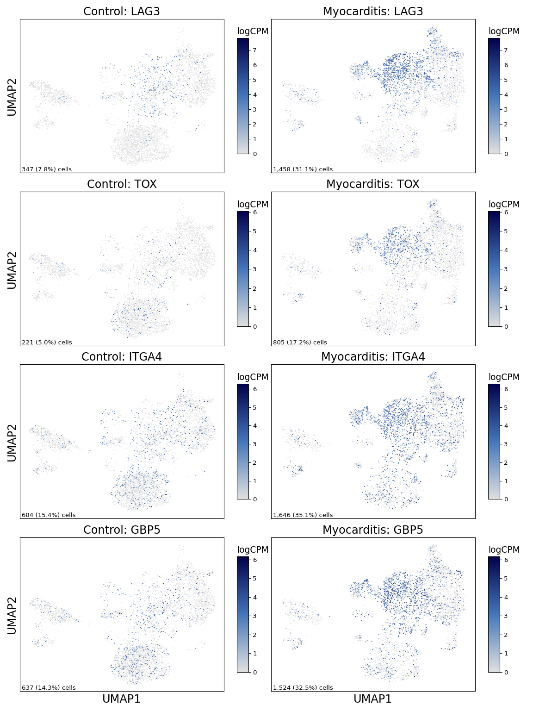
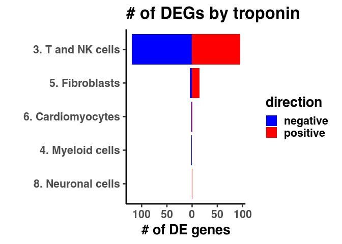
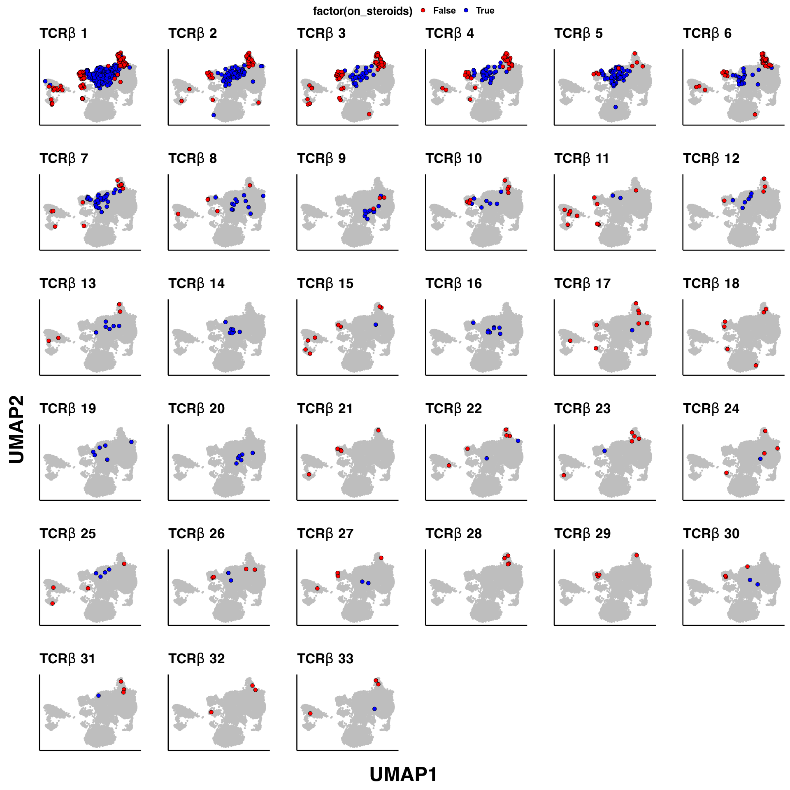
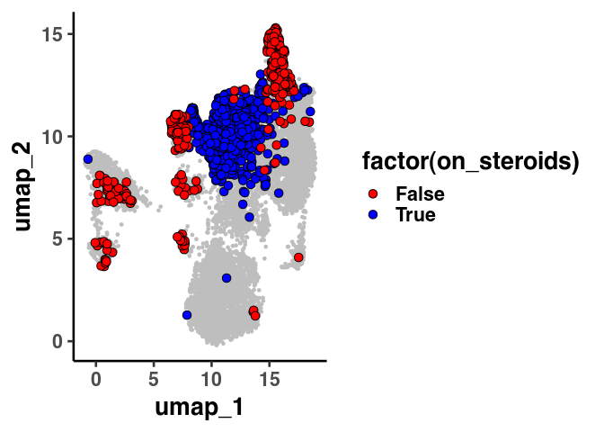
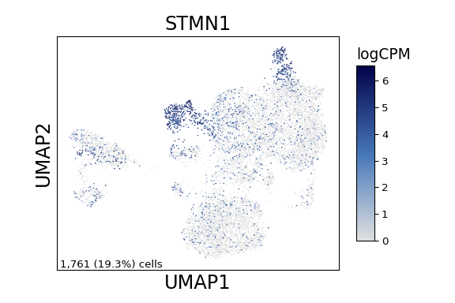

Extended data figure 4
================

## Setup

Load R libraries

``` r
library(tidyverse)
library(rmarkdown)
library(rlang)
library(parameters)
library(RColorBrewer)
library(ComplexHeatmap)
library(circlize)
library(Matrix)
library(glue)
library(ggforestplot)
library(ggbeeswarm)
library(ggrepel)
library(patchwork)
library(lme4)
library(ggstance)
library(DESeq2)
library(knitr)
library(fgsea)
library(ggpubr)
use_python("/projects/home/nealpsmith/.conda/envs/updated_pegasus/bin/python")

setwd('/projects/home/ikernin/github_code/myocarditis/functions')
source('masc.R')
source('de.R')
source('tissue_plot_masc.R')
source('tissue_gsea.R')
source('tissue_troponin_abundance.R')
```

Load Python packages

``` python
import pegasus as pg
import scanpy as sc
import warnings
warnings.filterwarnings('ignore')

import sys
sys.path.append("/projects/home/nealpsmith/publication_githubs/myocarditis/functions")
import python_functions
```

Read in single-cell data

``` python

tissue_t = pg.read_input('/projects/home/ikernin/projects/myocarditis/github_datasets/tissue_t.zarr')
```

``` python
tissue_cd4 = pg.read_input("/projects/home/ikernin/projects/myocarditis/tissue/cd4_subclustering/cd4_subclustering_harmony_0_9.zarr")
```

Read in TCR data

``` r
tissue_cell_info <- read.csv("/projects/home/nealpsmith/projects/myocarditis/tissue/data/tcr/blood_tissue_comps/tissue_cell_info.csv",
                             row.names = 1)

tissue_obs <- read_csv('/projects/home/ikernin/projects/myocarditis/updated_datasets/metadata/tissue_full_obs.csv')
```

## Supplemental Figure 4A

``` python

supp_3a_genes = ['GZMK', "CCL5", "ITGB7", "PDCD1", "CTLA4", "CXCR3", "CX3CR1", "STMN1"]
python_functions.multi_hex_featureplot(tissue_t,
                      supp_3a_genes,
                      ncol=4,
                      cmap=python_functions.blues_cmap,
                      gridsize=200)
```

    ##   0%|                                                                                                                                                                                                                                 | 0/8 [00:00<?, ?it/s] 12%|###########################1                                                                                                                                                                                             | 1/8 [00:00<00:01,  5.09it/s] 25%|######################################################2                                                                                                                                                                  | 2/8 [00:00<00:01,  4.47it/s] 38%|#################################################################################3                                                                                                                                       | 3/8 [00:00<00:01,  4.66it/s] 50%|############################################################################################################5                                                                                                            | 4/8 [00:00<00:00,  4.23it/s] 62%|#######################################################################################################################################6                                                                                 | 5/8 [00:01<00:00,  4.48it/s] 75%|##################################################################################################################################################################7                                                      | 6/8 [00:01<00:00,  4.12it/s] 88%|#############################################################################################################################################################################################8                           | 7/8 [00:01<00:00,  4.39it/s]100%|#########################################################################################################################################################################################################################| 8/8 [00:01<00:00,  4.06it/s]



## Supplemental figure 4B

``` python

supp_3b_genes = ["SELL", "CCR7", "FOXP3", "TBX21", "GATA3", "RORA", "CXCR3", "CXCL13", "PDCD1"]

python_functions.multi_hex_featureplot(tissue_cd4,
                      supp_3b_genes,
                      ncol=4,
                      cmap=python_functions.blues_cmap,
                      gridsize=200)
```

    ##   0%|                                                                                                                                                                                                                                 | 0/9 [00:00<?, ?it/s] 11%|########################1                                                                                                                                                                                                | 1/9 [00:00<00:01,  5.37it/s] 33%|########################################################################3                                                                                                                                                | 3/9 [00:00<00:01,  5.97it/s] 56%|########################################################################################################################5                                                                                                | 5/9 [00:00<00:00,  6.47it/s] 78%|########################################################################################################################################################################7                                                | 7/9 [00:00<00:00,  6.86it/s]100%|#########################################################################################################################################################################################################################| 9/9 [00:01<00:00,  8.01it/s]



## Supplemental Figure 4C

``` python
tissue_t.obs['Condition'] = [x.capitalize() for x in tissue_t.obs['condition']]
tissue_t_anndata = tissue_t.to_anndata()
sc.tl.embedding_density(tissue_t_anndata, groupby='Condition')
sc.pl.embedding_density(tissue_t_anndata, basis='umap', key=f'umap_density_Condition')
```



## Supplemental Figure 4D

``` python
stacked_bar_df = python_functions.get_stacked_bar_df(tissue_t, 't')
stacked_bar_order = tissue_t.obs['umap_name'].cat.categories.values
```

    ## Getting stacked bar info for: t

``` r
stacked_bar_order = py$stacked_bar_order[!str_detect(py$stacked_bar_order, 'Doublets')]
plot_clust_perc_by_donor(py$stacked_bar_df, 't', cluster_order = stacked_bar_order)
```

    ## Warning in py_to_r.pandas.core.frame.DataFrame(x): index contains duplicated
    ## values: row names not set

<!-- -->

## Supplemental Figure 4E

``` r
tissue_troponin_metadata <- read_csv('/projects/home/ikernin/projects/myocarditis/updated_datasets/metadata/tissue_troponin_metadata.csv')
troponin_filtered_df <- troponin_filter_tissue(tissue_obs, tissue_troponin_metadata)

# fit linear model by troponin for DE clusters
select_clusters <- c("h-NK: KLRF1 FCER1G",
                     "h-CD4T: IL7R LTB",
                    "h-CD8T: CD27 LAG3",
                    "h-CD8T: CCL5 NKG7",
                    "h-CD8T: cycling",
                    "h-MNP: S100A8-low C1QA-low",
                    "h-MNP: FCGR3A LILRB2",
                    "h-cDC: CLEC9A CD1C",
                    "Fibroblast: CXCL9, HLA-DRA")
troponin_cluster_percs <- troponin_get_percents_per_level(troponin_filtered_df, level='cluster')
select_cluster_percs <- troponin_cluster_percs %>%
        filter(cluster_names %in% select_clusters)
select_cluster_model <- troponin_fit_model(select_cluster_percs, level='cluster')
kable(select_cluster_model %>%
              dplyr::select(!c(data, model)) %>%
              unnest(cols = c(trop_coef, trop_se, trop_pval)))

troponin_plot_model(select_cluster_model %>% filter(cluster_names =="h-CD8T: cycling"),
                    select_cluster_percs %>% filter(cluster_names =="h-CD8T: cycling"),
                   "h-CD8T: cycling", level='cluster', point_size = 2.2, type='simple')
```

<!-- -->

| cluster\_names             |  trop\_coef |  trop\_se | trop\_pval |      padj |
| :------------------------- | ----------: | --------: | ---------: | --------: |
| Fibroblast: CXCL9, HLA-DRA |   0.0079106 | 0.0024072 |  0.0082023 | 0.0532563 |
| h-CD4T: IL7R LTB           |   0.0001508 | 0.0061707 |  0.9809880 | 0.9809880 |
| h-CD8T: CCL5 NKG7          |   0.0041760 | 0.0104397 |  0.6975596 | 0.8932075 |
| h-CD8T: CD27 LAG3          |   0.0049871 | 0.0063537 |  0.4507020 | 0.6760529 |
| h-CD8T: cycling            |   0.0059728 | 0.0021203 |  0.0182542 | 0.0547626 |
| h-cDC: CLEC9A CD1C         |   0.0019781 | 0.0006443 |  0.0118347 | 0.0532563 |
| h-MNP: FCGR3A LILRB2       |   0.0022458 | 0.0083721 |  0.7939622 | 0.8932075 |
| h-MNP: S100A8-low C1QA-low |   0.0115797 | 0.0083111 |  0.1937265 | 0.3487078 |
| h-NK: KLRF1 FCER1G         | \-0.0054702 | 0.0031077 |  0.1088655 | 0.2449473 |

## Supplemental Figure 4F

``` python

supp_3e_genes = ['LAG3', 'TOX', 'ITGA4', 'GBP5']
python_functions.multi_hexfp_by_condition(tissue_t,
                      supp_3e_genes,
                      cmap=python_functions.blues_cmap,
                      gridsize=200)
```

    ##   0%|                                                                                                                                                                                                                                 | 0/4 [00:00<?, ?it/s] 25%|######################################################2                                                                                                                                                                  | 1/4 [00:00<00:01,  2.61it/s] 50%|############################################################################################################5                                                                                                            | 2/4 [00:00<00:00,  2.68it/s] 75%|##################################################################################################################################################################7                                                      | 3/4 [00:01<00:00,  2.73it/s]100%|#########################################################################################################################################################################################################################| 4/4 [00:01<00:00,  2.76it/s]



## Supplemental Figure 4G

``` r
mtx <- read.csv("/projects/home/ikernin/projects/myocarditis/github_datasets/tissue_global_lineage_pseudocounts.csv",
                row.names = 1)

lin_assign <- read.csv("/projects/home/ikernin/projects/myocarditis/github_datasets/global_lineage_number_to_name_map.csv")

lin_assign$clust <- paste("c", lin_assign$umap_number, sep = "")
# trop_values <- read.csv("/projects/home/ikernin/projects/myocarditis/github_datasets/tissue_troponin_metadata.csv")

meta_data <- data.frame(row.names = colnames(mtx))

meta_data$clust <- sapply(rownames(meta_data), function(x) strsplit(x, "_")[[1]][3])
meta_data$donor <- sub("_c10|_c[1-9]", "", rownames(meta_data))

meta_data %<>%
  rownames_to_column() %>%
  dplyr::left_join(tissue_troponin_metadata, by = "donor") %>%
  dplyr::left_join(lin_assign, by = "clust") %>%
  column_to_rownames()


if (!file.exists("/projects/home/nealpsmith/projects/myocarditis/tissue_troponin_gene_modeling/data/tissue_lin_model_by_troponin.csv")){
  all_res <- data.frame()
  gset_res <- data.frame()
  for (cl in unique(meta_data$umap_name)){
    pdf(glue("/projects/home/nealpsmith/projects/myocarditis/tissue_troponin_gene_modeling/{cl}_results.pdf"))
    meta_temp <- meta_data %>%
      dplyr::filter(umap_name == cl) %>%
      na.omit() %>%
      mutate(log_trop = log(nearest_troponin))

    count_temp <- mtx[,rownames(meta_temp)]

    n_samp <- rowSums(count_temp != 0)
    count_temp <- count_temp[n_samp > round(nrow(meta_temp) / 2),]
    # Okay now we can run DESeq
    dds<- DESeqDataSetFromMatrix(countData = count_temp,
                                colData = meta_temp,
                                design = ~log_trop)
    dds<- DESeq(dds)
    res <- as.data.frame(results(dds))
    res<- res[!is.na(res$padj),]
    res$gene <- rownames(res)
    res$cluster <- cl

    if (nrow(res[res$padj < 0.1,]) > 20 ){
        up_label <- res[res$padj < 0.1,] %>%
          filter(log2FoldChange > 0) %>%
          arrange(pvalue) %>%
          top_n(-20, pvalue) %>%
          .$gene
        down_label <- res[res$padj < 0.1,] %>%
          filter(log2FoldChange < 0) %>%
          arrange(pvalue) %>%
          top_n(-20, pvalue) %>%
          .$gene
        label_genes <- c(up_label, down_label)
      } else if(nrow(res[res$padj < 0.1,]) > 0 ) {
        label_genes <- res[res$padj < 0.1,]$gene
      } else {
        label_genes = c()
      }
    print(
        ggplot(res, aes(x = log2FoldChange, y = -log10(pvalue))) +
          geom_point(data = res[res$padj > 0.1,], color = "grey") +
          geom_point(data = res[res$log2FoldChange > 0 & res$padj < 0.1,], color = "red") +
          geom_point(data = res[res$log2FoldChange < 0 & res$padj < 0.1,], color = "blue") +
          geom_text_repel(data = res[res$gene %in% label_genes,], aes(label = gene)) +
          ggtitle("")+
          theme_classic(base_size = 20)
      )

    ## Run GSEA ##
    res2 <- res %>%
      dplyr::select(gene, stat) %>%
      na.omit() %>%
      distinct() %>%
      group_by(gene) %>%
      summarize(stat=mean(stat)) %>%
      dplyr::select(gene, stat) %>%
      na.omit()

    ranks <- deframe(res2)

    gene_sets <- gmtPathways("/projects/home/nealpsmith/projects/kupper/all_data_analysis/data/msigdb_symbols.gmt")

    sets <- c("KEGG", "HALLMARK", "BIOCARTA")
    for (s in sets){
      gsets <- gene_sets[grep(s, names(gene_sets))]

      fgseaRes <- fgsea(pathways=gsets, stats=ranks, nperm=1000)
      fgseaResTidy <- fgseaRes %>%
      as_tibble() %>%
      arrange(desc(NES))
      fgseaResTidy$cluster <- cl
      gset_res <- rbind(gset_res, fgseaResTidy)

      # Make the GSEA plots
     print(
       ggplot(fgseaResTidy[fgseaResTidy$padj < 0.1,], aes(reorder(pathway, NES), NES)) +
         coord_flip() +
         geom_col() +
         labs(x="Pathway", y="Normalized Enrichment Score",
              title=paste("significant", s,"pathways", sep = " ")) +
         theme_minimal()
          )
      }
    dev.off()
    all_res <- rbind(all_res, res)
  }
  write.csv(all_res, "/projects/home/nealpsmith/projects/myocarditis/tissue_troponin_gene_modeling/data/tissue_lin_model_by_troponin.csv",
            row.names = FALSE)
  gset_res$leadingEdge <- as.character(gset_res$leadingEdge)
  write.csv(gset_res, "/projects/home/nealpsmith/projects/myocarditis/tissue_troponin_gene_modeling/data/tissue_lin_model_by_troponin_gsea_results.csv",
            row.names = FALSE)

} else {
  gene_sets <- gmtPathways("/projects/home/nealpsmith/projects/kupper/all_data_analysis/data/msigdb_symbols.gmt")
  all_res <- read.csv("/projects/home/nealpsmith/projects/myocarditis/tissue_troponin_gene_modeling/data/tissue_lin_model_by_troponin.csv")
  gset_res <- read.csv("/projects/home/nealpsmith/projects/myocarditis/tissue_troponin_gene_modeling/data/tissue_lin_model_by_troponin_gsea_results.csv")
}


# Side-by-side bars
n_degs <- all_res %>%
  dplyr::filter(padj < 0.1, cluster != "10. Doublets and RBC") %>%
  mutate(direction = ifelse(stat > 0, "positive", "negative")) %>%
  group_by(cluster, direction) %>%
  summarise(n_degs = n()) %>%
  mutate(n_degs = ifelse(direction == "negative", -n_degs, n_degs))

order <- n_degs %>%
  group_by(cluster) %>%
  summarise(tot = sum(abs(n_degs))) %>%
  arrange(desc(tot)) %>%
  .$cluster
n_degs$cluster <- factor(n_degs$cluster, levels = rev(order))


ggplot(n_degs, aes(x = cluster, y = n_degs, group = direction, fill = direction)) +
  geom_bar(stat = "identity") + coord_flip() +
  scale_fill_manual(values = c("#0000FF", "#FF0000")) +
  scale_y_continuous(labels = abs) +
  ggtitle(glue("# of DEGs by troponin")) +
  ylab("# of DE genes") + xlab("") +
  theme_classic(base_size = 20)
```

<!-- -->

## Supplemental Figure 4H

``` r
tissue_cell_info$samp_ster <- paste(tissue_cell_info$donor, tissue_cell_info$on_steroids, sep = "_")
# Re-calculate expaded clones by sample
tcr_props <- tissue_cell_info %>%
  dplyr::select(TRB_cdr3, samp_ster) %>%
  dplyr::filter(TRB_cdr3 != "") %>%
  group_by(samp_ster, TRB_cdr3) %>%
  summarise(n_cells = n()) %>%
  group_by(samp_ster) %>%
  mutate(n_total = sum(n_cells)) %>%
  mutate(perc = n_cells / n_total)

tcr_props$expanded_t_new <- ifelse(tcr_props$perc > 0.005 & tcr_props$n_cells > 1, TRUE, FALSE)

expanded_df <- tcr_props %>%
  dplyr::select(samp_ster, TRB_cdr3, expanded_t_new)

tissue_cell_info %<>%
  left_join(expanded_df, by = c("samp_ster", "TRB_cdr3"))

plot_df <- tissue_cell_info

expanded_clones_pre <- plot_df %>%
  dplyr::filter(donor == "SIC_264", on_steroids == "False", expanded_t_new == TRUE) %>%
  .$TRB_cdr3 %>%
  unique(.)


expanded_clones_post <- plot_df %>%
  dplyr::filter(donor == "SIC_264", on_steroids == "True", expanded_t_new == TRUE) %>%
  .$TRB_cdr3 %>%
  unique(.)

plot_order <- tcr_props %>%
  dplyr::filter(samp_ster %in% c("SIC_264_False", "SIC_264_True"), perc > 0.005, n_cells > 1) %>%
  group_by(TRB_cdr3) %>%
  summarise(n = sum(n_cells)) %>%
  arrange(desc(n)) %>%
  .$TRB_cdr3

plot_list <- list()
num <- 1
for (seq in plot_order){
  plot_df <- tissue_cell_info
  plot_df$clone_oi <- ifelse(plot_df$TRB_cdr3 == seq, TRUE, FALSE)
  plot <- ggplot(plot_df, aes(x = umap_1, y = umap_2)) +
    geom_point(data = dplyr::select(plot_df, -clone_oi), color = "grey", size = 1) +
    geom_point(data = plot_df[plot_df$clone_oi == TRUE,], pch = 21, size = 3, aes(fill = factor(on_steroids))) +
    scale_fill_manual(values = c("False" = "red", "True" = "blue")) +
    ggtitle(as.expression(bquote(TCR*beta ~ .(num)))) +
    xlab("") + ylab("") +
    theme_classic(base_size = 20) +
    theme(plot.title = element_text(size=25),
          axis.ticks = element_blank(),
          axis.text = element_blank())
  plot_list <- c(plot_list, list(plot))
  num <- num + 1
}

all_plots <- ggarrange(plotlist = plot_list, common.legend = TRUE, legend = "top")
figure <- annotate_figure(all_plots, left = textGrob("UMAP2", rot = 90, vjust = 1, hjust = 1, gp = gpar(cex = 3)),
                          bottom = textGrob("UMAP1", vjust = 0, gp = gpar(cex = 3)))
figure
```

<!-- -->

## Supplemental figure 4I

``` r
all_exp_clones <- unique(c(expanded_clones_post, expanded_clones_pre))
plot_df <- tissue_cell_info
plot_df$clone_oi <- ifelse(plot_df$TRB_cdr3 %in% all_exp_clones, TRUE, FALSE)
ggplot(plot_df, aes(x = umap_1, y = umap_2)) +
  geom_point(data = dplyr::select(plot_df, -clone_oi), color = "grey", size = 1) +
  geom_point(data = plot_df[plot_df$clone_oi == TRUE,], pch = 21, size = 3, aes(fill = factor(on_steroids))) +
  scale_fill_manual(values = c("False" = "red", "True" = "blue")) +
  theme_classic(base_size = 20) +
  theme(plot.title = element_text(size=10))
```

<!-- -->

## Supplemental Figure 4J

``` python
python_functions.hex_featureplot(tissue_t, 'STMN1', cmap=python_functions.blues_cmap)
```


