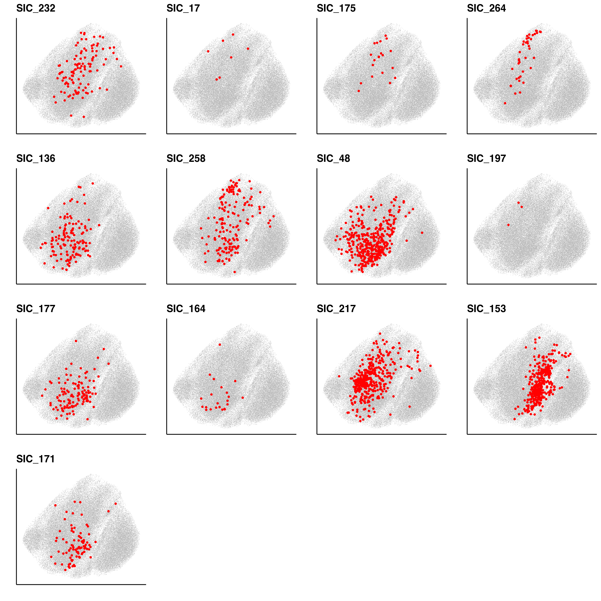
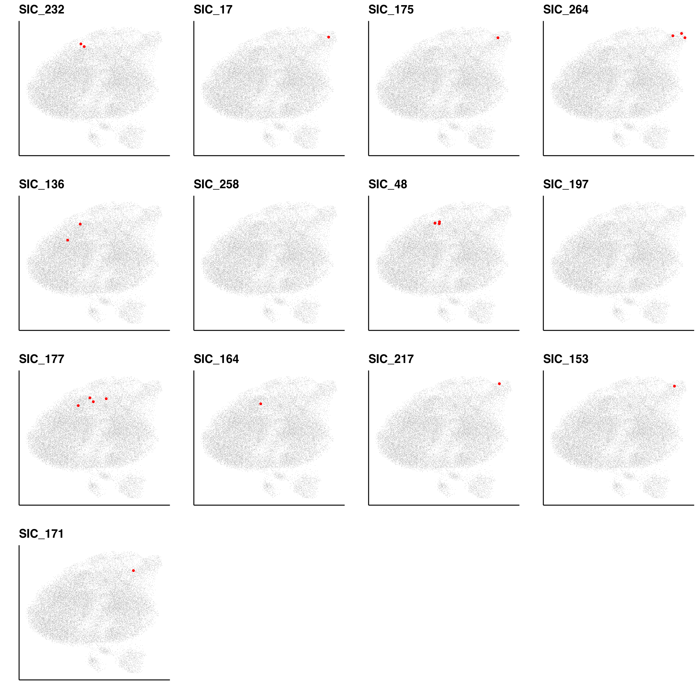
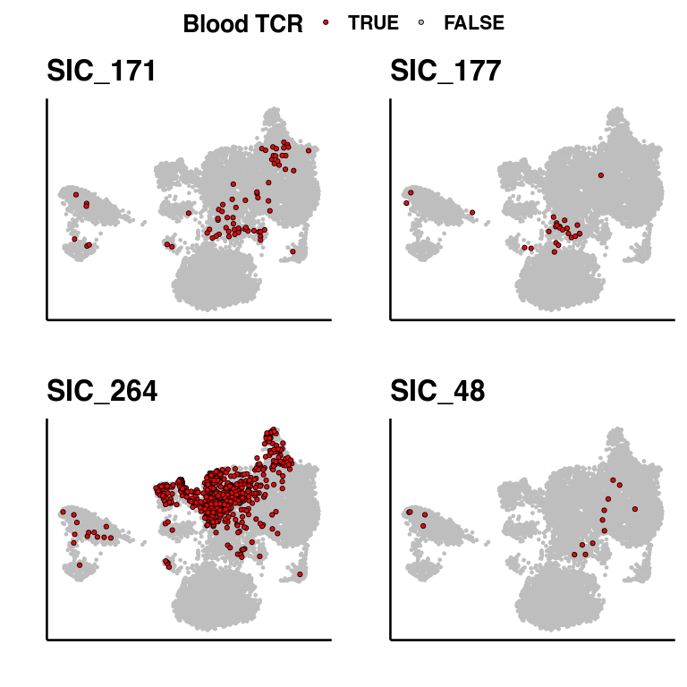
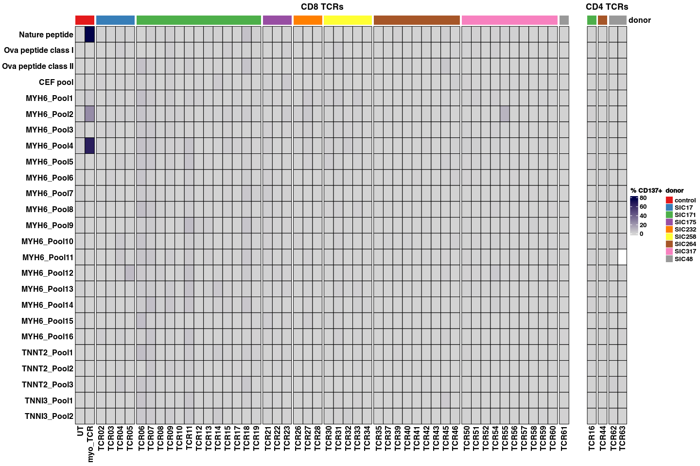

Supplemental Figure 6
================

## Setup

Load R libraries

``` r
library(tidyverse)
library(glue)
library(rlang)
library(parameters)
library(ggforestplot)
library(rmarkdown)
library(knitr)
library(scattermore)
library(magrittr)
library(alakazam)
library(ggrepel)
library(ggpubr)
library(RColorBrewer)
library(circlize)
library(ComplexHeatmap)

library(reticulate)
use_python("/projects/home/nealpsmith/.conda/envs/updated_pegasus/bin/python")

setwd('/projects/home/nealpsmith/publication_githubs/myocarditis/functions')

source('tcr_functions.R')
```

Load Python packages

``` python
import pegasus as pg
import warnings
warnings.filterwarnings('ignore')

import sys
sys.path.append("/projects/home/nealpsmith/publication_githubs/myocarditis/functions")
import python_functions
```

Read in single-cell data

``` python
blood_cd8_nk = pg.read_input('/projects/home/ikernin/projects/myocarditis/github_datasets/blood_cd8.zarr')
```

``` python
tissue_t = pg.read_input('/projects/home/ikernin/projects/myocarditis/github_datasets/tissue_t.zarr')
```

Read in TCR data

``` r
# Blood TCR info
bulk_tcr_df <- read.csv("/projects/home/nealpsmith/projects/myocarditis/data/adaptive/all_productive_tcrs.csv",
                        row.names = 1)

blood_sc_info_cd8 = read.csv(
        "/projects/home/nealpsmith/projects/myocarditis/blood/updated/data/myo_blood_cd8_obs.csv",
                     row.names = 1)
blood_sc_info_cd8$sample_id[blood_sc_info_cd8$sample_id == "SIC_258_784"] <- "SIC_258_787"
blood_sc_info_cd8$t_cell_cluster <- paste("cd8_", blood_sc_info_cd8$leiden_labels, sep = "")

blood_sc_info_cd4 = read.csv("/projects/home/nealpsmith/projects/myocarditis/blood/updated/data/myo_blood_cd4_obs.csv",
                     row.names = 1)
blood_sc_info_cd4$sample_id[blood_sc_info_cd4$sample_id == "SIC_258_784"] <- "SIC_258_787"
blood_sc_info_cd4$t_cell_cluster <- paste("cd4_", blood_sc_info_cd4$leiden_labels, sep = "")

all_blood_sc_info <- rbind(blood_sc_info_cd8, blood_sc_info_cd4)
# Add timepoint info
timepoint_info <- read.csv("/projects/home/nealpsmith/projects/myocarditis/blood/updated/data/myo_blood_timepoints.csv")

blood_sc_info_cd8 %<>%
  rownames_to_column("index") %>%
  dplyr::left_join(timepoint_info, by = "sample_id") %>%
  column_to_rownames("index")
all_blood_sc_info %<>%
  dplyr::left_join(timepoint_info, by = "sample_id")

tissue_sc_info <- read.csv("/projects/home/nealpsmith/projects/myocarditis/tissue/data/tcr/blood_tissue_comps/tissue_cell_info.csv",
                             row.names = 1)
tissue_sc_info <- tissue_sc_info[tissue_sc_info$TRB_cdr3 != "",]


bulk_tissue_samples = list("SIC_3" = list("tumor" = "A17-341_A2", "control" = "A17-341_A3", "myo" = "A17-341_A27"),
                           "SIC_232" = list("tumor" = "A19-395_A8", "control" = "A19-395_A7", "myo" = "A19-395_A53-1"),
                           "SIC_136" = list("tumor" = "A19-41_A10_Tumor", "control" = "A19-41_A10_Liver", "myo" = "A19-41_A33"),
                           "SIC_17" = list("tumor" = "A18-122_A51", "control" = "A18-122_A52", "myo" = "A18-122_A41"),
                           "SIC_175" = list("tumor" = "A19-230_A5", "control" = "T03054-11", "myo" = "A19-230_A48"),
                           "SIC_266" = list("myo" = "A20-363_A18"),
                           "SIC_264" = list("myo" = "A20-331_A1"),
                           # These are controls
                           "SIC_176" = list("myo" = "A19-213_A13"),
                           "SIC_14" = list("myo" = "T01708-11"),
                           "SIC_182" = list("myo" = "A19-240_A15"),
                           "T01241" = list("myo" = "A16-303_A5")
)
```

## Supplemental figure 6A

``` r
blood_overlap_subjs <- intersect(c(names(bulk_tissue_samples), unique(tissue_sc_info$donor)),
                                 unique(blood_sc_info_cd8$donor))

# Don't include bulk healing
healing_ids <- c("SIC_3", "SIC_175", "SIC_266", "SIC_232")

myo_exp_tcrs <- lapply(blood_overlap_subjs, function(s){
  subj_tcrs <- c()
  # See if they have bulk TCR
  if(s %in% names(bulk_tissue_samples)){
    if (!s %in% healing_ids){
      bulk_samp <- bulk_tissue_samples[[s]]$myo
      bulk_tcrs <- bulk_tcr_df[bulk_tcr_df$sample == bulk_samp,] %>%
        dplyr::select(amino_acid, count_templates_reads) %>%
        group_by(amino_acid) %>%
        summarise(n = sum(count_templates_reads)) %>%
        mutate(perc = n / sum(n) * 100)
    bulk_exp <- bulk_tcrs$amino_acid[bulk_tcrs$perc > 0.5 & bulk_tcrs$n > 1]
    subj_tcrs <- c(subj_tcrs, bulk_exp)
    }

  }
  # See if they have single cell TCR
  if (s %in% unique(tissue_sc_info$donor)){
    subj_sc <- tissue_sc_info[tissue_sc_info$donor == s,] %>%
      dplyr::filter(TRB_cdr3 != "") %>%
      dplyr::select(TRB_cdr3) %>%
      mutate("count" =  1) %>%
      group_by(TRB_cdr3) %>%
      summarise(n = sum(count)) %>%
      mutate(perc = n / sum(n) * 100)
    sc_exp <- subj_sc$TRB_cdr3[subj_sc$perc > 0.5 & subj_sc$n > 1]
    subj_tcrs <- c(subj_tcrs, sc_exp)
  }
  return(unique(subj_tcrs))
})
names(myo_exp_tcrs) <- blood_overlap_subjs


# Now one for overall
plot_df <- blood_sc_info_cd8
plot_df$myo_clone <- FALSE
for (s in blood_overlap_subjs){
  myo_clones <- myo_exp_tcrs[[s]]
  plot_df$myo_clone[plot_df$donor == s & plot_df$TRB_cdr3 %in% myo_clones] <- TRUE

}

ggplot(plot_df, aes(x = umap_1, y = umap_2)) +
  geom_scattermore(data = plot_df[plot_df$myo_clone == FALSE,], color = "grey", size = 1) +
  geom_point(data = plot_df[plot_df$myo_clone == TRUE,], color = "red", size = 2) +
  xlab("UMAP1") + ylab("UMAP2") +
  theme_classic(base_size = 20) +
  theme(axis.ticks = element_blank(), axis.text = element_blank())
```

<!-- -->

## Supplemental Figure 6B

``` r
info_df <- all_blood_sc_info[all_blood_sc_info$donor %in% blood_overlap_subjs,]
info_df$myo_clone <- "False"
for (s in blood_overlap_subjs){
  myo_clones <- myo_exp_tcrs[[s]]
  info_df$myo_clone[info_df$donor == s & info_df$TRB_cdr3 %in% myo_clones] <- "True"
}
# info_df <- info_df[info_df$TRB_cdr3 != "",]
info_df %<>% dplyr::filter(TRB_cdr3 != "", timepoint_cat != "pre_ici")

df <- tcr_assoc_func(info_df, cluster = info_df$t_cell_cluster, contrast = "myo_clone")

new_names <- c("clustercd8_1" = "1. b-NK: SPON2, FGFBP2",
               "clustercd8_2" = "2. b-CD8: ZNF683, GZMB",
               "clustercd8_3" = "3. b-CD8: CCL5, GNLY",
               "clustercd8_4" = "4. b-CD8: GZMK, DUSP2",
               "clustercd8_5" = "5. b-CD8: CCR7, CD45RA-prot",
               "clustercd8_6" = "6. b-CD8: CX3CR1, TBX21",
               "clustercd8_7" = "7. b-CD8: GZMK, TCF7",
               "clustercd8_8" = "8. b-MAIT: TRAV1-2, KLRB1",
               "clustercd8_9" = "9. b-CD8T/NK: MT-high",
               "clustercd8_10" = "10. b-CD8: cycling",
               "clustercd8_11" = "11. b-NK: XCL1, SPTSSB",
               "clustercd8_12" = "13. Doublets",
               "clustercd8_13" = "12. b-NK: cycling",
               "clustercd4_1" = "1. b-CD4: TNFRSF4, CD40LG",
               "clustercd4_2" = "2. b-CD4: CCR7, CD45RA-prot",
               "clustercd4_3" = "3. b-CD4: GZMA, HLA-DRB1",
               "clustercd4_4" = "4. b-CD4: Treg",
               "clustercd4_5" = "5. b-CD4: GZMK, HLA-DRB1-low",
               "clustercd4_6" = "6. b-CD4: MT-high",
               "clustercd4_7" = "7. b-CD4: cycling",
               "clustercd4_8" = "8. Doublets")
df$cluster <- sapply(df$cluster, function(x) new_names[[x]])

df <- df[df$cluster != "13. Doublets",]
ggplot(df, aes(x = myo_clone.OR, y = -log10(model.pvalue))) +
  geom_errorbarh(data = df[df$model.padj < 0.05 & df$myo_clone.OR > 1.42,],
                 aes(xmax = myo_clone.OR.95pct.ci.upper, xmin = myo_clone.OR.95pct.ci.lower),
                 color = "grey", height = 0) +
  geom_point(data = df[df$model.padj > 0.05 | df$myo_clone.OR < 1.42,],
             color = "grey") +
  geom_point(data = df[df$model.padj < 0.05 & df$myo_clone.OR > 1.42,],
             color = "red", size = 3) +
  geom_text_repel(data = df[df$model.padj < 0.05 & df$myo_clone.OR > 1.42,],
                  aes(label = cluster), size = 3, direction = "y") +
  geom_vline(xintercept = 1, linetype = "dashed") +
  xlab("OR") + ylab("-log10(p-value)") +
  theme_classic(base_size = 20)
```

<!-- -->

## Supplemental Figure 6C

``` r
subj_order <- c("SIC_232", "SIC_17", "SIC_175", "SIC_264", "SIC_136", "SIC_258", "SIC_48", "SIC_197",
                "SIC_177", "SIC_164", "SIC_217", "SIC_153", "SIC_171")

plot_list <- list()
for (s in subj_order){
  myo_clones <- myo_exp_tcrs[[s]]

  plot_df <- blood_sc_info_cd8
  plot_df$myo_clone <- ifelse(plot_df$donor == s & plot_df$TRB_cdr3 %in% myo_clones, TRUE, FALSE)

  plot <- ggplot(plot_df, aes(x = umap_1, y = umap_2)) +
    geom_scattermore(data = plot_df[plot_df$myo_clone == FALSE,], color = "grey", size = 1) +
    geom_point(data = plot_df[plot_df$myo_clone == TRUE,], color = "red", size = 2) +
    xlab("") + ylab("") +
    theme_classic(base_size = 20) +
    ggtitle(s) +
    theme(axis.ticks = element_blank(), axis.text = element_blank())
  plot_list <- c(plot_list, list(plot))

}
figure <- ggarrange(plotlist = plot_list, ncol = 4, nrow = 4, common.legend = TRUE, legend = "right")
figure
```

<!-- -->

## Supplemental Figure 6D

``` r
subj_order <- c("SIC_232", "SIC_17", "SIC_175", "SIC_264", "SIC_136", "SIC_258", "SIC_48", "SIC_197",
                "SIC_177", "SIC_164", "SIC_217", "SIC_153", "SIC_171")

plot_list <- list()
for (s in subj_order){
  myo_clones <- myo_exp_tcrs[[s]]

  plot_df <- blood_sc_info_cd4
  plot_df$myo_clone <- ifelse(plot_df$donor == s & plot_df$TRB_cdr3 %in% myo_clones, TRUE, FALSE)

  plot <- ggplot(plot_df, aes(x = umap_1, y = umap_2)) +
    geom_scattermore(data = plot_df[plot_df$myo_clone == FALSE,], color = "grey", size = 1) +
    geom_point(data = plot_df[plot_df$myo_clone == TRUE,], color = "red", size = 2) +
    xlab("") + ylab("") +
    theme_classic(base_size = 20) +
    ggtitle(s) +
    theme(axis.ticks = element_blank(), axis.text = element_blank())
  plot_list <- c(plot_list, list(plot))

}
figure <- ggarrange(plotlist = plot_list, ncol = 4, nrow = 4, common.legend = TRUE, legend = "right")
figure
```

<!-- -->

## Supplemental Figure 6E

``` r
# This dataframe is the same as "tissue_sc_info",
# but includes all cells (not just those tissue cells with a recovered TCR)
tissue_cell_info <- read.csv("/projects/home/nealpsmith/projects/myocarditis/tissue/data/tcr/blood_tissue_comps/tissue_cell_info.csv",
                             row.names = 1)


# Make the associated UMAPs
subj_list <- tissue_cell_info %>%
  dplyr::filter(blood_clone == "True") %>%
  dplyr::select(donor, blood_clone) %>%
  group_by(donor) %>%
  summarise(n=n()) %>%
  dplyr::filter(n > 10) %>%
  .$donor

plot_list <- list()
for (s in subj_list){
  plot_df <- tissue_cell_info
  plot_df$blood_clone <- ifelse(plot_df$donor == s & plot_df$blood_clone == "True", "TRUE", "FALSE")

  plot <- ggplot(plot_df, aes(x = umap_1, y = umap_2)) +
    geom_point(data = plot_df[plot_df$blood_clone == "FALSE",], aes(fill = blood_clone), color = "grey", size = 1) +
    geom_point(data = plot_df[plot_df$blood_clone == "TRUE",], pch = 21, aes(fill = blood_clone), size = 1.5) +
    xlab("") + ylab("") +
    scale_fill_manual(name = "Blood TCR", breaks = c("TRUE", "FALSE"),
                      values = c("TRUE" = "red", "FALSE" = "grey")) +
    theme_classic(base_size = 20) +
    ggtitle(s) +
    theme(axis.ticks = element_blank(), axis.text = element_blank())
  plot_list <- c(plot_list, list(plot))

}
all_plots <- ggarrange(plotlist = plot_list, common.legend = TRUE)
all_plots
```

<!-- -->

## Supplemental Figure 6F

``` python

supp_fig5e_genes = ['CXCR3', 'CX3CR1']
python_functions.multi_hex_featureplot(tissue_t,
                      supp_fig5e_genes,
                      ncol=2,
                      cmap=python_functions.blues_cmap,
                      gridsize=200)
```

    ##   0%|                                                                                                                                                                                                                                 | 0/2 [00:00<?, ?it/s] 50%|############################################################################################################5                                                                                                            | 1/2 [00:00<00:00,  4.85it/s]100%|#########################################################################################################################################################################################################################| 2/2 [00:00<00:00,  4.29it/s]


## Supplemental Figure 6H

``` r
colors <- brewer.pal(n = 10, "Set1")
```

    ## Warning in brewer.pal(n = 10, "Set1"): n too large, allowed maximum for palette Set1 is 9
    ## Returning the palette you asked for with that many colors

``` r
cd137_data <- read.csv("/projects/home/nealpsmith/projects/myocarditis/antigen_discovery/data/cd137_vals.csv", row.names = 1)
# Make the lowest value 0
# cd137_data[is.na(cd137_data)] <- 0
cd137_data[cd137_data < 0] <- 0
tcr_info <- read.csv("/projects/home/nealpsmith/projects/myocarditis/antigen_discovery/data/tcr_annotations.csv")

donor_colors <- colors[1:length(unique(tcr_info$donor))]
names(donor_colors) <- unique(tcr_info$donor)

cd8_tcrs <- tcr_info[tcr_info$subset == "CD8",]

heatmap_df_cd8 <- cd137_data[,cd8_tcrs$tcr]

# Need a continuous color scale
heatmap_col_fun = colorRamp2(c(min(heatmap_df_cd8), max(heatmap_df_cd8)), c("#D3D3D3", '#02024a'))

# Lets do the column split
donor_split <- factor(cd8_tcrs$donor)
annotation_cd8 <- HeatmapAnnotation(donor = cd8_tcrs$donor, col = list(donor = donor_colors), which = "column",
                                    show_annotation_name = FALSE)

cd8_hmap <- Heatmap(heatmap_df_cd8, col = heatmap_col_fun, cluster_columns = FALSE, cluster_rows = FALSE,
                    column_split = donor_split, column_title = "CD8 TCRs", name = "% CD137+",
                    top_annotation = annotation_cd8, rect_gp = gpar(col = "black"), row_names_side = "left", na_col = "white")
```

    ## Warning: The input is a data frame-like object, convert it to a matrix.

``` r
cd4_tcrs <- tcr_info[tcr_info$subset == "CD4",]

heatmap_df_cd4 <- cd137_data[,cd4_tcrs$tcr]

# Lets do the column split
donor_split <- factor(cd4_tcrs$donor)
annotation_cd4 <- HeatmapAnnotation(donor = cd4_tcrs$donor, col = list(donor = donor_colors), which = "column")

cd4_hmap <- Heatmap(heatmap_df_cd4, col = heatmap_col_fun, cluster_columns = FALSE, cluster_rows = FALSE,
                    column_split = donor_split, column_title = "CD4 TCRs", show_heatmap_legend = FALSE,
                    top_annotation = annotation_cd4, rect_gp = gpar(col = "black"), row_names_side = "left", na_col = "white")
```

    ## Warning: The input is a data frame-like object, convert it to a matrix.

``` r
hmap_list <- cd8_hmap + cd4_hmap

draw(hmap_list, ht_gap = unit(1, "cm"))
```

<!-- -->
