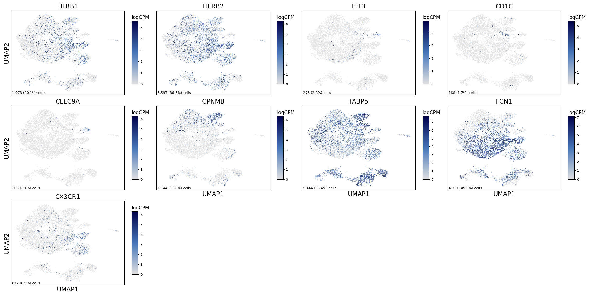
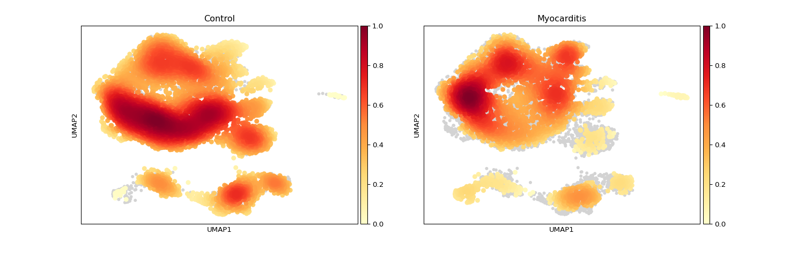
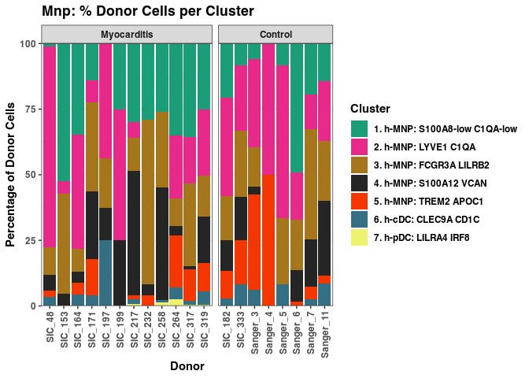
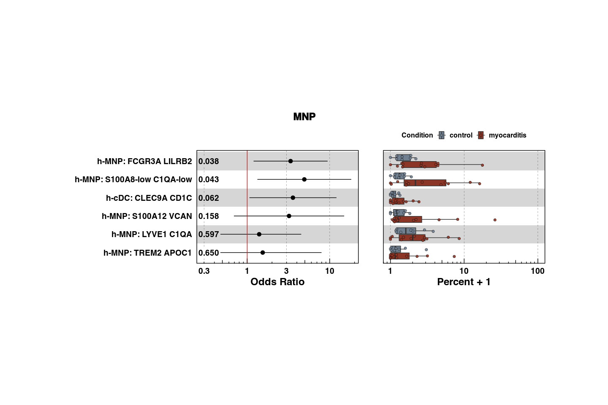

Supplemental Figure 7
================

## Setup

Load R libraries

``` r
# load packages
library(tidyverse)
library(rmarkdown)
library(rlang)
library(parameters)
library(RColorBrewer)
library(ComplexHeatmap)
library(circlize)
library(Matrix)
library(glue)
library(ggforestplot)
library(ggbeeswarm)
library(ggrepel)
library(patchwork)
library(lme4)
library(ggstance)
library(DESeq2)
library(knitr)
library(fgsea)
library(ggpubr)


library(reticulate)
use_python("/projects/home/nealpsmith/.conda/envs/updated_pegasus/bin/python")

setwd('/projects/home/nealpsmith/publication_githubs/myocarditis/functions')
source('stacked_bar.R')
source('blood_abundance.R')
source('masc.R')
source('tissue_plot_masc.R')
```

Load Python packages

``` python
import pegasus as pg
import scanpy as sc
import warnings
warnings.filterwarnings('ignore')

import sys
sys.path.append("/projects/home/nealpsmith/publication_githubs/myocarditis/functions")
import python_functions
```

Read in single-cell data

``` python
tissue_mnp = pg.read_input('/projects/home/ikernin/projects/myocarditis/github_datasets/tissue_myeloid.zarr')
```

## Supplemental Figure 7A

``` python

supp_7a_genes = ["LILRB1", "LILRB2", "FLT3", "CD1C", "CLEC9A", "GPNMB", "FABP5", "FCN1", "CX3CR1"]
python_functions.multi_hex_featureplot(tissue_mnp,
                      supp_7a_genes,
                      ncol=4,
                      cmap=python_functions.blues_cmap,
                      gridsize=200)
```

    ##   0%|                                                                                                                                                                                                                                 | 0/9 [00:00<?, ?it/s] 11%|########################1                                                                                                                                                                                                | 1/9 [00:00<00:02,  3.05it/s] 22%|################################################2                                                                                                                                                                        | 2/9 [00:00<00:02,  3.41it/s] 33%|########################################################################3                                                                                                                                                | 3/9 [00:00<00:01,  3.39it/s] 44%|################################################################################################4                                                                                                                        | 4/9 [00:01<00:01,  3.72it/s] 56%|########################################################################################################################5                                                                                                | 5/9 [00:01<00:01,  3.59it/s] 67%|################################################################################################################################################6                                                                        | 6/9 [00:01<00:00,  3.88it/s] 78%|########################################################################################################################################################################7                                                | 7/9 [00:01<00:00,  3.69it/s] 89%|################################################################################################################################################################################################8                        | 8/9 [00:02<00:00,  3.96it/s]100%|#########################################################################################################################################################################################################################| 9/9 [00:02<00:00,  3.74it/s]



## Supplemental Figure 7B

``` python
tissue_mnp.obs['Condition'] = [x.capitalize() for x in tissue_mnp.obs['condition']]
tissue_mnp = tissue_mnp.to_anndata()
sc.tl.embedding_density(tissue_mnp, groupby='Condition')
sc.pl.embedding_density(tissue_mnp, basis='umap', key=f'umap_density_Condition')
```



## Supplemental Figure 7C

``` python
tissue_mnp = pg.read_input('/projects/home/ikernin/projects/myocarditis/github_datasets/tissue_myeloid.zarr')
```

    ## 2024-04-03 15:47:16,463 - pegasusio.readwrite - INFO - zarr file '/projects/home/ikernin/projects/myocarditis/github_datasets/tissue_myeloid.zarr' is loaded.
    ## 2024-04-03 15:47:16,463 - pegasusio.readwrite - INFO - Function 'read_input' finished in 0.14s.

``` python
stacked_bar_df = python_functions.get_stacked_bar_df(tissue_mnp, 'mnp')
```

    ## Getting stacked bar info for: mnp

``` python
stacked_bar_order = tissue_mnp.obs['umap_name'].cat.categories.values
```

``` r
stacked_bar_order = py$stacked_bar_order[!str_detect(py$stacked_bar_order, 'Doublets')]
plot_clust_perc_by_donor(py$stacked_bar_df, 'mnp', cluster_order = stacked_bar_order)
```

    ## Warning in py_to_r.pandas.core.frame.DataFrame(x): index contains duplicated
    ## values: row names not set

<!-- -->

## Supplemental figure 7D

``` r
# read in tissue data
tissue_obs <- read_csv('/projects/home/ikernin/projects/myocarditis/updated_datasets/metadata/tissue_full_obs.csv')

# filter
masc_df <- masc_filter(tissue_obs)

# read in masc res (from figure 3 code)
cluster_masc_res <- read_csv('/projects/home/ikernin/projects/myocarditis/updated_datasets/masc/cluster_masc_res.csv')

# plot masc results
plot_masc_by_cell_type(cluster_masc_res, masc_df, lineage='MNP')
```

<!-- -->
