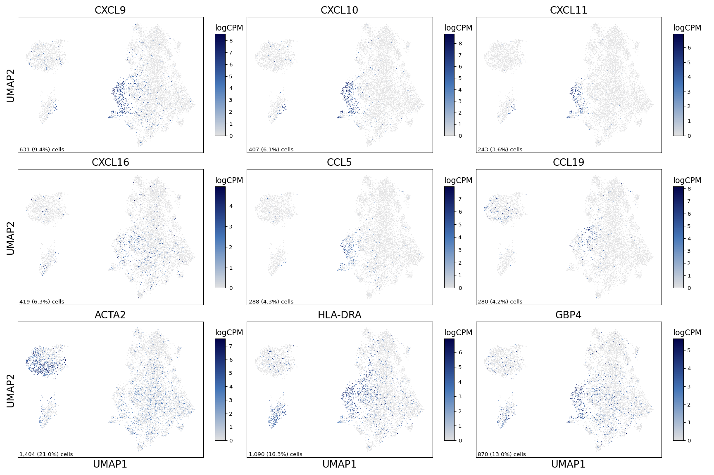
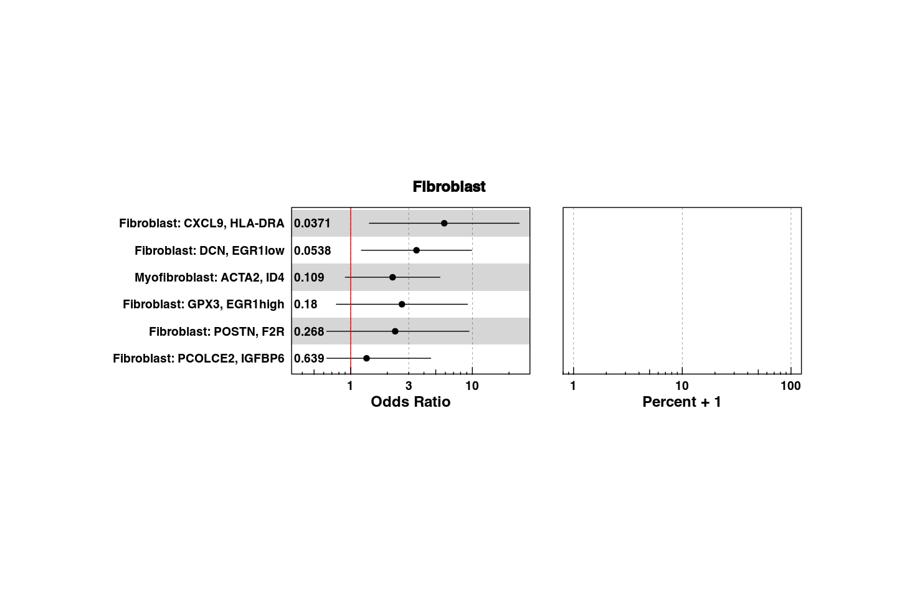
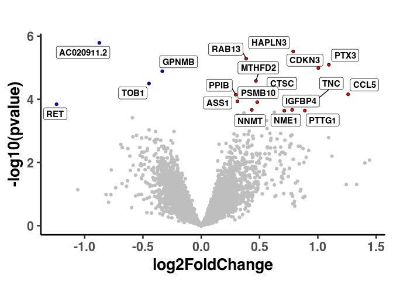

Supplemental Figure 9
================

## Set up

Load R libraries

``` r
# load packages
library(tidyverse)
library(rmarkdown)
library(rlang)
library(parameters)
library(RColorBrewer)
library(ComplexHeatmap)
library(circlize)
library(Matrix)
library(glue)
library(ggforestplot)
library(ggbeeswarm)
library(patchwork)
library(lme4)
library(ggstance)
library(DESeq2)
library(knitr)
library(fgsea)
library(ggrepel)

library(reticulate)
use_python("/projects/home/nealpsmith/.conda/envs/updated_pegasus/bin/python")

setwd('/projects/home/ikernin/github_code/myocarditis/functions')
source('masc.R')
source('plot_masc.R')
source('de.R')
source('stacked_bar.R')
```

Load Python packages

``` python
import pegasus as pg
import pandas as pd
import numpy as np
import matplotlib.pyplot as plt
import seaborn as sns
from scipy.sparse import csr_matrix
from scipy import stats
import warnings
warnings.filterwarnings('ignore')

import sys
sys.path.append("/projects/home/ikernin/github_code/myocarditis/functions")
import python_functions
import scanpy as sc
```

``` r
tissue_obs <- read_csv('/projects/home/ikernin/projects/myocarditis/updated_datasets/metadata/tissue_full_obs.csv')
```

    ## Rows: 84576 Columns: 19
    ## ── Column specification ─────────────────────────────────────────────────────────────────────────────────────────────────────────────────────────────────────────────────────────────────────────────────────────────────────────────────────
    ## Delimiter: ","
    ## chr (13): barcodekey, Channel, fatal, on_steroids, condition, sex, donor, so...
    ## dbl  (6): n_genes, n_counts, percent_mito, scale, leiden_labels, umap_numbers
    ## 
    ## ℹ Use `spec()` to retrieve the full column specification for this data.
    ## ℹ Specify the column types or set `show_col_types = FALSE` to quiet this message.

## Supplemental figure 9A

``` python

tissue_fibroblast = pg.read_input('/projects/myocarditis/data/heart/final_clusters/tissue_fibroblast.zarr')
```

    ## 2024-04-03 17:12:35,255 - pegasusio.readwrite - INFO - zarr file '/projects/myocarditis/data/heart/final_clusters/tissue_fibroblast.zarr' is loaded.
    ## 2024-04-03 17:12:35,255 - pegasusio.readwrite - INFO - Function 'read_input' finished in 0.20s.

``` python
supp_fig9a_genes = ['CXCL9', 'CXCL10', 'CXCL11', 'CXCL16', 'CCL5', 'CCL19', 'ACTA2', 'HLA-DRA', 'GBP4']
python_functions.multi_hex_featureplot(tissue_fibroblast, supp_fig9a_genes, ncol=3, cmap=python_functions.blues_cmap, gridsize=200)
```

    ##   0%|                                                                                                                                                                                                                 | 0/9 [00:00<?, ?it/s] 11%|######################3                                                                                                                                                                                  | 1/9 [00:00<00:02,  3.50it/s] 22%|############################################6                                                                                                                                                            | 2/9 [00:00<00:01,  4.00it/s] 33%|###################################################################                                                                                                                                      | 3/9 [00:00<00:01,  3.99it/s] 44%|#########################################################################################3                                                                                                               | 4/9 [00:00<00:01,  4.44it/s] 56%|###############################################################################################################6                                                                                         | 5/9 [00:01<00:00,  4.25it/s] 67%|######################################################################################################################################                                                                   | 6/9 [00:01<00:00,  4.66it/s] 78%|############################################################################################################################################################3                                            | 7/9 [00:01<00:00,  4.42it/s] 89%|##################################################################################################################################################################################6                      | 8/9 [00:01<00:00,  4.25it/s]100%|#########################################################################################################################################################################################################| 9/9 [00:01<00:00,  4.66it/s]



## Supplemental figure 9B

``` r
tissue_global_obs = read_csv('/projects/home/ikernin/projects/myocarditis/github_datasets/tissue_global_obs.csv')

# filter
masc_df <- masc_filter(tissue_global_obs)

# read in masc res (from figure 3 code)
cluster_masc_res <- read_csv('/projects/home/ikernin/projects/myocarditis/updated_datasets/masc/cluster_masc_res.csv')
colnames(cluster_masc_res)[colnames(cluster_masc_res) == "lineage_subcluster_name"] <- "cluster_names"

# plot masc results
plot_masc_by_cell_type(cluster_masc_res, masc_df, lineage='Fibroblast',comp_var = "condition")
```

<!-- -->

## Supplemental figure 9C

``` r
tissue_troponin_metadata <- read_csv('/projects/home/ikernin/projects/myocarditis/github_datasets/tissue_troponin_metadata.csv')
```

    ## Rows: 13 Columns: 3
    ## ── Column specification ─────────────────────────────────────────────────────────────────────────────────────────────────────────────────────────────────────────────────────────────────────────────────────────────────────────────────────
    ## Delimiter: ","
    ## chr (1): donor
    ## dbl (2): nearest_troponin, days_from_collection
    ## 
    ## ℹ Use `spec()` to retrieve the full column specification for this data.
    ## ℹ Specify the column types or set `show_col_types = FALSE` to quiet this message.

``` r
mtx <- read.csv("/projects/home/ikernin/projects/myocarditis/github_datasets/tissue_global_lineage_pseudocounts.csv",
                row.names = 1)

lin_assign <- read.csv("/projects/home/ikernin/projects/myocarditis/github_datasets/global_lineage_number_to_name_map.csv")

lin_assign$clust <- paste("c", lin_assign$umap_number, sep = "")
# trop_values <- read.csv("/projects/home/ikernin/projects/myocarditis/github_datasets/tissue_troponin_metadata.csv")

meta_data <- data.frame(row.names = colnames(mtx))

meta_data$clust <- sapply(rownames(meta_data), function(x) strsplit(x, "_")[[1]][3])
meta_data$donor <- sub("_c10|_c[1-9]", "", rownames(meta_data))

meta_data %<>%
  rownames_to_column() %>%
  dplyr::left_join(tissue_troponin_metadata, by = "donor") %>%
  dplyr::left_join(lin_assign, by = "clust") %>%
  column_to_rownames()


if (!file.exists("/projects/home/nealpsmith/projects/myocarditis/tissue_troponin_gene_modeling/data/tissue_lin_model_by_troponin.csv")){
  all_res <- data.frame()
  gset_res <- data.frame()
  for (cl in unique(meta_data$umap_name)){
    pdf(glue("/projects/home/nealpsmith/projects/myocarditis/tissue_troponin_gene_modeling/{cl}_results.pdf"))
    meta_temp <- meta_data %>%
      dplyr::filter(umap_name == cl) %>%
      na.omit() %>%
      mutate(log_trop = log(nearest_troponin))

    count_temp <- mtx[,rownames(meta_temp)]

    n_samp <- rowSums(count_temp != 0)
    count_temp <- count_temp[n_samp > round(nrow(meta_temp) / 2),]
    # Okay now we can run DESeq
    dds<- DESeqDataSetFromMatrix(countData = count_temp,
                                colData = meta_temp,
                                design = ~log_trop)
    dds<- DESeq(dds)
    res <- as.data.frame(results(dds))
    res<- res[!is.na(res$padj),]
    res$gene <- rownames(res)
    res$cluster <- cl

    if (nrow(res[res$padj < 0.1,]) > 20 ){
        up_label <- res[res$padj < 0.1,] %>%
          filter(log2FoldChange > 0) %>%
          arrange(pvalue) %>%
          top_n(-20, pvalue) %>%
          .$gene
        down_label <- res[res$padj < 0.1,] %>%
          filter(log2FoldChange < 0) %>%
          arrange(pvalue) %>%
          top_n(-20, pvalue) %>%
          .$gene
        label_genes <- c(up_label, down_label)
      } else if(nrow(res[res$padj < 0.1,]) > 0 ) {
        label_genes <- res[res$padj < 0.1,]$gene
      } else {
        label_genes = c()
      }
    print(
        ggplot(res, aes(x = log2FoldChange, y = -log10(pvalue))) +
          geom_point(data = res[res$padj > 0.1,], color = "grey") +
          geom_point(data = res[res$log2FoldChange > 0 & res$padj < 0.1,], color = "red") +
          geom_point(data = res[res$log2FoldChange < 0 & res$padj < 0.1,], color = "blue") +
          geom_text_repel(data = res[res$gene %in% label_genes,], aes(label = gene)) +
          ggtitle("")+
          theme_classic(base_size = 20)
      )

    ## Run GSEA ##
    res2 <- res %>%
      dplyr::select(gene, stat) %>%
      na.omit() %>%
      distinct() %>%
      group_by(gene) %>%
      summarize(stat=mean(stat)) %>%
      dplyr::select(gene, stat) %>%
      na.omit()

    ranks <- deframe(res2)

    gene_sets <- gmtPathways("/projects/home/nealpsmith/projects/kupper/all_data_analysis/data/msigdb_symbols.gmt")

    sets <- c("KEGG", "HALLMARK", "BIOCARTA")
    for (s in sets){
      gsets <- gene_sets[grep(s, names(gene_sets))]

      fgseaRes <- fgsea(pathways=gsets, stats=ranks, nperm=1000)
      fgseaResTidy <- fgseaRes %>%
      as_tibble() %>%
      arrange(desc(NES))
      fgseaResTidy$cluster <- cl
      gset_res <- rbind(gset_res, fgseaResTidy)

      # Make the GSEA plots
     print(
       ggplot(fgseaResTidy[fgseaResTidy$padj < 0.1,], aes(reorder(pathway, NES), NES)) +
         coord_flip() +
         geom_col() +
         labs(x="Pathway", y="Normalized Enrichment Score",
              title=paste("significant", s,"pathways", sep = " ")) +
         theme_minimal()
          )
      }
    dev.off()
    all_res <- rbind(all_res, res)
  }
  write.csv(all_res, "/projects/home/nealpsmith/projects/myocarditis/tissue_troponin_gene_modeling/data/tissue_lin_model_by_troponin.csv",
            row.names = FALSE)
  gset_res$leadingEdge <- as.character(gset_res$leadingEdge)
  write.csv(gset_res, "/projects/home/nealpsmith/projects/myocarditis/tissue_troponin_gene_modeling/data/tissue_lin_model_by_troponin_gsea_results.csv",
            row.names = FALSE)

} else {
  gene_sets <- gmtPathways("/projects/home/nealpsmith/projects/kupper/all_data_analysis/data/msigdb_symbols.gmt")
  all_res <- read.csv("/projects/home/nealpsmith/projects/myocarditis/tissue_troponin_gene_modeling/data/tissue_lin_model_by_troponin.csv")
  gset_res <- read.csv("/projects/home/nealpsmith/projects/myocarditis/tissue_troponin_gene_modeling/data/tissue_lin_model_by_troponin_gsea_results.csv")
}

plot_data <- all_res %>%
  dplyr::filter(cluster == "5. Fibroblasts")
ggplot(plot_data, aes(x = log2FoldChange, y = -log10(pvalue))) +
          geom_point(data = plot_data[plot_data$padj > 0.1,], color = "grey") +
          geom_point(data = plot_data[plot_data$log2FoldChange > 0 & plot_data$padj < 0.1,], pch = 21, fill = "red") +
          geom_point(data = plot_data[plot_data$log2FoldChange < 0 & plot_data$padj < 0.1,], pch = 21, fill = "blue") +
          geom_label_repel(data = plot_data[plot_data$padj < 0.1,], aes(label = gene)) +
          ggtitle("")+
          theme_classic(base_size = 20)
```

<!-- -->
