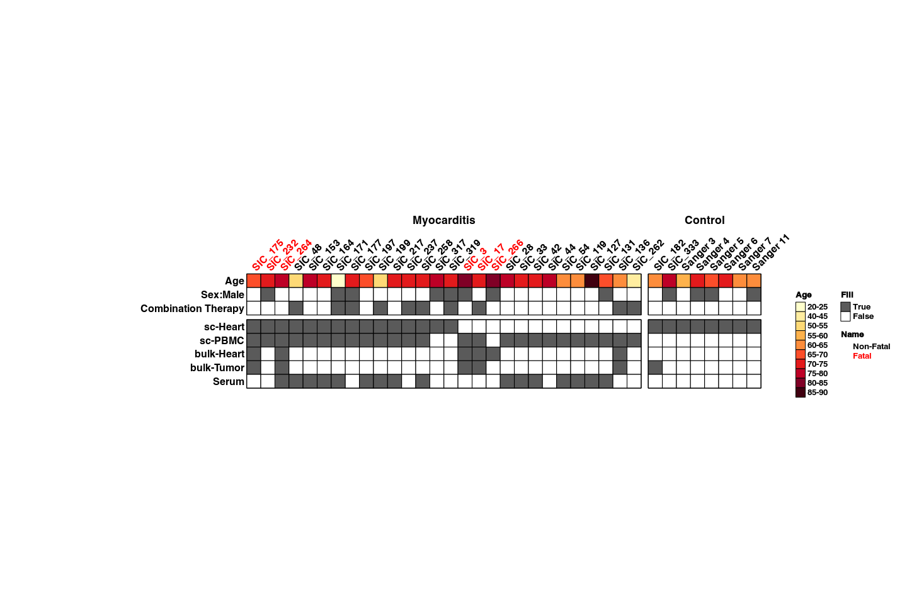
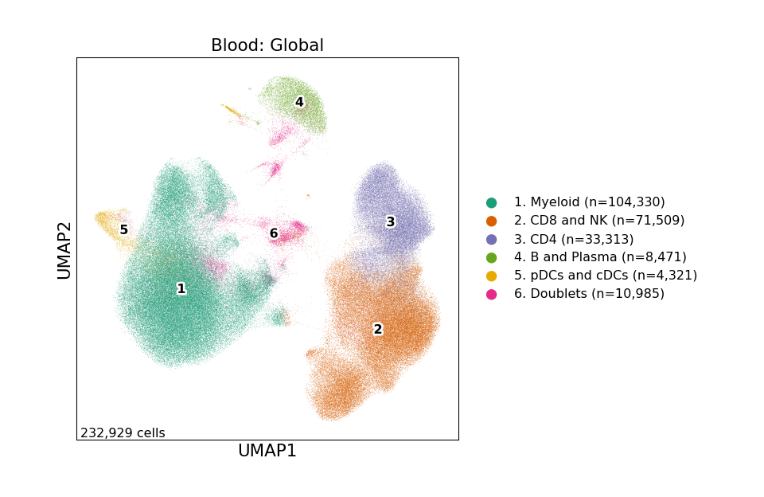
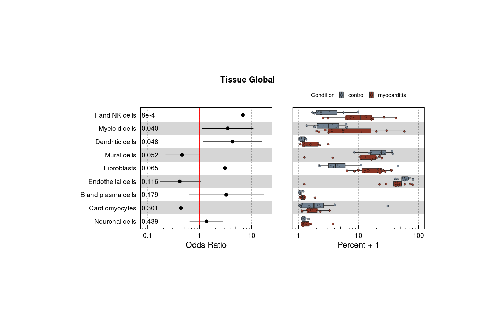
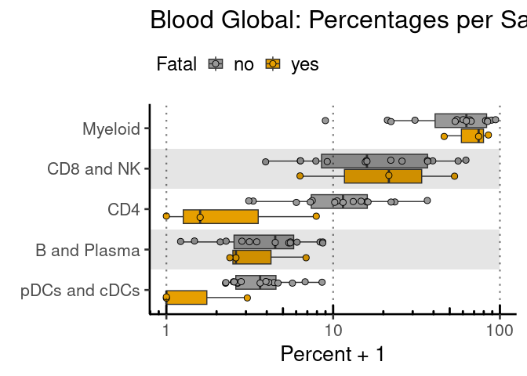
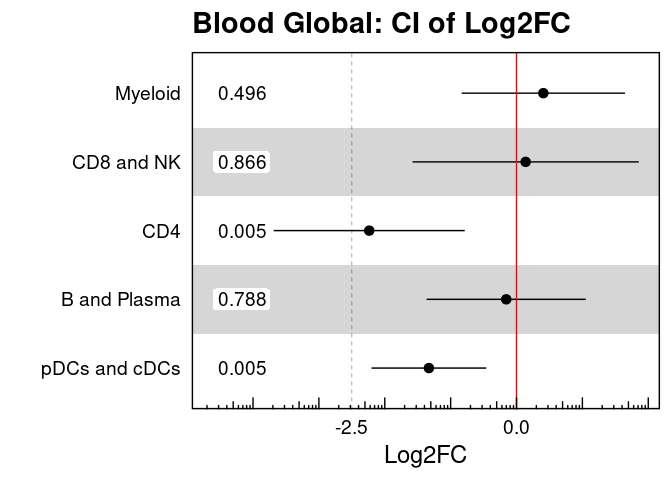

Figure 1
================

## Set up

Load R libraries

``` r
# load packages
library(tidyverse)
library(rmarkdown)
library(rlang)
library(parameters)
library(RColorBrewer)
library(ComplexHeatmap)
library(circlize)
library(Matrix)
library(glue)
library(ggforestplot)
library(ggbeeswarm)
library(patchwork)
library(lme4)
library(ggstance)
library(knitr)

setwd('/projects/home/ikernin/github_code/myocarditis/functions')
source('masc.R')
source('plot_masc.R')
source('blood_fatal_abundance.R')
```

Load Python packages

``` python
import pegasus as pg
import warnings
warnings.filterwarnings('ignore')

import sys
sys.path.append("/projects/home/ikernin/github_code/myocarditis/functions")
import python_functions
```

Read in single-cell data

``` python
tissue_global = pg.read_input('/projects/home/ikernin/projects/myocarditis/github_datasets/tissue_global.zarr')
```

``` python
blood_global = pg.read_input('/projects/home/ikernin/projects/myocarditis/github_datasets/blood_global.zarr')
```

## Figure 1A

``` r
# read in data
formatted_df <- read_csv('/projects/home/ikernin/github_repos/test_myocarditis/tables/tidy_fig1A.csv')

# get matrix
mtx <- formatted_df %>%
  select(!donor) %>%
  as.matrix()
rownames(mtx) <- formatted_df$donor
mtx <- t(mtx)
mtx[which(is.na(mtx))] <- 0
rownames(mtx) <- c('Age', 'Sex:Male', 'Fatal',
                   'Combination Therapy', 'sc-Heart',
                   'sc-PBMC', 'bulk-Heart', 'bulk-Tumor', 'Serum')

# color fatal sample names
col_name_color <- unname(ifelse(mtx['Fatal',] == '1', 'red', 'black'))
mtx <- mtx[which(rownames(mtx) != 'Fatal'), ] # remove fatal row

# col split
col_split <- factor(c(rep('Myocarditis', 28), rep('Control', 8)))
col_split <- fct_inorder(col_split)

# row split
row_split <- c(rep('meta', 3), rep('analyses',5))
row_split <- factor(row_split, levels=unique(row_split))

# colors
col_age = c(brewer.pal(9, 'YlOrRd'), '#400010')
make_rect <- function(j, i, x, y, width, height, fill) {
  grid.rect(x = x, y = y,
            width = width, height = height,
            gp = gpar(col = "black"))
  if (i == 1){ # ie age
    grid.rect(x = x, y = y,
              width = width, height = height,
              gp = gpar(fill = col_age[as.numeric(mtx[i,j])], col='black'))
  }
  else if (as.numeric(mtx[i,j]) == 1){
    grid.rect(x = x, y = y,
              width = width, height = height,
              gp = gpar(col="black", fill='#5A5A5A'))
  } else if (as.numeric(mtx[i,j]) == 0){
    grid.rect(x = x, y = y,
              width = width, height = height,
              gp = gpar(col="black", fill='white'))
  }
}

# make heatmap body
ht <- Heatmap(mtx,
        cell_fun = make_rect,
        rect_gp = gpar(type = "none"),
        border_gp = gpar(col = "black"),
        cluster_columns = FALSE,
        cluster_rows = FALSE,
        show_row_names = TRUE,
        row_title = NULL,
        row_split = row_split,
        row_gap = unit(2, 'mm'),
        column_names_gp = gpar(col = col_name_color),
        column_names_side = "top",
        show_heatmap_legend = FALSE,
        row_names_side = "left",
        show_column_names = TRUE,
        column_split = col_split,
        column_names_rot=45,
        width = ncol(mtx)*unit(6, "mm"),
        height = nrow(mtx)*unit(6, "mm"),
        column_gap = unit(3, "mm"))


# make legends
age_lgd <- Legend(labels = c("20-25","40-45","50-55","55-60","60-65",
                               "65-70","70-75","75-80","80-85","85-90"),
                  title = "Age",
                  legend_gp = gpar(fill=col_age),
                  border = 'black')

fill_lgd <- Legend(labels = c('True', 'False'),
                   title = 'Fill',
                   labels_gp = gpar(col = c('black', 'black')),
                   legend_gp = gpar(fill=c('#5A5A5A', 'white')),
                   border = 'black')

fatal_lgd <- Legend(labels = c('Non-Fatal', 'Fatal'),
                   title = 'Name',
                   labels_gp = gpar(col = c('black', 'red')),
                   legend_gp = gpar(fill= c('white', 'white')))

pd <- packLegend(age_lgd, fill_lgd, fatal_lgd,
                 max_height = nrow(mtx)*unit(6, "mm"))


draw(ht)
draw(pd, x = unit(0.93, "npc"), y = unit(0.43, "npc"))
```

<!-- -->

Figure 1C

``` python
python_functions.plot_umap(tissue_global, 'Tissue: Global', python_functions.tissue_global_pal)
python_functions.plot_umap(blood_global, 'Blood: Global', python_functions.blood_global_pal, marker_multiplier=28)
```



Figure 1D

``` r
# read in tissue cell metadata
tissue_global_obs = read_csv('/projects/home/ikernin/projects/myocarditis/github_datasets/tissue_global_obs.csv')
filtered_df  <- masc_filter(tissue_global_obs)

# run masc analysis
lineage_masc_res <- MASC(filtered_df,
                         cluster = filtered_df$umap_number,
                         contrast = "condition",
                         random_effects = "donor",
                         fixed_effects = "",
                         verbose = TRUE, save_models = FALSE)

# add cluster information to results
lineage_masc_formatted <- lineage_masc_res %>%
  as_tibble() %>%
  mutate(lineage_number = unlist(map( str_split(cluster, 'cluster'), 2)),
         lineage_number = as.numeric(lineage_number)) %>%
  left_join(filtered_df %>%
              select(umap_name, umap_number) %>%
              distinct(),
            by = c('lineage_number' = 'umap_number')) %>%
  mutate(lineage_names = unlist(map(str_split(umap_name, '\\. '), 2))) %>%
  relocate(lineage_names, lineage_number) %>%
  select(!c(cluster, umap_name))

# FDR adjust p-values
lineage_masc_formatted['p.adj'] <- p.adjust(lineage_masc_formatted$model.pvalue, method = 'fdr')
kable(lineage_masc_formatted)

# plot results
plot_masc_by_lineage(lineage_masc_formatted, filtered_df)
```

    ## Warning: The `size` argument of `element_rect()` is deprecated as of ggplot2 3.4.0.
    ## ℹ Please use the `linewidth` argument instead.

    ## Warning: The `groupOnX` argument of `position_quasirandom()` is deprecated as of
    ## ggbeeswarm 0.7.1.
    ## ℹ ggplot2 now handles this case automatically.

    ## Warning: Transformation introduced infinite values in continuous x-axis

    ## Warning: Using the `size` aesthetic with geom_rect was deprecated in ggplot2 3.4.0.
    ## ℹ Please use the `linewidth` aesthetic instead.

    ## Warning: The following aesthetics were dropped during statistical transformation: x
    ## ℹ This can happen when ggplot fails to infer the correct grouping structure in
    ##   the data.
    ## ℹ Did you forget to specify a `group` aesthetic or to convert a numerical
    ##   variable into a factor?

    ## Warning: `position_quasirandom()` requires non-overlapping x intervals

    ## Warning: Using the `size` aesthetic with geom_segment was deprecated in ggplot2 3.4.0.
    ## ℹ Please use the `linewidth` aesthetic instead.

    ## Warning: Using the `size` aesthetic with geom_polygon was deprecated in ggplot2 3.4.0.
    ## ℹ Please use the `linewidth` aesthetic instead.

<!-- -->

| lineage\_names     | lineage\_number |  size | model.pvalue | conditionmyocarditis.OR | conditionmyocarditis.OR.95pct.ci.lower | conditionmyocarditis.OR.95pct.ci.upper |     p.adj |
| :----------------- | --------------: | ----: | -----------: | ----------------------: | -------------------------------------: | -------------------------------------: | --------: |
| Endothelial cells  |               1 | 24745 |    0.1159022 |               0.4177602 |                              0.1618585 |                              1.0782478 | 0.1738532 |
| Mural cells        |               2 |  7050 |    0.0520849 |               0.4592017 |                              0.2199143 |                              0.9588563 | 0.1171911 |
| T and NK cells     |               3 |  2815 |    0.0008060 |               6.8413281 |                              2.4361450 |                             19.2122266 | 0.0072536 |
| Myeloid cells      |               4 |  2896 |    0.0402039 |               3.4798464 |                              1.1111553 |                             10.8979641 | 0.1171911 |
| Fibroblasts        |               5 |  5380 |    0.0651573 |               3.0923643 |                              1.2333169 |                              7.7536576 | 0.1172831 |
| Cardiomyocytes     |               6 |   378 |    0.3012611 |               0.4360036 |                              0.0933522 |                              2.0363643 | 0.3389188 |
| Dendritic cells    |               7 |   147 |    0.0476834 |               4.3256683 |                              1.1622024 |                             16.0999552 | 0.1171911 |
| Neuronal cells     |               8 |   148 |    0.4392100 |               1.3533474 |                              0.6420478 |                              2.8526680 | 0.4392100 |
| B and plasma cells |               9 |    46 |    0.1786607 |               3.2609827 |                              0.6182443 |                             17.2003338 | 0.2297066 |

## Figure 1E

``` r
# read in all blood cell metadata
blood_global_obs <- read_csv('/projects/home/ikernin/projects/myocarditis/github_datasets/blood_global_obs.csv')
fatal_blood_obs_filtered <- fatal_filter_df(blood_global_obs)

# fit lineage level model
lineage_order <- c("Myeloid", "CD8 and NK", "CD4", "B and Plasma", "pDCs and cDCs")
fatal_lineage_percents <- fatal_get_percent_per_level(fatal_blood_obs_filtered, level='lineage') %>%
    set_factor_order(col_name = 'lineage_names', order = lineage_order)
fatal_lineage_model <- fatal_fit_model(fatal_lineage_percents, level='lineage')
kable(fatal_lineage_model %>%
              select(!c(data, model)) %>%
              unnest(cols = c(fatal_coef, fatal_se, fatal_pval)))

fatal_plot_sample_perc(fatal_lineage_percents, title='Blood Global', level='lineage')
```

    ## Warning: Transformation introduced infinite values in continuous y-axis

<!-- -->

``` r
fatal_plot_ci_interval(fatal_lineage_model, 'Blood Global', level='lineage')
```

<!-- -->

| lineage\_names | fatal\_coef | fatal\_se | fatal\_pval |      padj |     CI\_low |    CI\_high |
| :------------- | ----------: | --------: | ----------: | --------: | ----------: | ----------: |
| B and Plasma   | \-0.1560894 | 0.5697430 |   0.7876172 | 0.8662722 | \-1.3638905 |   1.0517118 |
| CD4            | \-2.2362618 | 0.6840937 |   0.0048248 | 0.0129441 | \-3.6864756 | \-0.7860479 |
| CD8 and NK     |   0.1386080 | 0.8099891 |   0.8662722 | 0.8662722 | \-1.5784921 |   1.8557081 |
| Myeloid        |   0.4070682 | 0.5849094 |   0.4964454 | 0.8274090 | \-0.8328843 |   1.6470206 |
| pDCs and cDCs  | \-1.3296982 | 0.4109844 |   0.0051777 | 0.0129441 | \-2.2009463 | \-0.4584501 |
