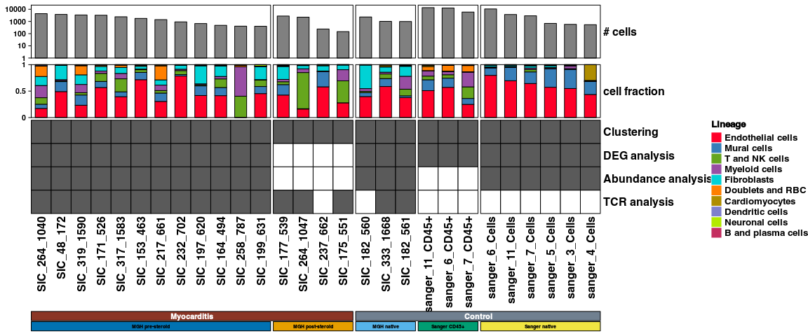

Figure 1
================

## Set up

Load R libraries

``` r
# load packages
library(tidyverse)
library(rmarkdown)
library(rlang)
library(parameters)
library(RColorBrewer)
library(ComplexHeatmap)
library(circlize)
library(Matrix)
library(glue)
library(fgsea)
library(DESeq2)
library(ggforestplot)
library(ggbeeswarm)
library(patchwork)
library(lme4)
library(ggstance)
library(knitr)
library(grid)
library(reticulate)

use_python("/projects/home/nealpsmith/.conda/envs/updated_pegasus/bin/python")


setwd('/projects/home/ikernin/github_code/myocarditis/functions')
source('de.R')
source('gsea.R')
source('masc.R')
source('plot_masc.R')
source('blood_abundance.R')
source('tissue_plot_masc.R')
source('tissue_gsea.R')
```

Load Python packages

``` python
import pegasus as pg
import warnings
import os
warnings.filterwarnings('ignore')

import sys
sys.path.append("/projects/home/ikernin/github_code/myocarditis/functions")
import python_functions
```

Read in single-cell data

``` python
tissue_global = pg.read_input('/projects/home/ikernin/projects/myocarditis/updated_datasets/tissue_all_with_dcs.zarr')
```

``` python
blood_global = pg.read_input('/projects/home/ikernin/projects/myocarditis/github_datasets/blood_global.zarr')
```

## Figure 1A

``` r
# read in data
formatted_df <- read_csv('/projects/home/ikernin/projects/myocarditis/updated_datasets/metadata/tidy_fig1A.csv')

# get matrix
mtx <- formatted_df %>%
  dplyr::select(!donor) %>%
  as.matrix()
rownames(mtx) <- formatted_df$donor
mtx <- t(mtx)
mtx[which(is.na(mtx))] <- 0
rownames(mtx) <- c('Age', 'Sex:Male', 'Fatal',
                   'Combination Therapy', 'sc-Heart',
                   'sc-PBMC', 'bulk-Heart', 'bulk-Tumor', 'Serum')

# color fatal sample names
col_name_color <- unname(ifelse(mtx['Fatal',] == '1', 'red', 'black'))
mtx <- mtx[which(rownames(mtx) != 'Fatal'), ] # remove fatal row

# col split
col_split <- factor(c(rep('Myocarditis', 28), rep('Control', 8)))
col_split <- fct_inorder(col_split)

# row split
row_split <- c(rep('meta', 3), rep('analyses',5))
row_split <- factor(row_split, levels=unique(row_split))

# colors
col_age = c(brewer.pal(9, 'YlOrRd'), '#400010')
make_rect <- function(j, i, x, y, width, height, fill) {
  grid.rect(x = x, y = y,
            width = width, height = height,
            gp = gpar(col = "black"))
  if (i == 1){ # ie age
    grid.rect(x = x, y = y,
              width = width, height = height,
              gp = gpar(fill = col_age[as.numeric(mtx[i,j])], col='black'))
  }
  else if (as.numeric(mtx[i,j]) == 1){
    grid.rect(x = x, y = y,
              width = width, height = height,
              gp = gpar(col="black", fill='#5A5A5A'))
  } else if (as.numeric(mtx[i,j]) == 0){
    grid.rect(x = x, y = y,
              width = width, height = height,
              gp = gpar(col="black", fill='white'))
  }
}

# make heatmap body
ht <- Heatmap(mtx,
        cell_fun = make_rect,
        rect_gp = gpar(type = "none"),
        border_gp = gpar(col = "black"),
        cluster_columns = FALSE,
        cluster_rows = FALSE,
        show_row_names = TRUE,
        row_title = NULL,
        row_split = row_split,
        row_gap = unit(2, 'mm'),
        column_names_gp = gpar(col = col_name_color),
        column_names_side = "top",
        show_heatmap_legend = FALSE,
        row_names_side = "left",
        show_column_names = TRUE,
        column_split = col_split,
        column_names_rot=45,
        width = ncol(mtx)*unit(6, "mm"),
        height = nrow(mtx)*unit(6, "mm"),
        column_gap = unit(3, "mm"))


# make legends
age_lgd <- Legend(labels = c("20-25","40-45","50-55","55-60","60-65",
                               "65-70","70-75","75-80","80-85","85-90"),
                  title = "Age",
                  legend_gp = gpar(fill=col_age),
                  border = 'black')

fill_lgd <- Legend(labels = c('True', 'False'),
                   title = 'Fill',
                   labels_gp = gpar(col = c('black', 'black')),
                   legend_gp = gpar(fill=c('#5A5A5A', 'white')),
                   border = 'black')

fatal_lgd <- Legend(labels = c('Non-Fatal', 'Fatal'),
                   title = 'Name',
                   labels_gp = gpar(col = c('black', 'red')),
                   legend_gp = gpar(fill= c('white', 'white')))

pd <- packLegend(age_lgd, fill_lgd, fatal_lgd,
                 max_height = nrow(mtx)*unit(6, "mm"))


draw(ht)
draw(pd, x = unit(0.93, "npc"), y = unit(0.43, "npc"))
```

<!-- -->

## Figure 1B

``` r
all_info <- read.csv("/projects/home/nealpsmith/projects/myocarditis/data/global_clustering_obs.csv")

all_info$on_steroids[all_info$donor == "SIC_232"] <- "False"

# Lets make a column that combines the technical replicates
atlas_meta <- read.csv("/projects/home/nealpsmith/projects/myocarditis/data/heart_atlas_meta.csv")

atlas_meta$Donor <- paste("sanger", atlas_meta$Donor, sep = "_")

all_info$summary_channel <- sapply(all_info$Channel, function(x){
  if (str_detect(x, "HCA")){
    meta <- atlas_meta %>% dplyr::filter(Sanger.ID == x)
    return(paste(meta$Donor, meta$Source, sep = "_"))
  } else {
    return(sub("*_[1-2]_heart", "", x))
  }
})

# Lets start building this matrix
heatmap_df <- matrix(nrow =1, ncol = length(unique(all_info$summary_channel))) %>%
  as.data.frame() %>%
  `colnames<-`(unique(all_info$summary_channel)) %>%
  `rownames<-`(c("myocarditis"))

# Enrichment strategy
cd45_enriched <- all_info %>%
  dplyr::select(summary_channel, source) %>%
  distinct() %>%
  dplyr::filter(source == "CD45+") %>%
  .$summary_channel

heatmap_df["CD45 enriched",] <- ifelse(colnames(heatmap_df) %in% cd45_enriched, "True", "False")

# Everyone contributed to clustering
heatmap_df["Clustering",] <- "True"

# Myo vs. control
myo_ctrl_info <- all_info %>%
  dplyr::select(summary_channel, condition) %>%
  distinct()

heatmap_df["myocarditis",] <- sapply(colnames(heatmap_df), function(x){
  if (myo_ctrl_info$condition[myo_ctrl_info$summary_channel == x] == "myocarditis"){
    return("True")
  } else {
    return("False")
  }
})

# Now steroid
on_steroids <- all_info %>%
  dplyr::select(summary_channel, on_steroids) %>%
  distinct() %>%
  dplyr::filter(on_steroids == "True") %>%
  .$summary_channel

heatmap_df["steroid",] <- ifelse(colnames(heatmap_df) %in% on_steroids, "True", "False")

# Now the DEGs
heatmap_df["DEG analysis",] <- sapply(colnames(heatmap_df), function(x){
  if (heatmap_df["steroid",x] == "True"){
    return("False")
  } else {
    return("True")
  }
})

# Abundance analysis
heatmap_df["Abundance analysis",] <- sapply(colnames(heatmap_df), function(x){
  if (heatmap_df["steroid",x] == "False" & heatmap_df["CD45 enriched", x] == "False"){
    return("True")
  } else {
    return("False")
  }
})


# TCR analyses
tcr_info <- read.csv("/projects/myocarditis/neal/data/myo_v2_tcells_res_1_1_complete_with_pb_and_tcr.csv",
                             row.names = 1)
tcr_info$has_clone <- ifelse(tcr_info$TRB_cdr3 != "", "True", "False")

tcr_info$summary_channel <- sapply(tcr_info$Channel, function(x){
  if (str_detect(x, "HCA")){
    meta <- atlas_meta %>% dplyr::filter(Sanger.ID == x)
    return(paste(meta$Donor, meta$Source, sep = "_"))
  } else {
    return(sub("*_[1-2]_heart", "", x))
  }
})

has_tcr <- tcr_info %>%
  dplyr::filter(has_clone == "True") %>%
  dplyr::select("summary_channel", "has_clone") %>%
  distinct() %>%
  .$summary_channel

heatmap_df["TCR analysis",] <- ifelse(colnames(heatmap_df) %in% has_tcr, "True", "False")

# Lets order the columns
heatmap_order <- c(colnames(heatmap_df)[heatmap_df["myocarditis",] == "True" & heatmap_df["steroid",] == "False"],
                   colnames(heatmap_df)[heatmap_df["myocarditis",] == "True" & heatmap_df["steroid",] == "True"],
                   colnames(heatmap_df)[heatmap_df["myocarditis",] == "False" & grepl("SIC", colnames(heatmap_df))],
                   colnames(heatmap_df)[heatmap_df["myocarditis",] == "False" & grepl("CD45+", colnames(heatmap_df))],
                   colnames(heatmap_df)[heatmap_df["myocarditis",] == "False" & grepl("Cells", colnames(heatmap_df))])

heatmap_df <- heatmap_df[,heatmap_order]


# Bottom bar/split
samp_info <- all_info %>%
  dplyr::select(summary_channel, condition, source, institution) %>%
  distinct()
samp_info$source[samp_info$source == "sorted"] <- "Cells"

cols <- list("myocarditis_pre_ster_mgh" = "#0072B2",
             "myocarditis_post_ster_mgh" = "#E69F00",
             "control_native_mgh" = "#56B4E9",
             "control_native_sanger" = "#009E73",
             "control_cd45_sanger" = "#F0E442")
group_cols <- c()
split <- c()
for (samp in colnames(heatmap_df)){
  if (grepl("sanger", samp)){
    if (grepl("Cells", samp)){
      group_cols <- c(group_cols, c(cols[["control_native_sanger"]]))
      split <- c(split, c("Sanger native"))
    } else {
      group_cols <- c(group_cols, c(cols[["control_cd45_sanger"]]))
      split <- c(split, c("Sanger CD45+"))
    }
  } else if (grepl("SIC_182|SIC_333", samp)){
    group_cols <- c(group_cols, c(cols[["control_native_mgh"]]))
    split <- c(split, c("MGH native"))
  } else if (heatmap_df["steroid",samp] == "False"){
    group_cols <- c(group_cols, c(cols[["myocarditis_pre_ster_mgh"]]))
    split <- c(split, c("MGH pre-steroid"))
  } else {
    group_cols <- c(group_cols, c(cols[["myocarditis_post_ster_mgh"]]))
    split <- c(split, c("MGH post-steroid"))
  }
}

split <- factor(split, levels = c("MGH pre-steroid", "MGH post-steroid", "MGH native", "Sanger CD45+", "Sanger native"))

# Okay want to get the columns ordered by cell # now (this is some ASS code, relies on level order of "split")
heatmap_order <- c()
for (cat in levels(split)){
  samps <- colnames(heatmap_df[,grep(cat, split)])
  new_ord <- all_info %>%
    dplyr::select(barcodekey, summary_channel) %>%
    dplyr::filter(summary_channel %in% samps) %>%
    group_by(summary_channel) %>%
    summarise(n_cells = n()) %>%
    arrange(desc(n_cells)) %>%
    .$summary_channel
  heatmap_order <- c(heatmap_order, new_ord)
}

heatmap_df <- heatmap_df[,heatmap_order]


# Now the colors
cat_colors <- structure(c("#5A5A5A", "white"), names = c("True", "False"))

# Lets do the # of cells bar
cell_number <- all_info %>%
  dplyr::select(barcodekey, summary_channel) %>%
  group_by(summary_channel) %>%
  summarise(n_cells = n()) %>%
  column_to_rownames("summary_channel") %>%
  .[heatmap_order,]

cell_codes = all_info[all_info$summary_channel == "sanger_6_Cells",]$barcodekey
cd45_codes = all_info[all_info$summary_channel == "sanger_6_CD45+",]$barcodekey

cell_codes <- sapply(cell_codes, function(x) strsplit(x, "_")[[1]][2])
cd45_codes <- sapply(cd45_codes, function(x) strsplit(x, "_")[[1]][2])

breaks = c(1, 10, 100, 1000, 10000)

# Need the top bar too
perc_lin <- all_info %>%
  dplyr::select(summary_channel, lineage1) %>%
  group_by(summary_channel, lineage1) %>%
  summarise(n_cells = n()) %>%
  group_by(summary_channel) %>%
  mutate(perc_cells = n_cells / sum(n_cells))

perc_lin_mtx <- matrix(ncol = length(unique(perc_lin$lineage1)),nrow = length(unique(perc_lin$summary_channel))) %>%
  `rownames<-`(unique(perc_lin$summary_channel)) %>%
  `colnames<-`(unique(perc_lin$lineage1))

for (n in rownames(perc_lin_mtx)){
  for (l in colnames(perc_lin_mtx)){
    val <- perc_lin[perc_lin$summary_channel == n & perc_lin$lineage1 == l,]$perc_cells
    if (length(val) > 0){
      perc_lin_mtx[n,l] <- val
    } else {
      perc_lin_mtx[n,l] <- 0
    }
  }
}

lin_cols = list("lineage" = c('Endothelial cells'= '#ff0029',
                              'Mural cells'= '#377eb8',
                              'T and NK cells'= '#66a61e',
                              'Myeloid cells'= '#984ea3',
                              'Fibroblasts'= '#00d2d5',
                              'Doublets and RBC'= '#ff7f00',
                              'Cardiomyocytes'= '#af8d00',
                              'Dendritic cells'= '#7f80cd',
                              'Neuronal cells'= '#b3e900',
                              'B and plasma cells'= '#c42e60'))
perc_lin_mtx <- perc_lin_mtx[colnames(heatmap_df),names(lin_cols$lineage)]

lin_col_list = sapply(colnames(perc_lin_mtx), function(x) lin_cols$lineage[[x]])
n_cell_bar = HeatmapAnnotation("# cells" = anno_barplot(log10(cell_number), height = unit(2, "cm"),
                                                        axis_param = list(at = log10(breaks), labels = breaks)),
                               "cell fraction" = anno_barplot(perc_lin_mtx, height = unit(2, "cm"), gp = gpar(fill = lin_col_list),
                               ), gap = unit(2.5, "mm"))

# Lets make a legend for the bar
lin_legend <- Legend(labels = colnames(perc_lin_mtx), legend_gp = gpar(fill = lin_col_list), title = "Lineage")

library(GetoptLong)  # for the function qq()
bottom_annotation <- HeatmapAnnotation(names = anno_text(colnames(heatmap_df), which = "column"),
                                       inst = anno_empty(border = FALSE, height = unit(3.5, "mm")),
                                       blk = anno_block(gp = gpar(fill = unlist(cols, use.names = FALSE)), labels = levels(split),
                                                        labels_gp = gpar(col = "black", fontsize = 5, fontface = "bold"),
                                                        height = unit(3.5, "mm")), which = "column")


group_block_anno = function(group, empty_anno, gp = gpar(),
    label = NULL, label_gp = gpar()) {

    seekViewport(qq("annotation_@{empty_anno}_@{min(group)}"))
    loc1 = deviceLoc(x = unit(0, "npc"), y = unit(0, "npc"))
    seekViewport(qq("annotation_@{empty_anno}_@{max(group)}"))
    loc2 = deviceLoc(x = unit(1, "npc"), y = unit(1, "npc"))

    seekViewport("global")
    grid.rect(loc1$x, loc1$y, width = loc2$x - loc1$x, height = loc2$y - loc1$y,
        just = c("left", "bottom"), gp = gp)
    if(!is.null(label)) {
        grid.text(label, x = (loc1$x + loc2$x)*0.5, y = (loc1$y + loc2$y)*0.5, gp = label_gp)
    }
}
# Want to remove a couple of rows we don't need anymore
heatmap_df <- heatmap_df[-c(1,2, 4),]

legend_list <- packLegend(lin_legend)

hmap <- Heatmap(heatmap_df, name = " ", col = cat_colors,
        rect_gp = gpar(col = "black", lwd = 1), cluster_columns = FALSE,
        cluster_rows = FALSE, top_annotation = n_cell_bar,
        show_column_names = FALSE, column_title = NULL, column_title_side = "bottom",
        column_title_gp = gpar(fontsize = unit(5, "cm")),
        bottom_annotation = bottom_annotation, column_split = split, show_heatmap_legend = FALSE)

draw(hmap, heatmap_legend_list = legend_list)
group_block_anno(1:2, "inst", gp = gpar(fill = "#8B3626"), label = "Myocarditis", label_gp = gpar(col = "white",
                                                                                              fontsize = 8, fontface = "bold"))
group_block_anno(3:5, "inst", gp = gpar(fill = "#708090"), label = "Control", label_gp = gpar(col = "white",
                                                                                           fontsize = 8, fontface = "bold"))
```

<!-- -->

## Figure 1D

``` python
tissue_global.obs['umap_number'] = tissue_global.obs['umap_numbers']
tissue_global.obs['umap_number'] = tissue_global.obs['umap_number'].astype('category')
tissue_global.obs['umap_name'] = tissue_global.obs['umap_name'].astype('category')
python_functions.plot_umap(tissue_global, 'Tissue: Global', python_functions.tissue_global_pal)
```


## Figure 1E

``` r
# read in tissue data
tissue_obs <- read_csv('/projects/home/ikernin/projects/myocarditis/updated_datasets/metadata/tissue_full_obs.csv')

# filter data
masc_df <- masc_filter(tissue_obs)

# fit MASC per lineage
lineage_masc_res <- MASC(masc_df,
                         cluster = masc_df$umap_numbers,
                         contrast = "condition",
                         random_effects = "donor",
                         fixed_effects = "",
                         verbose = TRUE, save_models = FALSE)

formatted_lineage_masc_res <- lineage_masc_res %>%
  as_tibble() %>%
  mutate(lineage_number = unlist(map( str_split(cluster, 'cluster'), 2)),
         lineage_number = as.numeric(lineage_number)) %>%
  left_join(masc_df %>%
              dplyr::select(umap_name, umap_numbers) %>%
              distinct(),
            by = c('lineage_number' = 'umap_numbers')) %>%
  dplyr::select(!cluster)
formatted_lineage_masc_res['p.adj'] <- p.adjust(formatted_lineage_masc_res$model.pvalue, method = 'fdr')
kable(formatted_lineage_masc_res)

# plot results
plot_masc_by_lineage(formatted_lineage_masc_res, masc_df)
```

<!-- -->

|  size | model.pvalue | conditionmyocarditis.OR | conditionmyocarditis.OR.95pct.ci.lower | conditionmyocarditis.OR.95pct.ci.upper | lineage\_number | umap\_name         |     p.adj |
| ----: | -----------: | ----------------------: | -------------------------------------: | -------------------------------------: | --------------: | :----------------- | --------: |
| 24745 |    0.1247032 |            4.263789e-01 |                              0.1617206 |                           1.124155e+00 |               1 | Endothelial cells  | 0.1781474 |
|    34 |    0.0180596 |            4.399342e+07 |                           1676.0633312 |                           1.154742e+12 |              10 | pDC                | 0.0902980 |
|  7050 |    0.0582226 |            4.660136e-01 |                              0.2340530 |                           9.278611e-01 |               2 | Mural cells        | 0.1247684 |
|  2815 |    0.0007290 |            6.926846e+00 |                              2.6818416 |                           1.789114e+01 |               3 | T and NK cells     | 0.0072899 |
|  2896 |    0.0384584 |            3.529993e+00 |                              1.2849400 |                           9.697611e+00 |               4 | Myeloid cells      | 0.1247684 |
|  4994 |    0.0753057 |            2.954166e+00 |                              1.0658547 |                           8.187885e+00 |               5 | Fibroblasts        | 0.1255095 |
|   378 |    0.3093014 |            4.418634e-01 |                              0.0958538 |                           2.036885e+00 |               6 | Cardiomyocytes     | 0.3436682 |
|   148 |    0.4217046 |            1.368878e+00 |                              0.6456487 |                           2.902239e+00 |               7 | Neuronal cells     | 0.4217046 |
|   113 |    0.0623842 |            3.585862e+00 |                              1.0641637 |                           1.208311e+01 |               8 | cDC                | 0.1247684 |
|    46 |    0.1745585 |            3.304919e+00 |                              0.6185902 |                           1.765706e+01 |               9 | B and plasma cells | 0.2181981 |

## Figure 1F

``` python
# get pseudobulk values for DE analysis
os.chdir('/projects/home/ikernin/projects/myocarditis/updated_datasets/pseudobulk')
python_functions.get_pseudobulk_info(tissue_global, 'tissue_global')
```

``` r
# run DE analysis by condition
tissue_cts <- read_counts('/projects/home/ikernin/projects/myocarditis/updated_datasets/pseudobulk/tissue_global_pseudocounts.csv')
tissue_meta <- read_meta('/projects/home/ikernin/projects/myocarditis/updated_datasets/pseudobulk/tissue_global_metainfo.csv')

setwd('/projects/home/ikernin/projects/myocarditis/updated_datasets/de_analysis')
tissue_deres <- run_de_by_comp_var(counts = tissue_cts,
                               meta = tissue_meta,
                               save_name = 'tissue_global',
                               comp_var_contrast_vec = c('condition', "myocarditis", "control"))
```

``` r
# map cluster numbers to names and remove doublets
tissue_obs <- read_csv('/projects/home/ikernin/projects/myocarditis/updated_datasets/metadata/tissue_full_obs.csv')
lineage_names <-  tissue_obs %>%
        dplyr::select(umap_name, umap_numbers) %>%
        distinct()
filtered_deres <- tissue_deres %>%
  left_join(lineage_names,
            by=c('cluster'='umap_numbers')) %>%
  dplyr::rename("cluster_names" = "umap_name") %>%
  filter(!str_detect(str_to_lower(cluster_names), 'doublets'))

# read in gsea pathways
pathways <- gmtPathways("/projects/home/ikernin/projects/myocarditis/github_datasets/msigdb_symbols.gmt")

# run gsea
setwd('/projects/home/ikernin/projects/myocarditis/updated_datasets/gsea')
run_gsea_by_cluster(filtered_deres,
                    'tissue_global')
tissue_gsea_res <- gsea_combine_xlsx('/projects/home/ikernin/projects/myocarditis/updated_datasets/gsea/tissue_global_all_gsea.xlsx')

# set lineage order to match masc results
lineage_order <- c("T and NK cells",
                   "Myeloid cells",
                   "Mural cells",
                   "cDC",
                   "Fibroblasts",
                   "Endothelial cells",
                   "B and plasma cells",
                   "Cardiomyocytes",
                   "Neuronal cells")

# pathways to highlight
main_pathways <- c(
                   "KEGG:ALLOGRAFT_REJECTION",
                   'KEGG:ANTIGEN_PROCESSING_AND_PRESENTATION',
                   "KEGG:CELL_ADHESION_MOLECULES_CAMS",
                   "KEGG:DNA_REPLICATION",
                   "HALLMARK:INTERFERON_GAMMA_RESPONSE",
                   "KEGG:VIRAL_MYOCARDITIS"
)

# pre-process data
tissue_gsea_plot_df <- tissue_gsea_res %>%
  mutate(pathway_name = str_c(geneset, pathway_name, sep=':')) %>%
  filter(pathway_name %in% main_pathways,
         cluster_name %in% lineage_order) %>%
  mutate(cluster_name = factor(cluster_name),
         pathway_name = factor(pathway_name)) %>%
  complete(cluster_name, pathway_name)

# make heatmap
setwd('/projects/home/ikernin/projects/myocarditis/updated_datasets/figures')
plot_heatmap(tissue_gsea_plot_df,
             cluster_order = lineage_order,
             col_order = main_pathways,
             'lineage_gsea_fig1.pdf')
```

``` r
knitr::include_graphics("/projects/home/ikernin/projects/myocarditis/updated_datasets/figures/lineage_gsea_fig1.pdf")
```

<embed src="../../../../projects/myocarditis/updated_datasets/figures/lineage_gsea_fig1.pdf" width="800px" height="460px" type="application/pdf" />

## Figure 1H

``` r
# read in serum values per sample
serum_df <- read_csv('/projects/home/ikernin/projects/myocarditis/updated_datasets/metadata/tidy_serum.csv')

# get between condition statistics for log1p values
serum_model <- serum_df %>%
  dplyr::select(!c(patient, timepoint, Sample)) %>%
  pivot_longer(cols=!c(condition),
               names_to='protein',
               values_to='value') %>%
  mutate(log1p_value = log1p(value)) %>%
  group_by(condition, protein) %>%
  summarize(log1p_values = list(log1p_value)) %>%
  pivot_wider(names_from = condition,
              values_from = log1p_values) %>%
  group_by(protein) %>%
  summarize(mean_case = mean(unlist(myocarditis)),
            std_case = sd(unlist(myocarditis)),
            n_case = length(unlist(myocarditis)),
            mean_control = mean(unlist(control)),
            std_control = sd(unlist(control)),
            n_control = length(unlist(control)),
            p_value = t.test(unlist(control), unlist(myocarditis))$p.value,
            t_stat = t.test(unlist(control), unlist(myocarditis))$statistic,
            log2FC = log2(mean_case/mean_control))
kable(serum_model)

# proteins to annotate in figures
serum_annot <-  c('MIG/CXCL9', 'IP-10', 'TNFα','IFNγ', 'IL-2',
                  'IL-12p40', 'IL-15', 'IL-18', 'IL-27', '6CKine')

# make volcano plot
serum_plot_df <- serum_model %>%
  mutate(
    name = case_when(
      protein %in% serum_annot ~ protein,
      TRUE ~ ""
    ),
    t_stat = -t_stat
  )

ggplot(serum_plot_df, aes(y = -log10(p_value), x = log2FC)) +
  geom_point(data = serum_plot_df %>% filter(t_stat < 0), color =  'slategray', size = 2.5) +
  geom_point(data = serum_plot_df %>% filter(t_stat > 0), color =  'tomato4', size = 2.5) +
  geom_vline(xintercept = 0, lty=2) +
  ggrepel::geom_label_repel(aes(label = name), size = 4) +
  theme_bw() +
  theme(axis.line = element_line(colour = "black"),
        panel.border = element_blank(),
        panel.background = element_blank())
```

<!-- -->

| protein      | mean\_case | std\_case | n\_case | mean\_control | std\_control | n\_control |  p\_value |     t\_stat |      log2FC |
| :----------- | ---------: | --------: | ------: | ------------: | -----------: | ---------: | --------: | ----------: | ----------: |
| 6CKine       |  6.4363743 | 0.7101943 |      16 |     4.5567455 |    2.5437937 |         10 | 0.0459437 | \-2.2817143 |   0.4982444 |
| BCA-1        |  4.8896005 | 1.0394112 |      16 |     3.8822775 |    0.5560748 |         10 | 0.0037935 | \-3.2104880 |   0.3328134 |
| CTACK        |  7.3854061 | 0.3856017 |      16 |     7.0697631 |    0.6390623 |         10 | 0.1818264 | \-1.4097232 |   0.0630154 |
| EGF          |  5.2334156 | 0.7222864 |      16 |     4.7273420 |    1.7544192 |         10 | 0.4043610 | \-0.8673928 |   0.1467236 |
| ENA-78       |  6.4743338 | 0.6180568 |      16 |     6.7690392 |    0.8540781 |         10 | 0.3586866 |   0.9471231 | \-0.0642193 |
| Eotaxin      |  3.9514577 | 0.6351661 |      16 |     4.0296076 |    0.9319650 |         10 | 0.8187338 |   0.2334441 | \-0.0282544 |
| Eotaxin-2    |  6.3029821 | 0.8643721 |      16 |     6.0331097 |    0.2604114 |         10 | 0.2576432 | \-1.1670045 |   0.0631328 |
| Eotaxin-3    |  1.2128693 | 1.4846713 |      16 |     0.6737767 |    1.3778945 |         10 | 0.3573158 | \-0.9418352 |   0.8480817 |
| FGF-2        |  5.0137612 | 1.2062506 |      16 |     3.8426111 |    1.4997129 |         10 | 0.0533933 | \-2.0838641 |   0.3838063 |
| FLT-3L       |  3.8099334 | 0.7345215 |      16 |     3.3411918 |    1.1989049 |         10 | 0.2855658 | \-1.1127215 |   0.1894030 |
| Fractalkine  |  5.3353875 | 0.7747217 |      16 |     4.3582980 |    1.5767914 |         10 | 0.0932337 | \-1.8266092 |   0.2918282 |
| G-CSF        |  2.4111508 | 2.2985718 |      16 |     1.9313054 |    1.9185079 |         10 | 0.5716786 | \-0.5742302 |   0.3201456 |
| GM-CSF       |  4.1298428 | 1.4318275 |      16 |     3.5633644 |    1.3597476 |         10 | 0.3233776 | \-1.0124982 |   0.2128469 |
| GROα         |  3.4976916 | 0.7170439 |      16 |     3.0594765 |    1.2331317 |         10 | 0.3260535 | \-1.0210509 |   0.1931183 |
| I-309        |  1.7733368 | 0.5745722 |      16 |     1.2702573 |    0.4969847 |         10 | 0.0276843 | \-2.3628207 |   0.4813458 |
| IFN-α2       |  4.3034714 | 1.9341091 |      16 |     3.0050394 |    2.2079845 |         10 | 0.1443742 | \-1.5288179 |   0.5181170 |
| IFNγ         |  1.9435044 | 1.4059266 |      16 |     0.9612081 |    0.6652875 |         10 | 0.0250747 | \-2.3979847 |   1.0157397 |
| IL-10        |  2.7738412 | 1.7354165 |      16 |     1.2456889 |    1.3806524 |         10 | 0.0209809 | \-2.4827516 |   1.1549414 |
| IL-12p40     |  6.1262569 | 1.3028557 |      16 |     4.4349363 |    1.2923763 |         10 | 0.0042644 | \-3.2363434 |   0.4660925 |
| IL-12p70     |  2.3888904 | 2.1255133 |      16 |     1.2592322 |    0.9518119 |         10 | 0.0776223 | \-1.8497685 |   0.9237963 |
| IL-13        |  4.4144231 | 1.0829592 |      16 |     3.6266109 |    1.5080893 |         10 | 0.1716196 | \-1.4365869 |   0.2836030 |
| IL-15        |  3.7151701 | 1.0837076 |      16 |     2.2245260 |    1.1138127 |         10 | 0.0033590 | \-3.3545572 |   0.7399303 |
| IL-16        |  1.2938391 | 2.4059516 |      16 |     1.3318474 |    2.8292304 |         10 | 0.9722888 |   0.0352558 | \-0.0417706 |
| IL-17A       |  2.8404342 | 1.7656720 |      16 |     1.5745222 |    1.5799273 |         10 | 0.0714845 | \-1.8988200 |   0.8511974 |
| IL-17E/IL-25 |  5.7418729 | 2.6941808 |      16 |     3.9094564 |    2.8434321 |         10 | 0.1198353 | \-1.6310400 |   0.5545534 |
| IL-17F       |  2.9082138 | 0.9201737 |      16 |     2.3049660 |    1.6178459 |         10 | 0.3022050 | \-1.0754080 |   0.3353879 |
| IL-18        |  4.5529270 | 0.8469335 |      16 |     3.1609961 |    1.7582195 |         10 | 0.0379982 | \-2.3395791 |   0.5264150 |
| IL-1RA       |  3.9844177 | 1.3788921 |      16 |     2.9077550 |    1.0645687 |         10 | 0.0355673 | \-2.2345065 |   0.4544632 |
| IL-1α        |  3.7092153 | 1.7665737 |      16 |     2.7010582 |    1.5049316 |         10 | 0.1350191 | \-1.5527928 |   0.4575893 |
| IL-1β        |  3.7776029 | 1.6315738 |      16 |     2.5616238 |    1.4620230 |         10 | 0.0619753 | \-1.9722459 |   0.5604124 |
| IL-2         |  1.8627309 | 1.6871037 |      16 |     0.6756830 |    0.7037706 |         10 | 0.0209716 | \-2.4891432 |   1.4630008 |
| IL-20        |  2.5522352 | 3.1023734 |      16 |     1.2752235 |    2.7138124 |         10 | 0.2819649 | \-1.1039848 |   1.0010112 |
| IL-21        |  1.4868531 | 1.6123368 |      16 |     1.0480728 |    1.8236082 |         10 | 0.5409368 | \-0.6236353 |   0.5045232 |
| IL-22        |  3.0965614 | 2.0476407 |      16 |     2.7713745 |    2.0495117 |         10 | 0.6981034 | \-0.3937390 |   0.1600654 |
| IL-23        |  2.2091780 | 3.4142322 |      16 |     2.4069013 |    4.1287228 |         10 | 0.9006628 |   0.1267562 | \-0.1236673 |
| IL-27        |  8.1959283 | 0.4365125 |      16 |     7.1586560 |    0.8112040 |         10 | 0.0028027 | \-3.7208548 |   0.1952186 |
| IL-28A       |  1.9237581 | 2.8072062 |      16 |     1.3484567 |    2.8816697 |         10 | 0.6227331 | \-0.5001813 |   0.5126182 |
| IL-3         |  0.3936793 | 0.2708367 |      16 |     0.3364586 |    0.2951412 |         10 | 0.6257284 | \-0.4962530 |   0.2265919 |
| IL-33        |  1.5510885 | 1.9664495 |      16 |     2.0807321 |    2.6816080 |         10 | 0.5968677 |   0.5403444 | \-0.4238102 |
| IL-4         |  1.2619752 | 1.1323697 |      16 |     0.9644388 |    0.8338522 |         10 | 0.4496054 | \-0.7690763 |   0.3879219 |
| IL-5         |  2.6155659 | 0.9475224 |      16 |     1.9732390 |    1.1590662 |         10 | 0.1600244 | \-1.4718343 |   0.4065574 |
| IL-6         |  2.4841638 | 0.9811992 |      16 |     2.0299885 |    1.7216854 |         10 | 0.4607923 | \-0.7605674 |   0.2912888 |
| IL-7         |  2.4569886 | 1.0001989 |      16 |     1.8172582 |    0.7737255 |         10 | 0.0806058 | \-1.8286225 |   0.4351277 |
| IL-8         |  3.1816575 | 1.3405947 |      16 |     2.8762683 |    1.3367150 |         10 | 0.5778419 | \-0.5661131 |   0.1455803 |
| IL-9         |  2.3737289 | 1.3995452 |      16 |     0.8601500 |    1.3993118 |         10 | 0.0146041 | \-2.6830949 |   1.4644951 |
| IP-10        |  7.3232318 | 1.7088805 |      16 |     5.2281214 |    1.9587047 |         10 | 0.0125870 | \-2.7844134 |   0.4861878 |
| LIF          |  1.7842529 | 1.5358532 |      16 |     1.1075488 |    1.7872170 |         10 | 0.3358263 | \-0.9904071 |   0.6879499 |
| M-CSF        |  5.4138877 | 0.8799103 |      16 |     4.4735527 |    1.8044625 |         10 | 0.1506946 | \-1.5376150 |   0.2752439 |
| MCP-1        |  5.6576888 | 0.8842821 |      16 |     5.4289545 |    1.5628755 |         10 | 0.6797663 | \-0.4224752 |   0.0595385 |
| MCP-2        |  3.9274040 | 0.3776841 |      16 |     3.9516614 |    0.1769999 |         10 | 0.8270705 |   0.2209949 | \-0.0088833 |
| MCP-3        |  3.2201558 | 1.0213659 |      16 |     2.5523514 |    1.0656746 |         10 | 0.1310709 | \-1.5794558 |   0.3353036 |
| MCP-4        |  4.0842874 | 1.7666237 |      16 |     4.2803509 |    1.5920842 |         10 | 0.7726134 |   0.2927517 | \-0.0676447 |
| MDC          |  6.5570121 | 0.3519171 |      16 |     5.9321419 |    2.1367101 |         10 | 0.3822666 | \-0.9170513 |   0.1444855 |
| MIG/CXCL9    |  9.1631650 | 0.6288525 |      16 |     8.2298567 |    1.1837104 |         10 | 0.0399116 | \-2.2988098 |   0.1549787 |
| MIP-1α       |  4.3172488 | 1.1287316 |      16 |     3.2865776 |    1.2553439 |         10 | 0.0487888 | \-2.1161581 |   0.3935262 |
| MIP-1β       |  4.3389583 | 0.5230917 |      16 |     3.5320302 |    1.3570783 |         10 | 0.1003234 | \-1.7986546 |   0.2968510 |
| MIP-1δ       |  8.6986187 | 0.6016228 |      16 |     8.0169640 |    1.1240404 |         10 | 0.1022145 | \-1.7661075 |   0.1177303 |
| PDGF-AA      |  7.2625498 | 0.4149287 |      16 |     6.8714718 |    2.4434248 |         10 | 0.6275551 | \-0.5016323 |   0.0798570 |
| PDGF-AB/BB   |  9.8534586 | 0.2195944 |      16 |     9.5292300 |    1.2586629 |         10 | 0.4397492 | \-0.8069556 |   0.0482706 |
| RANTES       |  7.4055882 | 0.4235097 |      16 |     6.8356067 |    2.4265108 |         10 | 0.4798918 | \-0.7358396 |   0.1155449 |
| SCF          |  3.2519765 | 2.0302255 |      16 |     1.6751457 |    2.4194080 |         10 | 0.1043613 | \-1.7174330 |   0.9570302 |
| SDF-1α+β     |  8.8320183 | 0.5500243 |      16 |     8.6591937 |    0.5690661 |         10 | 0.4549002 | \-0.7631023 |   0.0285105 |
| TARC         |  4.5425314 | 0.5415717 |      16 |     4.6026783 |    0.9859257 |         10 | 0.8623928 |   0.1769515 | \-0.0189771 |
| TGFα         |  2.4649651 | 0.8532875 |      16 |     2.2624766 |    1.3603165 |         10 | 0.6798823 | \-0.4217117 |   0.1236643 |
| TNFα         |  5.0640180 | 0.7379993 |      16 |     4.2743596 |    0.9044013 |         10 | 0.0335644 | \-2.3201738 |   0.2445742 |
| TNFβ         |  2.8253295 | 0.9145280 |      16 |     2.4683577 |    0.9559061 |         10 | 0.3583456 | \-0.9418542 |   0.1948676 |
| TPO          |  5.6742710 | 1.0042720 |      16 |     5.4147425 |    2.8027303 |         10 | 0.7836404 | \-0.2817361 |   0.0675423 |
| TRAIL        |  3.7510727 | 0.4668613 |      16 |     3.7174592 |    0.5276374 |         10 | 0.8707802 | \-0.1650769 |   0.0129863 |
| TSLP         |  0.7325628 | 1.1914176 |      16 |     1.4436622 |    2.9711651 |         10 | 0.4859080 |   0.7214547 | \-0.9787090 |
| VEGF-A       |  5.2810634 | 0.6310147 |      16 |     5.1891024 |    1.8756073 |         10 | 0.8837901 | \-0.1498372 |   0.0253435 |
| sCD40L       |  8.4292255 | 0.4433345 |      16 |     8.1623234 |    1.8579870 |         10 | 0.6651690 | \-0.4463922 |   0.0464202 |

## Figure 1I

``` python
adata = pg.read_input('/projects/home/sramesh/myo_final/blood/final/myo_blood_global.zarr')
adata.obs['umap_name'] = adata.obs['lineage'].astype('category')
lineage_order = adata.obs['lineage'].value_counts().index.to_list()
lineage_order = [i for i in lineage_order if i != 'Doublets and RBCs'] + ['Doublets and RBCs']
lineage_dict = dict(zip(lineage_order, range(1, len(lineage_order) + 1)))
adata.obs['umap_number'] = adata.obs['umap_name'].map(lineage_dict).astype('category')
python_functions.plot_umap(adata, '', python_functions.blood_global_pal)
```

    ## 2024-02-13 20:27:56,128 - pegasusio.readwrite - INFO - zarr file '/projects/home/sramesh/myo_final/blood/final/myo_blood_global.zarr' is loaded.
    ## 2024-02-13 20:27:56,128 - pegasusio.readwrite - INFO - Function 'read_input' finished in 5.09s.


## Figure 1J

``` r
wd <- '/projects/home/sramesh/github/myocarditis'

### Read in obs matrix and cluster annotations
obs <- read_csv(glue('/projects/home/sramesh/myo_final/blood/final/myo_blood_global_obs.csv'))
cluster_annots <- readxl::read_excel('/projects/home/sramesh/myo_final/blood/other_stuff/cluster_annotations.xlsx')

## Figure 1J
# run masc for case vs control by lineage (or read in file if it exists)
if (!file.exists(glue('{wd}/output/masc_for_deg_case_control_by_lineage.csv'))) {
  lineage_masc_res <- run_masc(obs,
                               c('deg_case_control', 'control', 'case'),
                               'lineage',
                               fixed_effects = c('sex', 'ici_type'))
  write_csv(lineage_masc_res, glue('{wd}/output/masc_for_deg_case_control_by_lineage.csv'))
} else {
  lineage_masc_res <- read_csv(glue('{wd}/output/masc_for_deg_case_control_by_lineage.csv'))
}

lineage_masc_res$lineage <- str_replace_all(lineage_masc_res$lineage, '_', ' ')

masc_helper(obs,
            c('deg_case_control', 'control', 'case'),
            'lineage',
            fixed_effects = c('sex', 'ici_type'),
            group_subset=NULL,
            masc_res=lineage_masc_res,
            colors=c('slategray', 'tomato4'))
```

<!-- -->

## Figure 1K

``` python
wd = '/projects/home/ikernin/projects/myocarditis/updated_datasets/blood'

counts, meta = python_functions.blood_pb_info('/projects/home/sramesh/myo_final/blood/final/myo_blood_global.zarr',
                                              'sample_id',
                                              'lineage',
                                              ['steroid_treatment', 'post_steroid_fatal', 'deg_case_control',
                                              'condition', 'lineage', 'sex', 'ici_type', 'on_ici_vs_control'])
counts.to_csv(f'{wd}/output/pb_counts_by_sample_id_and_lineage.csv')
meta.to_csv(f'{wd}/output/pb_meta_by_sample_id_and_lineage.csv')
```

    ## 2024-02-13 20:28:14,138 - pegasusio.readwrite - INFO - zarr file '/projects/home/sramesh/myo_final/blood/final/myo_blood_global.zarr' is loaded.
    ## 2024-02-13 20:28:14,138 - pegasusio.readwrite - INFO - Function 'read_input' finished in 5.31s.

``` r
setwd('/projects/home/ikernin/projects/myocarditis/updated_datasets/blood')

#### first run de
if (!file.exists(glue('{wd}/output/lineage_de_by_deg_case_control_all_results.csv'))) {
  counts <- read_counts(glue("{wd}/output/pb_counts_by_sample_id_and_lineage.csv"))
  meta <- read_meta(glue("{wd}/output/pb_meta_by_sample_id_and_lineage.csv"))
  meta <- meta %>%
    filter(deg_case_control != "NA") %>%
    filter(!str_detect(lineage, "Doublet"))
  case_control_contrast_vec <- c('deg_case_control', 'case', 'control')
  case_control_lineage_results <- run_de_by_comp_var(counts, meta, glue('{wd}/output/lineage'), case_control_contrast_vec,
                                                     deseq_formula = formula("~ deg_case_control + sex + ici_type"))
} else {
    case_control_lineage_results <- read_csv(glue('{wd}/output/lineage_de_by_deg_case_control_all_results.csv'))
}

#### then run gsea on de results
if (!file.exists(glue('{wd}/output/gsea_by_deg_case_control_by_lineage.csv'))) {
  case_control_lineage_gsea <- run_gsea(case_control_lineage_results)
  write_csv(case_control_lineage_gsea, glue('{wd}/output/gsea_by_deg_case_control_by_lineage.csv'))
} else {
  case_control_lineage_gsea <- read_csv(glue('{wd}/output/gsea_by_deg_case_control_by_lineage.csv'))
}

#### make heatmap
pathways <- c('KEGG_ALLOGRAFT_REJECTION', 'KEGG_ANTIGEN_PROCESSING_AND_PRESENTATION',
              'KEGG_CELL_ADHESION_MOLECULES_CAMS', 'KEGG_DNA_REPLICATION', 'HALLMARK_INTERFERON_GAMMA_RESPONSE',
              'KEGG_VIRAL_MYOCARDITIS')
pathway_abbrevs <- c('KEGG: Allo', 'KEGG: AP', 'KEGG: CAMS', 'KEGG: DNA', 'HALLMARK: IFNG', 'KEGG: Viral Myo')
abbrev_dict <- setNames(pathway_abbrevs, pathways)
lineage_order <- c('pDCs', 'cDCs', 'B and plasma', 'MNP', 'CD4', 'CD8 and NK')

heatmap_df <- case_control_lineage_gsea %>%
  complete(pathway, cluster) %>%
  replace_na(list(log2FoldChange = 0, padj = 1)) %>%
  dplyr::select(pathway, cluster, NES, padj) %>%
  filter(pathway %in% pathways) %>%
  mutate(cluster = str_replace_all(cluster, '_', ' ')) %>%
  mutate(pathway = abbrev_dict[pathway])

# Format main body:
# get information for the main body's cells
# not replacing NA values so they are colored gray in heatmap
nes_mtx <- heatmap_df %>%
  dplyr::select(c(pathway, cluster, NES)) %>%
  pivot_wider(names_from = cluster, values_from = NES) %>%
  column_to_rownames('pathway') %>%
  dplyr::select(all_of(lineage_order)) %>%
  as.matrix()
nes_mtx <- nes_mtx[pathway_abbrevs,] %>% t()

# define cell color range
heatmap_col_fun <- colorRamp2(c(floor(min(nes_mtx, na.rm = T)), 0, ceiling(max(nes_mtx, na.rm = T))),
                              brewer.pal(5, 'PiYG')[c(5,3,1)])

# Main body annotation (FDR):
# get fdr values
# not replacing NA values so they are colored gray in heatmap
fdr_mtx <- heatmap_df %>%
  dplyr::select(c(pathway, cluster, padj)) %>%
  pivot_wider(names_from = cluster, values_from = padj) %>%
  column_to_rownames('pathway') %>%
  dplyr::select(all_of(lineage_order)) %>%
  as.matrix()
fdr_mtx <- fdr_mtx[pathway_abbrevs,] %>% t()

# make function for plotting fdr value (this function returns a function)
fdr_func <- function(mtx) {
  function(j, i, x, y, width, height, fill) {
    if (!is.na(mtx[i, j]) & (mtx[i,j] < 0.1)) {
      grid.circle(x = x, y = y, r = unit(1.5, 'mm'),
                  gp = gpar(fill = 'black', col = NA))
    }
  }
}

# make sure columns are the same
stopifnot(colnames(fdr_mtx) == colnames(nes_mtx))
stopifnot(rownames(fdr_mtx) == rownames(nes_mtx))

# Legends
gsea_lgd <- Legend(col_fun = heatmap_col_fun, title = 'NES', direction = 'horizontal')
fdr_lgd <- Legend(pch = 16, type = "points", labels = "FDR < 0.1")
na_lgd <- Legend(labels = 'N/A', legend_gp = gpar(fill = 'grey'))
pd <- packLegend(gsea_lgd, fdr_lgd, na_lgd, direction = 'horizontal')

# Plot
ht_gsea <- Heatmap(nes_mtx,
                   col = heatmap_col_fun,
                   cell_fun = fdr_func(fdr_mtx),
                   column_order = colnames(nes_mtx),
                   top_annotation = NULL, column_title = NULL,
                   name = 'NES', show_heatmap_legend = FALSE,
                   cluster_columns = FALSE, column_names_side = "top",
                   show_column_names = T, column_names_rot = 45,
                   cluster_rows = FALSE, row_names_side = "left",
                   row_title_rot = 0, row_title_gp=gpar(fontface='bold'),
                   row_gap = unit(2, "mm"), border = TRUE,
                   width = ncol(nes_mtx)*unit(6, "mm"),
                   height = nrow(nes_mtx)*unit(6, "mm"))

draw(ht_gsea,
     heatmap_legend_list = pd,
     heatmap_legend_side = 'bottom',
     merge_legends = FALSE)
```

<!-- -->
