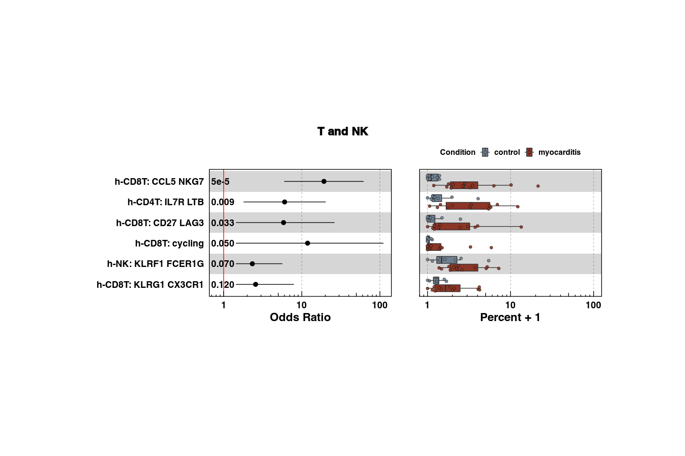
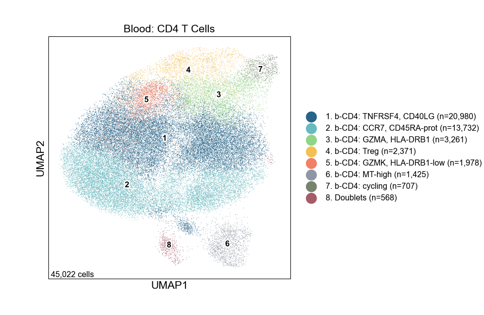
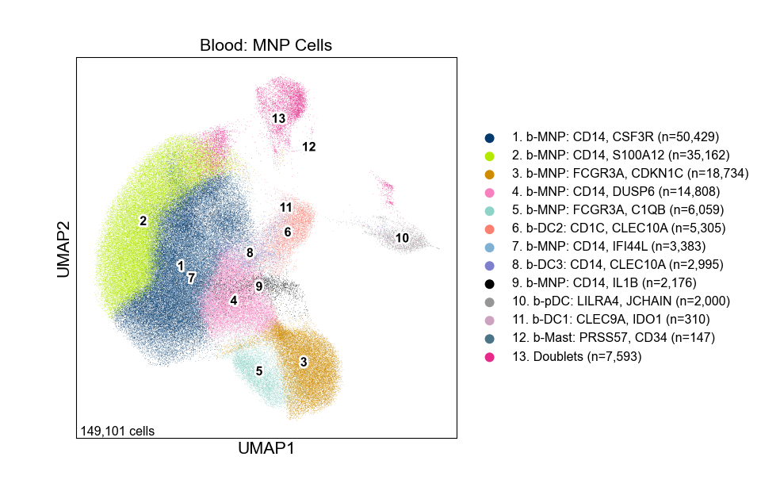
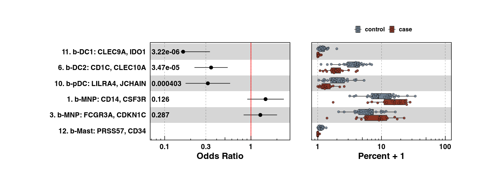

Figure 2
================

## Set up

Load R libraries

``` r
library(reticulate)
library(tidyverse)
library(rmarkdown)
library(rlang)
library(parameters)
library(RColorBrewer)
library(ComplexHeatmap)
library(circlize)
library(Matrix)
library(glue)
library(DESeq2)
library(fgsea)
library(ggforestplot)
library(ggbeeswarm)
library(patchwork)
library(lme4)
library(ggstance)
library(knitr)
library(grid)

wd <- '/projects/home/sramesh/github/myocarditis'
setwd(glue('{wd}/functions'))
source('de.R')
source('gsea.R')
source('masc.R')
source('plot_masc.R')
source('blood_abundance.R')
source('blood_troponin.R')

use_python("/projects/home/nealpsmith/.conda/envs/updated_pegasus/bin/python")
```

Load Python packages

``` python
import pandas as pd
import pegasus as pg
import os
import sys
import warnings
sys.path.append("/projects/home/sramesh/github/myocarditis/functions")
import python_functions as pyfun

wd = '/projects/home/sramesh/github/myocarditis'
warnings.filterwarnings('ignore')
```

Read in single-cell data and cluster names

``` python
adata = pg.read_input('/projects/home/sramesh/myo_final/blood/final/myo_blood_global.zarr')
cluster_annots = pd.read_excel('/projects/home/sramesh/myo_final/blood/other_stuff/cluster_annotations.xlsx')
name_dict = dict(zip(cluster_annots['lineage_cluster_mod'], cluster_annots['cluster_name_w_num']))
```

    ## 2024-02-05 12:02:56,935 - pegasusio.readwrite - INFO - zarr file '/projects/home/sramesh/myo_final/blood/final/myo_blood_global.zarr' is loaded.
    ## 2024-02-05 12:02:56,936 - pegasusio.readwrite - INFO - Function 'read_input' finished in 5.53s.

``` r
### Read in obs matrix and cluster annotations
obs <- read_csv('/projects/home/sramesh/myo_final/blood/final/myo_blood_global_obs.csv')
cluster_annots <- readxl::read_excel('/projects/home/sramesh/myo_final/blood/other_stuff/cluster_annotations.xlsx')
```

## Figure 2A

``` python
cd8 = pg.read_input('/projects/home/sramesh/myo_final/blood/final/myo_blood_cd8.h5ad')
cd8.obs['cluster_name_w_num'] = adata.obs['cluster_name_w_num']
cd8.obs[['umap_number', 'umap_name']] = cd8.obs['cluster_name_w_num'].str.split('\. ', expand=True)
cd8.obs['umap_number'] = cd8.obs['umap_number'].astype(int).astype('category')
cd8.obs['umap_name'] = cd8.obs['umap_name'].astype('category')
pyfun.plot_umap(cd8, 'Blood: CD8 T and NK Cells', pyfun.blood_cd8_pal, wspace=1)
```

    ## 2024-02-05 12:03:18,234 - pegasusio.readwrite - INFO - h5ad file '/projects/home/sramesh/myo_final/blood/final/myo_blood_cd8.h5ad' is loaded.
    ## 2024-02-05 12:03:18,234 - pegasusio.readwrite - INFO - Function 'read_input' finished in 14.67s.


## Figure 2B

``` python
cluster_order = [f'cd8_{i}' for i in [9, 6, 1, 7, 11, 2, 12, 10, 3, 8, 5, 4]]
cluster_order = [name_dict[i] for i in cluster_order]
gene_order = ['CX3CR1', 'TBX21', 'BRD4', 'S1PR5', 'SPON2', 'FGFBP2', 'AKR1C3', 'TCF7', 'IL7R', 'XCL1', 'SPTSSB',
              'ZNF683', 'GZMB', 'MKI67', 'STMN1', 'CXCR3', 'CCL5', 'GNLY', 'TRAV1-2', 'KLRB1', 'CCR7', 'GZMK', 'DUSP2']
pyfun.make_gene_dotplot(cd8.to_anndata(), cluster_order, gene_order, 'CD8 and NK', figsize=(12, 6),
                        names='cluster_name_w_num')
```


## Figure 2C

``` r
# run masc for case vs control by cluster (or read in file if it exists)
if (!file.exists(glue('{wd}/output/masc_for_deg_case_control_by_cluster.csv'))) {
  cluster_masc_res <- run_masc(obs,
                               c('deg_case_control', 'control', 'case'),
                               'lineage_cluster',
                               fixed_effects = c('sex', 'ici_type'))
  write_csv(cluster_masc_res, glue('{wd}/output/masc_for_deg_case_control_by_cluster.csv'))
} else {
  cluster_masc_res <- read_csv(glue('{wd}/output/masc_for_deg_case_control_by_cluster.csv'))
}

# rename clusters
cluster_name_dict <- setNames(cluster_annots$cluster_name_w_num,
                              cluster_annots$lineage_cluster)
cluster_masc_res$cluster_name_w_num <- cluster_masc_res$lineage_cluster %>% recode(!!!cluster_name_dict)

# filter for only cd8 and nk clusters and plot
cd8_clusters <- obs %>%
  filter((lineage == 'CD8 and NK') & (lineage != 'Doublets and RBCs')) %>%
  pull(cluster_name_w_num) %>%
  unique()
masc_helper(obs,
            c('deg_case_control', 'control', 'case'),
            'cluster_name_w_num',
            fixed_effects = c('sex', 'ici_type'),
            group_subset = cd8_clusters,
            masc_res = cluster_masc_res,
            colors = c('slategray', 'tomato4'))
```

    ## Warning: Transformation introduced infinite values in continuous x-axis

    ## Warning: The following aesthetics were dropped during statistical transformation: x
    ## ℹ This can happen when ggplot fails to infer the correct grouping structure in the data.
    ## ℹ Did you forget to specify a `group` aesthetic or to convert a numerical variable into a factor?

    ## Warning: `position_quasirandom()` requires non-overlapping x intervals

<!-- -->

## Figure 2D

``` python
cd4 = pg.read_input('/projects/home/sramesh/myo_final/blood/final/myo_blood_cd4.h5ad')
cd4.obs['cluster_name_w_num'] = adata.obs['cluster_name_w_num']
cd4.obs[['umap_number', 'umap_name']] = adata.obs['cluster_name_w_num'].str.split('\. ', expand=True)
cd4.obs['umap_number'] = cd4.obs['umap_number'].astype(int).astype('category')
cd4.obs['umap_name'] = cd4.obs['umap_name'].astype('category')
pyfun.plot_umap(cd4, 'Blood: CD4 T Cells', pyfun.blood_cd4_pal)
```

    ## 2024-02-05 12:03:34,769 - pegasusio.readwrite - INFO - h5ad file '/projects/home/sramesh/myo_final/blood/final/myo_blood_cd4.h5ad' is loaded.
    ## 2024-02-05 12:03:34,769 - pegasusio.readwrite - INFO - Function 'read_input' finished in 4.30s.



## Figure 2E

``` python
cluster_order = [f'cd4_{i}' for i in [3, 6, 2, 1, 5, 4, 7]]
cluster_order = [name_dict[i] for i in cluster_order]
gene_order = ['GZMA', 'HLA-DRB1', 'LGALS1', 'CCR7', 'TNFRSF4', 'CD40LG', 'GZMK', 'KLRB1', 'FOXP3', 'IL2RA', 'CXCR3',
              'STMN1', 'MKI67']
pyfun.make_gene_dotplot(cd4.to_anndata(), cluster_order, gene_order, 'CD4', figsize=(9, 5), names='cluster_name_w_num')
```


## Figure 2F

``` r
cd4_clusters <- obs %>%
  filter((lineage == 'CD4') & (lineage != 'Doublets and RBCs')) %>%
  pull(cluster_name_w_num) %>%
  unique()
masc_helper(obs,
            c('deg_case_control', 'control', 'case'),
            'cluster_name_w_num',
            fixed_effects = c('sex', 'ici_type'),
            group_subset = cd4_clusters,
            masc_res = cluster_masc_res,
            colors = c('slategray', 'tomato4'))
```

    ## Warning: Transformation introduced infinite values in continuous x-axis

    ## Warning: The following aesthetics were dropped during statistical transformation: x
    ## ℹ This can happen when ggplot fails to infer the correct grouping structure in the data.
    ## ℹ Did you forget to specify a `group` aesthetic or to convert a numerical variable into a factor?

    ## Warning: `position_quasirandom()` requires non-overlapping x intervals

<!-- -->

## Figure 2G

``` python
mnp = pg.read_input('/projects/home/sramesh/myo_final/blood/final/myo_blood_myeloid.h5ad')
mnp.obs['cluster_name_w_num'] = adata.obs['cluster_name_w_num']
mnp.obs[['umap_number', 'umap_name']] = adata.obs['cluster_name_w_num'].str.split('\. ', expand=True)
mnp.obs['umap_number'] = mnp.obs['umap_number'].astype(int).astype('category')
mnp.obs['umap_name'] = mnp.obs['umap_name'].astype('category')
pyfun.plot_umap(mnp, 'Blood: MNP Cells', pyfun.blood_mnp_pal)
```

    ## 2024-02-05 12:03:56,526 - pegasusio.readwrite - INFO - h5ad file '/projects/home/sramesh/myo_final/blood/final/myo_blood_myeloid.h5ad' is loaded.
    ## 2024-02-05 12:03:56,526 - pegasusio.readwrite - INFO - Function 'read_input' finished in 15.37s.



## Figure 2H

``` python
cluster_order = [f'mnp_{i}' for i in [11, 6, 8, 10, 7, 5, 9, 1, 2, 4, 3, 12]]
cluster_order = [name_dict[i] for i in cluster_order]
gene_order = ['CLEC9A', 'IDO1', 'CD1C', 'CLEC10A', 'RNASE2', 'F13A1', 'LILRA4', 'JCHAIN', 'IFI44L', 'IFI6', 'C1QB',
              'CTSL', 'CCL3', 'IL1B', 'CD14', 'CSF3R', 'S100A12', 'CTSD', 'DUSP6', 'MARCKS', 'FCGR3A', 'CDKN1C',
              'PRSS57', 'CD34']
pyfun.make_gene_dotplot(mnp.to_anndata(), cluster_order, gene_order, 'MNP', figsize=(12, 6), names='cluster_name_w_num')
```


## Figure 2I

``` r
mnp_clusters <- c("11. b-DC1: CLEC9A, IDO1", "6. b-DC2: CD1C, CLEC10A", "8. b-DC3: RNASE2, F13A1",
                  "10. b-pDC: LILRA4, JCHAIN", "7. b-MNP: IFI44L, IFI6", "5. b-MNP: C1QB, CTSL",
                  "9. b-MNP: CCL3, IL1B", "1. b-MNP: CD14, CSF3R", "2. b-MNP: S100A12, CTSD",
                  "4. b-MNP: DUSP6, MARCKS", "3. b-MNP: FCGR3A, CDKN1C", "12. b-Mast: PRSS57, CD34")
mnp_clusters <- mnp_clusters[length(mnp_clusters):1]
mnp_cluster_masc_res <- cluster_masc_res %>%
  filter(cluster_name_w_num %in% mnp_clusters) %>%
  # remove results for mast cells
  mutate(across(c(model.pvalue, deg_case_controlcase.OR, deg_case_controlcase.OR.95pct.ci.lower,
                  deg_case_controlcase.OR.95pct.ci.upper),
                ~ifelse(cluster_name_w_num == '12. b-Mast: PRSS57, CD34', NA, .)),
         # make cluster names as factor so they are ordered correctly
         cluster_name_w_num = factor(cluster_name_w_num, levels = mnp_clusters)) %>%
  arrange(cluster_name_w_num)
masc_helper(obs,
            c('deg_case_control', 'control', 'case'),
            'cluster_name_w_num',
            fixed_effects = c('sex', 'ici_type'),
            group_subset = mnp_clusters,
            masc_res = mnp_cluster_masc_res,
            colors = c('slategray', 'tomato4'),
            row_order = T)
```

    ## Warning: Transformation introduced infinite values in continuous x-axis

    ## Warning: Removed 1 rows containing missing values (`geom_errorbarh()`).

    ## Warning: Removed 1 rows containing missing values (`geom_point()`).

    ## Warning: Removed 1 rows containing missing values (`geom_label()`).

    ## Warning: The following aesthetics were dropped during statistical transformation: x
    ## ℹ This can happen when ggplot fails to infer the correct grouping structure in the data.
    ## ℹ Did you forget to specify a `group` aesthetic or to convert a numerical variable into a factor?

    ## Warning: `position_quasirandom()` requires non-overlapping x intervals

<!-- -->

## Figure 2J

``` r
# read in troponin data and format obs data for troponin analysis
troponin_data <- read_csv('/projects/home/sramesh/myo_final/blood/other_stuff/blood_troponin.csv')
filt_obs <- obs %>%
  filter(steroid_treatment == 'pre_steroid') %>% # only one sample per donor bc only looking at pre-steroid samples
  filter(!str_detect(lineage, "Doublet")) %>%
  left_join(troponin_data, by = 'sample_id') %>%
  filter(abs(days_sample_to_troponin) <= 3) %>%
  dplyr::rename(nearest_troponin = troponin_nearest_sample,
                cluster_names = lineage_cluster,
                lineage_names = lineage,
                donor = sample_id) %>%
  select(donor, nearest_troponin, cluster_names, lineage_names)

# select significantly abundant lineages
lineage_masc_res <- read_csv(glue('{wd}/output/masc_for_deg_case_control_by_lineage.csv'))
sig_lineages <- lineage_masc_res %>%
  filter((model.pvalue < 0.1)) %>%
  pull(lineage)

# calculate troponin trends
troponin_percents <- troponin_get_percent_per_level(filt_obs, level = 'lineage')
troponin_model <- troponin_fit_model(troponin_percents, level = 'lineage')
troponin_model <- troponin_model %>%
  mutate(trop_coef = unlist(trop_coef),
         trop_se = unlist(trop_se),
         trop_pval = unlist(trop_pval)) %>%
  select(-c(data, model))
troponin_percents <- troponin_percents %>% filter(lineage_names %in% sig_lineages)
troponin_model <- troponin_model %>% filter(lineage_names %in% sig_lineages)
troponin_model$padj <- p.adjust(troponin_model$trop_pval, method = 'fdr')

write_csv(troponin_model, glue('{wd}/output/troponin_by_sig_lineage.csv'))
troponin_plot_model(troponin_model, troponin_percents, 'Significant Lineages',
                    level = 'lineage', point_size = 2.2, type = 'detailed')
```

<!-- -->

## Figure 2K

``` python
if not os.path.exists(f'{wd}/output/pb_counts_by_sample_id_and_cluster.csv') or not os.path.exists(
    f'{wd}/output/pb_meta_by_sample_id_and_cluster.csv'):
    counts, meta = pyfun.blood_pb_info('/projects/home/sramesh/myo_final/blood/final/myo_blood_global.zarr',
                                       'sample_id',
                                       'lineage_cluster',
                                       ['steroid_treatment', 'post_steroid_fatal', 'deg_case_control', 'condition',
                                        'lineage', 'sex', 'ici_type', 'on_ici_vs_control'])
    counts.to_csv(f'{wd}/output/pb_counts_by_sample_id_and_cluster.csv')
    meta.to_csv(f'{wd}/output/pb_meta_by_sample_id_and_cluster.csv')
```

``` r
#### first run de
if (!file.exists(glue('{wd}/output/cluster_de_by_deg_case_control_all_results.csv'))) {
  counts <- read_counts("{wd}/output/pb_counts_by_sample_id_and_cluster.csv")
  meta <- read_meta("{wd}/output/pb_meta_by_sample_id_and_cluster.csv")
  meta <- meta %>%
    filter(deg_case_control != "NA") %>%
    filter(!str_detect(lineage, "Doublet"))
  case_control_contrast_vec <- c('deg_case_control', 'case', 'control')
  case_control_cluster_results <- run_de_by_comp_var(counts, meta, glue('{wd}/output/cluster'), case_control_contrast_vec,
                                                     deseq_formula = formula("~ deg_case_control + sex + ici_type"))
} else {
  case_control_cluster_results <- read_csv(glue('{wd}/output/cluster_de_by_deg_case_control_all_results.csv'))
}

#### then run gsea on de results
if (!file.exists(glue('{wd}/output/gsea_by_deg_case_control_by_cluster.csv'))) {
  case_control_cluster_gsea <- run_gsea(case_control_cluster_results)
  write_csv(case_control_cluster_gsea, glue('{wd}/output/gsea_by_deg_case_control_by_cluster.csv'))
} else {
  case_control_cluster_gsea <- read_csv(glue('{wd}/output/gsea_by_deg_case_control_by_cluster.csv'))
}

#### time to make the heatmap
# read in lineage de and gsea results and set cluster de and gsea results
lineage_de <- read_csv(glue('{wd}/output/lineage_de_by_deg_case_control_all_results.csv'))
lineage_gsea <- read_csv(glue('{wd}/output/gsea_by_deg_case_control_by_lineage.csv'))
cluster_de <- case_control_cluster_results
cluster_gsea <- case_control_cluster_gsea

# make dictionaries to convert cluster and lineage names
cluster_name_dict <- setNames(cluster_annots$cluster_name_w_num,
                              cluster_annots$lineage_cluster)
lineage_name_dict <- setNames(cluster_annots$lineage %>% str_replace_all(' ', '_'),
                              cluster_annots$lineage_cluster)

# make dictionary to get colors for clusters and lineages
color_dict <- setNames(cluster_annots$color,
                       cluster_annots$cluster_name_w_num)

# list of genes, their categories, and pathways
gene_list <- c('PDCD1', 'TNFRSF9', 'CCL3', 'CXCL10', 'IFNG', 'IL27', 'TNF', 'GBP5', 'IFITM1', 'FOS', 'KLF2', 'TCF7')
gene_cats <- c('CC', 'CC', 'CS', 'CS', 'CS', 'CS', 'CS', 'IF', 'IF', 'TF', 'TF', 'TF')
pathways <- c('HALLMARK_INTERFERON_ALPHA_RESPONSE', 'HALLMARK_INTERFERON_GAMMA_RESPONSE', 'KEGG_ALLOGRAFT_REJECTION',
              'KEGG_ANTIGEN_PROCESSING_AND_PRESENTATION', 'KEGG_CELL_ADHESION_MOLECULES_CAMS',
              'KEGG_GLYCOLYSIS_GLUCONEOGENESIS', 'KEGG_TGF_BETA_SIGNALING_PATHWAY', 'KEGG_VIRAL_MYOCARDITIS')
pathway_abbrevs <- c('HALLMARK: IFNA', 'HALLMARK: IFNG', 'KEGG: Allo', 'KEGG: AP', 'KEGG: CAMS',
                     'KEGG: GG', 'KEGG: TGFB', 'KEGG: Viral Myo')
lineage_order <- c('CD8 and NK', 'CD4', 'MNP', 'B and plasma')

# exclude pDCs from lineage_de and lineage_gsea since it's just one cluster
lineage_de <- lineage_de %>%
  filter(cluster != 'pDCs')
lineage_gsea <- lineage_gsea %>%
  filter(cluster != 'pDCs')

# adding missing clusters and recode cluster columns
all_res_combinations <- expand_grid(
  gene_symbol = unique(cluster_de$gene_symbol),
  cluster = cluster_annots %>%
    filter(!str_detect(lineage, 'Doublets')) %>%
    pull(lineage_cluster)
)
all_gsea_combinations <- expand_grid(
  pathway = unique(cluster_gsea$pathway),
  cluster = cluster_annots %>%
    filter(!str_detect(lineage, 'Doublets')) %>%
    pull(lineage_cluster)
)
lineage_de <- lineage_de %>%
  complete(gene_symbol, cluster) %>%
  replace_na(list(log2FoldChange = 0, padj = 1)) %>%
  mutate(cluster_group = recode(cluster, 'cDCs' = 'MNP')) %>%
  mutate(cluster = paste('All', str_replace_all(cluster, '_and_', '/')))
cluster_de <- cluster_de %>%
  complete(gene_symbol, cluster) %>%
  replace_na(list(log2FoldChange = 0, padj = 1)) %>%
  full_join(all_res_combinations) %>%  # missing clusters with no de results should stay as NA
  mutate(cluster_group = recode(cluster, !!!lineage_name_dict)) %>%
  mutate(cluster_group = recode(cluster_group, 'cDCs' = 'MNP', 'pDCs' = 'MNP')) %>%
  mutate(cluster = recode(cluster, !!!cluster_name_dict))
lineage_gsea <- lineage_gsea %>%
  complete(pathway, cluster) %>%
  replace_na(list(log2FoldChange = 0, padj = 1)) %>%
  mutate(cluster_group = recode(cluster, 'cDCs' = 'MNP')) %>%
  mutate(cluster = paste('All', str_replace_all(cluster, '_and_', '/')))
cluster_gsea <- cluster_gsea %>%
  complete(pathway, cluster) %>%
  replace_na(list(NES = 0, padj = 1)) %>%
  full_join(all_gsea_combinations) %>%
  mutate(cluster_group = recode(cluster, !!!lineage_name_dict)) %>%
  mutate(cluster_group = recode(cluster_group, 'cDCs' = 'MNP', 'pDCs' = 'MNP')) %>%
  mutate(cluster = recode(cluster, !!!cluster_name_dict))

# combine de results and meta data for heatmap
full_res <- bind_rows(lineage_de, cluster_de)
full_gsea <- bind_rows(lineage_gsea, cluster_gsea)
heatmap_full_res_df <- full_res %>%
  select(gene_symbol, cluster, cluster_group, log2FoldChange, padj) %>%
  filter(gene_symbol %in% unlist(gene_list, use.names = F))
heatmap_full_gsea_df <- full_gsea %>%
  select(pathway, cluster, cluster_group, NES, padj) %>%
  filter(pathway %in% unlist(pathways, use.names = F)) %>%
  mutate(pathway = recode(pathway, !!!setNames(pathway_abbrevs, pathways)))

# function to order columns such that lineages come first and clusters are sorted by number
order_cols <- function(col_names) {
  col_names <- gtools::mixedsort(col_names)
  lineages <- col_names[str_detect(col_names, 'All')]
  clusters <- col_names[!str_detect(col_names, 'All')]
  return(c(lineages, clusters))
}

# Full heatmap -----------------------------------------------------------------------

# Format main body --------------------------------------------------------

heatmap_de_df <- heatmap_full_res_df %>%
  filter(gene_symbol %in% gene_list)
heatmap_gsea_df <- heatmap_full_gsea_df %>%
  filter(pathway %in% pathway_abbrevs)

# get information for the main body's cells
# not replacing NA values so they are colored gray in heatmap
logfc_mtx <- heatmap_de_df %>%
  select(c(gene_symbol, cluster, log2FoldChange)) %>%
  pivot_wider(names_from = cluster, values_from = log2FoldChange) %>%
  # replace(is.na(.), 0) %>%
  column_to_rownames('gene_symbol') %>%
  select(order_cols(colnames(.))) %>%
  as.matrix()
logfc_mtx <- logfc_mtx[gene_list,]
nes_mtx <- heatmap_gsea_df %>%
  select(c(pathway, cluster, NES)) %>%
  pivot_wider(names_from = cluster, values_from = NES) %>%
  # replace(is.na(.), 0) %>%
  column_to_rownames('pathway') %>%
  select(order_cols(colnames(.))) %>%
  as.matrix()

# define cell color range
heatmap_de_col_fun <- colorRamp2(c(floor(min(logfc_mtx, na.rm = T)), 0, ceiling(max(logfc_mtx, na.rm = T))),
                                 c("blue", "white", "red"))
heatmap_gsea_col_fun <- colorRamp2(c(floor(min(nes_mtx, na.rm = T)), 0, ceiling(max(nes_mtx, na.rm = T))),
                                   brewer.pal(5, 'PiYG')[c(5, 3, 1)])

# Main body annotation (FDR) ----------------------------------------------

# get fdr values
# not replacing NA values so they are colored gray in heatmap
fdr_de_mtx <- heatmap_de_df %>%
  select(c(gene_symbol, cluster, padj)) %>%
  pivot_wider(names_from = cluster, values_from = padj) %>%
  # replace(is.na(.), Inf) %>%
  column_to_rownames('gene_symbol') %>%
  select(order_cols(colnames(.))) %>%
  as.matrix()
fdr_de_mtx <- fdr_de_mtx[gene_list,]
fdr_gsea_mtx <- heatmap_gsea_df %>%
  select(c(pathway, cluster, padj)) %>%
  pivot_wider(names_from = cluster, values_from = padj) %>%
  # replace(is.na(.), Inf) %>%
  column_to_rownames('pathway') %>%
  select(order_cols(colnames(.))) %>%
  as.matrix()

# make sure columns the same
stopifnot(colnames(fdr_de_mtx) == colnames(logfc_mtx))
stopifnot(rownames(fdr_de_mtx) == rownames(logfc_mtx))
stopifnot(colnames(fdr_gsea_mtx) == colnames(nes_mtx))
stopifnot(rownames(fdr_gsea_mtx) == rownames(nes_mtx))

# make function for plotting fdr value (this function returns a function)
fdr_func <- function(mtx) {
  function(j, i, x, y, width, height, fill) {
    if (!is.na(mtx[i, j]) & (mtx[i, j] < 0.1)) {
      grid.circle(x = x, y = y, r = unit(1.5, 'mm'),
                  gp = gpar(fill = 'black', col = NA))
    }
  }
}


# Column annotation (cluster names) ---------------------------------------

# define colors and col_split
col_df <- tibble(col_names = colnames(logfc_mtx))
col_df <- col_df %>%
  mutate(color = recode(col_names, !!!color_dict, .default = 'white')) %>%
  mutate(group = recode(col_names, !!!setNames(cluster_annots$lineage, cluster_annots$cluster_name_w_num))) %>%
  mutate(group = recode(group, 'All cDCs' = 'All MNP', 'All pDCs' = 'MNP',
                        "cDCs" = "MNP", "pDCs" = "MNP")) %>%
  mutate(lineage = str_replace_all(group, 'All ', '')) %>%
  mutate(lineage = str_replace_all(lineage, '/', ' and ')) %>%
  mutate(border = str_detect(group, 'All')) %>%
  mutate(gap = ifelse(border, 4, 2)) %>%
  mutate(lineage = factor(lineage, levels = lineage_order)) %>%
  arrange(lineage)

col_fun <- setNames(col_df$color, col_df$col_names)
col_split <- factor(col_df$group, unique(col_df$group))
col_gaps <- col_df$group %>%
  unique() %>%
  str_detect('All') %>%
  ifelse(2, 6)
border_fun <- col_df$border
logfc_mtx <- logfc_mtx[, col_df$col_names, drop = F]
fdr_de_mtx <- fdr_de_mtx[, col_df$col_names, drop = F]
nes_mtx <- nes_mtx[, col_df$col_names, drop = F]
fdr_gsea_mtx <- fdr_gsea_mtx[, col_df$col_names, drop = F]

ha <- HeatmapAnnotation(cluster = names(col_fun),
                        col = list(cluster = col_fun),
                        show_legend = FALSE,
                        show_annotation_name = FALSE,
                        simple_anno_size = unit(3, "mm"),
                        border = border_fun)

# edit colnames right before plotting
colnames(logfc_mtx) <- str_remove(colnames(logfc_mtx), regex(":.*"))
colnames(nes_mtx) <- str_remove(colnames(nes_mtx), regex(":.*"))
colnames(fdr_de_mtx) <- str_remove(colnames(fdr_de_mtx), regex(":.*"))
colnames(fdr_gsea_mtx) <- str_remove(colnames(fdr_gsea_mtx), regex(":.*"))


# Row annotation (gene names) ---------------------------------------------

# split gene rows by category
row_split <- gene_cats
category_levels <- row_split %>% unique()
if ('Other' %in% category_levels) {
  category_levels <- c(category_levels[category_levels != 'Other'], 'Other')
}
row_split <- factor(row_split, levels = category_levels)

# Legends -----------------------------------------------------------------
de_lgd <- Legend(col_fun = heatmap_de_col_fun, title = 'Log2FC')
gsea_lgd <- Legend(col_fun = heatmap_gsea_col_fun, title = 'NES')
fdr_lgd <- Legend(pch = 16, type = "points", labels = "FDR < 0.1")
na_lgd <- Legend(labels = 'N/A', legend_gp = gpar(fill = 'grey'))
pd <- packLegend(de_lgd, gsea_lgd, direction = 'horizontal')
pd <- packLegend(pd, fdr_lgd, na_lgd, direction = 'vertical')

# Plot --------------------------------------------------------------------

ht_de <- Heatmap(logfc_mtx,
                 col = heatmap_de_col_fun,
                 row_split = row_split, column_order = colnames(logfc_mtx),
                 column_split = col_split, column_title = NULL,
                 cell_fun = fdr_func(fdr_de_mtx),
                 top_annotation = ha,
                 name = 'Log2FC', show_heatmap_legend = FALSE,
                 cluster_columns = FALSE, column_names_side = "top",
                 show_column_names = T, column_names_rot = 45,
                 cluster_rows = FALSE, row_names_side = "left",
                 row_title_rot = 0, row_title_gp = gpar(fontface = 'bold'),
                 row_gap = unit(2, "mm"), border = TRUE,
                 column_gap = unit(col_gaps, 'mm'),
                 width = ncol(logfc_mtx) * unit(6, "mm"),
                 height = nrow(logfc_mtx) * unit(6, "mm"))

ht_gsea <- Heatmap(nes_mtx,
                   col = heatmap_gsea_col_fun,
                   cell_fun = fdr_func(fdr_gsea_mtx),
                   column_order = colnames(logfc_mtx),
                   top_annotation = NULL, column_title = NULL,
                   name = 'NES', show_heatmap_legend = FALSE,
                   column_names_gp = gpar(fontface = 'bold'),
                   cluster_columns = FALSE, column_names_side = "top",
                   show_column_names = T, column_names_rot = 90,
                   cluster_rows = FALSE, row_names_side = "left",
                   row_title_rot = 0, row_title_gp = gpar(fontface = 'bold'),
                   row_gap = unit(2, "mm"), border = TRUE,
                   column_gap = unit(col_gaps, 'mm'),
                   width = ncol(nes_mtx) * unit(6, "mm"),
                   height = nrow(nes_mtx) * unit(6, "mm"))

draw(ht_de %v% ht_gsea,
     heatmap_legend_list = pd,
     merge_legends = FALSE)
```

<!-- -->
