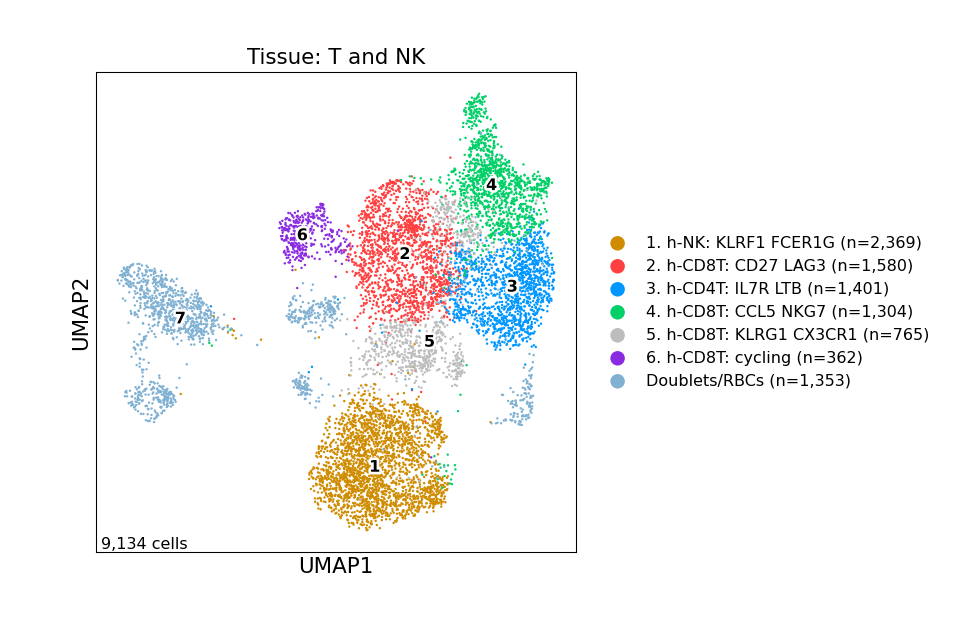
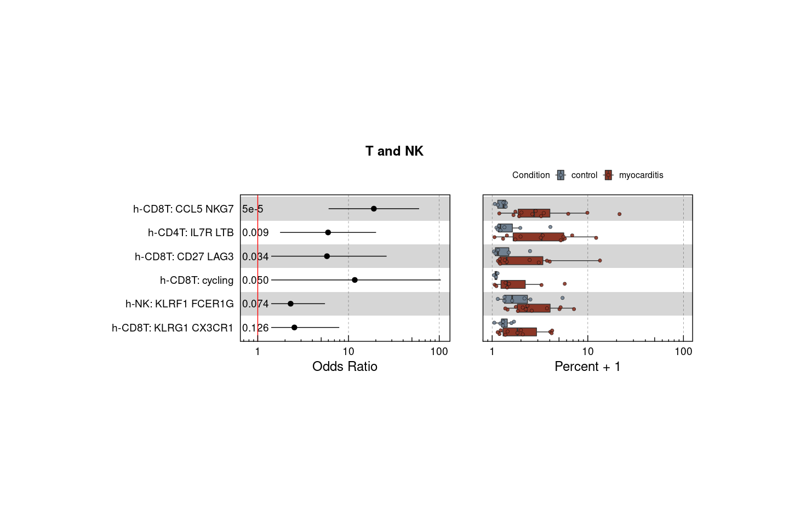
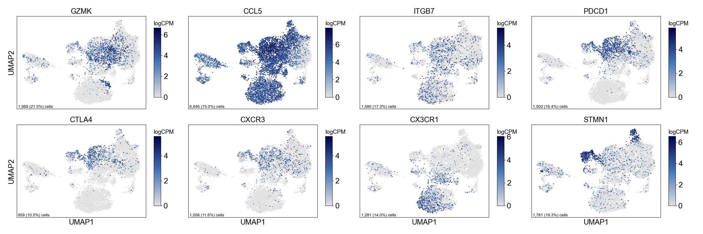
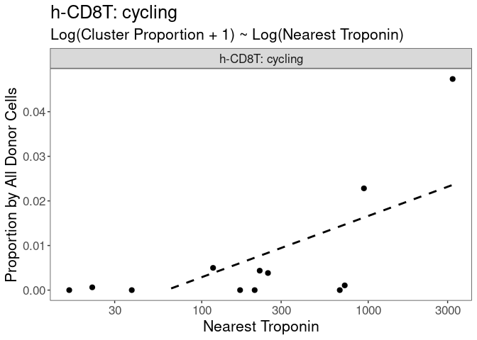
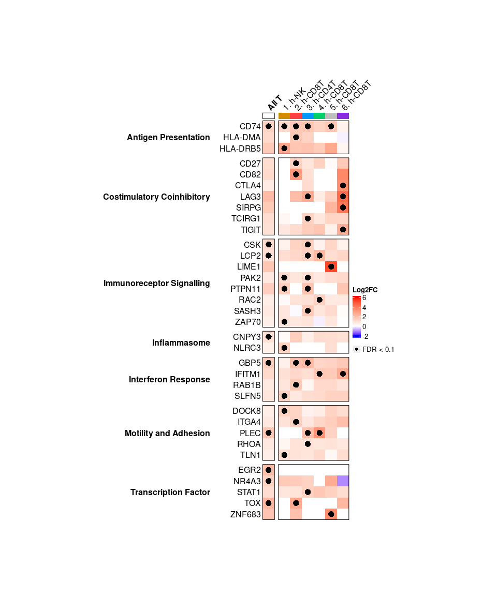
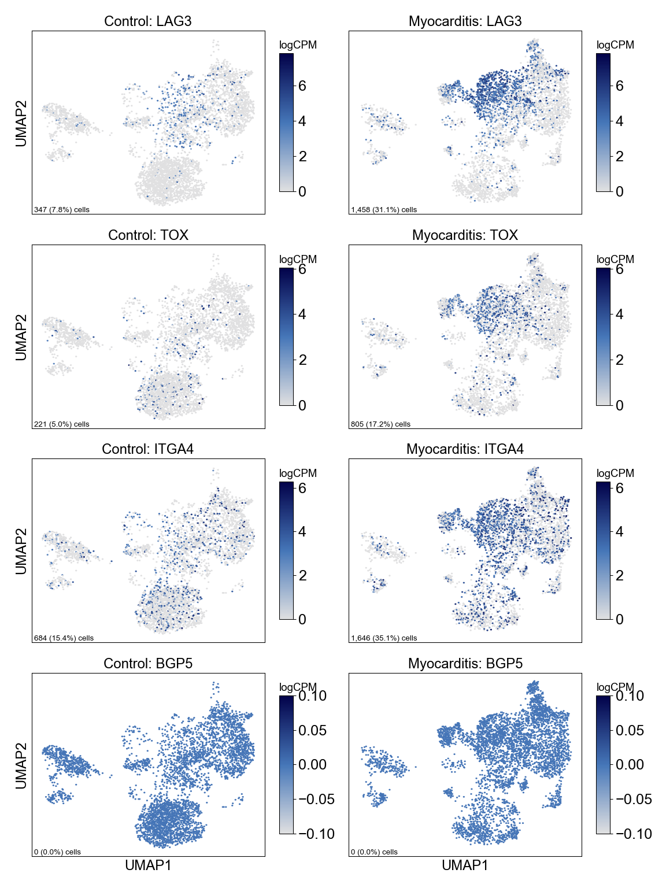

Figure 2
================

## Set up

Load R libraries

``` r
# load packages
library(tidyverse)
library(rmarkdown)
library(rlang)
library(parameters)
library(RColorBrewer)
library(ComplexHeatmap)
library(circlize)
library(Matrix)
library(glue)
library(ggforestplot)
library(ggbeeswarm)
library(patchwork)
library(lme4)
library(ggstance)
library(DESeq2)
library(knitr)

library(reticulate)
use_python("/projects/home/nealpsmith/.conda/envs/updated_pegasus/bin/python")

setwd('/projects/home/ikernin/github_code/myocarditis/functions')
source('masc.R')
source('plot_masc.R')
source('tissue_troponin_abundance.R')
source('de.R')
```

Load Python packages

``` python
import pegasus as pg
import warnings
warnings.filterwarnings('ignore')

import sys
sys.path.append("/projects/home/ikernin/github_code/myocarditis/functions")
import python_functions
```

Read in single-cell data

``` python
tissue_t = pg.read_input('/projects/home/ikernin/projects/myocarditis/github_datasets/tissue_t.zarr')
```

    ## 2023-03-31 15:25:08,374 - pegasusio.readwrite - INFO - zarr file '/projects/home/ikernin/projects/myocarditis/github_datasets/tissue_t.zarr' is loaded.
    ## 2023-03-31 15:25:08,374 - pegasusio.readwrite - INFO - Function 'read_input' finished in 0.22s.

## Figure 2A

``` python
python_functions.plot_umap(tissue_t, 'Tissue: T and NK', python_functions.tissue_t_pal, marker_multiplier=6)
```



## Figure 2B

``` python
python_functions.make_gene_dotplot(tissue_t.to_anndata(),
             cluster_order=['4. h-CD8T: CCL5 NKG7',
                            '3. h-CD4T: IL7R LTB',
                            '2. h-CD8T: CD27 LAG3',
                            '6. h-CD8T: cycling',
                            '1. h-NK: KLRF1 FCER1G',
                            '5. h-CD8T: KLRG1 CX3CR1'],
             gene_order=['CD8A', 'CCL5', 'NKG7',  # 4. h-CD8T markers
                         'CD4', 'IL7R', 'LTB',  # 3. h-CD4T markers
                         'CD27', 'LAG3', 'PDCD1',  # 2. h-CD8T markers
                         'STMN1', 'TOP2A',  # 6. h-CD8T markers
                         'KLRF1', 'FCER1G',  # 1. h-NK markers
                         'KLRG1', 'CX3CR1', 'GZMH'  # 5. h-CD8T markers
                         ],
             title='T/NK')
```


## Figure 2C

``` r
tissue_global_obs = read_csv('/projects/home/ikernin/projects/myocarditis/github_datasets/tissue_global_obs.csv')
masc_filtered_df  <- masc_filter(tissue_global_obs)

## run MASC for subclusters
cluster_masc_res <- MASC(masc_filtered_df,
                 cluster = masc_filtered_df$global_subcluster_number,
                 contrast = "condition",
                 random_effects = "donor",
                 fixed_effects = "",
                 verbose = TRUE, save_models = FALSE)

## add cluster names to results
cluster_masc_formatted <- cluster_masc_res %>%
  as_tibble() %>%
  mutate(cluster_number = unlist(map( str_split(cluster, 'cluster'), 2)),
         cluster_number = as.numeric(cluster_number)) %>%
  left_join(masc_filtered_df %>%
              select(umap_name, umap_number, global_subcluster_name, global_subcluster_number) %>%
              distinct(),
            by = c('cluster_number' = 'global_subcluster_number')) %>%
  mutate(cluster_names = unlist(map(str_split(global_subcluster_name, '\\. '), 2))) %>%
  relocate(umap_name, cluster_names, cluster_number) %>%
  select(!c(cluster, global_subcluster_name))

## FDR adjust p-values
cluster_masc_formatted['p.adj'] <- p.adjust(cluster_masc_formatted$model.pvalue, method = 'fdr')

## save results
write_csv(cluster_masc_formatted, 'cluster_masc_res.csv')

## plot results for T and NK lineage
plot_masc_by_cell_type(cluster_masc_formatted, masc_filtered_df, lineage='T and NK')
```

<!-- -->

## Figure 2D

``` python
fig_2d_genes = ['GZMK', "CCL5", "ITGB7", "PDCD1", "CTLA4", "CXCR3", "CX3CR1", "STMN1"]
python_functions.multi_hex_featureplot(tissue_t,
                      fig_2d_genes,
                      ncol=4,
                      cmap=python_functions.blues_cmap,
                      gridsize=200)
```

    ##   0%|                                                                                               | 0/8 [00:00<?, ?it/s] 12%|##########8                                                                            | 1/8 [00:00<00:02,  3.12it/s] 25%|#####################7                                                                 | 2/8 [00:00<00:01,  3.89it/s] 38%|################################6                                                      | 3/8 [00:00<00:01,  3.69it/s] 50%|###########################################5                                           | 4/8 [00:01<00:00,  4.05it/s] 62%|######################################################3                                | 5/8 [00:01<00:00,  3.83it/s] 75%|#################################################################2                     | 6/8 [00:01<00:00,  4.11it/s] 88%|############################################################################1          | 7/8 [00:01<00:00,  3.88it/s]100%|#######################################################################################| 8/8 [00:02<00:00,  4.13it/s]100%|#######################################################################################| 8/8 [00:02<00:00,  3.96it/s]



## Figure 2E

``` r
tissue_troponin_metadata <- read_csv('/projects/home/ikernin/projects/myocarditis/github_datasets/tissue_troponin_metadata.csv')
```

    ## Rows: 13 Columns: 3
    ## ── Column specification ───────────────────────────────────────────────────────────────────────────────────────────────────
    ## Delimiter: ","
    ## chr (1): donor
    ## dbl (2): nearest_troponin, days_from_collection
    ## 
    ## ℹ Use `spec()` to retrieve the full column specification for this data.
    ## ℹ Specify the column types or set `show_col_types = FALSE` to quiet this message.

``` r
troponin_filtered_df <- troponin_filter_tissue(tissue_global_obs, tissue_troponin_metadata)
```

    ## Joining with `by = join_by(donor)`

``` r
# fit linear model by troponin for DE clusters
select_clusters <- c("h-NK: KLRF1 FCER1G",
                     "h-CD4T: IL7R LTB",
                    "h-CD8T: CD27 LAG3",
                    "h-CD8T: CCL5 NKG7",
                    "h-CD8T: cycling",
                    "h-MNP: S100A8-low C1QA-low",
                    "h-MNP: FCGR3A LILRB2",
                    "h-cDC: CLEC9A CD1C",
                    "Fibroblasts: DCN LUM")
troponin_cluster_percs <- troponin_get_percents_per_level(troponin_filtered_df, level='cluster')
```

    ## `summarise()` has grouped output by 'donor'. You can override using the `.groups` argument.
    ## Joining with `by = join_by(donor)`
    ## Joining with `by = join_by(donor)`

``` r
select_cluster_percs <- troponin_cluster_percs %>%
        filter(cluster_names %in% select_clusters)
select_cluster_model <- troponin_fit_model(select_cluster_percs, level='cluster')
kable(select_cluster_model %>%
              select(!c(data, model)) %>%
              unnest(cols = c(trop_coef, trop_se, trop_pval)))
```

| cluster\_names             |  trop\_coef |  trop\_se | trop\_pval |      padj |
| :------------------------- | ----------: | --------: | ---------: | --------: |
| Fibroblasts: DCN LUM       |   0.0161216 | 0.0162256 |  0.3438558 | 0.6189405 |
| h-CD4T: IL7R LTB           |   0.0001064 | 0.0061510 |  0.9865381 | 0.9865381 |
| h-CD8T: CCL5 NKG7          |   0.0039344 | 0.0104176 |  0.7135667 | 0.9050230 |
| h-CD8T: CD27 LAG3          |   0.0049633 | 0.0063341 |  0.4514475 | 0.6771712 |
| h-CD8T: cycling            |   0.0058375 | 0.0020689 |  0.0181105 | 0.0814970 |
| h-cDC: CLEC9A CD1C         |   0.0019211 | 0.0006323 |  0.0125033 | 0.0814970 |
| h-MNP: FCGR3A LILRB2       |   0.0021302 | 0.0083788 |  0.8044649 | 0.9050230 |
| h-MNP: S100A8-low C1QA-low |   0.0112636 | 0.0082623 |  0.2027089 | 0.4560950 |
| h-NK: KLRF1 FCER1G         | \-0.0054666 | 0.0030911 |  0.1074143 | 0.3222428 |

``` r
troponin_plot_model(select_cluster_model %>% filter(cluster_names =="h-CD8T: cycling"),
                    select_cluster_percs %>% filter(cluster_names =="h-CD8T: cycling"),
                    "h-CD8T: cycling", level='cluster', point_size = 2.2, type='simple')
```

    ## `geom_smooth()` using formula = 'y ~ x'

    ## Warning: Removed 21 rows containing missing values (`geom_smooth()`).

<!-- -->

## Figure 2F

``` python
# get pseudobulk counts and metadata by donor for t and nk  clusters
python_functions.get_pseudobulk_info(tissue_t, 'tissue_t')

# get pseudobulk counts and metadata by donor for t cells only
tissue_t.obs['t_cell'] = tissue_t.obs['umap_name'].isin(['2. h-CD8T: CD27 LAG3',
                                                         '3. h-CD4T: IL7R LTB',
                                                         '4. h-CD8T: CCL5 NKG7',
                                                         '5. h-CD8T: KLRG1 CX3CR1',
                                                         '6. h-CD8T: cycling'])
tissue_t.obs['t_cell'] = tissue_t.obs['t_cell'].replace({True: 'all_t', False: 'other'})
python_functions.get_pseudobulk_info(tissue_t, 'tissue_t_grouped', cluster_col='t_cell')
```

``` r
# run DE analysis by condition
t_deres <- run_de_by_condition(counts_filepath = '/projects/home/ikernin/projects/myocarditis/github_datasets/tissue_t_pseudocounts.csv',
                               meta_filepath = '/projects/home/ikernin/projects/myocarditis/github_datasets/tissue_t_metainfo.csv',
                               save_name = 'tissue_t')

t_grouped_deres <- run_de_by_condition(counts_filepath = '/projects/home/ikernin/projects/myocarditis/github_datasets/tissue_t_grouped_pseudocounts.csv',
                                       meta_filepath = '/projects/home/ikernin/projects/myocarditis/github_datasets/tissue_t_grouped_metainfo.csv',
                                       save_name = 'tissue_t_grouped')
```

    ## [1] "Cluster 1"
    ## [1] "Cluster 2"
    ## [1] "Cluster 3"
    ## [1] "Cluster 4"
    ## [1] "Cluster 5"
    ## [1] "Cluster 6"
    ## [1] "Cluster 7"
    ## [1] "saving results..."
    ## [1] "Cluster all_t"
    ## [1] "Cluster other"
    ## [1] "saving results..."

``` r
# combine de results and meta data for heatmap
t_full_deres <- bind_rows(t_deres %>%
                               mutate(cluster = as.character(cluster)),
                             t_grouped_deres)
t_clusters <- read_csv('/projects/home/ikernin/projects/myocarditis/github_datasets/t_cluster_map.csv') # cluster number to name map
t_genes <- read_csv('/projects/home/ikernin/projects/myocarditis/github_datasets/t_heatmap_genes.csv') # genes to include in heatmap
t_heatmap_df <- get_heatmap_data(t_full_deres, t_genes, t_clusters)

heatmap_df <- t_heatmap_df %>%
  mutate(cluster = cluster_name,
    cluster = case_when(
    cluster == 'all_t' ~ 'All T',
    TRUE ~ cluster
  )) %>%
  select(!cluster_name)


# Format main body --------------------------------------------------------

# set category order
category_levels <- sort(unique(heatmap_df$category))
category_levels <- c(category_levels[category_levels != 'Other'], 'Other')

# reformat from long to wide
heatmap_df <- heatmap_df %>%
  distinct() %>%
  pivot_wider(names_from = cluster, values_from = c(log2FoldChange, padj)) %>%
  filter(!is.na(category)) %>%
  mutate(category = factor(category, levels = category_levels)) %>%
  arrange(category)

# get information for the main body's cells
heatmap_mtx <- heatmap_df %>%
  select(starts_with("log2FoldChange")) %>%
  replace(is.na(.), 0) %>%
  rename_with(~str_remove(., "log2FoldChange_")) %>%
  select(order(colnames(.))) %>%
  as.matrix()
rownames(heatmap_mtx) <- heatmap_df$gene_symbol

# define cell color range
heatmap_col_fun <- colorRamp2(c(floor(min(heatmap_mtx)), 0, ceiling(max(heatmap_mtx))),
                              c("blue", "white", "red"))

# split into subclusters and lineage
heatmap_mtx_subcluster <- heatmap_mtx[, !str_detect(colnames(heatmap_mtx), 'All')]
colnames(heatmap_mtx_subcluster) <- str_remove(colnames(heatmap_mtx_subcluster), regex(":.*"))
heatmap_mtx_lineage <- heatmap_mtx[, str_detect(colnames(heatmap_mtx), 'All'), drop=FALSE]


# Main body annotation (FDR) ----------------------------------------------

# get fdr values
fdr_mtx <- heatmap_df %>%
  select(starts_with('padj')) %>%
  replace(is.na(.), Inf) %>%
  rename_with(~str_remove(., "padj_")) %>%
  select(order(colnames(.))) %>%
  as.matrix()

# make sure columns the same
stopifnot(colnames(fdr_mtx) == colnames(heatmap_mtx))

# split into subcluster and lineage
fdr_mtx_subcluster <- fdr_mtx[, !str_detect(colnames(fdr_mtx), 'All')]
fdr_mtx_lineage <- fdr_mtx[, str_detect(colnames(fdr_mtx), 'All'), drop=FALSE]

# make function for plotting fdr value
fdr_func_subcluster <- function(j, i, x, y, width, height, fill){
  if (fdr_mtx_subcluster[i,j] < 0.1){
    grid.circle(x = x, y = y, r = unit(1.5, 'mm'),
                gp = gpar(fill = 'black', col = NA))
  }
}
fdr_func_lineage <- function(j, i, x, y, width, height, fill){
  if (fdr_mtx_lineage[i,j] < 0.1){
    grid.circle(x = x, y = y, r = unit(1.5, "mm"),
                gp = gpar(fill = 'black', col = NA))
  }
}

# create legend for fdr
lgd_fdr = Legend(pch = 16, type = "points", labels = "FDR < 0.1")


# Column annotation (cluster names) ---------------------------------------

# define colors
clust_col_fun <- c('#cf8c00', '#ff4040', '#0097ff', '#00d067', '#bdbdbd', '#8a2be2')
names(clust_col_fun) <- seq(1,6)

lineage_col_fun <- c('white')
names(lineage_col_fun) <- 'All'


clust_ha <- HeatmapAnnotation(clust_colors = names(clust_col_fun),
                              col = list(clust_colors = clust_col_fun),
                              show_legend = FALSE,
                              show_annotation_name = FALSE,
                              simple_anno_size = unit(3, "mm"))
lineage_ha <- HeatmapAnnotation(lineage = names(lineage_col_fun),
                                col = list(lineage = lineage_col_fun),
                                show_legend = FALSE,
                                show_annotation_name = FALSE,
                                simple_anno_size = unit(3, "mm"),
                                border = T)


# Row annotation (gene names) ---------------------------------------------

# split rows by gene category
stopifnot(rownames(heatmap_mtx_subcluster) == rownames(heatmap_mtx_lineage))
row_split <- str_replace_all(heatmap_df$category, "_", " ")
row_split <- factor(row_split, levels = unique(row_split))


# Plot --------------------------------------------------------------------

ht_subcluster <- Heatmap(heatmap_mtx_subcluster,
                         col = heatmap_col_fun,
                         row_split = row_split,
                         cell_fun = fdr_func_subcluster,
                         top_annotation = clust_ha,
                         name = 'Log2FC',
                         cluster_columns = FALSE,  column_names_side = "top",
                         show_column_names = T, column_names_rot = 45,
                         cluster_rows = FALSE, row_names_side = "left",
                         row_title_rot = 0, row_title_gp=gpar(fontface='bold'),
                         row_gap = unit(2, "mm"), border = TRUE,
                         width = ncol(heatmap_mtx_subcluster)*unit(6, "mm"),
                         height = nrow(heatmap_mtx_subcluster)*unit(6, "mm"))

ht_lineage <- Heatmap(heatmap_mtx_lineage,
                      col = heatmap_col_fun,
                      row_split = row_split,
                      cell_fun = fdr_func_lineage,
                      top_annotation = lineage_ha,
                      name = 'Lineage', show_heatmap_legend = FALSE,
                      column_names_gp = gpar(fontface='bold'),
                      cluster_columns = FALSE,  column_names_side = "top",
                      show_column_names = T, column_names_rot = 45,
                      cluster_rows = FALSE, row_names_side = "left",
                      row_title_rot = 0, row_title_gp=gpar(fontface='bold'),
                      row_gap = unit(2, "mm"), border = TRUE,
                      width = ncol(heatmap_mtx_lineage)*unit(6, "mm"),
                      height = nrow(heatmap_mtx_lineage)*unit(6, "mm"))

draw(ht_lineage + ht_subcluster,
     annotation_legend_list = list(lgd_fdr),
     merge_legends = TRUE)
```

<!-- -->

## Figure 2G

``` python
fig_2g_genes = ['LAG3', 'TOX', 'ITGA4', 'BGP5']
python_functions.multi_hexfp_by_condition(tissue_t,
                      fig_2g_genes,
                      cmap=python_functions.blues_cmap,
                      gridsize=200)
```

    ##   0%|                                                                                               | 0/4 [00:00<?, ?it/s] 25%|#####################7                                                                 | 1/4 [00:00<00:01,  2.51it/s] 50%|###########################################5                                           | 2/4 [00:00<00:00,  2.64it/s] 75%|#################################################################2                     | 3/4 [00:01<00:00,  2.57it/s]100%|#######################################################################################| 4/4 [00:01<00:00,  2.67it/s]100%|#######################################################################################| 4/4 [00:01<00:00,  2.63it/s]


