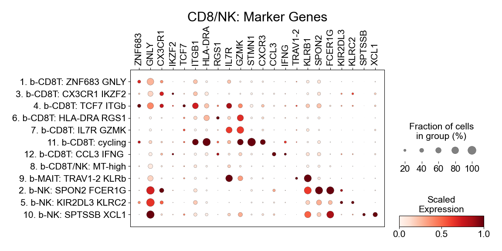
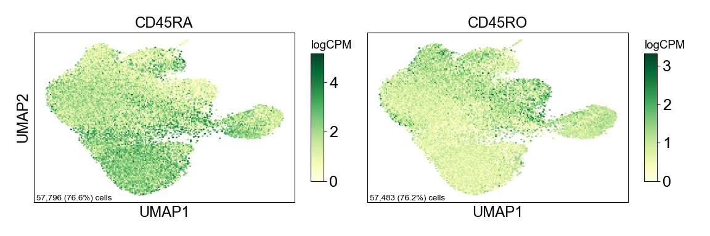

Figure 3
================

## Setup

Load R libraries

``` r
library(reticulate)
use_python("/projects/home/nealpsmith/.conda/envs/updated_pegasus/bin/python")
```

Load Python packages

``` python
import pegasus as pg
import warnings
warnings.filterwarnings('ignore')

import sys
sys.path.append("/projects/home/ikernin/github_code/myocarditis/functions")
import python_functions
```

Read in single-cell data

``` python
blood_cd8_nk = pg.read_input('/projects/home/ikernin/projects/myocarditis/github_datasets/blood_cd8.zarr')
```

``` python
blood_cd8_nk_adt = pg.read_input('/projects/home/ikernin/projects/myocarditis/github_datasets/blood_cd8_nk_adt.zarr')
```

## Figure 3E

``` python
python_functions.plot_umap(blood_cd8_nk, 'Blood: CD8 and NK', python_functions.blood_cd8_pal)
```


## Figure 3F

``` python
python_functions.make_gene_dotplot(blood_cd8_nk.to_anndata(),
             cluster_order=['1. b-CD8T: ZNF683 GNLY', '3. b-CD8T: CX3CR1 IKZF2', '4. b-CD8T: TCF7 ITGb',
                            '6. b-CD8T: HLA-DRA RGS1', '7. b-CD8T: IL7R GZMK', '11. b-CD8T: cycling',
                            '12. b-CD8T: CCL3 IFNG ', '8. b-CD8T/NK: MT-high', '9. b-MAIT: TRAV1-2 KLRb',
                            '2. b-NK: SPON2 FCER1G', '5. b-NK: KIR2DL3 KLRC2', '10. b-NK: SPTSSB XCL1'],
             gene_order=['ZNF683', 'GNLY', 'CX3CR1', 'IKZF2', 'TCF7', 'ITGB1', 'HLA-DRA',
                         'RGS1', 'IL7R', 'GZMK', 'STMN1', 'CXCR3', 'CCL3', 'IFNG', 'TRAV1-2',
                         'KLRB1', 'SPON2', 'FCER1G',  'KIR2DL3', 'KLRC2', 'SPTSSB', 'XCL1'],
             title='CD8/NK')
```



## Figure 3I

``` python
## for adt data
fig_3i_adt_genes = ['CD45RA', 'CD45RO']
python_functions.multi_hex_featureplot(blood_cd8_nk_adt,
                      fig_3i_adt_genes,
                      ncol=2,
                      cmap='YlGn',
                      gridsize=200)

## for gex data
fig_3i_gex_genes = ['STMN1', 'CXCR3', 'CX3CR1', 'IFNG']
python_functions.multi_hex_featureplot(blood_cd8_nk,
                      fig_3i_gex_genes,
                      ncol=2,
                      cmap=python_functions.blues_cmap,
                      gridsize=200)
```

    ##   0%|                                                                                               | 0/2 [00:00<?, ?it/s] 50%|###########################################5                                           | 1/2 [00:00<00:00,  1.45it/s]100%|#######################################################################################| 2/2 [00:01<00:00,  1.60it/s]100%|#######################################################################################| 2/2 [00:01<00:00,  1.58it/s]



    ##   0%|                                                                                               | 0/4 [00:00<?, ?it/s] 25%|#####################7                                                                 | 1/4 [00:01<00:03,  1.11s/it] 50%|###########################################5                                           | 2/4 [00:02<00:02,  1.04s/it] 75%|#################################################################2                     | 3/4 [00:03<00:01,  1.07s/it]100%|#######################################################################################| 4/4 [00:04<00:00,  1.04s/it]100%|#######################################################################################| 4/4 [00:04<00:00,  1.05s/it]


