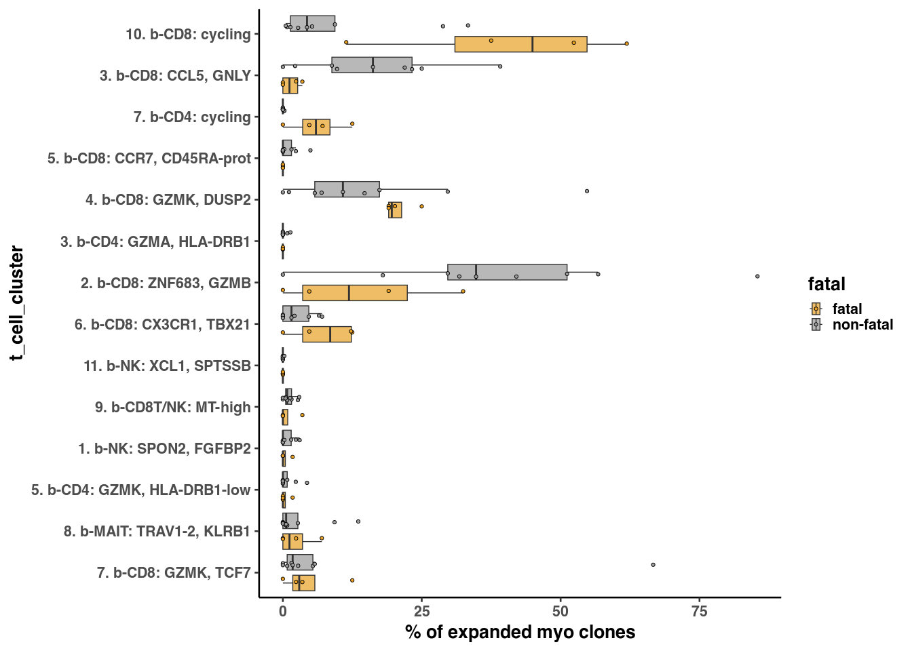

Figure 3
================

## Setup

Load R libraries

``` r
library(reticulate)
use_python("/projects/home/nealpsmith/.conda/envs/updated_pegasus/bin/python")

library(tidyverse)
library(ggpubr)
library(ggplot2)
library(scattermore)
library(grid)
library(alakazam)
library(magrittr)
library(circlize)
library(ComplexHeatmap)

setwd('../../functions')
source('tcr_functions.R')
```

Load Python packages

``` python
import pegasus as pg
import warnings
warnings.filterwarnings('ignore')

import sys
sys.path.append("/projects/home/ikernin/github_code/myocarditis/functions")
import python_functions
```

Read in single-cell data

``` python
blood_cd8_nk = pg.read_input('/projects/home/ikernin/projects/myocarditis/github_datasets/blood_cd8.zarr')
```

``` python
blood_cd8_nk_adt = pg.read_input('/projects/home/ikernin/projects/myocarditis/github_datasets/blood_cd8_nk_adt.zarr')
```

``` python
blood_cd8_nk
```

``` r
bulk_tcr_df <- read.csv("/projects/home/nealpsmith/projects/myocarditis/data/adaptive/all_productive_tcrs.csv",
                        row.names = 1)
blood_sc_info = read.csv("/projects/home/nealpsmith/projects/myocarditis/tissue/data/tcr/blood_tissue_comps/cell_info.csv",
                     row.names = 1)
tissue_sc_info <- read.csv("/projects/home/nealpsmith/projects/myocarditis/tissue/data/tcr/blood_tissue_comps/tissue_cell_info.csv",
                             row.names = 1)
tissue_sc_info <- tissue_sc_info[tissue_sc_info$TRB_cdr3 != "",]
### Okay lets look at the overlap between tumor and myocarditis and tumor control in our subjects ###
bulk_tissue_samples = list("SIC_3" = list("tumor" = "A17-341_A2", "control" = "A17-341_A3", "myo" = "A17-341_A27"),
                           "SIC_232" = list("tumor" = "A19-395_A8", "control" = "A19-395_A7", "myo" = "A19-395_A53-1"),
                           "SIC_136" = list("tumor" = "A19-41_A10_Tumor", "control" = "A19-41_A10_Liver", "myo" = "A19-41_A33"),
                           "SIC_17" = list("tumor" = "A18-122_A51", "control" = "A18-122_A52", "myo" = "A18-122_A41"),
                           "SIC_175" = list("tumor" = "A19-230_A5", "control" = "T03054-11", "myo" = "A19-230_A48"),
                           "SIC_266" = list("myo" = "A20-363_A18"),
                           "SIC_264" = list("myo" = "A20-331_A1"),
                           # These are controls
                           "SIC_176" = list("myo" = "A19-213_A13"),
                           "SIC_14" = list("myo" = "T01708-11"),
                           "SIC_182" = list("myo" = "A19-240_A15"),
                           "T01241" = list("myo" = "A16-303_A5")
)
```

## Figure 3B

``` r
control_ids <- c("SIC_176", "SIC_14", "SIC_182", "T01241")
healing_ids <- c("SIC_3", "SIC_175", "SIC_266")
borderline_ids <- c("SIC_136")
active <- c("SIC_264", "SIC_17")

meta_df <- data.frame("category" = c("control", "control", "control", "control",
                                     "healing", "healing", "healing",
                                     "borderline", "active", "active"),
                      "id" = c("SIC_176", "SIC_14", "SIC_182", "T01241",
                               "SIC_3", "SIC_175", "SIC_266", "SIC_136", "SIC_264", "SIC_17"))

heart_tcrs <- lapply(names(bulk_tissue_samples), function(s){
  heart_samp <- bulk_tissue_samples[[s]][["myo"]]
  subj_tcrs <- bulk_tcr_df %>%
    dplyr::filter(sample == heart_samp) %>%
    dplyr::select(amino_acid, sample, id, count_templates_reads)
  return(subj_tcrs)
}) %>% do.call(rbind, .)

colnames(heart_tcrs)[colnames(heart_tcrs) == "amino_acid"] <- "clone_id"
# Only look at subjects with at least 200 TCRs
div_df <- heart_tcrs[,c("clone_id", "id", "count_templates_reads")]
div_df <- div_df[div_df$id != "SIC_232",] # They have tumors in their heart...different case
div <- alphaDiversity(div_df, group = "id", nboot = 100, min_n = 100, copy = "count_templates_reads")
```

    ## [1] "MADE IT!"
    ## # A tibble: 369 × 9
    ## # Groups:   id [9]
    ##    id          q     d  d_sd d_lower d_upper     e e_lower e_upper
    ##    <chr>   <dbl> <dbl> <dbl>   <dbl>   <dbl> <dbl>   <dbl>   <dbl>
    ##  1 SIC_136   0    156.  5.61    145.    167. 1       0.929    1.07
    ##  2 SIC_136   0.1  154.  5.84    143.    166. 0.991   0.917    1.06
    ##  3 SIC_136   0.2  153.  6.09    141.    165. 0.981   0.905    1.06
    ##  4 SIC_136   0.3  151.  6.36    139.    164. 0.971   0.891    1.05
    ##  5 SIC_136   0.4  150.  6.64    137.    163. 0.961   0.877    1.04
    ##  6 SIC_136   0.5  148.  6.94    134.    162. 0.949   0.862    1.04
    ##  7 SIC_136   0.6  146.  7.26    132.    160. 0.937   0.846    1.03
    ##  8 SIC_136   0.7  144.  7.60    129.    159. 0.925   0.829    1.02
    ##  9 SIC_136   0.8  142.  7.96    127.    158. 0.912   0.812    1.01
    ## 10 SIC_136   0.9  140.  8.33    124.    156. 0.898   0.793    1.00
    ## # … with 359 more rows

``` r
# Add healing meta
div %<>%
  dplyr::left_join(meta_df, by = "id")

ggplot(div, aes_string(x = "q", y = "d", group = "id", color = "category")) +
  geom_line(size = 1) +
  # facet_wrap(~subj) +
  # scale_color_manual(values = c("blue", "red")) +
  ggtitle("Hill diversity index") + baseTheme() +
  xlab("q") + ylab("d") +
  theme_classic(base_size = 20) +
  theme(legend.title = element_blank())
```

<!-- -->

## Figure 3C

``` r
fisher_res <- data.frame()
all_seq_info <- data.frame()

# Lets just look at subjects where we have control tissue
case_control_subjs <- c("SIC_3", "SIC_136", "SIC_17", "SIC_175")

for (subj in case_control_subjs){
  # Get the data for the subject
  subj_data <-  bulk_tcr_df %>%
    dplyr::filter(id == subj)

  subj_by_aa <- subj_data %>%
    dplyr::select(sample, tissue, amino_acid, count_templates_reads) %>%
    group_by(sample, tissue, amino_acid) %>%
    summarise("n_count_aa" = sum(count_templates_reads)) %>%
    group_by(sample) %>%
    dplyr::mutate("perc_of_samp" = n_count_aa / sum(n_count_aa)) # Lets get the proportion of each TCR AA seq in sample

  # Now make seperate dataframes
  subj_split <- split(subj_by_aa, f = subj_by_aa$sample)
  samp_info <- bulk_tissue_samples[[subj]]

  tumor_data <- subj_split[[samp_info$tumor]] %>%
    ungroup() %>%
    dplyr::select(amino_acid, perc_of_samp, n_count_aa) %>%
    `colnames<-`(c("amino_acid", "perc_tumor", "n_tumor"))

  control_data <- subj_split[[samp_info$control]] %>%
    ungroup %>%
    dplyr::select(amino_acid, perc_of_samp, n_count_aa) %>%
    `colnames<-`(c("amino_acid", "perc_control", "n_control"))

  myo_data <- subj_split[[samp_info$myo]] %>%
    ungroup %>%
    dplyr::select(amino_acid, perc_of_samp, n_count_aa) %>%
    `colnames<-`(c("amino_acid", "perc_myo", "n_myo"))

  info_df <- list(tumor_data, control_data, myo_data) %>%
    reduce(full_join, by = c("amino_acid"))
  info_df[is.na(info_df)] <- 0

  info_df$subj <- subj
  # Save all the seq info to a dataframe for a ranking plot
  all_seq_info <- rbind(all_seq_info, info_df)

  # Limit to TCRs found in at least tumor or myo, don't care about those exclusive to control
  info_df %<>%
    dplyr::filter(perc_tumor > 0.005 | perc_myo > 0.005) %>%
    dplyr::filter(n_control > 0) # Decided on this filter to be as strict as possible with analysis
  # Now that we have every TCR and its counts in the tumor, control, myo, lets do the stats
  stats_fisher <- lapply(info_df$amino_acid, function(seq){
    seq_info <- info_df %>% dplyr::filter(amino_acid == seq)
    d <- data.frame(group = c("ctrl", "myo", "tumor"),
                    tcr1_n = c(seq_info$n_control, seq_info$n_myo, seq_info$n_tumor),
                    tcr1_p = c(seq_info$perc_control, seq_info$perc_myo, seq_info$perc_tumor)) %>%
      dplyr::mutate(total_n = c(sum(control_data$n_control), sum(myo_data$n_myo), sum(tumor_data$n_tumor)))

    fisher_myo <- fisher.test(matrix(c(d$tcr1_n[d$group == "myo"],
                                       d$total_n[d$group == "myo"] - d$tcr1_n[d$group == "myo"],
                                       d$tcr1_n[d$group == "ctrl"],
                                       d$total_n[d$group == "ctrl"] - d$tcr1_n[d$group == "ctrl"]), nrow = 2))
    fisher_myo <- broom::tidy(fisher_myo) %>%
      `colnames<-`(paste("fisher", colnames(.), sep = "_")) %>%
      dplyr::mutate(term = "groupmyo")
    fisher_tumor <- fisher.test(matrix(c(d$tcr1_n[d$group == "tumor"],
                                       d$total_n[d$group == "tumor"] - d$tcr1_n[d$group == "tumor"],
                                       d$tcr1_n[d$group == "ctrl"],
                                       d$total_n[d$group == "ctrl"] - d$tcr1_n[d$group == "ctrl"]), nrow = 2))
    fisher_tumor <- broom::tidy(fisher_tumor) %>%
      `colnames<-`(paste("fisher", colnames(.), sep = "_")) %>%
      dplyr::mutate(term = "grouptumor")
    fish_res <- rbind(fisher_myo, fisher_tumor) %>%
      mutate(seq = seq)
    return(fish_res)
  }) %>%
    do.call(rbind, .) %>%
    mutate(subj = subj)

  fisher_by_seq <- data.frame()
  for(s in unique(stats_fisher$seq)){
  seq_info <- stats_fisher %>% dplyr::filter(seq == s)
  df <- data.frame(amino_acid = s,
                   subj = unique(seq_info$subj),
                   myo_log_fc = seq_info$fisher_estimate[seq_info$term == "groupmyo"],
                   tumor_log_fc = seq_info$fisher_estimate[seq_info$term == "grouptumor"],
                   myo_pval = seq_info$fisher_p.value[seq_info$term == "groupmyo"],
                   tumor_pval = seq_info$fisher_p.value[seq_info$term == "grouptumor"],
                   myo_estimate = seq_info$fisher_estimate[seq_info$term == "groupmyo"],
                   tumor_estimate = seq_info$fisher_estimate[seq_info$term == "grouptumor"])
  fisher_by_seq <- rbind(fisher_by_seq, df)
  }
  fisher_by_seq %<>%
    dplyr::left_join(info_df, by = c("amino_acid", "subj"))
  fisher_by_seq$tum_ctl_fc <- sapply(fisher_by_seq$amino_acid, function(s){

    # If it doesn't exist in either, fold-change is set to 1
    if (!s %in% tumor_data$amino_acid & !s %in% control_data$amino_acid){
      return(1)
    }

    # Adding pseudocunts to deal with zeros
    if (s %in% tumor_data$amino_acid){
      perc_tum <- (tumor_data$n_tumor[tumor_data$amino_acid == s] + 1) / (sum(tumor_data$n_tumor) + 1)
    } else {
      perc_tum <- 1 /  (sum(tumor_data$n_tumor) + 1)
    }

    if (s %in% control_data$amino_acid){
      perc_ctl <- (control_data$n_control[control_data$amino_acid == s] + 1) / (sum(control_data$n_control) + 1)
    } else {
      perc_ctl <- 1 / (sum(control_data$n_control) + 1)
    }
    return(perc_tum / perc_ctl)

  })
  fisher_by_seq$myo_ctl_fc <- sapply(fisher_by_seq$amino_acid, function(s){

    if (!s %in% myo_data$amino_acid & !s %in% control_data$amino_acid){
      return(1)
    }
    # Adding pseudocunts to deal with zeros
    if (s %in% myo_data$amino_acid){
      perc_myo <- (myo_data$n_myo[myo_data$amino_acid == s] + 1) / (sum(myo_data$n_myo) + 1)
    } else {
      perc_myo <- 1 /  (sum(myo_data$n_myo) + 1)
    }

    if (s %in% control_data$amino_acid){
      perc_ctl <- (control_data$n_control[control_data$amino_acid == s] + 1) / (sum(control_data$n_control) + 1)
    } else {
      perc_ctl <- 1 / (sum(control_data$n_control) + 1)
    }
    return(perc_myo / perc_ctl)

  })

  # fisher_by_seq$tum_ctl_fc <- fisher_by_seq$perc_tumor / fisher_by_seq$perc_control
  # fisher_by_seq$myo_ctl_fc <- fisher_by_seq$perc_myo / fisher_by_seq$perc_control
  # fisher_by_seq$myo_tum_fc <- fisher_by_seq$perc_myo / fisher_by_seq$perc_tumor

  fisher_res <- rbind(fisher_res, fisher_by_seq)

}

fisher_res$myo_padj <-p.adjust(fisher_res$myo_pval, method = "fdr")
fisher_res$tumor_padj <-p.adjust(fisher_res$tumor_pval, method = "fdr")


fisher_res$tum_ctl_fc[fisher_res$tum_ctl_fc > 50] <- 50
fisher_res$myo_ctl_fc[fisher_res$myo_ctl_fc > 50] <- 50

fisher_res$myo_enriched <- ifelse(fisher_res$myo_padj < 0.05 & fisher_res$myo_log_fc > 1, TRUE, FALSE)
fisher_res$tum_enriched <- ifelse(fisher_res$tumor_padj < 0.05 & fisher_res$tumor_log_fc > 1, TRUE, FALSE)
fisher_res$sig_cat <- ifelse(fisher_res$myo_enriched == TRUE,
                               ifelse(fisher_res$tum_enriched == TRUE, "enriched in both", "myo enriched"),
                               ifelse(fisher_res$tum_enriched == TRUE, "tumor enriched", "not enriched"))

fisher_res$sig_cat <- factor(fisher_res$sig_cat, levels = c("myo enriched", "tumor enriched", "enriched in both", "not enriched"))
ggplot(fisher_res, aes(x = myo_ctl_fc, y = tum_ctl_fc, fill = sig_cat)) +
  geom_point(pch = 21, size = 4) +
  scale_fill_manual(values = c("#7CAE00", "#C77CFF", "#F8766D", "grey")) +
  xlab("% Myocarditis : % control") +
  ylab("% Tumor : % control") +
  theme_classic(base_size = 20) +
  theme(legend.title = element_blank())
```

<!-- -->

\#\#Figure 3D

``` r
fisher_res$subj <- factor(fisher_res$subj, levels = c("SIC_3", "SIC_17", "SIC_136", "SIC_175"))
fisher_res <- fisher_res[order(fisher_res$subj, decreasing = TRUE),]
ggplot(fisher_res, aes(x = myo_ctl_fc, y = tum_ctl_fc, fill = subj)) +
  geom_point(pch = 21, size = 4) +
  scale_fill_manual(values = c('#CC79A7', "#F0E442","#56B4E9", '#E69F00')) +
  # scale_fill_brewer(palette = "Set2") +
  # geom_abline(slope = 1, size = 2, linetype = "dashed", color = "red") +
  xlab("% Myocarditis : % control") +
  ylab("% Tumor : % control") +
  theme_classic(base_size = 20) +
  theme(legend.title = element_blank())
```

<!-- -->

## Figure 3E

``` python
python_functions.plot_umap(blood_cd8_nk, 'Blood: CD8 and NK', python_functions.blood_cd8_pal)
```



## Figure 3F

``` python

python_functions.make_gene_dotplot(blood_cd8_nk.to_anndata(),
             cluster_order=['1. b-CD8T: ZNF683 GNLY', '3. b-CD8T: CX3CR1 IKZF2', '4. b-CD8T: TCF7 ITGb',
                            '6. b-CD8T: HLA-DRA RGS1', '7. b-CD8T: IL7R GZMK', '11. b-CD8T: cycling',
                            '12. b-CD8T: CCL3 IFNG ', '8. b-CD8T/NK: MT-high', '9. b-MAIT: TRAV1-2 KLRb',
                            '2. b-NK: SPON2 FCER1G', '5. b-NK: KIR2DL3 KLRC2', '10. b-NK: SPTSSB XCL1'],
             gene_order=['ZNF683', 'GNLY', 'CX3CR1', 'IKZF2', 'TCF7', 'ITGB1', 'HLA-DRA',
                         'RGS1', 'IL7R', 'GZMK', 'STMN1', 'CXCR3', 'CCL3', 'IFNG', 'TRAV1-2',
                         'KLRB1', 'SPON2', 'FCER1G',  'KIR2DL3', 'KLRC2', 'SPTSSB', 'XCL1'],
             title='CD8/NK')
```


## Figure 3G

``` r
subjs_oi <- c("SIC_175", "SIC_264", "SIC_48", "SIC_177")
myo_exp_tcrs <- lapply(subjs_oi, function(s){
  subj_tcrs <- c()
  # See if they have bulk TCR
  if(s %in% names(bulk_tissue_samples)){
    bulk_samp <- bulk_tissue_samples[[s]]$myo
    bulk_tcrs <- bulk_tcr_df[bulk_tcr_df$sample == bulk_samp,] %>%
      dplyr::select(amino_acid, count_templates_reads) %>%
      group_by(amino_acid) %>%
      summarise(n = sum(count_templates_reads)) %>%
      mutate(perc = n / sum(n) * 100)
    bulk_exp <- bulk_tcrs$amino_acid[bulk_tcrs$perc > 0.5 & bulk_tcrs$n > 1]
    subj_tcrs <- c(subj_tcrs, bulk_exp)
  }
  # See if they have single cell TCR
  if (s %in% unique(tissue_sc_info$donor)){
    subj_sc <- tissue_sc_info[tissue_sc_info$donor == s,] %>%
      dplyr::filter(TRB_cdr3 != "") %>%
      dplyr::select(TRB_cdr3) %>%
      mutate("count" =  1) %>%
      group_by(TRB_cdr3) %>%
      summarise(n = sum(count)) %>%
      mutate(perc = n / sum(n) * 100)
    sc_exp <- subj_sc$TRB_cdr3[subj_sc$perc > 0.5 & subj_sc$n > 1]
    subj_tcrs <- c(subj_tcrs, sc_exp)
  }
  return(unique(subj_tcrs))
})
names(myo_exp_tcrs) <- subjs_oi
plot_list <- list()
for (s in subjs_oi){
  myo_clones <- myo_exp_tcrs[[s]]

  plot_df <- blood_sc_info
  plot_df$myo_clone <- ifelse(plot_df$donor == s & plot_df$TRB_cdr3 %in% myo_clones, TRUE, FALSE)

  plot <- ggplot(plot_df, aes(x = umap_1, y = umap_2)) +
    geom_scattermore(data = plot_df[plot_df$myo_clone == FALSE,], color = "grey", size = 1) +
    geom_point(data = plot_df[plot_df$myo_clone == TRUE,], color = "red", size = 2) +
    xlab("") + ylab("") +
    theme_classic(base_size = 20) +
    ggtitle(s) +
    theme(axis.ticks = element_blank(), axis.text = element_blank())
  plot_list <- c(plot_list, list(plot))

}
figure <- ggarrange(plotlist = plot_list, ncol = 2, nrow = 2, common.legend = TRUE, legend = "right")
figure
```

<!-- -->

## Figure 3H

``` r
blood_overlap_subjs <- intersect(c(names(bulk_tissue_samples), unique(tissue_sc_info$donor)), unique(blood_sc_info$donor))
# Need to remove SIC_3, its healing myocarditis, so different
blood_overlap_subjs <- blood_overlap_subjs[blood_overlap_subjs != "SIC_3"]
myo_exp_tcrs <- lapply(blood_overlap_subjs, function(s){
  subj_tcrs <- c()
  # See if they have bulk TCR
  if(s %in% names(bulk_tissue_samples)){
    if (!s %in% healing_ids){
      bulk_samp <- bulk_tissue_samples[[s]]$myo
      bulk_tcrs <- bulk_tcr_df[bulk_tcr_df$sample == bulk_samp,] %>%
        dplyr::select(amino_acid, count_templates_reads) %>%
        group_by(amino_acid) %>%
        summarise(n = sum(count_templates_reads)) %>%
        mutate(perc = n / sum(n) * 100)
    bulk_exp <- bulk_tcrs$amino_acid[bulk_tcrs$perc > 0.5 & bulk_tcrs$n > 1]
    subj_tcrs <- c(subj_tcrs, bulk_exp)
    }

  }
  # See if they have single cell TCR
  if (s %in% unique(tissue_sc_info$donor)){
    subj_sc <- tissue_sc_info[tissue_sc_info$donor == s,] %>%
      dplyr::filter(TRB_cdr3 != "") %>%
      dplyr::select(TRB_cdr3) %>%
      mutate("count" =  1) %>%
      group_by(TRB_cdr3) %>%
      summarise(n = sum(count)) %>%
      mutate(perc = n / sum(n) * 100)
    sc_exp <- subj_sc$TRB_cdr3[subj_sc$perc > 0.5 & subj_sc$n > 1]
    subj_tcrs <- c(subj_tcrs, sc_exp)
  }
  return(unique(subj_tcrs))
})
names(myo_exp_tcrs) <- blood_overlap_subjs

association_dfs <- lapply(blood_overlap_subjs, function(s){
  myo_clones <- myo_exp_tcrs[[s]]
  info_df <- blood_sc_info[blood_sc_info$donor == s,]
  info_df$myo_clone <- ifelse(info_df$donor == s & info_df$TRB_cdr3 %in% myo_clones, "True", "False")
  if (nrow(info_df[info_df$myo_clone == "True",]) == 0){
    return(0)
  }
  df <- tcr_assoc_func(info_df, cluster = info_df$leiden_labels, contrast = "myo_clone")
  return(df)
})
names(association_dfs) <- blood_overlap_subjs
association_dfs$SIC_199 <- NULL

stacked_bar_df <- data.frame()
n_overlap_df <- data.frame()
subj_order <- c("SIC_232", "SIC_17", "SIC_175", "SIC_264", "SIC_136", "SIC_258", "SIC_48", "SIC_197",
                "SIC_177", "SIC_164", "SIC_217", "SIC_153", "SIC_171")
for (s in subj_order){
  myo_clones <- myo_exp_tcrs[[s]]

  plot_df <- blood_sc_info
  plot_df$myo_clone <- ifelse(plot_df$donor == s & plot_df$TRB_cdr3 %in% myo_clones, TRUE, FALSE)

  # Now get the info for the stacked bars
  stacked_bar_info <- plot_df %>%
    dplyr::filter(myo_clone == TRUE) %>%
    dplyr::select(leiden_labels) %>%
    group_by(leiden_labels) %>%
    summarise(n = n()) %>%
    mutate("perc" = n / sum(n) * 100) %>%
    dplyr::mutate(donor = s)

  stacked_bar_df <- rbind(stacked_bar_df, stacked_bar_info)

  # Now the number of overlapping unique and total CDR3s
  n_unique = plot_df %>%
    dplyr::filter(myo_clone == TRUE) %>%
    dplyr::select(TRB_cdr3) %>%
    distinct() %>%
    nrow()
  n_total = plot_df %>%
    dplyr::filter(myo_clone == TRUE) %>%
    nrow()
  n_overlap_df <- rbind(n_overlap_df, data.frame("unique_cdr3s" = n_unique, "total_cells" = n_total, "subj" = s))
}

heatmap_df <- lapply(names(association_dfs), function(n){
  df = association_dfs[[n]]
  ors <- df["myo_clone.OR"] %>%
    `colnames<-`(c(n)) %>%
    rownames_to_column(var = "cluster")
  return(ors)
}) %>%
  reduce(full_join, by = "cluster") %>%
  replace(is.na(.), 1) %>%
  column_to_rownames("cluster") %>%
  t()

pval_df <- lapply(names(association_dfs), function(n){
  df = association_dfs[[n]]
  ors <- df["model.padj"] %>%
    `colnames<-`(c(n)) %>%
    rownames_to_column(var = "cluster")
  return(ors)
}) %>%
  reduce(full_join, by = "cluster") %>%
  replace(is.na(.), 1) %>%
  column_to_rownames("cluster") %>%
  t()

# Lets remove the doublets
heatmap_df <- heatmap_df %>%
  as.data.frame() %>%
  dplyr::select(-cluster9)

pval_df <- pval_df %>%
  as.data.frame() %>%
  dplyr::select(-cluster9)

# Adjust column names
new_names <- c("cluster1" = "2. b-NK",
"cluster2" = "1. b-CD8T",
"cluster3" = "3. b-CD8T",
"cluster4" = "4. b-CD8T",
"cluster5" = "5. b-NK",
"cluster6" = "6. b-CD8T",
"cluster7" = "7. b-CD8T",
"cluster8" = "8. b-CD8T/NK",
"cluster9" = "MNP/T doublets",
"cluster10" = "9. b-MAIT",
"cluster11" = "10.b-NK",
"cluster12" = "11. b-CD8T",
"cluster13" = "12. b-CD8T")

colnames(heatmap_df) <- sapply(colnames(heatmap_df), function(x) new_names[x])
colnames(pval_df) <- sapply(colnames(pval_df), function(x) new_names[x])

heatmap_col_fun = colorRamp2(c(min(heatmap_df), max(heatmap_df)), c("#FAFAFA", "red"))

# Lets do the clustering
clustering = hclust(dist(t(heatmap_df), method = "euclidean"), method = "ward.D2")
col_hc <- as.dendrogram(clustering)

clustering = hclust(dist(heatmap_df, method = "euclidean"), method = "ward.D2")
row_hc <- as.dendrogram(clustering)

# The stacked bar
perc_df <- lapply(rownames(heatmap_df), function(s){
  stacked_df = stacked_bar_df %>%
    dplyr::filter(donor == s) %>%
    dplyr::select(leiden_labels, perc) %>%
    `colnames<-`(c("cluster", s))
}) %>%
  reduce(full_join, by = "cluster") %>%
  replace(is.na(.), 0) %>%
  mutate(cluster = paste("cluster", cluster, sep = ""))  %>%
  column_to_rownames("cluster") %>%
  t()

# How about the number of overlapping clones
n_myo_clones <- n_overlap_df %>%
  dplyr::select(subj, unique_cdr3s) %>%
  dplyr::filter(unique_cdr3s > 0, subj != "SIC_199") %>%
  column_to_rownames("subj")

n_overlap_cells_df <- n_overlap_df %>%
  dplyr::select(subj, total_cells) %>%
  dplyr::filter(total_cells > 0, subj != "SIC_199") %>%
  column_to_rownames("subj")


clust_cols = list(cluster1 = "#C0BCDB",
                  cluster2 = "#1C9F76",
                  cluster3 = "#FCCEE5",
                  cluster4 = "#BD83BE",
                  cluster5 = "#C5EBFF",
                  cluster6 = "#C52F60",
                  cluster7 = "#D95E03",
                  cluster8 = "#E7AC07",
                  cluster9 = "#A8761E",
                  cluster10 = "#757675",
                  cluster11 = "#BDBDBC",
                  cluster12 = "#4AA93A",
                  cluster13 = "#597ABC")
cols <- as.character(sapply(unique(colnames(perc_df)), function(x) clust_cols[[x]]))
unique_breaks = c(1, 10, 50, 100)
n_cell_breaks = c(1, 10, 100, 1000)

colnames(heatmap_df) <- sapply(colnames(heatmap_df), function(x) sub("cluster", "", x))
fatal_cases <- c("SIC_3", "SIC_17", "SIC_175", "SIC_232", "SIC_264")

fatal_indx <- grep(paste(fatal_cases, sep = "", collapse = "$|"), rownames(heatmap_df))
nonfatal_indx <- grep(paste(fatal_cases, sep = "", collapse = "$|"), rownames(heatmap_df), invert = TRUE)

# Change the order of the rows in all of the dataframes
heatmap_df <- heatmap_df[c(fatal_indx, nonfatal_indx),]
pval_df <- pval_df[c(fatal_indx, nonfatal_indx),]
perc_df <- perc_df[c(fatal_indx, nonfatal_indx),]
n_myo_clones <- n_myo_clones[c(fatal_indx, nonfatal_indx),]
n_overlap_cells_df <- n_overlap_cells_df[c(fatal_indx, nonfatal_indx),]

right_anno = rowAnnotation("% shared TCRβs" = anno_barplot(perc_df, gp = gpar(fill = cols), border = FALSE,
                                                        width = unit(6, "cm"), axis_param = list(gp = gpar(fontsize = 12))),
                              "# unique TCRβs" = anno_barplot(log10(n_myo_clones), gp = gpar(fill = "grey"),
                                                        border = FALSE,
                                                        ylim = c(log10(1), log10(100)),
                                                        axis_param = list(at = log10(unique_breaks), labels = unique_breaks),
                                                        width = unit(3, "cm")),
                              "# cells" = anno_barplot(log10(n_overlap_cells_df), gp = gpar(fill = "grey"),
                                                       border = FALSE,
                                                       ylim = c(log10(1), log10(1000)),
                                                       axis_param = list(at = log10(n_cell_breaks), labels = n_cell_breaks),
                                                       width = unit(3, "cm")), show_annotation_name = TRUE,
                           gap = unit(2, "mm"), annotation_name_gp= gpar(fontsize = 13))

split <- c()
for(s in rownames(heatmap_df)){
  if (s %in% fatal_cases) {
    split <- c(split, "fatal")
  } else {
    split <- c(split, "non-fatal")
  }
}

split <- factor(split, levels = c("fatal", "non-fatal"))

subj_hmap <- Heatmap(heatmap_df, col = heatmap_col_fun, name = "OR",
                cluster_columns = col_hc, cluster_rows = FALSE,
                     split = split,row_gap = unit(3, "mm"),
                     right_annotation = right_anno,
                     column_title = "Cluster", column_title_side = "bottom",
                     column_title_gp = gpar(fontsize = 20),
                     column_names_rot = 90, column_names_gp = gpar(fontsize = 17),
                     row_title_gp = gpar(fontsize = 20),
                cell_fun = function(j, i, x, y, width, height, fill){
                    if (pval_df[i, j] < 0.05 & heatmap_df[i, j] > 1){
                      grid.circle(x, y, r = unit(1, "mm"), gp = gpar(fill = "light grey"))
                    }
                  })

draw(subj_hmap, ht_gap = unit(c(6, 2), "mm"), heatmap_legend_side = "left")
```

<!-- -->

## Figure 3I

``` python
# for adt data
fig_3i_adt_genes = ['CD45RA', 'CD45RO']
python_functions.multi_hex_featureplot(blood_cd8_nk_adt,
                      fig_3i_adt_genes,
                      ncol=2,
                      cmap='YlGn',
                      gridsize=200)

## for gex data
fig_3i_gex_genes = ['STMN1', 'CXCR3', 'CX3CR1', 'IFNG']
python_functions.multi_hex_featureplot(blood_cd8_nk,
                      fig_3i_gex_genes,
                      ncol=2,
                      cmap=python_functions.blues_cmap,
                      gridsize=200)
```

    ##   0%|                                                                                                                                                                 | 0/2 [00:00<?, ?it/s] 50%|############################################################################5                                                                            | 1/2 [00:00<00:00,  1.84it/s]100%|#########################################################################################################################################################| 2/2 [00:01<00:00,  1.76it/s]


    ##   0%|                                                                                                                                                                 | 0/4 [00:00<?, ?it/s] 25%|######################################2                                                                                                                  | 1/4 [00:00<00:02,  1.30it/s] 50%|############################################################################5                                                                            | 2/4 [00:01<00:01,  1.27it/s] 75%|##################################################################################################################7                                      | 3/4 [00:02<00:00,  1.29it/s]100%|#########################################################################################################################################################| 4/4 [00:03<00:00,  1.25it/s]


