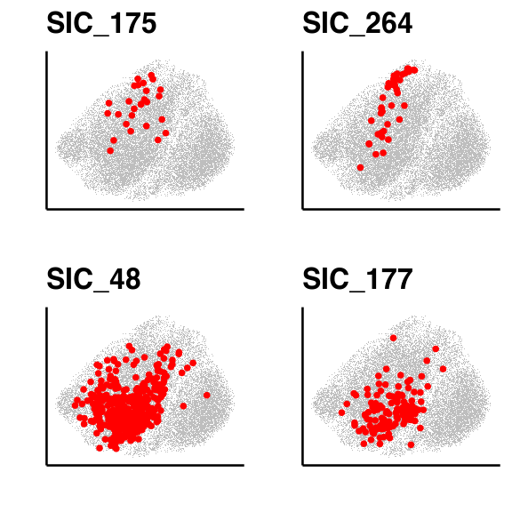

Figure 3
================

## Setup

Load R libraries

``` r
library(reticulate)
use_python("/projects/home/nealpsmith/.conda/envs/updated_pegasus/bin/python")

library(tidyverse)
library(ggpubr)
library(ggplot2)
library(scattermore)
library(grid)
library(alakazam)
library(magrittr)
library(circlize)
library(ComplexHeatmap)
library(RColorBrewer)

setwd('/projects/home/ikernin/github_code/myocarditis/functions')
source('/projects/home/nealpsmith/publication_githubs/myocarditis/functions/tcr_functions.R')
```

Load Python packages

``` python
import pegasus as pg
import warnings
warnings.filterwarnings('ignore')

import sys
sys.path.append("/projects/home/ikernin/github_code/myocarditis/functions")
import python_functions
```

Read in single-cell data

``` python
# blood_cd8_nk = pg.read_input('/projects/home/ikernin/projects/myocarditis/github_datasets/blood_cd8.zarr')
# blood_cd8_nk_adt = pg.read_input('/projects/home/ikernin/projects/myocarditis/github_datasets/blood_cd8_nk_adt.zarr')
# blood_cd8_nk
blood_cd8_nk = pg.read_input("/projects/home/sramesh/myo_final/blood/cd8_v2/myo_blood_cd8_v2_res_2_1_v2_w_cite_complete_with_pb.zarr")
```

``` r
bulk_tcr_df <- read.csv("/projects/home/nealpsmith/projects/myocarditis/data/adaptive/all_productive_tcrs.csv",
                        row.names = 1)
blood_sc_info = read.csv("/projects/home/nealpsmith/projects/myocarditis/blood/updated/data/myo_blood_cd8_obs.csv",
                     row.names = 1)
blood_sc_info$sample_id[blood_sc_info$sample_id == "SIC_258_784"] <- "SIC_258_787"

tissue_sc_info <- read.csv("/projects/home/nealpsmith/projects/myocarditis/tissue/data/tcr/blood_tissue_comps/tissue_cell_info.csv",
                             row.names = 1)
tissue_sc_info <- tissue_sc_info[tissue_sc_info$TRB_cdr3 != "",]
### Okay lets look at the overlap between tumor and myocarditis and tumor control in our subjects ###
bulk_tissue_samples = list("SIC_3" = list("tumor" = "A17-341_A2", "control" = "A17-341_A3", "myo" = "A17-341_A27"),
                           # "SIC_232" = list("tumor" = "A19-395_A8", "control" = "A19-395_A7", "myo" = "A19-395_A53-1"),
                           "SIC_136" = list("tumor" = "A19-41_A10_Tumor", "control" = "A19-41_A10_Liver", "myo" = "A19-41_A33"),
                           "SIC_17" = list("tumor" = "A18-122_A51", "control" = "A18-122_A52", "myo" = "A18-122_A41"),
                           "SIC_175" = list("tumor" = "A19-230_A5", "control" = "T03054-11", "myo" = "A19-230_A48"),
                           "SIC_266" = list("myo" = "A20-363_A18"),
                           "SIC_264" = list("myo" = "A20-331_A1"),
                           # These are controls
                           "SIC_176" = list("myo" = "A19-213_A13"),
                           "SIC_14" = list("myo" = "T01708-11"),
                           # "SIC_182" = list("myo" = "A19-240_A15"),
                           "T01241" = list("myo" = "A16-303_A5")
)
```

## Figure 3B

``` r
fisher_res <- data.frame()
all_seq_info <- data.frame()

# Lets just look at subjects where we have control tissue
case_control_subjs <- c("SIC_3", "SIC_136", "SIC_17", "SIC_175")

for (subj in case_control_subjs){
  # Get the data for the subject
  subj_data <-  bulk_tcr_df %>%
    dplyr::filter(id == subj)

  subj_by_aa <- subj_data %>%
    dplyr::select(sample, tissue, amino_acid, count_templates_reads) %>%
    group_by(sample, tissue, amino_acid) %>%
    summarise("n_count_aa" = sum(count_templates_reads)) %>%
    group_by(sample) %>%
    dplyr::mutate("perc_of_samp" = n_count_aa / sum(n_count_aa)) # Lets get the proportion of each TCR AA seq in sample

  # Now make seperate dataframes
  subj_split <- split(subj_by_aa, f = subj_by_aa$sample)
  samp_info <- bulk_tissue_samples[[subj]]

  tumor_data <- subj_split[[samp_info$tumor]] %>%
    ungroup() %>%
    dplyr::select(amino_acid, perc_of_samp, n_count_aa) %>%
    `colnames<-`(c("amino_acid", "perc_tumor", "n_tumor"))

  control_data <- subj_split[[samp_info$control]] %>%
    ungroup %>%
    dplyr::select(amino_acid, perc_of_samp, n_count_aa) %>%
    `colnames<-`(c("amino_acid", "perc_control", "n_control"))

  myo_data <- subj_split[[samp_info$myo]] %>%
    ungroup %>%
    dplyr::select(amino_acid, perc_of_samp, n_count_aa) %>%
    `colnames<-`(c("amino_acid", "perc_myo", "n_myo"))

  info_df <- list(tumor_data, control_data, myo_data) %>%
    reduce(full_join, by = c("amino_acid"))
  info_df[is.na(info_df)] <- 0

  info_df$subj <- subj
  # Save all the seq info to a dataframe for a ranking plot
  all_seq_info <- rbind(all_seq_info, info_df)

  # Limit to TCRs found in at least tumor or myo, don't care about those exclusive to control
  info_df %<>%
    dplyr::filter(perc_tumor > 0.005 | perc_myo > 0.005) %>%
    dplyr::filter(n_control > 0) # Decided on this filter to be as strict as possible with analysis
  # Now that we have every TCR and its counts in the tumor, control, myo, lets do the stats
  stats_fisher <- lapply(info_df$amino_acid, function(seq){
    seq_info <- info_df %>% dplyr::filter(amino_acid == seq)
    d <- data.frame(group = c("ctrl", "myo", "tumor"),
                    tcr1_n = c(seq_info$n_control, seq_info$n_myo, seq_info$n_tumor),
                    tcr1_p = c(seq_info$perc_control, seq_info$perc_myo, seq_info$perc_tumor)) %>%
      dplyr::mutate(total_n = c(sum(control_data$n_control), sum(myo_data$n_myo), sum(tumor_data$n_tumor)))

    fisher_myo <- fisher.test(matrix(c(d$tcr1_n[d$group == "myo"],
                                       d$total_n[d$group == "myo"] - d$tcr1_n[d$group == "myo"],
                                       d$tcr1_n[d$group == "ctrl"],
                                       d$total_n[d$group == "ctrl"] - d$tcr1_n[d$group == "ctrl"]), nrow = 2))
    fisher_myo <- broom::tidy(fisher_myo) %>%
      `colnames<-`(paste("fisher", colnames(.), sep = "_")) %>%
      dplyr::mutate(term = "groupmyo")
    fisher_tumor <- fisher.test(matrix(c(d$tcr1_n[d$group == "tumor"],
                                       d$total_n[d$group == "tumor"] - d$tcr1_n[d$group == "tumor"],
                                       d$tcr1_n[d$group == "ctrl"],
                                       d$total_n[d$group == "ctrl"] - d$tcr1_n[d$group == "ctrl"]), nrow = 2))
    fisher_tumor <- broom::tidy(fisher_tumor) %>%
      `colnames<-`(paste("fisher", colnames(.), sep = "_")) %>%
      dplyr::mutate(term = "grouptumor")
    fish_res <- rbind(fisher_myo, fisher_tumor) %>%
      mutate(seq = seq)
    return(fish_res)
  }) %>%
    do.call(rbind, .) %>%
    mutate(subj = subj)

  fisher_by_seq <- data.frame()
  for(s in unique(stats_fisher$seq)){
  seq_info <- stats_fisher %>% dplyr::filter(seq == s)
  df <- data.frame(amino_acid = s,
                   subj = unique(seq_info$subj),
                   myo_log_fc = seq_info$fisher_estimate[seq_info$term == "groupmyo"],
                   tumor_log_fc = seq_info$fisher_estimate[seq_info$term == "grouptumor"],
                   myo_pval = seq_info$fisher_p.value[seq_info$term == "groupmyo"],
                   tumor_pval = seq_info$fisher_p.value[seq_info$term == "grouptumor"],
                   myo_estimate = seq_info$fisher_estimate[seq_info$term == "groupmyo"],
                   tumor_estimate = seq_info$fisher_estimate[seq_info$term == "grouptumor"])
  fisher_by_seq <- rbind(fisher_by_seq, df)
  }
  fisher_by_seq %<>%
    dplyr::left_join(info_df, by = c("amino_acid", "subj"))
  fisher_by_seq$tum_ctl_fc <- sapply(fisher_by_seq$amino_acid, function(s){

    # If it doesn't exist in either, fold-change is set to 1
    if (!s %in% tumor_data$amino_acid & !s %in% control_data$amino_acid){
      return(1)
    }

    # Adding pseudocunts to deal with zeros
    if (s %in% tumor_data$amino_acid){
      perc_tum <- (tumor_data$n_tumor[tumor_data$amino_acid == s] + 1) / (sum(tumor_data$n_tumor) + 1)
    } else {
      perc_tum <- 1 /  (sum(tumor_data$n_tumor) + 1)
    }

    if (s %in% control_data$amino_acid){
      perc_ctl <- (control_data$n_control[control_data$amino_acid == s] + 1) / (sum(control_data$n_control) + 1)
    } else {
      perc_ctl <- 1 / (sum(control_data$n_control) + 1)
    }
    return(perc_tum / perc_ctl)

  })
  fisher_by_seq$myo_ctl_fc <- sapply(fisher_by_seq$amino_acid, function(s){

    if (!s %in% myo_data$amino_acid & !s %in% control_data$amino_acid){
      return(1)
    }
    # Adding pseudocunts to deal with zeros
    if (s %in% myo_data$amino_acid){
      perc_myo <- (myo_data$n_myo[myo_data$amino_acid == s] + 1) / (sum(myo_data$n_myo) + 1)
    } else {
      perc_myo <- 1 /  (sum(myo_data$n_myo) + 1)
    }

    if (s %in% control_data$amino_acid){
      perc_ctl <- (control_data$n_control[control_data$amino_acid == s] + 1) / (sum(control_data$n_control) + 1)
    } else {
      perc_ctl <- 1 / (sum(control_data$n_control) + 1)
    }
    return(perc_myo / perc_ctl)

  })

  # fisher_by_seq$tum_ctl_fc <- fisher_by_seq$perc_tumor / fisher_by_seq$perc_control
  # fisher_by_seq$myo_ctl_fc <- fisher_by_seq$perc_myo / fisher_by_seq$perc_control
  # fisher_by_seq$myo_tum_fc <- fisher_by_seq$perc_myo / fisher_by_seq$perc_tumor

  fisher_res <- rbind(fisher_res, fisher_by_seq)

}

fisher_res$myo_padj <-p.adjust(fisher_res$myo_pval, method = "fdr")
fisher_res$tumor_padj <-p.adjust(fisher_res$tumor_pval, method = "fdr")


fisher_res$tum_ctl_fc[fisher_res$tum_ctl_fc > 50] <- 50
fisher_res$myo_ctl_fc[fisher_res$myo_ctl_fc > 50] <- 50

fisher_res$myo_enriched <- ifelse(fisher_res$myo_padj < 0.05 & fisher_res$myo_log_fc > 1, TRUE, FALSE)
fisher_res$tum_enriched <- ifelse(fisher_res$tumor_padj < 0.05 & fisher_res$tumor_log_fc > 1, TRUE, FALSE)
fisher_res$sig_cat <- ifelse(fisher_res$myo_enriched == TRUE,
                               ifelse(fisher_res$tum_enriched == TRUE, "enriched in both", "myo enriched"),
                               ifelse(fisher_res$tum_enriched == TRUE, "tumor enriched", "not enriched"))

fisher_res$sig_cat <- factor(fisher_res$sig_cat, levels = c("myo enriched", "tumor enriched", "enriched in both", "not enriched"))
ggplot(fisher_res, aes(x = myo_ctl_fc, y = tum_ctl_fc, fill = sig_cat)) +
  geom_point(pch = 21, size = 4) +
  scale_fill_manual(values = c("#7CAE00", "#C77CFF", "#F8766D", "grey")) +
  xlab("% Myocarditis : % control") +
  ylab("% Tumor : % control") +
  theme_classic(base_size = 20) +
  theme(legend.title = element_blank())
```

<!-- -->

## Figure 3C

``` r
fisher_res$subj <- factor(fisher_res$subj, levels = c("SIC_3", "SIC_17", "SIC_136", "SIC_175"))
fisher_res <- fisher_res[order(fisher_res$subj, decreasing = TRUE),]
ggplot(fisher_res, aes(x = myo_ctl_fc, y = tum_ctl_fc, fill = subj)) +
  geom_point(pch = 21, size = 4) +
  scale_fill_manual(values = c('#CC79A7', "#F0E442","#56B4E9", '#E69F00')) +
  # scale_fill_brewer(palette = "Set2") +
  # geom_abline(slope = 1, size = 2, linetype = "dashed", color = "red") +
  xlab("% Myocarditis : % control") +
  ylab("% Tumor : % control") +
  theme_classic(base_size = 20) +
  theme(legend.title = element_blank())
```

<!-- -->

## Figure 3D

``` r
subjs_oi <- c("SIC_175", "SIC_264", "SIC_48", "SIC_177")
myo_exp_tcrs <- lapply(subjs_oi, function(s){
  subj_tcrs <- c()
  # See if they have bulk TCR
  if(s %in% names(bulk_tissue_samples)){
    bulk_samp <- bulk_tissue_samples[[s]]$myo
    bulk_tcrs <- bulk_tcr_df[bulk_tcr_df$sample == bulk_samp,] %>%
      dplyr::select(amino_acid, count_templates_reads) %>%
      group_by(amino_acid) %>%
      summarise(n = sum(count_templates_reads)) %>%
      mutate(perc = n / sum(n) * 100)
    bulk_exp <- bulk_tcrs$amino_acid[bulk_tcrs$perc > 0.5 & bulk_tcrs$n > 1]
    subj_tcrs <- c(subj_tcrs, bulk_exp)
  }
  # See if they have single cell TCR
  if (s %in% unique(tissue_sc_info$donor)){
    subj_sc <- tissue_sc_info[tissue_sc_info$donor == s,] %>%
      dplyr::filter(TRB_cdr3 != "") %>%
      dplyr::select(TRB_cdr3) %>%
      mutate("count" =  1) %>%
      group_by(TRB_cdr3) %>%
      summarise(n = sum(count)) %>%
      mutate(perc = n / sum(n) * 100)
    sc_exp <- subj_sc$TRB_cdr3[subj_sc$perc > 0.5 & subj_sc$n > 1]
    subj_tcrs <- c(subj_tcrs, sc_exp)
  }
  return(unique(subj_tcrs))
})
names(myo_exp_tcrs) <- subjs_oi
plot_list <- list()
for (s in subjs_oi){
  myo_clones <- myo_exp_tcrs[[s]]

  plot_df <- blood_sc_info
  plot_df$myo_clone <- ifelse(plot_df$donor == s & plot_df$TRB_cdr3 %in% myo_clones, TRUE, FALSE)

  plot <- ggplot(plot_df, aes(x = umap_1, y = umap_2)) +
    geom_scattermore(data = plot_df[plot_df$myo_clone == FALSE,], color = "grey", size = 1) +
    geom_point(data = plot_df[plot_df$myo_clone == TRUE,], color = "red", size = 2) +
    xlab("") + ylab("") +
    theme_classic(base_size = 20) +
    ggtitle(s) +
    theme(axis.ticks = element_blank(), axis.text = element_blank())
  plot_list <- c(plot_list, list(plot))

}
figure <- ggarrange(plotlist = plot_list, ncol = 2, nrow = 2, common.legend = TRUE, legend = "right")
figure
```

<!-- -->

## Figure 3e

``` r
# Blood TCR info
bulk_tcr_df <- read.csv("/projects/home/nealpsmith/projects/myocarditis/data/adaptive/all_productive_tcrs.csv",
                        row.names = 1)
# CD8
blood_sc_info_cd8 = read.csv("/projects/home/nealpsmith/projects/myocarditis/blood/updated/data/myo_blood_cd8_obs.csv",
                     row.names = 1)
blood_sc_info_cd8$sample_id[blood_sc_info_cd8$sample_id == "SIC_258_784"] <- "SIC_258_787"
blood_sc_info_cd8$t_cell_cluster <- paste("cd8_", blood_sc_info_cd8$leiden_labels, sep = "")

# CD4
blood_sc_info_cd4 = read.csv("/projects/home/nealpsmith/projects/myocarditis/blood/updated/data/myo_blood_cd4_obs.csv",
                     row.names = 1)
blood_sc_info_cd4$sample_id[blood_sc_info_cd4$sample_id == "SIC_258_784"] <- "SIC_258_787"
blood_sc_info_cd4$t_cell_cluster <- paste("cd4_", blood_sc_info_cd4$leiden_labels, sep = "")

# Make a combined dataframe
all_blood_sc_info <- rbind(blood_sc_info_cd8, blood_sc_info_cd4)
# Add timepoint info
timepoint_info <- read.csv("/projects/home/nealpsmith/projects/myocarditis/blood/updated/data/myo_blood_timepoints.csv")

blood_sc_info_cd8 %<>%
  rownames_to_column("index") %>%
  dplyr::left_join(timepoint_info, by = "sample_id") %>%
  column_to_rownames("index")
all_blood_sc_info %<>%
  dplyr::left_join(timepoint_info, by = "sample_id")

tissue_sc_info <- read.csv("/projects/home/nealpsmith/projects/myocarditis/tissue/data/tcr/blood_tissue_comps/tissue_cell_info.csv",
                             row.names = 1)
tissue_sc_info <- tissue_sc_info[tissue_sc_info$TRB_cdr3 != "",]

blood_overlap_subjs <- intersect(c(names(bulk_tissue_samples), unique(tissue_sc_info$donor)), unique(blood_sc_info_cd8$donor))

# Don't include bulk healing
healing_ids <- c("SIC_3", "SIC_175", "SIC_266", "SIC_232")

myo_exp_tcrs <- lapply(blood_overlap_subjs, function(s){
  subj_tcrs <- c()
  # See if they have bulk TCR
  if(s %in% names(bulk_tissue_samples)){
    if (!s %in% healing_ids){
      bulk_samp <- bulk_tissue_samples[[s]]$myo
      bulk_tcrs <- bulk_tcr_df[bulk_tcr_df$sample == bulk_samp,] %>%
        dplyr::select(amino_acid, count_templates_reads) %>%
        group_by(amino_acid) %>%
        summarise(n = sum(count_templates_reads)) %>%
        mutate(perc = n / sum(n) * 100)
    bulk_exp <- bulk_tcrs$amino_acid[bulk_tcrs$perc > 0.5 & bulk_tcrs$n > 1]
    subj_tcrs <- c(subj_tcrs, bulk_exp)
    }

  }
  # See if they have single cell TCR
  if (s %in% unique(tissue_sc_info$donor)){
    subj_sc <- tissue_sc_info[tissue_sc_info$donor == s,] %>%
      dplyr::filter(TRB_cdr3 != "") %>%
      dplyr::select(TRB_cdr3) %>%
      mutate("count" =  1) %>%
      group_by(TRB_cdr3) %>%
      summarise(n = sum(count)) %>%
      mutate(perc = n / sum(n) * 100)
    sc_exp <- subj_sc$TRB_cdr3[subj_sc$perc > 0.5 & subj_sc$n > 1]
    subj_tcrs <- c(subj_tcrs, sc_exp)
  }
  return(unique(subj_tcrs))
})
names(myo_exp_tcrs) <- blood_overlap_subjs

info_df <- all_blood_sc_info[all_blood_sc_info$donor %in% blood_overlap_subjs,]
info_df$myo_clone <- "False"
for (s in blood_overlap_subjs){
  myo_clones <- myo_exp_tcrs[[s]]
  info_df$myo_clone[info_df$donor == s & info_df$TRB_cdr3 %in% myo_clones] <- "True"
}
# info_df <- info_df[info_df$TRB_cdr3 != "",]
info_df %<>% dplyr::filter(TRB_cdr3 != "", timepoint_cat != "pre_ici")

prop_df <- info_df %>%
  dplyr::select(donor, myo_clone, t_cell_cluster) %>%
  dplyr::filter(myo_clone == "True") %>%
  dplyr::select(-myo_clone) %>%
  group_by(donor, t_cell_cluster) %>%
  summarise(n_cells = n()) %>%
  ungroup() %>%
  complete(donor, t_cell_cluster) %>%
  replace(is.na(.), 0) %>%
  group_by(donor) %>%
  mutate(total_cells = sum(n_cells)) %>%
  mutate(perc_exp_myo = n_cells / total_cells * 100) %>%
  mutate(perc_plus_1 = perc_exp_myo + 1)
```

    ## `summarise()` has grouped output by 'donor'. You can override using the
    ## `.groups` argument.

``` r
new_names <- c("cd8_1" = "1. b-NK: SPON2, FGFBP2",
               "cd8_2" = "2. b-CD8: ZNF683, GZMB",
               "cd8_3" = "3. b-CD8: CCL5, GNLY",
               "cd8_4" = "4. b-CD8: GZMK, DUSP2",
               "cd8_5" = "5. b-CD8: CCR7, CD45RA-prot",
               "cd8_6" = "6. b-CD8: CX3CR1, TBX21",
               "cd8_7" = "7. b-CD8: GZMK, TCF7",
               "cd8_8" = "8. b-MAIT: TRAV1-2, KLRB1",
               "cd8_9" = "9. b-CD8T/NK: MT-high",
               "cd8_10" = "10. b-CD8: cycling",
               "cd8_11" = "11. b-NK: XCL1, SPTSSB",
               "cd8_12" = "13. Doublets",
               "cd8_13" = "12. b-NK: cycling",
               "cd4_1" = "1. b-CD4: TNFRSF4, CD40LG",
               "cd4_2" = "2. b-CD4: CCR7, CD45RA-prot",
               "cd4_3" = "3. b-CD4: GZMA, HLA-DRB1",
               "cd4_4" = "4. b-CD4: Treg",
               "cd4_5" = "5. b-CD4: GZMK, HLA-DRB1-low",
               "cd4_6" = "6. b-CD4: MT-high",
               "cd4_7" = "7. b-CD4: cycling",
               "cd4_8" = "8. Doublets")
prop_df$t_cell_cluster <- sapply(prop_df$t_cell_cluster, function(x) new_names[[x]])
prop_df <- prop_df %>%
  dplyr::filter(t_cell_cluster != "13. Doublets")

fatal_cases <- c("SIC_3", "SIC_17", "SIC_175", "SIC_232", "SIC_264")

prop_df$fatal <- ifelse(prop_df$donor %in% fatal_cases, "fatal", "non-fatal")
# prop_df$t_cell_cluster <- factor(prop_df$t_cell_cluster)

pval_df <- data.frame()

for (cl in unique(prop_df$t_cell_cluster)){
  dat <-  prop_df %>%
    dplyr::filter(t_cell_cluster == cl)
  dat$log_perc <- log1p(dat$perc_exp_myo)

  summary(lm(log_perc ~ fatal, data = dat))
  stat <- t.test(log1p(dat$perc_exp_myo[dat$fatal == "fatal"]), log1p(dat$perc_exp_myo[dat$fatal == "non-fatal"]))

  pval_df <- rbind(pval_df, data.frame(t_cell_cluster = cl,
                                       t_stat = stat$statistic,
                                       p_value = stat$p.value))
}
pval_df$adj_p <- p.adjust(pval_df$p_value, method = "fdr")

order <- pval_df %>%
  arrange(p_value) %>%
  .$t_cell_cluster
prop_df$t_cell_cluster <- factor(prop_df$t_cell_cluster, levels = rev(order))
ggplot(prop_df, aes(y = t_cell_cluster, x = perc_exp_myo, fill = fatal)) +
  geom_boxplot(alpha = 0.7,outlier.shape = NA, position=position_dodge(1)) +
  geom_point(pch = 21, position = position_jitterdodge(0.1)) +
  scale_fill_manual(values = c("#e7a023","#999a99")) +
  xlab("% of expanded myo clones") +
  theme_classic(base_size = 20)
```

<!-- -->

## Figure 3f

``` python
# for adt data
fig_4g_adt_genes = ['cite_CD45RA', 'cite_CD45RO']
python_functions.multi_hex_featureplot(blood_cd8_nk,
                      fig_4g_adt_genes,
                      ncol=2,
                      cmap='YlGn',
                      gridsize=200)

## for gex data
fig_4g_gex_genes = ['CXCR3', 'MKI67']
python_functions.multi_hex_featureplot(blood_cd8_nk,
                      fig_4g_gex_genes,
                      ncol=2,
                      cmap=python_functions.blues_cmap,
                      gridsize=200)
```

    ##   0%|                                                                                                                                                                                                                                 | 0/2 [00:00<?, ?it/s] 50%|############################################################################################################5                                                                                                            | 1/2 [00:01<00:01,  1.00s/it]100%|#########################################################################################################################################################################################################################| 2/2 [00:02<00:00,  1.03s/it]


    ##   0%|                                                                                                                                                                                                                                 | 0/2 [00:00<?, ?it/s] 50%|############################################################################################################5                                                                                                            | 1/2 [00:00<00:00,  1.02it/s]100%|#########################################################################################################################################################################################################################| 2/2 [00:02<00:00,  1.00s/it]


## Figure 3h

``` r
colors <- brewer.pal(n = 10, "Set1")
```

    ## Warning in brewer.pal(n = 10, "Set1"): n too large, allowed maximum for palette Set1 is 9
    ## Returning the palette you asked for with that many colors

``` r
cd137_data <- read.csv("/projects/home/nealpsmith/projects/myocarditis/antigen_discovery/data/cd137_vals.csv", row.names = 1)
# Make the lowest value 0
# cd137_data[is.na(cd137_data)] <- 0
cd137_data[cd137_data < 0] <- 0
tcr_info <- read.csv("/projects/home/nealpsmith/projects/myocarditis/antigen_discovery/data/tcr_annotations.csv")

donor_colors <- colors[1:length(unique(tcr_info$donor))]
names(donor_colors) <- unique(tcr_info$donor)

cd8_tcrs <- tcr_info[tcr_info$subset == "CD8",]
heatmap_df_cd8 <- cd137_data[,cd8_tcrs$tcr]

scatter_df <- cd137_data %>%
  rownames_to_column("peptide") %>%
  reshape2::melt(id.vars = "peptide") %>%
  `colnames<-`(c("peptide", "tcr", "perc_cd137")) %>%
  left_join(tcr_info, by = "tcr")
scatter_df$peptide <- factor(scatter_df$peptide, levels = rev(rownames(heatmap_df_cd8)))

scatter_df$pep_group <- ifelse(grepl("MYH", scatter_df$peptide), "Myosin",
                               ifelse(grepl("TNNT", scatter_df$peptide), "TnT",
                                       ifelse(grepl("TNNI", scatter_df$peptide), "TnI", "Control")))
scatter_df$tcr[scatter_df$tcr == "myo_TCR"] <- "control TCR (Axlerod et al)"

ggplot(scatter_df, aes(y = peptide, x = perc_cd137)) +
  geom_jitter(data = scatter_df %>% dplyr::filter(!tcr %in% c("control TCR (Axlerod et al)", "UT")),
              fill = "grey", pch = 21, width = 0, height = 0.25, alpha = 0.2) +
  geom_point(data = scatter_df %>% dplyr::filter(tcr == "control TCR (Axlerod et al)"), pch = 21, fill = "red", size = 2) +
  geom_point(data = scatter_df %>% dplyr::filter(tcr == "UT"), pch = 21, fill = "blue", size = 2) +
  # geom_text_repel(data = scatter_df %>% dplyr::filter(perc_cd137 > 20), aes(label = tcr)) +
  facet_grid(rows = "pep_group", space = "free_y", scales = "free_y") +
  xlab("% CD137") +
  ylab("peptide pool") +
  theme_classic(base_size = 20)
```

    ## Warning: Removed 1 rows containing missing values (`geom_point()`).

<!-- -->
