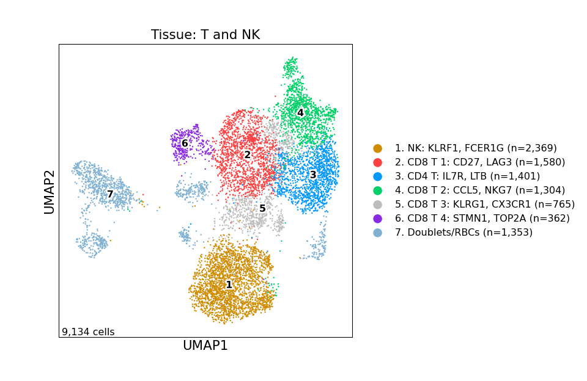
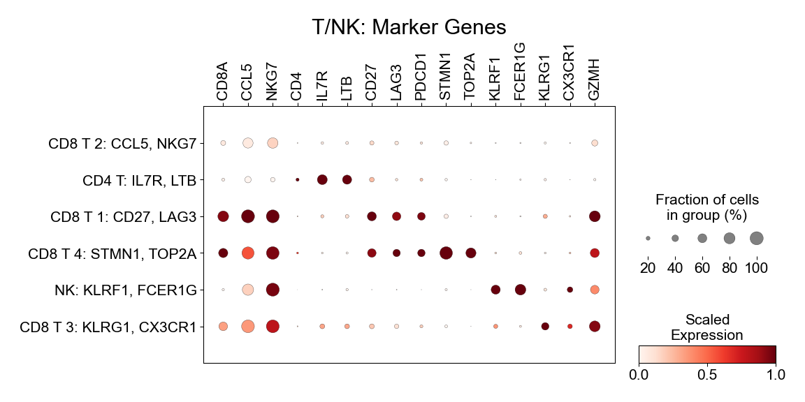

Figure 3
================

## Set up

Load R libraries

``` r
# load packages
library(tidyverse)
library(rmarkdown)
library(rlang)
library(parameters)
library(RColorBrewer)
library(ComplexHeatmap)
library(circlize)
library(Matrix)
library(glue)
library(ggforestplot)
library(ggbeeswarm)
library(ggrepel)
library(patchwork)
library(lme4)
library(ggstance)
library(DESeq2)
library(knitr)
library(fgsea)
library(ggpubr)

library(reticulate)
use_python("/projects/home/nealpsmith/.conda/envs/updated_pegasus/bin/python")

setwd('/projects/home/nealpsmith/publication_githubs/myocarditis/functions')
source('masc.R')
source('plot_masc.R')
source('tissue_troponin_abundance.R')
source('de.R')
```

Load Python packages

``` python
import pegasus as pg
import warnings
warnings.filterwarnings('ignore')

import sys
sys.path.append("/projects/home/ikernin/github_code/myocarditis/functions")
import python_functions
```

Read in single-cell data

``` python
tissue_t = pg.read_input('/projects/home/ikernin/projects/myocarditis/github_datasets/tissue_t.zarr')
```

    ## 2024-01-17 20:57:17,505 - pegasusio.readwrite - INFO - zarr file '/projects/home/ikernin/projects/myocarditis/github_datasets/tissue_t.zarr' is loaded.
    ## 2024-01-17 20:57:17,506 - pegasusio.readwrite - INFO - Function 'read_input' finished in 0.25s.

## Figure 3A

``` python
python_functions.plot_umap(tissue_t, 'Tissue: T and NK', python_functions.tissue_t_pal, marker_multiplier=6)
```



## Figure 3B

``` python
python_functions.make_gene_dotplot(tissue_t.to_anndata(),
             cluster_order=['4. h-CD8T: CCL5 NKG7',
                            '3. h-CD4T: IL7R LTB',
                            '2. h-CD8T: CD27 LAG3',
                            '6. h-CD8T: cycling',
                            '1. h-NK: KLRF1 FCER1G',
                            '5. h-CD8T: KLRG1 CX3CR1'],
             gene_order=['CD8A', 'CCL5', 'NKG7',  # 4. h-CD8T markers
                         'CD4', 'IL7R', 'LTB',  # 3. h-CD4T markers
                         'CD27', 'LAG3', 'PDCD1',  # 2. h-CD8T markers
                         'STMN1', 'TOP2A',  # 6. h-CD8T markers
                         'KLRF1', 'FCER1G',  # 1. h-NK markers
                         'KLRG1', 'CX3CR1', 'GZMH'  # 5. h-CD8T markers
                         ],
             title='T/NK')
```



## Figure 3C

``` r
tissue_global_obs = read_csv('/projects/home/ikernin/projects/myocarditis/github_datasets/tissue_global_obs.csv')
masc_filtered_df  <- masc_filter(tissue_global_obs)

## run MASC for subclusters
cluster_masc_res <- MASC(masc_filtered_df,
                 cluster = masc_filtered_df$global_subcluster_number,
                 contrast = "condition",
                 random_effects = "donor",
                 fixed_effects = "",
                 verbose = TRUE, save_models = FALSE)

## add cluster names to results
cluster_masc_formatted <- cluster_masc_res %>%
  as_tibble() %>%
  mutate(cluster_number = unlist(map( str_split(cluster, 'cluster'), 2)),
         cluster_number = as.numeric(cluster_number)) %>%
  left_join(masc_filtered_df %>%
              select(umap_name, umap_number, global_subcluster_name, global_subcluster_number) %>%
              distinct(),
            by = c('cluster_number' = 'global_subcluster_number')) %>%
  mutate(cluster_names = unlist(map(str_split(global_subcluster_name, '\\. '), 2))) %>%
  relocate(umap_name, cluster_names, cluster_number) %>%
  select(!c(cluster, global_subcluster_name))

## FDR adjust p-values
cluster_masc_formatted['p.adj'] <- p.adjust(cluster_masc_formatted$model.pvalue, method = 'fdr')

## save results
# write_csv(cluster_masc_formatted, 'cluster_masc_res.csv')

## plot results for T and NK lineage
plot_masc_by_cell_type(cluster_masc_formatted, masc_filtered_df, lineage='T and NK', comp_var = "condition")
```

<!-- -->

## Figure 3D

``` r
tissue_troponin_metadata <- read_csv('/projects/home/ikernin/projects/myocarditis/github_datasets/tissue_troponin_metadata.csv')
```

    ## Rows: 13 Columns: 3
    ## ── Column specification ─────────────────────────────────────────────────────────────────────────────────────────────────────────────────────────────────────────────────────────────────────────────────────────────────────────────────────
    ## Delimiter: ","
    ## chr (1): donor
    ## dbl (2): nearest_troponin, days_from_collection
    ## 
    ## ℹ Use `spec()` to retrieve the full column specification for this data.
    ## ℹ Specify the column types or set `show_col_types = FALSE` to quiet this message.

``` r
troponin_filtered_df <- troponin_filter_tissue(tissue_global_obs, tissue_troponin_metadata)
```

    ## Joining, by = "donor"

``` r
# fit linear model by troponin for DE clusters
select_clusters <- c("h-NK: KLRF1 FCER1G",
                     "h-CD4T: IL7R LTB",
                    "h-CD8T: CD27 LAG3",
                    "h-CD8T: CCL5 NKG7",
                    "h-CD8T: cycling",
                    "h-MNP: S100A8-low C1QA-low",
                    "h-MNP: FCGR3A LILRB2",
                    "h-cDC: CLEC9A CD1C",
                    "Fibroblasts: DCN LUM")
troponin_cluster_percs <- troponin_get_percents_per_level(troponin_filtered_df, level='cluster')
```

    ## `summarise()` has grouped output by 'donor'. You can override using the `.groups` argument.
    ## Joining, by = "donor"
    ## Joining, by = "donor"

``` r
select_cluster_percs <- troponin_cluster_percs %>%
        filter(cluster_names %in% select_clusters)
select_cluster_model <- troponin_fit_model(select_cluster_percs, level='cluster')
kable(select_cluster_model %>%
              select(!c(data, model)) %>%
              unnest(cols = c(trop_coef, trop_se, trop_pval)))
```

| cluster\_names             |  trop\_coef |  trop\_se | trop\_pval |      padj |
| :------------------------- | ----------: | --------: | ---------: | --------: |
| Fibroblasts: DCN LUM       |   0.0161216 | 0.0162256 |  0.3438558 | 0.6189405 |
| h-CD4T: IL7R LTB           |   0.0001064 | 0.0061510 |  0.9865381 | 0.9865381 |
| h-CD8T: CCL5 NKG7          |   0.0039344 | 0.0104176 |  0.7135667 | 0.9050230 |
| h-CD8T: CD27 LAG3          |   0.0049633 | 0.0063341 |  0.4514475 | 0.6771712 |
| h-CD8T: cycling            |   0.0058375 | 0.0020689 |  0.0181105 | 0.0814970 |
| h-cDC: CLEC9A CD1C         |   0.0019211 | 0.0006323 |  0.0125033 | 0.0814970 |
| h-MNP: FCGR3A LILRB2       |   0.0021302 | 0.0083788 |  0.8044649 | 0.9050230 |
| h-MNP: S100A8-low C1QA-low |   0.0112636 | 0.0082623 |  0.2027089 | 0.4560950 |
| h-NK: KLRF1 FCER1G         | \-0.0054666 | 0.0030911 |  0.1074143 | 0.3222428 |

``` r
troponin_plot_model(select_cluster_model %>% filter(cluster_names =="h-CD8T: cycling"),
                    select_cluster_percs %>% filter(cluster_names =="h-CD8T: cycling"),
                   "h-CD8T: cycling", level='cluster', point_size = 2.2, type='simple')
```

    ## `geom_smooth()` using formula = 'y ~ x'

    ## Warning: Removed 21 rows containing missing values (`geom_smooth()`).

<!-- -->

## Figure 3E

``` python
# get pseudobulk counts and metadata by donor for t and nk  clusters
# python_functions.get_pseudobulk_info(tissue_t, 'tissue_t')

# get pseudobulk counts and metadata by donor for t cells only
tissue_t.obs['t_cell'] = tissue_t.obs['umap_name'].isin(['2. h-CD8T: CD27 LAG3',
                                                         '3. h-CD4T: IL7R LTB',
                                                         '4. h-CD8T: CCL5 NKG7',
                                                         '5. h-CD8T: KLRG1 CX3CR1',
                                                         '6. h-CD8T: cycling'])
tissue_t.obs['t_cell'] = tissue_t.obs['t_cell'].replace({True: 'all_t', False: 'other'})
# python_functions.get_pseudobulk_info(tissue_t, 'tissue_t_grouped', cluster_col='t_cell')
```

``` r
# run DE analysis by condition
t_counts <- read_counts('/projects/home/ikernin/projects/myocarditis/github_datasets/tissue_t_pseudocounts.csv')
t_meta <- read_meta('/projects/home/ikernin/projects/myocarditis/github_datasets/tissue_t_metainfo.csv')

t_deres <- run_de_by_comp_var(counts = t_counts,
                               meta = t_meta,
                               save_name = 'tissue_t',
                               comp_var_contrast_vec = c('condition', "myocarditis", "control"))

t_counts <- read_counts('/projects/home/ikernin/projects/myocarditis/github_datasets/tissue_t_grouped_pseudocounts.csv')
t_meta <- read_meta('/projects/home/ikernin/projects/myocarditis/github_datasets/tissue_t_grouped_metainfo.csv')

t_grouped_deres <- run_de_by_comp_var(counts = t_counts,
                                      meta = t_meta,
                                      save_name = 'tissue_t_grouped',
                                      comp_var_contrast_vec = c('condition', "myocarditis", "control"))
```

    ## [1] "Cluster 1"
    ## [1] "Cluster 2"
    ## [1] "Cluster 3"
    ## [1] "Cluster 4"
    ## [1] "Cluster 5"
    ## [1] "Cluster 6"
    ## [1] "Cluster 7"
    ## [1] "saving results..."
    ## [1] "Cluster all_t"
    ## [1] "Cluster other"
    ## [1] "saving results..."

``` r
# combine de results and meta data for heatmap
t_full_deres <- bind_rows(t_deres %>%
                               mutate(cluster = as.character(cluster)),
                             t_grouped_deres)
t_clusters <- read_csv('/projects/home/ikernin/projects/myocarditis/github_datasets/t_cluster_map.csv') # cluster number to name map
t_genes <- read_csv('/projects/home/ikernin/projects/myocarditis/github_datasets/t_heatmap_genes.csv') # genes to include in heatmap
t_heatmap_df <- get_heatmap_data(t_full_deres, t_genes, t_clusters)

heatmap_df <- t_heatmap_df %>%
  mutate(cluster = cluster_name,
    cluster = case_when(
    cluster == 'all_t' ~ 'All T',
    TRUE ~ cluster
  )) %>%
  select(!cluster_name)


# Format main body --------------------------------------------------------

# set category order
category_levels <- sort(unique(heatmap_df$category))
category_levels <- c(category_levels[category_levels != 'Other'], 'Other')

# reformat from long to wide
heatmap_df <- heatmap_df %>%
  distinct() %>%
  pivot_wider(names_from = cluster, values_from = c(log2FoldChange, padj)) %>%
  filter(!is.na(category)) %>%
  mutate(category = factor(category, levels = category_levels)) %>%
  arrange(category)

# get information for the main body's cells
heatmap_mtx <- heatmap_df %>%
  select(starts_with("log2FoldChange")) %>%
  replace(is.na(.), 0) %>%
  rename_with(~str_remove(., "log2FoldChange_")) %>%
  select(order(colnames(.))) %>%
  as.matrix()
rownames(heatmap_mtx) <- heatmap_df$gene_symbol

# define cell color range
heatmap_col_fun <- colorRamp2(c(floor(min(heatmap_mtx)), 0, ceiling(max(heatmap_mtx))),
                              c("blue", "white", "red"))

# split into subclusters and lineage
heatmap_mtx_subcluster <- heatmap_mtx[, !str_detect(colnames(heatmap_mtx), 'All')]
colnames(heatmap_mtx_subcluster) <- str_remove(colnames(heatmap_mtx_subcluster), regex(":.*"))
heatmap_mtx_lineage <- heatmap_mtx[, str_detect(colnames(heatmap_mtx), 'All'), drop=FALSE]


# Main body annotation (FDR) ----------------------------------------------

# get fdr values
fdr_mtx <- heatmap_df %>%
  select(starts_with('padj')) %>%
  replace(is.na(.), Inf) %>%
  rename_with(~str_remove(., "padj_")) %>%
  select(order(colnames(.))) %>%
  as.matrix()

# make sure columns the same
stopifnot(colnames(fdr_mtx) == colnames(heatmap_mtx))

# split into subcluster and lineage
fdr_mtx_subcluster <- fdr_mtx[, !str_detect(colnames(fdr_mtx), 'All')]
fdr_mtx_lineage <- fdr_mtx[, str_detect(colnames(fdr_mtx), 'All'), drop=FALSE]

# make function for plotting fdr value
fdr_func_subcluster <- function(j, i, x, y, width, height, fill){
  if (fdr_mtx_subcluster[i,j] < 0.1){
    grid.circle(x = x, y = y, r = unit(1.5, 'mm'),
                gp = gpar(fill = 'black', col = NA))
  }
}
fdr_func_lineage <- function(j, i, x, y, width, height, fill){
  if (fdr_mtx_lineage[i,j] < 0.1){
    grid.circle(x = x, y = y, r = unit(1.5, "mm"),
                gp = gpar(fill = 'black', col = NA))
  }
}

# create legend for fdr
lgd_fdr = Legend(pch = 16, type = "points", labels = "FDR < 0.1")


# Column annotation (cluster names) ---------------------------------------

# define colors
clust_col_fun <- c('#cf8c00', '#ff4040', '#0097ff', '#00d067', '#bdbdbd', '#8a2be2')
names(clust_col_fun) <- seq(1,6)

lineage_col_fun <- c('white')
names(lineage_col_fun) <- 'All'


clust_ha <- HeatmapAnnotation(clust_colors = names(clust_col_fun),
                              col = list(clust_colors = clust_col_fun),
                              show_legend = FALSE,
                              show_annotation_name = FALSE,
                              simple_anno_size = unit(3, "mm"))
lineage_ha <- HeatmapAnnotation(lineage = names(lineage_col_fun),
                                col = list(lineage = lineage_col_fun),
                                show_legend = FALSE,
                                show_annotation_name = FALSE,
                                simple_anno_size = unit(3, "mm"),
                                border = T)


# Row annotation (gene names) ---------------------------------------------

# split rows by gene category
stopifnot(rownames(heatmap_mtx_subcluster) == rownames(heatmap_mtx_lineage))
row_split <- str_replace_all(heatmap_df$category, "_", " ")
row_split <- factor(row_split, levels = unique(row_split))


# Plot --------------------------------------------------------------------

ht_subcluster <- Heatmap(heatmap_mtx_subcluster,
                         col = heatmap_col_fun,
                         row_split = row_split,
                         cell_fun = fdr_func_subcluster,
                         top_annotation = clust_ha,
                         name = 'Log2FC',
                         cluster_columns = FALSE,  column_names_side = "top",
                         show_column_names = T, column_names_rot = 45,
                         cluster_rows = FALSE, row_names_side = "left",
                         row_title_rot = 0, row_title_gp=gpar(fontface='bold'),
                         row_gap = unit(2, "mm"), border = TRUE,
                         width = ncol(heatmap_mtx_subcluster)*unit(6, "mm"),
                         height = nrow(heatmap_mtx_subcluster)*unit(6, "mm"))

ht_lineage <- Heatmap(heatmap_mtx_lineage,
                      col = heatmap_col_fun,
                      row_split = row_split,
                      cell_fun = fdr_func_lineage,
                      top_annotation = lineage_ha,
                      name = 'Lineage', show_heatmap_legend = FALSE,
                      column_names_gp = gpar(fontface='bold'),
                      cluster_columns = FALSE,  column_names_side = "top",
                      show_column_names = T, column_names_rot = 45,
                      cluster_rows = FALSE, row_names_side = "left",
                      row_title_rot = 0, row_title_gp=gpar(fontface='bold'),
                      row_gap = unit(2, "mm"), border = TRUE,
                      width = ncol(heatmap_mtx_lineage)*unit(6, "mm"),
                      height = nrow(heatmap_mtx_lineage)*unit(6, "mm"))

draw(ht_lineage + ht_subcluster,
     annotation_legend_list = list(lgd_fdr),
     merge_legends = TRUE)
```

<!-- -->

## Figure 3F

``` r
mtx <- read.csv("/projects/home/ikernin/projects/myocarditis/github_datasets/tissue_global_lineage_pseudocounts.csv",
                row.names = 1)

lin_assign <- read.csv("/projects/home/ikernin/projects/myocarditis/github_datasets/global_lineage_number_to_name_map.csv")

lin_assign$clust <- paste("c", lin_assign$umap_number, sep = "")
# trop_values <- read.csv("/projects/home/ikernin/projects/myocarditis/github_datasets/tissue_troponin_metadata.csv")

meta_data <- data.frame(row.names = colnames(mtx))

meta_data$clust <- sapply(rownames(meta_data), function(x) strsplit(x, "_")[[1]][3])
meta_data$donor <- sub("_c10|_c[1-9]", "", rownames(meta_data))

meta_data %<>%
  rownames_to_column() %>%
  dplyr::left_join(tissue_troponin_metadata, by = "donor") %>%
  dplyr::left_join(lin_assign, by = "clust") %>%
  column_to_rownames()


if (!file.exists("/projects/home/nealpsmith/projects/myocarditis/tissue_troponin_gene_modeling/data/tissue_lin_model_by_troponin.csv")){
  all_res <- data.frame()
  gset_res <- data.frame()
  for (cl in unique(meta_data$umap_name)){
    pdf(glue("/projects/home/nealpsmith/projects/myocarditis/tissue_troponin_gene_modeling/{cl}_results.pdf"))
    meta_temp <- meta_data %>%
      dplyr::filter(umap_name == cl) %>%
      na.omit() %>%
      mutate(log_trop = log(nearest_troponin))

    count_temp <- mtx[,rownames(meta_temp)]

    n_samp <- rowSums(count_temp != 0)
    count_temp <- count_temp[n_samp > round(nrow(meta_temp) / 2),]
    # Okay now we can run DESeq
    dds<- DESeqDataSetFromMatrix(countData = count_temp,
                                colData = meta_temp,
                                design = ~log_trop)
    dds<- DESeq(dds)
    res <- as.data.frame(results(dds))
    res<- res[!is.na(res$padj),]
    res$gene <- rownames(res)
    res$cluster <- cl

    if (nrow(res[res$padj < 0.1,]) > 20 ){
        up_label <- res[res$padj < 0.1,] %>%
          filter(log2FoldChange > 0) %>%
          arrange(pvalue) %>%
          top_n(-20, pvalue) %>%
          .$gene
        down_label <- res[res$padj < 0.1,] %>%
          filter(log2FoldChange < 0) %>%
          arrange(pvalue) %>%
          top_n(-20, pvalue) %>%
          .$gene
        label_genes <- c(up_label, down_label)
      } else if(nrow(res[res$padj < 0.1,]) > 0 ) {
        label_genes <- res[res$padj < 0.1,]$gene
      } else {
        label_genes = c()
      }
    print(
        ggplot(res, aes(x = log2FoldChange, y = -log10(pvalue))) +
          geom_point(data = res[res$padj > 0.1,], color = "grey") +
          geom_point(data = res[res$log2FoldChange > 0 & res$padj < 0.1,], color = "red") +
          geom_point(data = res[res$log2FoldChange < 0 & res$padj < 0.1,], color = "blue") +
          geom_text_repel(data = res[res$gene %in% label_genes,], aes(label = gene)) +
          ggtitle("")+
          theme_classic(base_size = 20)
      )

    ## Run GSEA ##
    res2 <- res %>%
      dplyr::select(gene, stat) %>%
      na.omit() %>%
      distinct() %>%
      group_by(gene) %>%
      summarize(stat=mean(stat)) %>%
      dplyr::select(gene, stat) %>%
      na.omit()

    ranks <- deframe(res2)

    gene_sets <- gmtPathways("/projects/home/nealpsmith/projects/kupper/all_data_analysis/data/msigdb_symbols.gmt")

    sets <- c("KEGG", "HALLMARK", "BIOCARTA")
    for (s in sets){
      gsets <- gene_sets[grep(s, names(gene_sets))]

      fgseaRes <- fgsea(pathways=gsets, stats=ranks, nperm=1000)
      fgseaResTidy <- fgseaRes %>%
      as_tibble() %>%
      arrange(desc(NES))
      fgseaResTidy$cluster <- cl
      gset_res <- rbind(gset_res, fgseaResTidy)

      # Make the GSEA plots
     print(
       ggplot(fgseaResTidy[fgseaResTidy$padj < 0.1,], aes(reorder(pathway, NES), NES)) +
         coord_flip() +
         geom_col() +
         labs(x="Pathway", y="Normalized Enrichment Score",
              title=paste("significant", s,"pathways", sep = " ")) +
         theme_minimal()
          )
      }
    dev.off()
    all_res <- rbind(all_res, res)
  }
  write.csv(all_res, "/projects/home/nealpsmith/projects/myocarditis/tissue_troponin_gene_modeling/data/tissue_lin_model_by_troponin.csv",
            row.names = FALSE)
  gset_res$leadingEdge <- as.character(gset_res$leadingEdge)
  write.csv(gset_res, "/projects/home/nealpsmith/projects/myocarditis/tissue_troponin_gene_modeling/data/tissue_lin_model_by_troponin_gsea_results.csv",
            row.names = FALSE)

} else {
  gene_sets <- gmtPathways("/projects/home/nealpsmith/projects/kupper/all_data_analysis/data/msigdb_symbols.gmt")
  all_res <- read.csv("/projects/home/nealpsmith/projects/myocarditis/tissue_troponin_gene_modeling/data/tissue_lin_model_by_troponin.csv")
  gset_res <- read.csv("/projects/home/nealpsmith/projects/myocarditis/tissue_troponin_gene_modeling/data/tissue_lin_model_by_troponin_gsea_results.csv")
}


# Side-by-side bars
n_degs <- all_res %>%
  dplyr::filter(padj < 0.1, cluster != "10. Doublets and RBC") %>%
  mutate(direction = ifelse(stat > 0, "positive", "negative")) %>%
  group_by(cluster, direction) %>%
  summarise(n_degs = n()) %>%
  mutate(n_degs = ifelse(direction == "negative", -n_degs, n_degs))
```

    ## `summarise()` has grouped output by 'cluster'. You can override using the
    ## `.groups` argument.

``` r
order <- n_degs %>%
  group_by(cluster) %>%
  summarise(tot = sum(abs(n_degs))) %>%
  arrange(desc(tot)) %>%
  .$cluster
n_degs$cluster <- factor(n_degs$cluster, levels = rev(order))


ggplot(n_degs, aes(x = cluster, y = n_degs, group = direction, fill = direction)) +
  geom_bar(stat = "identity") + coord_flip() +
  scale_fill_manual(values = c("#0000FF", "#FF0000")) +
  scale_y_continuous(labels = abs) +
  ggtitle(glue("# of DEGs by troponin")) +
  ylab("# of DE genes") + xlab("") +
  theme_classic(base_size = 20)
```

<!-- -->

``` r
plot_data <- all_res %>%
  dplyr::filter(cluster == "3. T and NK cells")

label_up <- c("MKI67", "TOP2A", "BIRC5", "LAG3", "HLA-DRA", "HLA-DRB1", "KIR2DL4")
label_down <- c("CX3CR1", "S1PR5", "CCL4", "KLF3", "KLRG1")
label_genes <- c(label_up, label_down)
ggplot(plot_data, aes(x = log2FoldChange, y = -log10(pvalue))) +
          geom_point(data = plot_data[plot_data$padj > 0.1,], color = "grey") +
          geom_point(data = plot_data[plot_data$log2FoldChange > 0 & plot_data$padj < 0.1,], pch = 21, fill = "red") +
          geom_point(data = plot_data[plot_data$log2FoldChange < 0 & plot_data$padj < 0.1,], pch = 21, fill = "blue") +
          geom_label_repel(data = plot_data[plot_data$gene %in% label_genes,], aes(label = gene)) +
          ggtitle("")+
          theme_classic(base_size = 20)
```

<!-- -->

## Figure 3H

``` r
tcell_data <- all_res %>%
  dplyr::filter(cluster == "3. T and NK cells")
plot_gsets <- c("KEGG_CELL_CYCLE",
                "HALLMARK_TNFA_SIGNALING_VIA_NFKB",
                "HALLMARK_G2M_CHECKPOINT",
                "HALLMARK_MTORC1_SIGNALING")

plot_list <- list()
for (gset in plot_gsets){
  print(gset)
  ranks <- tcell_data %>%
    dplyr::select(gene, stat) %>%
    na.omit() %>%
    arrange(desc(stat))  %>%
    deframe(.)

  gset_list <- gene_sets[gset]

  fgsea_res <- fgsea(gset_list, stats = ranks, nperm = 10000)

  nes <- round(fgsea_res$NES[fgsea_res$pathway == gset], 3)
  pval <- round(fgsea_res$pval[fgsea_res$pathway == gset], 3)
  if (pval == 0) {
    pval <- "< 0.001"
  }
  n_genes <- fgsea_res$size[fgsea_res$pathway == gset]

  rnk <- rank(-ranks)
  ord <- order(rnk)

  statsAdj <- ranks[ord]
  statsAdj <- sign(statsAdj) * (abs(statsAdj) ^ 1)
  statsAdj <- statsAdj / max(abs(statsAdj))

  pathway <- unname(as.vector(na.omit(match(gset_list[[gset]], names(statsAdj)))))
  pathway <- sort(pathway)

  gseaRes <- calcGseaStat(statsAdj, selectedStats = pathway,
                            returnAllExtremes = TRUE)

  bottoms <- gseaRes$bottoms
  tops <- gseaRes$tops

  n <- length(statsAdj)
  xs <- as.vector(rbind(pathway - 1, pathway))
  ys <- as.vector(rbind(bottoms, tops))
  toPlot <- data.frame(x=c(0, xs, n + 1), y=c(0, ys, 0))

  diff <- (max(tops) - min(bottoms)) / 8

  x=y=NULL

  p <- ggplot(toPlot, aes(x = x, y = y)) +
    # geom_point(color="blue", size=0.1) +
    geom_line(color="blue") +
    geom_hline(yintercept=0, colour="black") +
    geom_segment(data=data.frame(x=pathway),
                     mapping=aes(x=x, y=-0.15,
                                 xend=x, yend=-0.25),
                     size=0.4) +
    scale_y_continuous(limits = c(-0.5, 1), expand = c(0.05,0.05)) +
    xlab("Rank") + ylab("Enrichment score") +
    geom_text(aes(label = "")) +
    annotate("text", label = glue("NES : {nes}"), x = length(ranks) - 1000, y  =0.9) +
    annotate("text", label = glue("p-value : {pval}"), x = length(ranks) - 1000, y = 0.8) +
    annotate("text", label = glue("# genes : {n_genes}"), x = length(ranks) - 1000, y = 0.7) +
    ggtitle(glue("{gset}")) +
    theme_classic(base_size = 12)
  plot_list <- c(plot_list, list(p))

}
```

    ## [1] "KEGG_CELL_CYCLE"

    ## Warning in fgsea(gset_list, stats = ranks, nperm = 10000): You are trying to run
    ## fgseaSimple. It is recommended to use fgseaMultilevel. To run fgseaMultilevel,
    ## you need to remove the nperm argument in the fgsea function call.

    ## Warning: Using `size` aesthetic for lines was deprecated in ggplot2 3.4.0.
    ## ℹ Please use `linewidth` instead.

    ## [1] "HALLMARK_TNFA_SIGNALING_VIA_NFKB"

    ## Warning in fgsea(gset_list, stats = ranks, nperm = 10000): You are trying to run
    ## fgseaSimple. It is recommended to use fgseaMultilevel. To run fgseaMultilevel,
    ## you need to remove the nperm argument in the fgsea function call.

    ## [1] "HALLMARK_G2M_CHECKPOINT"

    ## Warning in fgsea(gset_list, stats = ranks, nperm = 10000): You are trying to run
    ## fgseaSimple. It is recommended to use fgseaMultilevel. To run fgseaMultilevel,
    ## you need to remove the nperm argument in the fgsea function call.

    ## [1] "HALLMARK_MTORC1_SIGNALING"

    ## Warning in fgsea(gset_list, stats = ranks, nperm = 10000): You are trying to run
    ## fgseaSimple. It is recommended to use fgseaMultilevel. To run fgseaMultilevel,
    ## you need to remove the nperm argument in the fgsea function call.

``` r
plots <- ggarrange(plotlist = plot_list, ncol = 2, nrow = 2)
plots
```

<!-- -->
