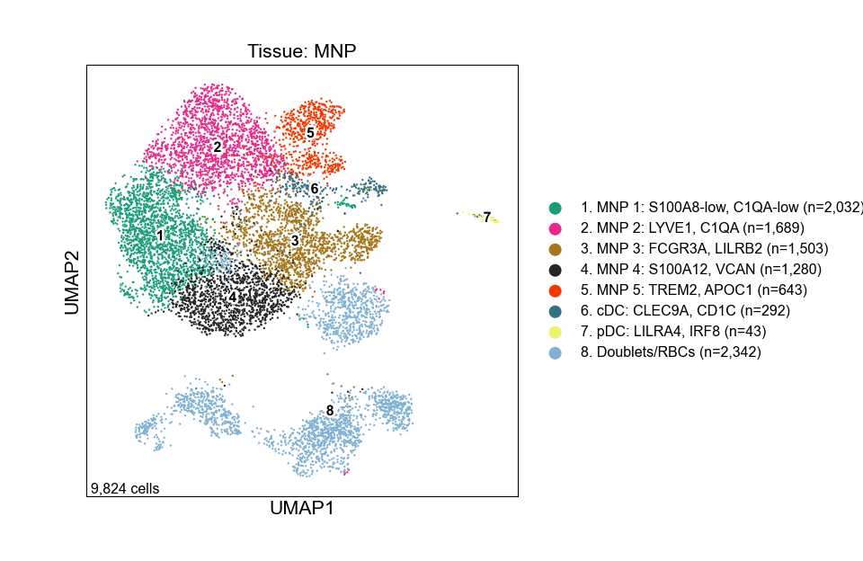
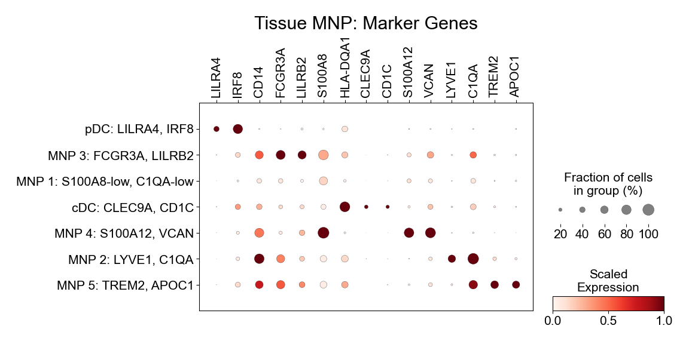
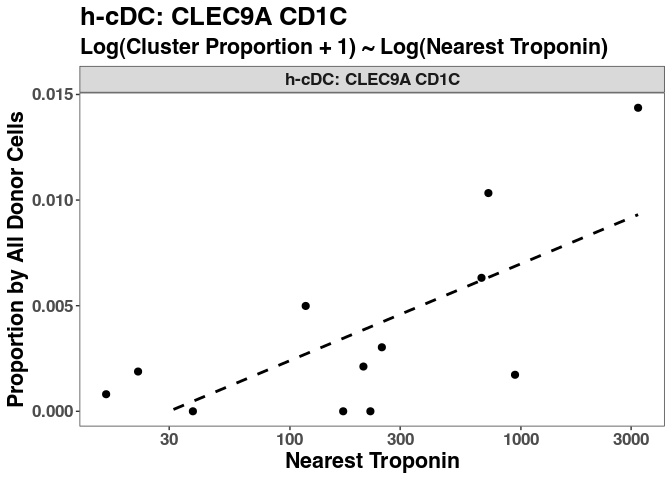
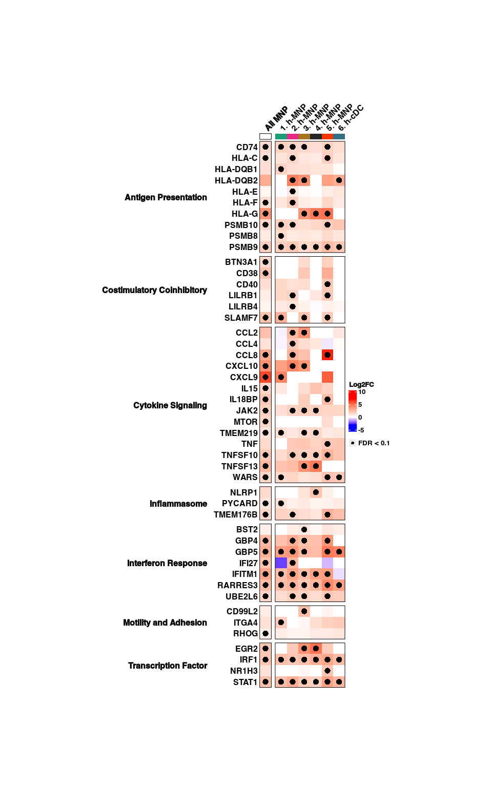
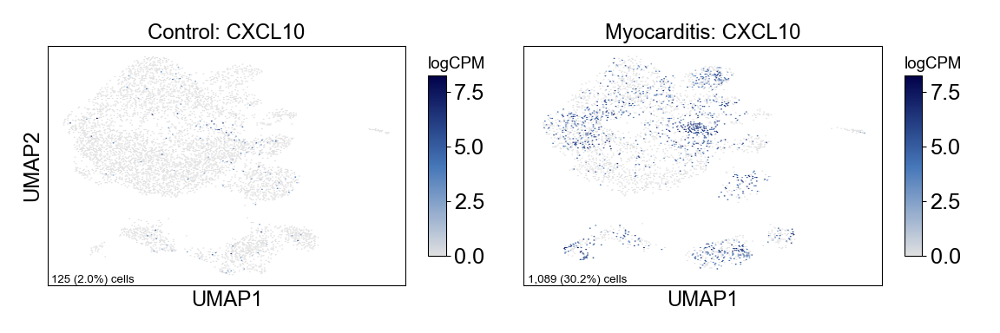

Figure 4
================

## Set up

Load R libraries

``` r
# load packages
library(tidyverse)
library(rmarkdown)
library(rlang)
library(parameters)
library(RColorBrewer)
library(ComplexHeatmap)
library(circlize)
library(Matrix)
library(glue)
library(ggforestplot)
library(ggbeeswarm)
library(ggrepel)
library(patchwork)
library(lme4)
library(ggstance)
library(DESeq2)
library(knitr)
library(fgsea)
library(ggpubr)

library(reticulate)
use_python("/projects/home/nealpsmith/.conda/envs/updated_pegasus/bin/python")

setwd('/projects/home/ikernin/github_code/myocarditis/functions')
source('masc.R')
source('de.R')
source('tissue_plot_masc.R')
source('tissue_gsea.R')
source('tissue_troponin_abundance.R')
```

Load Python packages

``` python
import pegasus as pg
import os
import warnings
warnings.filterwarnings('ignore')

import sys
sys.path.append("/projects/home/ikernin/github_code/myocarditis/functions")
import python_functions
```

Read in single-cell data

``` python
tissue_myeloid = pg.read_input('/projects/home/ikernin/projects/myocarditis/updated_datasets/tissue_myeloid.zarr')
```

``` r
tissue_obs <- read_csv('/projects/home/ikernin/projects/myocarditis/updated_datasets/metadata/tissue_full_obs.csv')
```

## Figure 4A

``` python
python_functions.plot_umap(tissue_myeloid, 'Tissue: MNP', python_functions.tissue_mnp_pal, marker_multiplier=6)
```



## Figure 4B

``` python
python_functions.make_gene_dotplot(tissue_myeloid.to_anndata(),
             cluster_order=['pDC: LILRA4, IRF8',
                            'MNP 3: FCGR3A, LILRB2',
                            'MNP 1: S100A8-low, C1QA-low',
                            'cDC: CLEC9A, CD1C',
                            'MNP 4: S100A12, VCAN',
                            'MNP 2: LYVE1, C1QA',
                            'MNP 5: TREM2, APOC1'],
             gene_order=['LILRA4', 'IRF8',  # pDC
                         'CD14', 'FCGR3A', 'LILRB2',  # MNP_3
                         'S100A8',  # MNP_1
                         'HLA-DQA1', 'CLEC9A', 'CD1C',  # cDC
                         'S100A12', 'VCAN',  # MNP_4
                         'LYVE1', 'C1QA',  # MNP_2
                         'TREM2', 'APOC1'  # MNP_5
                         ],
             title='Tissue MNP')
```



## Figure 4C

``` r
tissue_troponin_metadata <- read_csv('/projects/home/ikernin/projects/myocarditis/updated_datasets/metadata/tissue_troponin_metadata.csv')
troponin_filtered_df <- troponin_filter_tissue(tissue_obs, tissue_troponin_metadata)

# fit linear model by troponin for DE clusters
select_clusters <- c("h-NK: KLRF1 FCER1G",
                     "h-CD4T: IL7R LTB",
                    "h-CD8T: CD27 LAG3",
                    "h-CD8T: CCL5 NKG7",
                    "h-CD8T: cycling",
                    "h-MNP: S100A8-low C1QA-low",
                    "h-MNP: FCGR3A LILRB2",
                    "h-cDC: CLEC9A CD1C",
                    "Fibroblast: CXCL9, HLA-DRA")
troponin_cluster_percs <- troponin_get_percents_per_level(troponin_filtered_df, level='cluster')
select_cluster_percs <- troponin_cluster_percs %>%
        filter(cluster_names %in% select_clusters)
select_cluster_model <- troponin_fit_model(select_cluster_percs, level='cluster')
kable(select_cluster_model %>%
              dplyr::select(!c(data, model)) %>%
              unnest(cols = c(trop_coef, trop_se, trop_pval)))

troponin_plot_model(select_cluster_model %>% filter(cluster_names =="h-cDC: CLEC9A CD1C"),
                    select_cluster_percs %>% filter(cluster_names =="h-cDC: CLEC9A CD1C"),
                   "h-cDC: CLEC9A CD1C", level='cluster', point_size = 2.2, type='simple')
```

<!-- -->

| cluster\_names             |  trop\_coef |  trop\_se | trop\_pval |      padj |
| :------------------------- | ----------: | --------: | ---------: | --------: |
| Fibroblast: CXCL9, HLA-DRA |   0.0079106 | 0.0024072 |  0.0082023 | 0.0532563 |
| h-CD4T: IL7R LTB           |   0.0001508 | 0.0061707 |  0.9809880 | 0.9809880 |
| h-CD8T: CCL5 NKG7          |   0.0041760 | 0.0104397 |  0.6975596 | 0.8932075 |
| h-CD8T: CD27 LAG3          |   0.0049871 | 0.0063537 |  0.4507020 | 0.6760529 |
| h-CD8T: cycling            |   0.0059728 | 0.0021203 |  0.0182542 | 0.0547626 |
| h-cDC: CLEC9A CD1C         |   0.0019781 | 0.0006443 |  0.0118347 | 0.0532563 |
| h-MNP: FCGR3A LILRB2       |   0.0022458 | 0.0083721 |  0.7939622 | 0.8932075 |
| h-MNP: S100A8-low C1QA-low |   0.0115797 | 0.0083111 |  0.1937265 | 0.3487078 |
| h-NK: KLRF1 FCER1G         | \-0.0054702 | 0.0031077 |  0.1088655 | 0.2449473 |

## Figure 4j

``` python
os.chdir('/projects/home/ikernin/projects/myocarditis/updated_datasets/pseudobulk')
python_functions.get_pseudobulk_info(tissue_myeloid, 'tissue_mnp')

# get pseudobulk counts and metadata by donor for all mnp clusters
tissue_myeloid.obs['mnp_cell'] = tissue_myeloid.obs['umap_name'].isin(["MNP 3: FCGR3A, LILRB2",
                                                                       "MNP 1: S100A8-low, C1QA-low","MNP 2: LYVE1, C1QA",
                                                                       "MNP 4: S100A12, VCAN",
                                                                       "MNP 5: TREM2, APOC1"
])
tissue_myeloid.obs['mnp_cell'] = tissue_myeloid.obs['mnp_cell'].replace({True: 'all_mnp', False: 'other'})
python_functions.get_pseudobulk_info(tissue_myeloid, 'tissue_mnp_grouped', cluster_col='mnp_cell')
```

``` r
setwd('/projects/home/ikernin/projects/myocarditis/updated_datasets/de_analysis')

# run DE analysis by condition
tissue_mnp_cts <- read_counts('/projects/home/ikernin/projects/myocarditis/updated_datasets/pseudobulk/tissue_mnp_pseudocounts.csv')
tissue_mnp_meta <- read_meta('/projects/home/ikernin/projects/myocarditis/updated_datasets/pseudobulk/tissue_mnp_metainfo.csv')
tissue_mnp_deres <- run_de_by_comp_var(counts = tissue_mnp_cts,
                               meta = tissue_mnp_meta,
                               save_name = 'tissue_mnp',
                               comp_var_contrast_vec = c('condition', "myocarditis", "control"))

tissue_mnp_grouped_cts <- read_counts('/projects/home/ikernin/projects/myocarditis/updated_datasets/pseudobulk/tissue_mnp_grouped_pseudocounts.csv')
tissue_mnp_grouped_meta <- read_meta('/projects/home/ikernin/projects/myocarditis/updated_datasets/pseudobulk/tissue_mnp_grouped_metainfo.csv')
tissue_mnp_grouped_deres <- run_de_by_comp_var(counts = tissue_mnp_grouped_cts,
                               meta = tissue_mnp_grouped_meta,
                               save_name = 'tissue_mnp_grouped',
                               comp_var_contrast_vec = c('condition', "myocarditis", "control"))
```

``` r
# combine de results and meta data for heatmap
mnp_full_deres <- bind_rows(tissue_mnp_deres %>%
                               mutate(cluster = as.character(cluster)),
                             tissue_mnp_grouped_deres)
mnp_clusters <- tissue_obs %>%
  filter(umap_name %in% c('pDC', 'cDC', 'Myeloid cells')) %>%
  dplyr::select(lineage_subcluster_name, lineage_subcluster_number) %>%
  distinct() %>%
  dplyr::rename('cluster_name' = 'lineage_subcluster_name') %>%
  dplyr::rename('cluster_number' = 'lineage_subcluster_number') %>%
  add_row(cluster_name = 'all_mnp', cluster_number = 'all_mnp') %>%
    add_row(cluster_name = 'other', cluster_number = 'other') %>%
  add_row(cluster_name = 'Doublets/RBCs', cluster_number = '8') %>%
  mutate(cluster_name =
           case_when(
           str_detect(cluster_name, ':') ~ str_c(cluster_number, cluster_name, sep = '. '),
           TRUE ~ cluster_name)
  )
mnp_genes <- read_csv('/projects/home/ikernin/projects/myocarditis/updated_datasets/de_analysis/myeloid_heatmap_genes.csv') # genes to include in heatmap
mnp_heatmap_df <- get_heatmap_data(mnp_full_deres, mnp_genes, mnp_clusters)

heatmap_df <- mnp_heatmap_df %>%
  mutate(cluster = cluster_name,
    cluster = case_when(
    cluster == 'all_mnp' ~ 'All MNP',
    TRUE ~ cluster
  )) %>%
  dplyr::select(!cluster_name)


# Format main body --------------------------------------------------------

# set category order
category_levels <- sort(unique(heatmap_df$category))
category_levels <- c(category_levels[category_levels != 'Other'], 'Other')

# reformat from long to wide
heatmap_df <- heatmap_df %>%
  distinct() %>%
  pivot_wider(names_from = cluster, values_from = c(log2FoldChange, padj)) %>%
  filter(!is.na(category)) %>%
  mutate(category = factor(category, levels = category_levels)) %>%
  arrange(category)

# get information for the main body's cells
heatmap_mtx <- heatmap_df %>%
  dplyr::select(starts_with("log2FoldChange")) %>%
  replace(is.na(.), 0) %>%
  rename_with(~str_remove(., "log2FoldChange_")) %>%
  dplyr::select(order(colnames(.))) %>%
  as.matrix()
rownames(heatmap_mtx) <- heatmap_df$gene_symbol

# define cell color range
heatmap_col_fun <- colorRamp2(c(floor(min(heatmap_mtx)), 0, ceiling(max(heatmap_mtx))),
                              c("blue", "white", "red"))

# split into subclusters and lineage
heatmap_mtx_subcluster <- heatmap_mtx[, !str_detect(colnames(heatmap_mtx), 'All')]
colnames(heatmap_mtx_subcluster) <- str_remove(colnames(heatmap_mtx_subcluster), regex(":.*"))
heatmap_mtx_lineage <- heatmap_mtx[, str_detect(colnames(heatmap_mtx), 'All'), drop=FALSE]


# Main body annotation (FDR) ----------------------------------------------

# get fdr values
fdr_mtx <- heatmap_df %>%
  dplyr::select(starts_with('padj')) %>%
  replace(is.na(.), Inf) %>%
  rename_with(~str_remove(., "padj_")) %>%
  dplyr::select(order(colnames(.))) %>%
  as.matrix()

# make sure columns the same
stopifnot(colnames(fdr_mtx) == colnames(heatmap_mtx))

# split into subcluster and lineage
fdr_mtx_subcluster <- fdr_mtx[, !str_detect(colnames(fdr_mtx), 'All')]
fdr_mtx_lineage <- fdr_mtx[, str_detect(colnames(fdr_mtx), 'All'), drop=FALSE]

# make function for plotting fdr value
fdr_func_subcluster <- function(j, i, x, y, width, height, fill){
  if (fdr_mtx_subcluster[i,j] < 0.1){
    grid.circle(x = x, y = y, r = unit(1.5, 'mm'),
                gp = gpar(fill = 'black', col = NA))
  }
}
fdr_func_lineage <- function(j, i, x, y, width, height, fill){
  if (fdr_mtx_lineage[i,j] < 0.1){
    grid.circle(x = x, y = y, r = unit(1.5, "mm"),
                gp = gpar(fill = 'black', col = NA))
  }
}

# create legend for fdr
lgd_fdr = Legend(pch = 16, type = "points", labels = "FDR < 0.1")


# Column annotation (cluster names) ---------------------------------------

# define colors
clust_col_fun <- c('#1b9e77', '#e7298a', '#a6761d', '#252525', '#f43600', '#356F83')
names(clust_col_fun) <- seq(1, 6)
clust_ha <- HeatmapAnnotation(clust_colors = names(clust_col_fun),
                              col = list(clust_colors = clust_col_fun),
                              show_legend = FALSE,
                              show_annotation_name = FALSE,
                              simple_anno_size = unit(3, "mm"))

lineage_col_fun <- c('white')
names(lineage_col_fun) <- 'All'
lineage_ha <- HeatmapAnnotation(lineage = names(lineage_col_fun),
                                col = list(lineage = lineage_col_fun),
                                show_legend = FALSE,
                                show_annotation_name = FALSE,
                                simple_anno_size = unit(3, "mm"),
                                border = T)

# Row annotation (gene names) ---------------------------------------------

# split rows by gene category
stopifnot(rownames(heatmap_mtx_subcluster) == rownames(heatmap_mtx_lineage))
row_split <- str_replace_all(heatmap_df$category, "_", " ")
row_split <- factor(row_split, levels = unique(row_split))


# Plot --------------------------------------------------------------------

ht_subcluster <- Heatmap(heatmap_mtx_subcluster,
                         col = heatmap_col_fun,
                         row_split = row_split,
                         cell_fun = fdr_func_subcluster,
                         top_annotation = clust_ha,
                         name = 'Log2FC',
                         cluster_columns = FALSE,  column_names_side = "top",
                         show_column_names = T, column_names_rot = 45,
                         cluster_rows = FALSE, row_names_side = "left",
                         row_title_rot = 0, row_title_gp=gpar(fontface='bold'),
                         row_gap = unit(2, "mm"), border = TRUE,
                         width = ncol(heatmap_mtx_subcluster)*unit(6, "mm"),
                         height = nrow(heatmap_mtx_subcluster)*unit(6, "mm"))

ht_lineage <- Heatmap(heatmap_mtx_lineage,
                      col = heatmap_col_fun,
                      row_split = row_split,
                      cell_fun = fdr_func_lineage,
                      top_annotation = lineage_ha,
                      name = 'Lineage', show_heatmap_legend = FALSE,
                      column_names_gp = gpar(fontface='bold'),
                      cluster_columns = FALSE,  column_names_side = "top",
                      show_column_names = T, column_names_rot = 45,
                      cluster_rows = FALSE, row_names_side = "left",
                      row_title_rot = 0, row_title_gp=gpar(fontface='bold'),
                      row_gap = unit(2, "mm"), border = TRUE,
                      width = ncol(heatmap_mtx_lineage)*unit(6, "mm"),
                      height = nrow(heatmap_mtx_lineage)*unit(6, "mm"))

draw(ht_lineage + ht_subcluster,
     annotation_legend_list = list(lgd_fdr),
     merge_legends = TRUE)
```

<!-- -->

``` r
# filter out doublets
filtered_mnp_deres <- mnp_full_deres %>%
        left_join(mnp_clusters,
                  by = c('cluster' = 'cluster_number')) %>%
        filter(!str_detect(str_to_lower(cluster_name), 'doublets')) %>%
        dplyr::rename('cluster_names' = 'cluster_name')

# read in gsea pathways
pathways <- gmtPathways("/projects/home/ikernin/projects/myocarditis/updated_datasets/msigdb_symbols.gmt")

# run gsea
setwd('/projects/home/ikernin/projects/myocarditis/updated_datasets/gsea')
run_gsea_by_cluster(filtered_mnp_deres, 'tissue_myeloid')
myeloid_gsea_res <- gsea_combine_xlsx('/projects/home/ikernin/projects/myocarditis/updated_datasets/gsea/tissue_myeloid_all_gsea.xlsx')

# plot gsea
main_pathways <- c(
  "HALLMARK:INTERFERON_GAMMA_RESPONSE",
  "KEGG:ALLOGRAFT_REJECTION",
  'KEGG:ANTIGEN_PROCESSING_AND_PRESENTATION',
                   "KEGG:CELL_ADHESION_MOLECULES_CAMS",
                   "KEGG:DNA_REPLICATION",
                   "KEGG:VIRAL_MYOCARDITIS")
mnp_order <- c("all",
               "6. h-cDC",
               "1. h-MNP",
               "2. h-MNP",
               "3. h-MNP",
               "4. h-MNP",
               "5. h-MNP")
mnp_plot_df <- myeloid_gsea_res %>%
  mutate(pathway_name = str_c(geneset, pathway_name, sep=':')) %>%
  filter(pathway_name %in% main_pathways,
         cluster_name %in% mnp_order) %>%
  mutate(cluster_name = factor(cluster_name),
         pathway_name = factor(pathway_name)) %>%
  complete(cluster_name, pathway_name)

# make heatmap
setwd('/projects/home/ikernin/projects/myocarditis/updated_datasets/figures')
plot_heatmap(mnp_plot_df,
             cluster_order = mnp_order,
             col_order = main_pathways,
             'mnp_gsea.pdf',
             split = T)
```

``` r
knitr::include_graphics("/projects/home/ikernin/projects/myocarditis/updated_datasets/figures/mnp_gsea.pdf")
```

<!-- -->

## Figure 4k

``` python
fig_5g_genes = ['CXCL10']
python_functions.multi_hexfp_by_condition(tissue_myeloid, fig_5g_genes, cmap = python_functions.blues_cmap, gridsize=200)
```

    ##   0%|                                                                                                                                                                                                                                 | 0/1 [00:00<?, ?it/s]100%|#########################################################################################################################################################################################################################| 1/1 [00:00<00:00,  2.50it/s]


