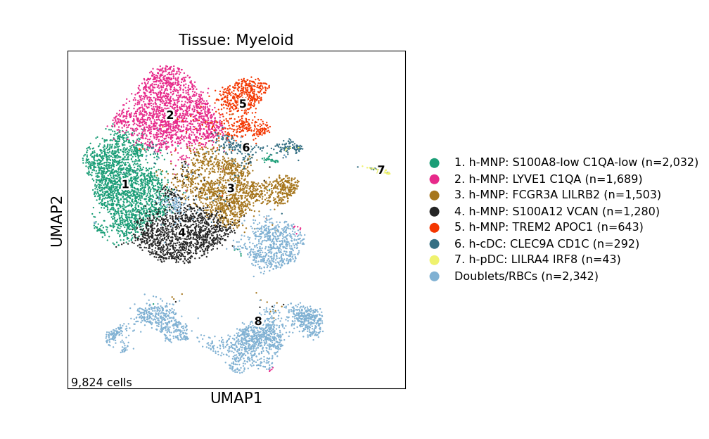
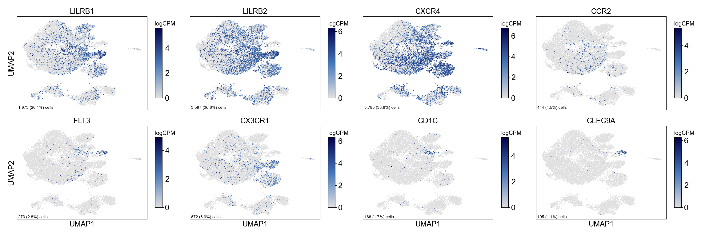
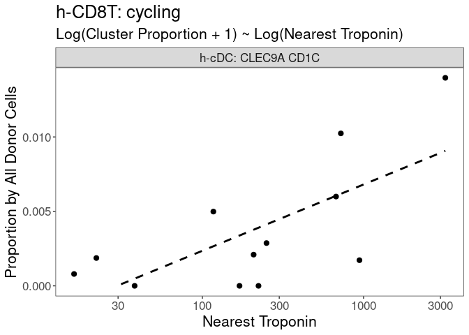
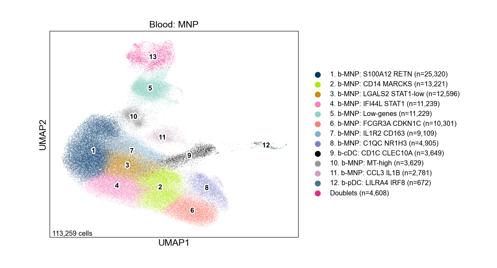
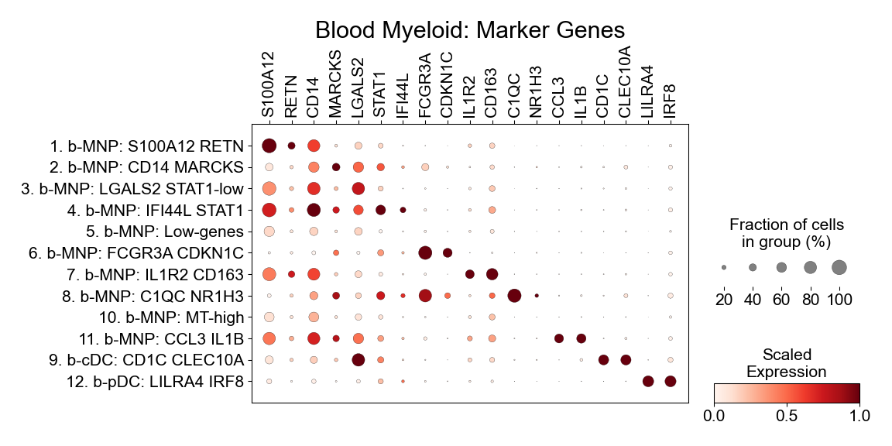
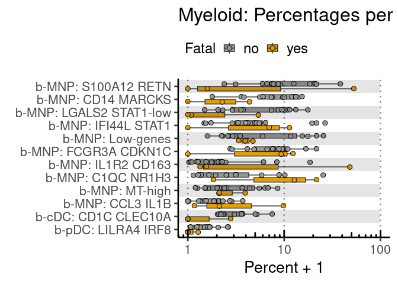
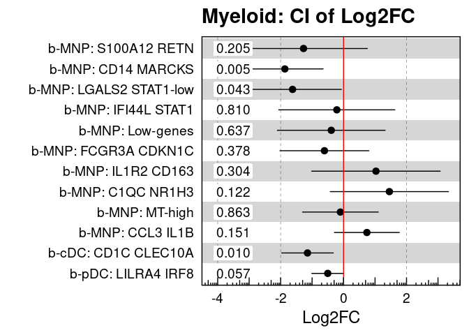
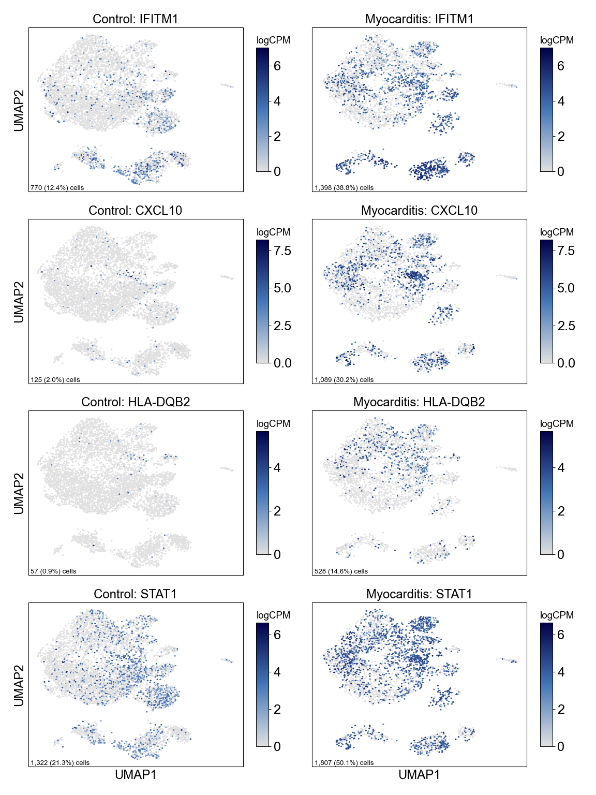

Figure 4
================

## Set up

Load R libraries

``` r
# load packages
library(tidyverse)
library(rmarkdown)
library(rlang)
library(parameters)
library(RColorBrewer)
library(ComplexHeatmap)
library(circlize)
library(Matrix)
library(glue)
library(ggforestplot)
library(ggbeeswarm)
library(patchwork)
library(lme4)
library(ggstance)
library(DESeq2)
library(knitr)

library(reticulate)
use_python("/projects/home/nealpsmith/.conda/envs/updated_pegasus/bin/python")

setwd('/projects/home/ikernin/github_code/myocarditis/functions')
source('masc.R')
source('plot_masc.R')
source('tissue_troponin_abundance.R')
source('blood_fatal_abundance.R')
source('de.R')
```

Load Python packages

``` python
import pegasus as pg
import warnings
warnings.filterwarnings('ignore')

import sys
sys.path.append("/projects/home/ikernin/github_code/myocarditis/functions")
import python_functions
```

Read in single-cell data

``` python
tissue_myeloid = pg.read_input('/projects/home/ikernin/projects/myocarditis/github_datasets/tissue_myeloid.zarr')
```

``` python
blood_myeloid = pg.read_input('/projects/home/ikernin/projects/myocarditis/github_datasets/blood_myeloid.zarr')
```

## Figure 4A

``` python
python_functions.plot_umap(tissue_myeloid, 'Tissue: Myeloid', python_functions.tissue_mnp_pal, wspace=0.9, marker_multiplier=6)
```



## Figure 4B

``` python
python_functions.make_gene_dotplot(tissue_myeloid.to_anndata(),
             cluster_order=['7. h-pDC: LILRA4 IRF8',
                            '3. h-MNP: FCGR3A LILRB2',
                            '1. h-MNP: S100A8-low C1QA-low',
                            '6. h-cDC: CLEC9A CD1C',
                            '2. h-MNP: LYVE1 C1QA',
                            '4. h-MNP: S100A12 VCAN',
                            '5. h-MNP: TREM2 APOC1'],
             gene_order=['LILRA4', 'IRF8',
                         'CD14', 'FCGR3A', 'LILRB2',
                         'S100A8',
                         'HLA-DQA1', 'CLEC9A', 'CD1C',
                         'LYVE1', 'C1QA',
                         'S100A12', 'VCAN',
                         'TREM2', 'APOC1'
                         ],
             title='Heart Myeloid')
```


## Figure 4c

``` r
# read in masc tissue results (see figure_2.rmd fig_2c)
tissue_global_obs = read_csv('/projects/home/ikernin/projects/myocarditis/github_datasets/tissue_global_obs.csv')
masc_filtered_df  <- masc_filter(tissue_global_obs)
cluster_masc_res <- read_csv('/projects/home/ikernin/projects/myocarditis/github_datasets/cluster_masc_res.csv')
plot_masc_by_cell_type(cluster_masc_res, masc_filtered_df, lineage='Myeloid')
```

<!-- -->

## Figure 4D

``` python
fig_4d_genes = ["LILRB1", "LILRB2", "CXCR4", "CCR2", "FLT3", "CX3CR1", "CD1C", "CLEC9A"]
python_functions.multi_hex_featureplot(tissue_myeloid,
                      fig_4d_genes,
                      ncol=4,
                      cmap=python_functions.blues_cmap,
                      gridsize=200)
```

    ##   0%|                                                                                               | 0/8 [00:00<?, ?it/s] 12%|##########8                                                                            | 1/8 [00:00<00:02,  2.68it/s] 25%|#####################7                                                                 | 2/8 [00:00<00:01,  3.33it/s] 38%|################################6                                                      | 3/8 [00:00<00:01,  3.07it/s] 50%|###########################################5                                           | 4/8 [00:01<00:01,  3.39it/s] 62%|######################################################3                                | 5/8 [00:01<00:00,  3.16it/s] 75%|#################################################################2                     | 6/8 [00:01<00:00,  3.41it/s] 88%|############################################################################1          | 7/8 [00:02<00:00,  3.17it/s]100%|#######################################################################################| 8/8 [00:02<00:00,  3.40it/s]100%|#######################################################################################| 8/8 [00:02<00:00,  3.28it/s]



## Figure 4G

``` r
tissue_troponin_metadata <- read_csv('/projects/home/ikernin/projects/myocarditis/github_datasets/tissue_troponin_metadata.csv')
troponin_filtered_df <- troponin_filter_tissue(tissue_global_obs, tissue_troponin_metadata)

# fit linear model by troponin for DE clusters
select_clusters <- c("h-NK: KLRF1 FCER1G",
                     "h-CD4T: IL7R LTB",
                    "h-CD8T: CD27 LAG3",
                    "h-CD8T: CCL5 NKG7",
                    "h-CD8T: cycling",
                    "h-MNP: S100A8-low C1QA-low",
                    "h-MNP: FCGR3A LILRB2",
                    "h-cDC: CLEC9A CD1C",
                    "Fibroblasts: DCN LUM")
troponin_cluster_percs <- troponin_get_percents_per_level(troponin_filtered_df, level='cluster')
select_cluster_percs <- troponin_cluster_percs %>%
        filter(cluster_names %in% select_clusters)
select_cluster_model <- troponin_fit_model(select_cluster_percs, level='cluster')
kable(select_cluster_model %>%
              select(!c(data, model)) %>%
              unnest(cols = c(trop_coef, trop_se, trop_pval)))

troponin_plot_model(select_cluster_model %>% filter(cluster_names =="h-cDC: CLEC9A CD1C"),
                    select_cluster_percs %>% filter(cluster_names =="h-cDC: CLEC9A CD1C"),
                    "h-CD8T: cycling", level='cluster', point_size = 2.2, type='simple')
```

<!-- -->

| cluster\_names             |  trop\_coef |  trop\_se | trop\_pval |      padj |
| :------------------------- | ----------: | --------: | ---------: | --------: |
| Fibroblasts: DCN LUM       |   0.0161216 | 0.0162256 |  0.3438558 | 0.6189405 |
| h-CD4T: IL7R LTB           |   0.0001064 | 0.0061510 |  0.9865381 | 0.9865381 |
| h-CD8T: CCL5 NKG7          |   0.0039344 | 0.0104176 |  0.7135667 | 0.9050230 |
| h-CD8T: CD27 LAG3          |   0.0049633 | 0.0063341 |  0.4514475 | 0.6771712 |
| h-CD8T: cycling            |   0.0058375 | 0.0020689 |  0.0181105 | 0.0814970 |
| h-cDC: CLEC9A CD1C         |   0.0019211 | 0.0006323 |  0.0125033 | 0.0814970 |
| h-MNP: FCGR3A LILRB2       |   0.0021302 | 0.0083788 |  0.8044649 | 0.9050230 |
| h-MNP: S100A8-low C1QA-low |   0.0112636 | 0.0082623 |  0.2027089 | 0.4560950 |
| h-NK: KLRF1 FCER1G         | \-0.0054666 | 0.0030911 |  0.1074143 | 0.3222428 |

## Figure 4H

``` python
python_functions.plot_umap(blood_myeloid, 'Blood: MNP', python_functions.blood_mnp_pal, fig_size=(6, 5))
```



## Figure 4I

``` python
python_functions.make_gene_dotplot(blood_myeloid.to_anndata(),
             cluster_order=['1. b-MNP: S100A12 RETN',
                            '2. b-MNP: CD14 MARCKS',
                            '3. b-MNP: LGALS2 STAT1-low',
                            '4. b-MNP: IFI44L STAT1',
                            '5. b-MNP: Low-genes',
                            '6. b-MNP: FCGR3A CDKN1C',
                            '7. b-MNP: IL1R2 CD163',
                            '8. b-MNP: C1QC NR1H3',
                            '10. b-MNP: MT-high',
                            '11. b-MNP: CCL3 IL1B',
                            '9. b-cDC: CD1C CLEC10A',
                            '12. b-pDC: LILRA4 IRF8'],
             gene_order=['S100A12', 'RETN', 'CD14', 'MARCKS', 'LGALS2', 'STAT1',
                         'IFI44L', 'FCGR3A', 'CDKN1C', 'IL1R2', 'CD163', 'C1QC',
                         'NR1H3', 'CCL3', 'IL1B', 'CD1C', 'CLEC10A', 'LILRA4', 'IRF8'],
             title='Blood Myeloid')
```



## Figure 4J

``` r
# read in all blood cell metadata
blood_global_obs <- read_csv('/projects/home/ikernin/projects/myocarditis/github_datasets/blood_global_obs.csv')
fatal_blood_obs_filtered <- fatal_filter_df(blood_global_obs)

# fit cluster level model
fatal_cluster_percents <- fatal_get_percent_per_level(fatal_blood_obs_filtered, level='cluster')
fatal_cluster_model <- fatal_fit_model(fatal_cluster_percents, level='cluster')
fatal_cluster_lineages <- fatal_blood_obs_filtered %>% select(cluster_names, lineage_names) %>% distinct()

# get get myeloid lineage level results
myeloid_order <- c('b-MNP: S100A12 RETN', 
                   'b-MNP: CD14 MARCKS', 
                   'b-MNP: LGALS2 STAT1-low', 
                   'b-MNP: IFI44L STAT1', 
                   'b-MNP: Low-genes', 
                   'b-MNP: FCGR3A CDKN1C', 
                   'b-MNP: IL1R2 CD163', 
                   'b-MNP: C1QC NR1H3', 
                   'b-MNP: MT-high', 
                   'b-MNP: CCL3 IL1B', 
                   'b-cDC: CD1C CLEC10A', 
                   'b-pDC: LILRA4 IRF8'
        )
fatal_myeloid_percents <- fatal_cluster_percents %>% filter(cluster_names %in% myeloid_order)
fatal_myeloid_percents <- set_factor_order(fatal_myeloid_percents , col_name = 'cluster_names', order = myeloid_order)
fatal_myeloid_model <- fatal_cluster_model %>% filter(cluster_names %in% myeloid_order)
fatal_myeloid_model <- set_factor_order(fatal_myeloid_model , col_name = 'cluster_names', order = myeloid_order)
kable(fatal_myeloid_model %>%
              select(!c(data, model)) %>%
              unnest(cols = c(fatal_coef, fatal_se, fatal_pval)))

fatal_plot_sample_perc(fatal_myeloid_percents, title='Myeloid')
```

<!-- -->

``` r
fatal_plot_ci_interval(fatal_myeloid_model, 'Myeloid', level='cluster')
```

<!-- -->

| cluster\_names          | fatal\_coef | fatal\_se | fatal\_pval |      padj |     CI\_low |    CI\_high |
| :---------------------- | ----------: | --------: | ----------: | --------: | ----------: | ----------: |
| b-cDC: CD1C CLEC10A     | \-1.1462558 | 0.3923256 |   0.0099810 | 0.1571825 | \-1.9779489 | \-0.3145627 |
| b-MNP: C1QC NR1H3       |   1.4552782 | 0.8917117 |   0.1222011 | 0.3624134 | \-0.4350662 |   3.3456227 |
| b-MNP: CCL3 IL1B        |   0.7408779 | 0.4916590 |   0.1513264 | 0.3624134 | \-0.3013926 |   1.7831484 |
| b-MNP: CD14 MARCKS      | \-1.8657124 | 0.5790480 |   0.0053252 | 0.1571825 | \-3.0932392 | \-0.6381855 |
| b-MNP: FCGR3A CDKN1C    | \-0.6082624 | 0.6713534 |   0.3783653 | 0.5608821 | \-2.0314679 |   0.8149432 |
| b-MNP: IFI44L STAT1     | \-0.2142503 | 0.8752731 |   0.8097375 | 0.8573692 | \-2.0697465 |   1.6412458 |
| b-MNP: IL1R2 CD163      |   1.0290736 | 0.9680601 |   0.3035516 | 0.4967208 | \-1.0231221 |   3.0812694 |
| b-MNP: LGALS2 STAT1-low | \-1.6209202 | 0.7381269 |   0.0431807 | 0.2590841 | \-3.1856793 | \-0.0561612 |
| b-MNP: Low-genes        | \-0.3909754 | 0.8135717 |   0.6373295 | 0.7401245 | \-2.1156704 |   1.3337196 |
| b-MNP: MT-high          | \-0.1007128 | 0.5732739 |   0.8627495 | 0.8873995 | \-1.3159991 |   1.1145735 |
| b-MNP: S100A12 RETN     | \-1.2721616 | 0.9623776 |   0.2047923 | 0.4095845 | \-3.3123111 |   0.7679879 |
| b-pDC: LILRA4 IRF8      | \-0.5030789 | 0.2452638 |   0.0569959 | 0.2931218 | \-1.0230148 |   0.0168571 |

## Figure 4K

``` python
# get pseudobulk counts and metadata by donor for all myeloid clusters
python_functions.get_pseudobulk_info(tissue_myeloid, 'tissue_myeloid')

# get pseudobulk counts and metadata by donor for all mnp clusters
tissue_myeloid.obs['mnp_cell'] = tissue_myeloid.obs['umap_name'].isin(['1. h-MNP: S100A8-low C1QA-low',
                                                               '2. h-MNP: LYVE1 C1QA',
                                                               '3. h-MNP: FCGR3A LILRB2',
                                                               '4. h-MNP: S100A12 VCAN',
                                                               '5. h-MNP: TREM2 APOC1'])
tissue_myeloid.obs['mnp_cell'] = tissue_myeloid.obs['mnp_cell'].replace({True: 'all_mnp', False: 'other'})
python_functions.get_pseudobulk_info(tissue_myeloid, 'tissue_mnp_grouped', cluster_col='mnp_cell')
```

``` r
# run DE analysis by condition
myeloid_deres <- run_de_by_condition(counts_filepath = '/projects/home/ikernin/projects/myocarditis/github_datasets/tissue_myeloid_pseudocounts.csv',
                               meta_filepath = '/projects/home/ikernin/projects/myocarditis/github_datasets/tissue_myeloid_metainfo.csv',
                               save_name = 'tissue_myeloid')

myeloid_grouped_deres <- run_de_by_condition(counts_filepath = '/projects/home/ikernin/projects/myocarditis/github_datasets/tissue_mnp_grouped_pseudocounts.csv',
                                       meta_filepath = '/projects/home/ikernin/projects/myocarditis/github_datasets/tissue_mnp_grouped_metainfo.csv',
                                       save_name = 'tissue_mnp_grouped')
```

    ## [1] "Cluster 1"
    ## [1] "Cluster 2"
    ## [1] "Cluster 3"
    ## [1] "Cluster 4"
    ## [1] "Cluster 5"
    ## [1] "Cluster 6"
    ## [1] "Cluster 7"
    ## [1] "Cluster 8"
    ## [1] "saving results..."
    ## [1] "Cluster all_mnp"
    ## [1] "Cluster other"
    ## [1] "saving results..."

``` r
# combine de results and meta data for heatmap
myeloid_full_deres <- bind_rows(myeloid_deres %>%
                               mutate(cluster = as.character(cluster)),
                             myeloid_grouped_deres)
myeloid_clusters <- read_csv('/projects/home/ikernin/projects/myocarditis/github_datasets/myeloid_cluster_map.csv')
myeloid_genes <- read_csv('/projects/home/ikernin/projects/myocarditis/github_datasets/myeloid_heatmap_genes.csv')
myeloid_heatmap_df <- get_heatmap_data(myeloid_full_deres, myeloid_genes, myeloid_clusters)
heatmap_df <- myeloid_heatmap_df %>%
  mutate(cluster = cluster_name,
    cluster = case_when(
    cluster == 'all_mnp' ~ 'All MNP',
    TRUE ~ cluster
  )) %>%
  select(!cluster_name)


# Format main body --------------------------------------------------------

# set category order
category_levels <- sort(unique(heatmap_df$category))
category_levels <- c(category_levels[category_levels != 'Other'], 'Other')

# reformat from long to wide
heatmap_df <- heatmap_df %>%
  distinct() %>%
  pivot_wider(names_from = cluster, values_from = c(log2FoldChange, padj)) %>%
  filter(!is.na(category)) %>%
  mutate(category = factor(category, levels = category_levels)) %>%
  arrange(category)

# get information for the main body's cells
heatmap_mtx <- heatmap_df %>%
  select(starts_with("log2FoldChange")) %>%
  replace(is.na(.), 0) %>%
  rename_with(~str_remove(., "log2FoldChange_")) %>%
  select(order(colnames(.))) %>%
  as.matrix()
rownames(heatmap_mtx) <- heatmap_df$gene_symbol

# define cell color range
heatmap_col_fun <- colorRamp2(c(floor(min(heatmap_mtx)), 0, ceiling(max(heatmap_mtx))),
                              c("blue", "white", "red"))

# split into subclusters and lineage
heatmap_mtx_subcluster <- heatmap_mtx[, !str_detect(colnames(heatmap_mtx), 'All')]
colnames(heatmap_mtx_subcluster) <- str_remove(colnames(heatmap_mtx_subcluster), regex(":.*"))
heatmap_mtx_lineage <- heatmap_mtx[, str_detect(colnames(heatmap_mtx), 'All'), drop=FALSE]


# Main body annotation (FDR) ----------------------------------------------

# get fdr values
fdr_mtx <- heatmap_df %>%
  select(starts_with('padj')) %>%
  replace(is.na(.), Inf) %>%
  rename_with(~str_remove(., "padj_")) %>%
  select(order(colnames(.))) %>%
  as.matrix()

# make sure columns the same
stopifnot(colnames(fdr_mtx) == colnames(heatmap_mtx))

# split into subcluster and lineage
fdr_mtx_subcluster <- fdr_mtx[, !str_detect(colnames(fdr_mtx), 'All')]
fdr_mtx_lineage <- fdr_mtx[, str_detect(colnames(fdr_mtx), 'All'), drop=FALSE]

# make function for plotting fdr value
fdr_func_subcluster <- function(j, i, x, y, width, height, fill){
  if (fdr_mtx_subcluster[i,j] < 0.1){
    grid.circle(x = x, y = y, r = unit(1.5, 'mm'),
                gp = gpar(fill = 'black', col = NA))
  }
}
fdr_func_lineage <- function(j, i, x, y, width, height, fill){
  if (fdr_mtx_lineage[i,j] < 0.1){
    grid.circle(x = x, y = y, r = unit(1.5, "mm"),
                gp = gpar(fill = 'black', col = NA))
  }
}

# create legend for fdr
lgd_fdr = Legend(pch = 16, type = "points", labels = "FDR < 0.1")


# Column annotation (cluster names) ---------------------------------------

# define colors
clust_col_fun <- c('#1b9e77', '#e7298a', '#a6761d', '#252525', '#f43600', '#356F83')
names(clust_col_fun) <- seq(1, 6)
clust_ha <- HeatmapAnnotation(clust_colors = names(clust_col_fun),
                              col = list(clust_colors = clust_col_fun),
                              show_legend = FALSE,
                              show_annotation_name = FALSE,
                              simple_anno_size = unit(3, "mm"))

lineage_col_fun <- c('white')
names(lineage_col_fun) <- 'All'
lineage_ha <- HeatmapAnnotation(lineage = names(lineage_col_fun),
                                col = list(lineage = lineage_col_fun),
                                show_legend = FALSE,
                                show_annotation_name = FALSE,
                                simple_anno_size = unit(3, "mm"),
                                border = T)

# Row annotation (gene names) ---------------------------------------------

# split rows by gene category
stopifnot(rownames(heatmap_mtx_subcluster) == rownames(heatmap_mtx_lineage))
row_split <- str_replace_all(heatmap_df$category, "_", " ")
row_split <- factor(row_split, levels = unique(row_split))


# Plot --------------------------------------------------------------------

ht_subcluster <- Heatmap(heatmap_mtx_subcluster,
                         col = heatmap_col_fun,
                         row_split = row_split,
                         cell_fun = fdr_func_subcluster,
                         top_annotation = clust_ha,
                         name = 'Log2FC',
                         cluster_columns = FALSE,  column_names_side = "top",
                         show_column_names = T, column_names_rot = 45,
                         cluster_rows = FALSE, row_names_side = "left",
                         row_title_rot = 0, row_title_gp=gpar(fontface='bold'),
                         row_gap = unit(2, "mm"), border = TRUE,
                         width = ncol(heatmap_mtx_subcluster)*unit(6, "mm"),
                         height = nrow(heatmap_mtx_subcluster)*unit(6, "mm"))

ht_lineage <- Heatmap(heatmap_mtx_lineage,
                      col = heatmap_col_fun,
                      row_split = row_split,
                      cell_fun = fdr_func_lineage,
                      top_annotation = lineage_ha,
                      name = 'Lineage', show_heatmap_legend = FALSE,
                      column_names_gp = gpar(fontface='bold'),
                      cluster_columns = FALSE,  column_names_side = "top",
                      show_column_names = T, column_names_rot = 45,
                      cluster_rows = FALSE, row_names_side = "left",
                      row_title_rot = 0, row_title_gp=gpar(fontface='bold'),
                      row_gap = unit(2, "mm"), border = TRUE,
                      width = ncol(heatmap_mtx_lineage)*unit(6, "mm"),
                      height = nrow(heatmap_mtx_lineage)*unit(6, "mm"))

draw(ht_lineage + ht_subcluster,
     annotation_legend_list = list(lgd_fdr),
     merge_legends = TRUE)
```

<!-- -->

## Figure 4L

``` python
fig_4l_genes = ['IFITM1', 'CXCL10', 'HLA-DQB2', 'STAT1']
python_functions.multi_hexfp_by_condition(tissue_myeloid, fig_4l_genes, cmap = python_functions.blues_cmap, gridsize=200)
```

    ##   0%|                                                                                               | 0/4 [00:00<?, ?it/s] 25%|#####################7                                                                 | 1/4 [00:00<00:01,  2.00it/s] 50%|###########################################5                                           | 2/4 [00:00<00:00,  2.15it/s] 75%|#################################################################2                     | 3/4 [00:01<00:00,  2.22it/s]100%|#######################################################################################| 4/4 [00:01<00:00,  2.24it/s]100%|#######################################################################################| 4/4 [00:01<00:00,  2.20it/s]


