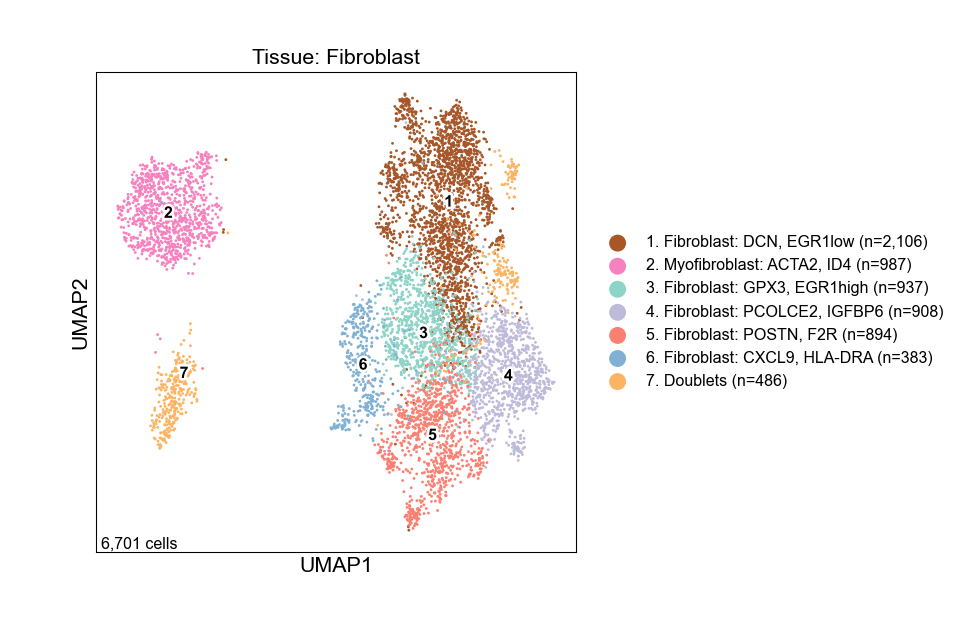

Figure 5
================

## Set up

Load R libraries

``` r
# load packages
library(tidyverse)
library(rmarkdown)
library(rlang)
library(parameters)
library(RColorBrewer)
library(ComplexHeatmap)
library(circlize)
library(Matrix)
library(glue)
library(ggforestplot)
library(ggbeeswarm)
library(patchwork)
library(lme4)
library(ggstance)
library(DESeq2)
library(knitr)

library(reticulate)
use_python("/projects/home/nealpsmith/.conda/envs/updated_pegasus/bin/python")

setwd('/projects/home/ikernin/github_code/myocarditis/functions')
source('masc.R')
source('plot_masc.R')
source('de.R')
```

Load Python packages

``` python
import pegasus as pg
import pandas as pd
import numpy as np
import matplotlib.pyplot as plt
import seaborn as sns
from scipy.sparse import csr_matrix
from scipy import stats
import warnings
warnings.filterwarnings('ignore')

import sys
sys.path.append("/projects/home/ikernin/github_code/myocarditis/functions")
import python_functions
```

Read in single-cell data

``` python
tissue_nonimmune = pg.read_input('/projects/home/ikernin/projects/myocarditis/github_datasets/tissue_nonimmune.zarr')
```

    ## 2023-03-31 15:20:30,178 - pegasusio.readwrite - INFO - zarr file '/projects/home/ikernin/projects/myocarditis/github_datasets/tissue_nonimmune.zarr' is loaded.
    ## 2023-03-31 15:20:30,179 - pegasusio.readwrite - INFO - Function 'read_input' finished in 0.65s.

``` python
tissue_global = pg.read_input('/projects/home/ikernin/projects/myocarditis/github_datasets/tissue_global.zarr')
```

    ## 2023-03-31 15:20:31,096 - pegasusio.readwrite - INFO - zarr file '/projects/home/ikernin/projects/myocarditis/github_datasets/tissue_global.zarr' is loaded.
    ## 2023-03-31 15:20:31,096 - pegasusio.readwrite - INFO - Function 'read_input' finished in 0.91s.

## Figure 5A

``` python
python_functions.plot_umap(tissue_nonimmune, 'Tissue: Non-Immune', python_functions.tissue_nonimmune_pal, fig_size=(6, 5), marker_multiplier=15)
```



## Figure 5B

``` python
# split data into endothelial and non-endothelial cells
endothelial_clusters = ['1. Capillary EC: RGCC CA4',
                        '9. Arterial EC: RBP7 BTNL9',
                        '5. Arterial EC: HEY1 SEMA3G',
                        '2. Capillary EC: CXCL2 JUN',
                        '11. Venous EC: ACKR1 PLVAP',
                        '14. Inflammatory EC: CXCL9 IDO1',
                        '13. Endocardial: NPR3 POSTN',
                        '3. Capillary EC: VWF CD36',
                        '15. Lymphatic EC: PDPN CCL21']
non_endothelial_clusters = ['8. Smooth muscle: TAGLN MYH11',
                            '7. Pericytes: KCNJ8 ABCC9',
                            '4. Fibroblasts: DCN LUM',
                            '16. Myofibroblasts: ACTA2 COL14A1',
                            '6. Pericytes: HLA-DRB1 S1PR1',
                            '12. Cardiomyocytes: TNNT2 MB',
                            '17. Neuronal: PLP1 NRXN1',
                            '10. Pericytes: RGS5 KCNJ8-low']

endothelial = tissue_nonimmune[tissue_nonimmune.obs['umap_name'].isin(endothelial_clusters)].copy()
non_endothelial = tissue_nonimmune[tissue_nonimmune.obs['umap_name'].isin(non_endothelial_clusters)].copy()

# plot dotplots

python_functions.make_gene_dotplot(endothelial.to_anndata(),
             cluster_order=endothelial_clusters,
             gene_order=['RGCC', 'CA4',  # Capillary EC1
                         'RBP7', 'BTNL9',  # Arterial EC2
                         'HEY1', 'SEMA3G',  # Arterial EC1
                         'CXCL2', 'JUN',  # Capillary EC2
                         'ACKR1', 'PLVAP',  # Venous EC
                         'CXCL9', 'IDO1',  # Inflammatory EC
                         'NPR3', 'POSTN',  # Endocardia
                         'VWF', 'CD36',  # Capillary EC3
                         'PDPN', 'CCL21'  # Lymphatic ECs
                         ],
             title='Endothelial')
python_functions.make_gene_dotplot(non_endothelial.to_anndata(),
             cluster_order=non_endothelial_clusters,
             gene_order=['TAGLN', 'MYH11',  # Smooth Muscle
                         'KCNJ8', 'ABCC9',  # Pericytes2
                         'DCN', 'LUM',  # Fibroblasts
                         'ACTA2', 'COL14A1', 'ID4',  # Myofibroblasts
                         'HLA-DRB1', 'S1PR1',  # Pericytes1
                         'TNNT2', 'MB',  # Cardiomyoctyes
                         'PLP1', 'NRXN1',  # Neuronal
                         'RGS5'  # Pericytes3
                         ],
             title='Non-Endothelial')
```


## Figure 5C

``` r
# read in masc tissue results (see figure_2.rmd fig_2c)
tissue_global_obs = read_csv('/projects/home/ikernin/projects/myocarditis/github_datasets/tissue_global_obs.csv')
masc_filtered_df  <- masc_filter(tissue_global_obs)
cluster_masc_res <- read_csv('/projects/home/ikernin/projects/myocarditis/github_datasets/cluster_masc_res.csv')
plot_masc_by_cell_type(cluster_masc_res, masc_filtered_df, lineage='Nonimmune')
```

<!-- -->

## Figure 5D

``` python
python_functions.get_pseudobulk_info(tissue_nonimmune, 'tissue_nonimmune')
```

``` r
nonimmune_deres <- run_de_by_condition(counts_filepath = '/projects/home/ikernin/projects/myocarditis/github_datasets/tissue_nonimmune_pseudocounts.csv',
                    meta_filepath = '/projects/home/ikernin/projects/myocarditis/github_datasets/tissue_nonimmune_metainfo.csv',
                    save_name = 'tissue_nonimmune')
```

``` r
# plot number of up/down-expressed genes
nonimmune_cluster_map <- read_csv('/projects/home/ikernin/projects/myocarditis/github_datasets/nonimmune_cluster_map.csv')
nonimmune_deres <- nonimmune_deres %>%
  left_join(nonimmune_cluster_map, by = c('cluster' = 'cluster_number'))


get_up_down <- function(data){
  n_up <- data %>% filter(log2FoldChange > 0) %>% nrow()
  n_down <- data %>% filter(log2FoldChange < 0) %>% nrow()

  return(list('n_up' = n_up, 'n_down' = n_down))
}

plot_df <- nonimmune_deres %>%
  filter(abs(log2FoldChange) >= 0, padj <= 0.1) %>%
  group_by(cluster_name) %>%
  nest() %>%
  filter(cluster_name != 'Doublets/RBCs') %>%
  mutate(deg = map(data, get_up_down)) %>%
  unnest_wider(deg) %>%
  select(cluster_name, n_up, n_down) %>%
  mutate(n_total = n_up + n_down,
         n_down = -1 * n_down) %>%
  pivot_longer(c(n_up, n_down), names_to = 'direction')

breaks <- pretty(plot_df$value) # get plot break values

ggplot(plot_df, aes(x = reorder(cluster_name, n_total), y = value, fill = direction)) +
  geom_bar(stat = 'identity') +
  geom_hline(yintercept = 0) +
  coord_flip() +
  scale_y_continuous(breaks = breaks,
                     labels = abs(breaks)) +
  scale_fill_manual(values = c('#708090', '#8B3626')) +
  theme_bw() +
  theme(panel.grid.major = element_blank(),
        panel.grid.minor = element_blank(),
        legend.position = "none",
        plot.title = element_text(hjust = 0.5),
        text = element_text(size = 16)) +
  labs(x = element_blank(),
       y = element_blank(),
       title = 'Tissue Non-immune DE Results',
       subtitle = 'Padj < 0.01')
```

<!-- -->

## Figure 5E

``` r
nonimmune_clusters <- read_csv('/projects/home/ikernin/projects/myocarditis/github_datasets/nonimmune_cluster_map.csv')
heatmap_genes <- read_csv('/projects/home/ikernin/projects/myocarditis/github_datasets/nonimmune_heatmap_genes.csv')
nonimmune_heatmap_df <- get_heatmap_data(nonimmune_deres, heatmap_genes, nonimmune_clusters)

heatmap_df <- nonimmune_heatmap_df %>%
  mutate(cluster = cluster_name) %>%
  select(!cluster_name)


# Format main body --------------------------------------------------------

# set category order
category_levels <- sort(unique(heatmap_df$category))
category_levels <- c(category_levels[category_levels != 'Other'], 'Other')

# reformat from long to wide
heatmap_df <- heatmap_df %>%
  distinct() %>%
  pivot_wider(names_from = cluster, values_from = c(log2FoldChange, padj)) %>%
  filter(!is.na(category)) %>%
  mutate(category = factor(category, levels = category_levels)) %>%
  arrange(category)

# get information for the main body's cells
heatmap_mtx <- heatmap_df %>%
  select(starts_with("log2FoldChange")) %>%
  replace(is.na(.), 0) %>%
  rename_with(~str_remove(., "log2FoldChange_")) %>%
  select(order(colnames(.))) %>%
  as.matrix()
rownames(heatmap_mtx) <- heatmap_df$gene_symbol
colnames(heatmap_mtx) <- str_remove(colnames(heatmap_mtx), regex(":.*"))

# move CXCL9 before CXCL10
which(rownames(heatmap_mtx) == 'CXCL9')
which(rownames(heatmap_mtx) == 'CXCL10')
row_order <- c(rownames(heatmap_mtx)[1:(which(rownames(heatmap_mtx) == 'CXCL10')-1)],
               'CXCL9',
               rownames(heatmap_mtx)[which(rownames(heatmap_mtx) == 'CXCL10'):(which(rownames(heatmap_mtx) == 'CXCL9')-1)],
               rownames(heatmap_mtx)[(which(rownames(heatmap_mtx) == 'CXCL9')+1): nrow(heatmap_mtx)])
heatmap_mtx <- heatmap_mtx[row_order, ]


# define cell color range
heatmap_col_fun <- colorRamp2(c(floor(min(heatmap_mtx)), 0, ceiling(max(heatmap_mtx))),
                              c("blue", "white", "red"))

# Main body annotation (FDR) ----------------------------------------------

# get fdr values
fdr_mtx <- heatmap_df %>%
  select(starts_with('padj')) %>%
  replace(is.na(.), Inf) %>%
  rename_with(~str_remove(., "padj_")) %>%
  select(order(colnames(.))) %>%
  as.matrix()
colnames(fdr_mtx) <- str_remove(colnames(fdr_mtx), regex(":.*"))
rownames(fdr_mtx) <- heatmap_df$gene_symbol

fdr_mtx <- fdr_mtx[row_order, ]

# make sure same cols and rows
stopifnot(colnames(fdr_mtx) == colnames(heatmap_mtx))
stopifnot(rownames(fdr_mtx) == rownames(heatmap_mtx))

# make function for plotting fdr value
fdr_func <- function(j, i, x, y, width, height, fill){
  if (fdr_mtx[i,j] < 0.1){
    grid.circle(x = x, y = y, r = unit(1.5, 'mm'),
                gp = gpar(fill = 'black', col = NA))
  }
}

# create legend for fdr
lgd_fdr = Legend(pch = 16, type = "points", labels = "FDR < 0.1")


# put together lineage heatmaps -------------------------------------------

# define column splits
lineage_list <- list("endothelial" = c("5. Arterial EC",
                                       "9. Arterial EC",
                                       "1. Capillary EC",
                                       "2. Capillary EC",
                                       "3. Capillary EC",
                                       "13. Endocardial",
                                       "14. Inflammatory EC",
                                       "15. Lymphatic EC",
                                       "11. Venous EC"),
                     "mural" = c("6. Pericytes",
                                 "7. Pericytes",
                                 "10. Pericytes",
                                 "8. Smooth muscle"),
                     "fibroblasts" = c("4. Fibroblasts",
                                       "16. Myofibroblasts"),
                     "cardiomyocytes" = "12. Cardiomyocytes",
                     "nueronal" = "17. Neuronal")


make_lineage_heatmap <- function(lineage, n_lineage){

  # make sure same cols and rows
  stopifnot(colnames(fdr_mtx) == colnames(heatmap_mtx))
  stopifnot(rownames(fdr_mtx) == rownames(heatmap_mtx))

  # subset heatmap for given lineage
  lineage_ht <- heatmap_mtx[, lineage_list[lineage][[1]], drop=F]
  lineage_fdr <- fdr_mtx[, lineage_list[lineage][[1]], drop=F]

  # make function for plotting fdr value
  fdr_func <- function(j, i, x, y, width, height, fill){
    if (lineage_fdr[i,j] < 0.1){
      grid.circle(x = x, y = y, r = unit(1.5, 'mm'),
                  gp = gpar(fill = 'black', col = NA))
    }
  }

  # set column annotation colors
  lineage_cols <- list("endothelial" = c('#fb8072',
                                         '#ffed6f',
                                        '#a65628',
                                        '#f781bf',
                                        '#8dd3c7',
                                        '#4ba93b',
                                        '#5779bb',
                                        '#927acc',
                                        '#d95f02'),
                      "mural" = c('#fdb462',
                                  '#fccde5',
                                  '#c4eaff',
                                  '#bc80bd'),
                      "fibroblasts" = c('#bebada',
                                        '#bf3947'),
                      "cardiomyocytes" = '#737373',
                      "nueronal" = '#f48758')


  clust_col_fun <- lineage_cols[lineage][[1]]
  names(clust_col_fun) <- seq(1, ncol(lineage_ht))

  # create column heatmap annotation
  clust_ha <- HeatmapAnnotation(clust_colors = names(clust_col_fun),
                                col = list(clust_colors = clust_col_fun),
                                show_legend = FALSE,
                                show_annotation_name = FALSE,
                                simple_anno_size = unit(3, "mm"))

  # split rows by gene category
  categories_df <- rownames(lineage_ht) %>%
          as_tibble() %>%
          mutate(gene_symbol = value) %>%
          left_join(heatmap_df %>% select(gene_symbol,category))
  row_split <- str_replace_all(categories_df$category, "_", " ")
  row_split <- factor(row_split, levels = unique(row_split))

  # format for multiple heatmaps
  heatmap_name = if (n_lineage == 1) "Log2FC" else as.character(n_lineage)
  draw_legend = if(n_lineage == 1) TRUE else FALSE

  # create heatmap
  ht <- Heatmap(lineage_ht, name = heatmap_name,
                col = heatmap_col_fun,
                row_split = row_split,
                cell_fun = fdr_func,
                top_annotation = clust_ha,
                show_heatmap_legend = draw_legend,
                cluster_columns = FALSE,  column_names_side = "top",
                show_column_names = T, column_names_rot = 45,
                cluster_rows = FALSE, row_names_side = "left",
                row_title_rot = 0, row_title_gp=gpar(fontface='bold'),
                row_gap = unit(2, "mm"), border = TRUE,
                width = ncol(lineage_ht)*unit(6, "mm"),
                height = nrow(lineage_ht)*unit(6, "mm"))
  return(ht)
}

ht_endothelial <- make_lineage_heatmap('endothelial', n_lineage = 1)
ht_mural <- make_lineage_heatmap("mural", 2)
ht_fibroblasts <- make_lineage_heatmap("fibroblasts" , 3)
ht_cardiomyocytes <- make_lineage_heatmap("cardiomyocytes" , 4)
ht_nueronal <- make_lineage_heatmap("nueronal" , 5)

draw(ht_endothelial + ht_mural  + ht_fibroblasts + ht_cardiomyocytes + ht_nueronal,
     annotation_legend_list = list(lgd_fdr),
     merge_legends = TRUE)
```

<!-- -->

    ## [1] 15
    ## [1] 11

## Figure 5F

``` python
fig_5f_genes = ['CXCL10', 'CXCL9', 'MDK', 'FLT3LG', 'STAT1']
python_functions.multi_hexfp_by_condition(tissue_nonimmune, fig_5f_genes, cmap = python_functions.blues_cmap, gridsize=200)
```

    ##   0%|                                                    | 0/5 [00:00<?, ?it/s] 20%|########8                                   | 1/5 [00:01<00:04,  1.17s/it] 40%|#################6                          | 2/5 [00:02<00:03,  1.17s/it] 60%|##########################4                 | 3/5 [00:03<00:02,  1.14s/it] 80%|###################################2        | 4/5 [00:04<00:01,  1.13s/it]100%|############################################| 5/5 [00:05<00:00,  1.13s/it]100%|############################################| 5/5 [00:05<00:00,  1.14s/it]


## Figure 5H

``` python
# get pseudobulk counts for all clusters
python_functions.get_pseudobulk_info(tissue_global, 'tissue_global', cluster_col='global_subcluster_number')

# read in cell-cell data, pseduobulk counts, and cell metadata

interactions = pd.read_csv('/projects/home/ikernin/projects/myocarditis/github_datasets/cell_cell_interactions_filtered.csv')
priority_interactions = pd.read_csv('/projects/home/ikernin/projects/myocarditis/github_datasets/cell_cell_priority_interactions.csv')
count_mtx = pd.read_csv('/projects/home/ikernin/projects/myocarditis/github_datasets/tissue_global_pseudocounts.csv', index_col=0)
meta = pd.read_csv('/projects/home/ikernin/projects/myocarditis/github_datasets/tissue_global_obs.csv')
meta = meta[meta['on_steroids'] != True]

# filter for priority interactions
interactions = interactions[interactions['interacting_pair'].isin(priority_interactions['interacting_pair'])].copy()

# need to map cluster names to numbers
name_to_number = dict(zip(meta['subcluster_name'], meta['global_subcluster_number']))
interactions['cluster_a'] = interactions['name_a'].replace(name_to_number)
interactions['cluster_b'] = interactions['name_b'].replace(name_to_number)

# format data
def log100k(count_mtx):
    cols, index = count_mtx.index, count_mtx.columns
    norm_mtx = csr_matrix(count_mtx.T)
    scale = 100000 / norm_mtx.sum(axis=1).A1
    norm_mtx.data *= np.repeat(scale, np.diff(norm_mtx.indptr))
    norm_mtx.data = np.log1p(norm_mtx.data)
    norm_mtx = pd.DataFrame.sparse.from_spmatrix(norm_mtx, columns=cols, index=index)
    return norm_mtx


val_mtx = log100k(count_mtx)
samp_to_cond = dict(zip(meta['donor'], meta['condition']))
tomato4 = "#8B3626"
slategray = '#708090'

fig_5h = pd.DataFrame({'name_a': ['h-CD8T: CCL5 NKG7', 'Pericytes: KCNJ8 ABCC9', 'h-cDC: CLEC9A CD1C', 'Fibroblasts: DCN LUM'],
                       'name_b': ['Venous EC: ACKR1 PLVAP', 'h-CD8T: CD27 LAG3', 'Fibroblasts: DCN LUM', 'h-CD8T: CD27 LAG3'],
                       'gene_a': ['CXCR3', 'ICAM1', 'FLT3', 'VCAM1'],
                       'gene_b': ['CXCL9', 'ITGAL', 'FLT3LG', 'ITGA4;ITGB7']})
fig_5h_df = fig_5h.merge(interactions, how='left', on=['name_a', 'name_b', 'gene_a', 'gene_b'])

fig, ax = plt.subplots(nrows=1, ncols=4, figsize=(15, 4))
ax = ax.ravel()
for num, (_, row) in enumerate(fig_5h_df.iterrows()):
    # get row information
    name_a, gene_a = row['name_a'], row['gene_a']
    name_b, gene_b = row['name_b'], row['gene_b']
    gene_a = gene_a.split(';')[0] if ';' in gene_a else gene_a
    gene_b = gene_b.split(';')[0] if ';' in gene_b else gene_b
    clust_a, clust_b = name_to_number[name_a], name_to_number[name_b]

    # get samples with cluster data
    samps = np.intersect1d(meta[meta['subcluster_name'] == name_a]['donor'],
                                   meta[meta['subcluster_name'] == name_b]['donor'])

    # collect gene counts
    plot_df = pd.DataFrame(index=samps)
    plot_df[f'{name_a}: {gene_a}'] = val_mtx.loc[[f'{i}_c{clust_a}' for i in samps], gene_a].values
    plot_df[f'{name_b}: {gene_b}'] = val_mtx.loc[[f'{i}_c{clust_b}' for i in samps], gene_b].values
    plot_df['condition'] = plot_df.index.map(samp_to_cond)

    # plot
    if 'CD8' in name_b:  # plot CD8 clusters on x-axis for consistency
        sns.scatterplot(x=f'{name_b}: {gene_b}', y=f'{name_a}: {gene_a}', data=plot_df, hue='condition',
                        ax=ax[num], palette={'myocarditis': tomato4, 'control': slategray}, legend=False,
                        s=200, edgecolor='black')
    else:
        sns.scatterplot(x=f'{name_a}: {gene_a}', y=f'{name_b}: {gene_b}', data=plot_df, hue='condition',
                        ax=ax[num], palette={'myocarditis': tomato4, 'control': slategray}, legend=False,
                        s=200, edgecolor='black')
```

    ## <AxesSubplot:xlabel='h-CD8T: CCL5 NKG7: CXCR3', ylabel='Venous EC: ACKR1 PLVAP: CXCL9'>
    ## <AxesSubplot:xlabel='h-CD8T: CD27 LAG3: ITGAL', ylabel='Pericytes: KCNJ8 ABCC9: ICAM1'>
    ## <AxesSubplot:xlabel='h-cDC: CLEC9A CD1C: FLT3', ylabel='Fibroblasts: DCN LUM: FLT3LG'>
    ## <AxesSubplot:xlabel='h-CD8T: CD27 LAG3: ITGA4', ylabel='Fibroblasts: DCN LUM: VCAM1'>

``` python
fig.tight_layout()
plt.show()
```


## Figure 5I

``` r
serum_df <- read_csv('/projects/home/ikernin/projects/myocarditis/github_datasets/tidy_serum.csv')

# print t-test model stats
model_df <- serum_df %>%
  select(!c(patient, timepoint, Sample)) %>%
  pivot_longer(cols=!condition,
               names_to='protein',
               values_to='value') %>%
  mutate(log1p_value = log1p(value)) %>%
  group_by(condition, protein) %>%
  summarize(log1p_values = list(log1p_value)) %>%
  pivot_wider(names_from = condition,
              values_from = log1p_values) %>%
  group_by(protein) %>%
  summarize(mean_case = mean(unlist(myocarditis)),
            std_case = sd(unlist(myocarditis)),
            n_case = length(unlist(myocarditis)),
            mean_control = mean(unlist(control)),
            std_control = sd(unlist(control)),
            n_control = length(unlist(control)),
            p_value = t.test(unlist(control), unlist(myocarditis))$p.value)
kable(model_df)

# plot serum values for proteins of interst
fig_5i_proteins <- c('MIG/CXCL9', 'IP-10', 'TNFα','IFNγ', 'IL-2',
                    'IL-12p40', 'IL-15', 'IL-18', 'IL-27', '6CKine')

plot_df <- serum_df %>%
  select(!c(Sample, timepoint)) %>%
  pivot_longer(cols = !c(patient, condition),
               names_to='protein') %>%
  filter(protein %in% fig_5i_proteins) %>%
  mutate(protein = case_when(
    protein == '6CKine' ~ 'CCL21',
    protein == 'IP-10' ~ 'CXCL10',
    protein == 'MIG/CXCL9' ~ 'CXCL9',
    TRUE ~ protein
  ))

ggplot(plot_df, aes(x = condition, y = value + 1, fill = condition)) +
  geom_boxplot(outlier.shape = NA, alpha = 0.6) +
  geom_jitter(aes(fill = condition),
              shape=21) +
  scale_y_log10()+
  scale_color_manual(values = c('slategray', 'tomato4')) +
  scale_fill_manual(values = c('slategray', 'tomato4')) +
  theme_bw() +
  theme(panel.grid.minor = element_blank(),
        panel.grid.major = element_blank(),
        axis.text.x=element_blank(),
        axis.ticks.x=element_blank()) +
  facet_wrap(~protein,
             scales = 'free_y',
             nrow=2) +
  labs(fill = 'Condition',
       color = 'Condition',
       x = element_blank(),
       y = "log10(pg/mL + 1)")
```

<!-- -->

| protein      | mean\_case | std\_case | n\_case | mean\_control | std\_control | n\_control |  p\_value |
| :----------- | ---------: | --------: | ------: | ------------: | -----------: | ---------: | --------: |
| 6CKine       |  6.4363743 | 0.7101943 |      16 |     4.5567455 |    2.5437937 |         10 | 0.0459437 |
| BCA-1        |  4.8896005 | 1.0394112 |      16 |     3.8822775 |    0.5560748 |         10 | 0.0037935 |
| CTACK        |  7.3854061 | 0.3856017 |      16 |     7.0697631 |    0.6390623 |         10 | 0.1818264 |
| EGF          |  5.2334156 | 0.7222864 |      16 |     4.7273420 |    1.7544192 |         10 | 0.4043610 |
| ENA-78       |  6.4743338 | 0.6180568 |      16 |     6.7690392 |    0.8540781 |         10 | 0.3586866 |
| Eotaxin      |  3.9514577 | 0.6351661 |      16 |     4.0296076 |    0.9319650 |         10 | 0.8187338 |
| Eotaxin-2    |  6.3029821 | 0.8643721 |      16 |     6.0331097 |    0.2604114 |         10 | 0.2576432 |
| Eotaxin-3    |  1.2128693 | 1.4846713 |      16 |     0.6737767 |    1.3778945 |         10 | 0.3573158 |
| FGF-2        |  5.0137612 | 1.2062506 |      16 |     3.8426111 |    1.4997129 |         10 | 0.0533933 |
| FLT-3L       |  3.8099334 | 0.7345215 |      16 |     3.3411918 |    1.1989049 |         10 | 0.2855658 |
| Fractalkine  |  5.3353875 | 0.7747217 |      16 |     4.3582980 |    1.5767914 |         10 | 0.0932337 |
| G-CSF        |  2.4111508 | 2.2985718 |      16 |     1.9313054 |    1.9185079 |         10 | 0.5716786 |
| GM-CSF       |  4.1298428 | 1.4318275 |      16 |     3.5633644 |    1.3597476 |         10 | 0.3233776 |
| GROα         |  3.4976916 | 0.7170439 |      16 |     3.0594765 |    1.2331317 |         10 | 0.3260535 |
| I-309        |  1.7733368 | 0.5745722 |      16 |     1.2702573 |    0.4969847 |         10 | 0.0276843 |
| IFN-α2       |  4.3034714 | 1.9341091 |      16 |     3.0050394 |    2.2079845 |         10 | 0.1443742 |
| IFNγ         |  1.9435044 | 1.4059266 |      16 |     0.9612081 |    0.6652875 |         10 | 0.0250747 |
| IL-10        |  2.7738412 | 1.7354165 |      16 |     1.2456889 |    1.3806524 |         10 | 0.0209809 |
| IL-12p40     |  6.1262569 | 1.3028557 |      16 |     4.4349363 |    1.2923763 |         10 | 0.0042644 |
| IL-12p70     |  2.3888904 | 2.1255133 |      16 |     1.2592322 |    0.9518119 |         10 | 0.0776223 |
| IL-13        |  4.4144231 | 1.0829592 |      16 |     3.6266109 |    1.5080893 |         10 | 0.1716196 |
| IL-15        |  3.7151701 | 1.0837076 |      16 |     2.2245260 |    1.1138127 |         10 | 0.0033590 |
| IL-16        |  1.2938391 | 2.4059516 |      16 |     1.3318474 |    2.8292304 |         10 | 0.9722888 |
| IL-17A       |  2.8404342 | 1.7656720 |      16 |     1.5745222 |    1.5799273 |         10 | 0.0714845 |
| IL-17E/IL-25 |  5.7418729 | 2.6941808 |      16 |     3.9094564 |    2.8434321 |         10 | 0.1198353 |
| IL-17F       |  2.9082138 | 0.9201737 |      16 |     2.3049660 |    1.6178459 |         10 | 0.3022050 |
| IL-18        |  4.5529270 | 0.8469335 |      16 |     3.1609961 |    1.7582195 |         10 | 0.0379982 |
| IL-1RA       |  3.9844177 | 1.3788921 |      16 |     2.9077550 |    1.0645687 |         10 | 0.0355673 |
| IL-1α        |  3.7092153 | 1.7665737 |      16 |     2.7010582 |    1.5049316 |         10 | 0.1350191 |
| IL-1β        |  3.7776029 | 1.6315738 |      16 |     2.5616238 |    1.4620230 |         10 | 0.0619753 |
| IL-2         |  1.8627309 | 1.6871037 |      16 |     0.6756830 |    0.7037706 |         10 | 0.0209716 |
| IL-20        |  2.5522352 | 3.1023734 |      16 |     1.2752235 |    2.7138124 |         10 | 0.2819649 |
| IL-21        |  1.4868531 | 1.6123368 |      16 |     1.0480728 |    1.8236082 |         10 | 0.5409368 |
| IL-22        |  3.0965614 | 2.0476407 |      16 |     2.7713745 |    2.0495117 |         10 | 0.6981034 |
| IL-23        |  2.2091780 | 3.4142322 |      16 |     2.4069013 |    4.1287228 |         10 | 0.9006628 |
| IL-27        |  8.1959283 | 0.4365125 |      16 |     7.1586560 |    0.8112040 |         10 | 0.0028027 |
| IL-28A       |  1.9237581 | 2.8072062 |      16 |     1.3484567 |    2.8816697 |         10 | 0.6227331 |
| IL-3         |  0.3936793 | 0.2708367 |      16 |     0.3364586 |    0.2951412 |         10 | 0.6257284 |
| IL-33        |  1.5510885 | 1.9664495 |      16 |     2.0807321 |    2.6816080 |         10 | 0.5968677 |
| IL-4         |  1.2619752 | 1.1323697 |      16 |     0.9644388 |    0.8338522 |         10 | 0.4496054 |
| IL-5         |  2.6155659 | 0.9475224 |      16 |     1.9732390 |    1.1590662 |         10 | 0.1600244 |
| IL-6         |  2.4841638 | 0.9811992 |      16 |     2.0299885 |    1.7216854 |         10 | 0.4607923 |
| IL-7         |  2.4569886 | 1.0001989 |      16 |     1.8172582 |    0.7737255 |         10 | 0.0806058 |
| IL-8         |  3.1816575 | 1.3405947 |      16 |     2.8762683 |    1.3367150 |         10 | 0.5778419 |
| IL-9         |  2.3737289 | 1.3995452 |      16 |     0.8601500 |    1.3993118 |         10 | 0.0146041 |
| IP-10        |  7.3232318 | 1.7088805 |      16 |     5.2281214 |    1.9587047 |         10 | 0.0125870 |
| LIF          |  1.7842529 | 1.5358532 |      16 |     1.1075488 |    1.7872170 |         10 | 0.3358263 |
| M-CSF        |  5.4138877 | 0.8799103 |      16 |     4.4735527 |    1.8044625 |         10 | 0.1506946 |
| MCP-1        |  5.6576888 | 0.8842821 |      16 |     5.4289545 |    1.5628755 |         10 | 0.6797663 |
| MCP-2        |  3.9274040 | 0.3776841 |      16 |     3.9516614 |    0.1769999 |         10 | 0.8270705 |
| MCP-3        |  3.2201558 | 1.0213659 |      16 |     2.5523514 |    1.0656746 |         10 | 0.1310709 |
| MCP-4        |  4.0842874 | 1.7666237 |      16 |     4.2803509 |    1.5920842 |         10 | 0.7726134 |
| MDC          |  6.5570121 | 0.3519171 |      16 |     5.9321419 |    2.1367101 |         10 | 0.3822666 |
| MIG/CXCL9    |  9.1631650 | 0.6288525 |      16 |     8.2298567 |    1.1837104 |         10 | 0.0399116 |
| MIP-1α       |  4.3172488 | 1.1287316 |      16 |     3.2865776 |    1.2553439 |         10 | 0.0487888 |
| MIP-1β       |  4.3389583 | 0.5230917 |      16 |     3.5320302 |    1.3570783 |         10 | 0.1003234 |
| MIP-1δ       |  8.6986187 | 0.6016228 |      16 |     8.0169640 |    1.1240404 |         10 | 0.1022145 |
| PDGF-AA      |  7.2625498 | 0.4149287 |      16 |     6.8714718 |    2.4434248 |         10 | 0.6275551 |
| PDGF-AB/BB   |  9.8534586 | 0.2195944 |      16 |     9.5292300 |    1.2586629 |         10 | 0.4397492 |
| RANTES       |  7.4055882 | 0.4235097 |      16 |     6.8356067 |    2.4265108 |         10 | 0.4798918 |
| SCF          |  3.2519765 | 2.0302255 |      16 |     1.6751457 |    2.4194080 |         10 | 0.1043613 |
| SDF-1α+β     |  8.8320183 | 0.5500243 |      16 |     8.6591937 |    0.5690661 |         10 | 0.4549002 |
| TARC         |  4.5425314 | 0.5415717 |      16 |     4.6026783 |    0.9859257 |         10 | 0.8623928 |
| TGFα         |  2.4649651 | 0.8532875 |      16 |     2.2624766 |    1.3603165 |         10 | 0.6798823 |
| TNFα         |  5.0640180 | 0.7379993 |      16 |     4.2743596 |    0.9044013 |         10 | 0.0335644 |
| TNFβ         |  2.8253295 | 0.9145280 |      16 |     2.4683577 |    0.9559061 |         10 | 0.3583456 |
| TPO          |  5.6742710 | 1.0042720 |      16 |     5.4147425 |    2.8027303 |         10 | 0.7836404 |
| TRAIL        |  3.7510727 | 0.4668613 |      16 |     3.7174592 |    0.5276374 |         10 | 0.8707802 |
| TSLP         |  0.7325628 | 1.1914176 |      16 |     1.4436622 |    2.9711651 |         10 | 0.4859080 |
| VEGF-A       |  5.2810634 | 0.6310147 |      16 |     5.1891024 |    1.8756073 |         10 | 0.8837901 |
| sCD40L       |  8.4292255 | 0.4433345 |      16 |     8.1623234 |    1.8579870 |         10 | 0.6651690 |

## Figure 5J

Calculate expression values for each cluster

``` python
# read in data
df = pg.read_input('/projects/home/ikernin/projects/myocarditis/github_datasets/tissue_global.zarr')

# filter out non-immune cells, doublets, and post-steroid samples
```

``` python
filtered_df = df[df.obs['umap_name'] != '10. Doublets and RBC']
filtered_df = filtered_df[filtered_df.obs['on_steroids'] != 'True']

# filter for cases only
filtered_df = filtered_df[filtered_df.obs['condition'] == 'myocarditis']

# filter for genes of interest
genes = pd.read_csv('/projects/home/ikernin/projects/myocarditis/github_datasets/drug_target_metadata.csv')
gene_list = list(genes['Gene'].unique())
filtered_df = filtered_df[:, gene_list].copy()

# filter for genes appearing in more than 200 cells
raw_X = filtered_df.get_matrix('raw.X')
greater_than_200 = np.ravel((raw_X != 0).sum(axis=0) >= 200)
raw_X = raw_X[:, greater_than_200].copy()
filtered_df = filtered_df[:, greater_than_200].copy()

# remove unused cluster categories
filtered_df.obs['global_subcluster_name'] = filtered_df.obs['global_subcluster_name'].cat.remove_unused_categories()

# filter for genes expressed in >5% of cells in at least one cluster
perc_df = pd.DataFrame(columns=filtered_df.obs['global_subcluster_name'].cat.categories,
                       index=filtered_df.var_names.values)
for clust in perc_df.columns.values:
    clust_cts = raw_X[filtered_df.obs['global_subcluster_name'] == clust].copy()
    n_nonzero = (clust_cts != 0).sum(axis=0)
    perc_nonzero = n_nonzero / clust_cts.shape[0]
    perc_df[clust] = perc_nonzero.transpose()

greater_than_5perc = (perc_df >= 0.05).sum(axis=1) > 0
filtered_df = filtered_df[:, greater_than_5perc].copy()
raw_X = raw_X[:, greater_than_5perc].copy()

# get gene sums per each cluster
sum_df = pd.DataFrame(columns=filtered_df.obs['global_subcluster_name'].cat.categories,
                      index=filtered_df.var_names.values)
for clust in sum_df.columns.values:
    sum_df[clust] = raw_X[filtered_df.obs['global_subcluster_name'] == clust].sum(axis=0).transpose()

# log normalize column counts
per_100k = (sum_df * 100000) / sum_df.sum(axis=0)
log100k_df = np.log1p(per_100k)

# get z-score of genes across clusters
gene_zscore_df = stats.zscore(log100k_df, axis=1)
gene_zscore_df.to_csv('drug_target_heatmap_cts.csv')
```

``` r
# read in data
cts <- read_csv('/projects/home/ikernin/projects/myocarditis/github_datasets/drug_target_heatmap_cts.csv')
meta <- read_csv('/projects/home/ikernin/projects/myocarditis/github_datasets/drug_target_metadata.csv')

# create heatmap body matrix
colnames(cts)[1] <- 'Gene'
heatmap_df <- cts %>%
  left_join(meta %>%
              distinct(Gene, Group)) %>%
  mutate(Group = factor(Group, levels =  c("Immune_Checkpoint", "Myocarditis_Tx", "Drug_Targets"))) %>%
  arrange(Group, Gene)

mtx <- heatmap_df %>%
  select(!c('Gene', 'Group')) %>%
  as.matrix()
rownames(mtx) <- heatmap_df$Gene
colnames(mtx) <- unlist(map(str_split(colnames(mtx), '\\. '), 2))

# set column order (exclude non-immune clusters)
col_order = c("h-CD4T: IL7R LTB", "h-CD8T: CD27 LAG3", "h-CD8T: CCL5 NKG7",
              "h-CD8T: KLRG1 CX3CR1", "h-CD8T: cycling", "h-NK: KLRF1 FCER1G",
              "h-cDC: CLEC9A CD1C", "h-MNP: S100A8-low C1QA-low", "h-MNP: LYVE1 C1QA",
              "h-MNP: FCGR3A LILRB2", "h-MNP: S100A12 VCAN", "h-MNP: TREM2 APOC1", "h-pDC: LILRA4 IRF8",
              "h-B: CD79A MS4A1", "h-Plasmablast: JCHAIN MZB1")
lineage_order = c(rep('T/NK', 6),
                  rep('Myeloid', 7),
                  rep('B/Plasma', 2))
mtx <- mtx[, col_order]

# define cell color range
heatmap_col_fun <- colorRamp2(c(floor(min(mtx)), 0, ceiling(max(mtx))),
                              c("deepskyblue3", "white", "coral2"))

# split rows by gene category
row_split <- str_replace_all(heatmap_df$Group, "_", " ")
row_split <- factor(row_split, levels = unique(row_split))

# split columns by lineage
column_split <- factor(lineage_order, levels = unique(lineage_order))

# plot heatmap
ht <- Heatmap(mtx,
              name = 'Expression scaled across clusters',
              col = heatmap_col_fun,
              row_split = row_split,
              column_split = column_split,
              column_gap = unit(2, "mm"),
              row_gap = unit(2, "mm"),
              cluster_columns = FALSE,  column_names_side = "top",
              show_column_names = T,
              cluster_rows = FALSE, row_names_side = "left",
              row_title_rot = 0,
              row_title_gp=gpar(fontface='bold'),
              column_title_gp=gpar(fontface='bold'),
              border = TRUE,
              heatmap_legend_param = list(direction = "horizontal",
                                          title_position = 'topcenter'),
              width = ncol(mtx)*unit(5, "mm"),
              height = nrow(mtx)*unit(5, "mm"))

draw(ht,
     heatmap_legend_side = "bottom",
     align_heatmap_legend = "heatmap_center")
```

<!-- -->
