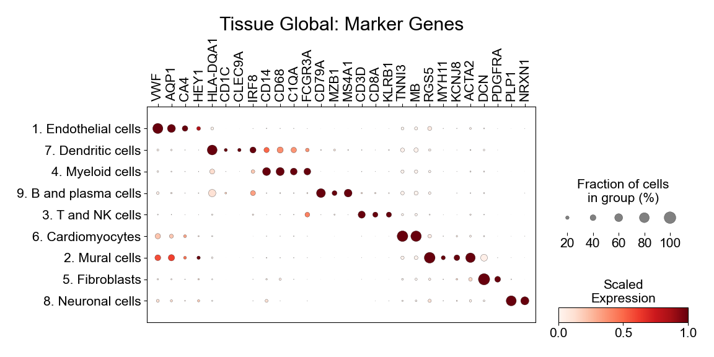
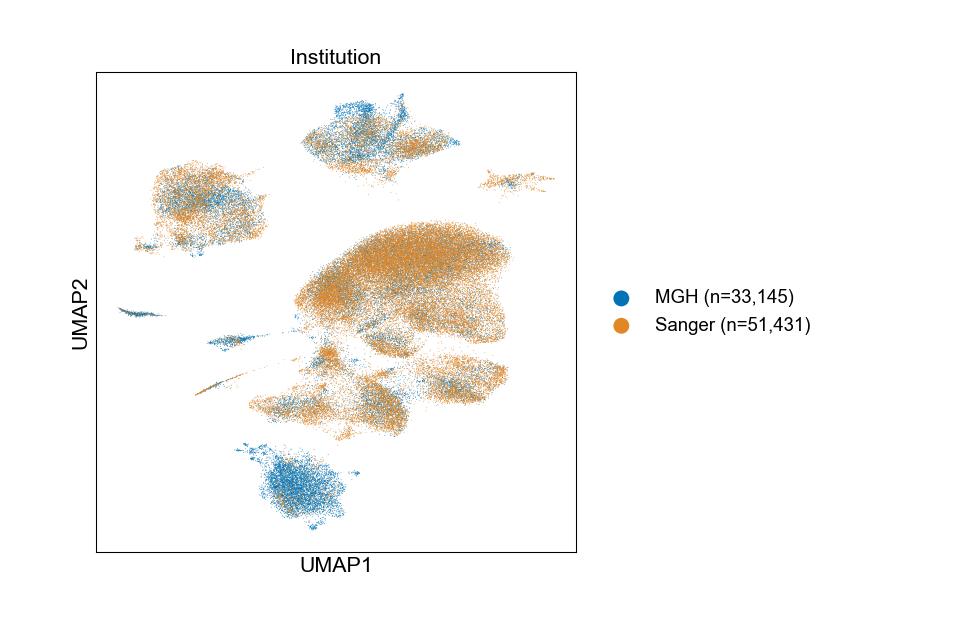
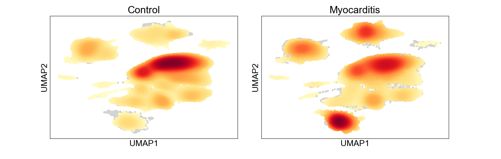
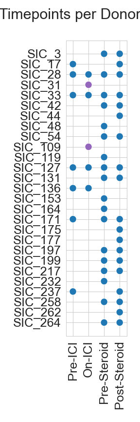
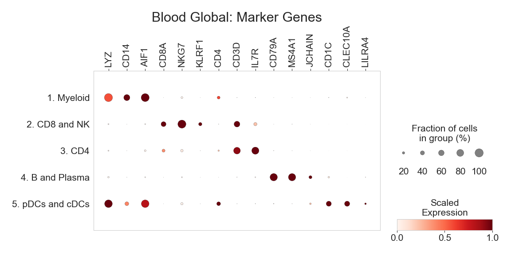
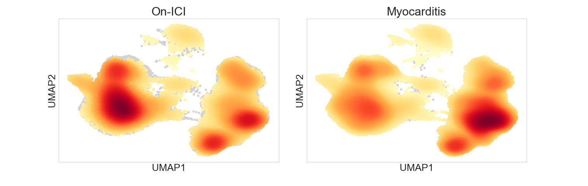
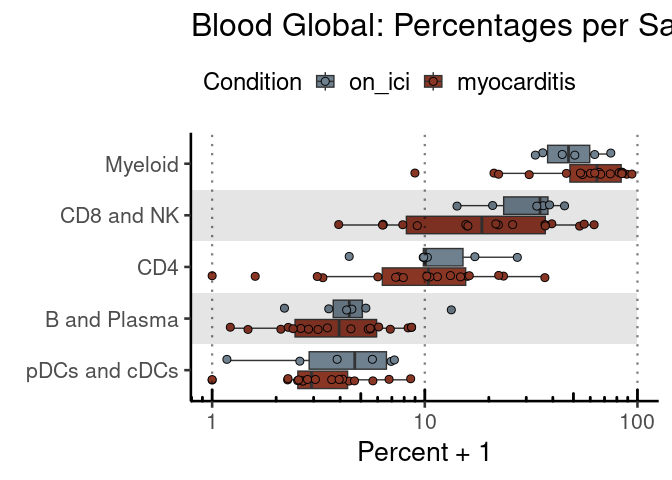
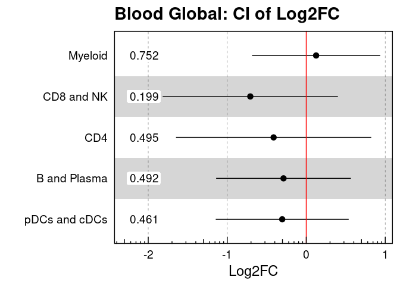
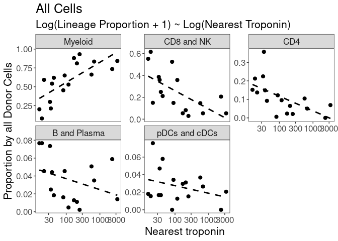

Supplemental Figure 1
================

## Setup

Load R libraries

``` r
library(tidyverse)
library(glue)
library(rlang)
library(parameters)
library(ggforestplot)
library(rmarkdown)
library(reticulate)
use_python("/projects/home/nealpsmith/.conda/envs/updated_pegasus/bin/python")

setwd('/projects/home/ikernin/github_code/myocarditis/functions')
source('stacked_bar.R')
source('blood_condition_abundance.R')
source('blood_troponin_abundance.R')
```

Load Python packages

``` python
import pegasus as pg
import scanpy as sc
import pandas as pd
import seaborn as sns
import matplotlib.pyplot as plt
import warnings
warnings.filterwarnings('ignore')

import sys
sys.path.append("/projects/home/ikernin/github_code/myocarditis/functions")
import python_functions
```

Read in single-cell data

``` python
tissue_global = pg.read_input('/projects/home/ikernin/projects/myocarditis/github_datasets/tissue_global.zarr')
```

``` python
blood_global = pg.read_input('/projects/home/ikernin/projects/myocarditis/github_datasets/blood_global.zarr')
```

## Supplemental Figure 1A

``` python
python_functions.make_gene_dotplot(tissue_global.to_anndata(),
                  cluster_order=['1. Endothelial cells', '7. Dendritic cells', '4. Myeloid cells',
                                 '9. B and plasma cells', '3. T and NK cells', '6. Cardiomyocytes',
                                 '2. Mural cells', '5. Fibroblasts', '8. Neuronal cells',
                            ],
                  gene_order=['VWF', 'AQP1', 'CA4', 'HEY1', 'HLA-DQA1', 'CD1C',
                         'CLEC9A', 'IRF8', 'CD14', 'CD68', 'C1QA', 'FCGR3A',
                         'CD79A', 'MZB1', 'MS4A1', 'CD3D', 'CD8A', 'KLRB1', 'TNNI3',
                         'MB', 'RGS5', 'MYH11', 'KCNJ8', 'ACTA2', 'DCN',
                         'PDGFRA', 'PLP1', 'NRXN1'],
                  title='Tissue Global'
                 )
```



## Supplemental Figure 1B

``` python
# get number of cells from each institution
n_mgh = (tissue_global.obs['institution'] == 'mgh').sum()
n_sanger = (tissue_global.obs['institution'] == 'sanger').sum()
name_dict = {
    'mgh': f'MGH (n={n_mgh:,})',
    'sanger': f'Sanger (n={n_sanger:,})'
}
tissue_global.obs['n_institution'] = [name_dict[x] for x in tissue_global.obs['institution']]

# plot umap
fig = pg.scatter(tissue_global,
                 basis='umap',
                 attrs='n_institution',
                 panel_size=(5,5),
                 palettes="#0072B5FF,#E18727FF",
                 wspace=0.8,
                 return_fig=True)
fig.patch.set_visible(True)
ax = fig.axes[0]
ax.xaxis.label.set_fontsize(16)
ax.yaxis.label.set_fontsize(16)
ax.set_title('Institution', fontsize=16)
ax.legend(bbox_to_anchor=(1.04, 0.5), loc="center left", borderaxespad=0,
          markerscale=20, frameon=False,
          prop={'size': 14})
plt.show()
```



``` python
plt.close()
```

## Supplemental Figure 1D

``` python
tissue_global.obs['Condition'] = [x.capitalize() for x in tissue_global.obs['condition']]
tissue_global_anndata = tissue_global.to_anndata()
sc.tl.embedding_density(tissue_global_anndata, groupby='Condition')
```

    ## ... storing 'n_institution' as categorical
    ## ... storing 'Condition' as categorical

``` python
sc.pl.embedding_density(tissue_global_anndata, basis='umap', key=f'umap_density_Condition', colorbar_loc=None)
```



## Supplemental Figure 1E

``` python
# join all post-steroid timepoints into one category
post_steroid_cats = ['post_steroid', 'post_2nd_line_tx', 'off_is']
blood_global.obs['scatterplot_timepoints'] = ['post_steroid' if x in post_steroid_cats else x for x in blood_global.obs['timepoint_cat']]
blood_global.obs['scatterplot_timepoints'] = blood_global.obs['scatterplot_timepoints'].astype('category')

# get dataframe with timepoints for each donor
subset_df = blood_global.obs[['donor', 'scatterplot_timepoints']]
unique_df = subset_df.drop_duplicates()

# highlight samples used as controls
unique_df['control'] = unique_df['donor'].isin(['SIC_31', 'SIC_109']) & (unique_df['scatterplot_timepoints'] == 'on_ici')

# order donor samples by timepoint
timepoint_order = ['pre_ici', 'on_ici', 'pre_steroid', 'post_steroid']
unique_df['scatterplot_timepoints'] = pd.Categorical(unique_df['scatterplot_timepoints'], timepoint_order)
unique_df = unique_df.sort_values('scatterplot_timepoints')


# plot
sns.set_style("whitegrid")
fig, ax = plt.subplots(figsize=(3, 9))
sns.scatterplot(data=unique_df, x='scatterplot_timepoints', y='donor',
                hue='control', palette=[sns.color_palette()[0], sns.color_palette()[4]],
                s=120, legend=False)
fig.suptitle("Timepoints per Donor")
ax.set(xlabel=None, ylabel=None)
ax.set_xticklabels(['Pre-ICI', 'On-ICI', 'Pre-Steroid', 'Post-Steroid'])
plt.xticks(rotation=90)
```

    ## ([0, 1, 2, 3], [Text(0, 0, 'Pre-ICI'), Text(1, 0, 'On-ICI'), Text(2, 0, 'Pre-Steroid'), Text(3, 0, 'Post-Steroid')])

``` python
plt.margins(x=.15)
plt.subplots_adjust(top=.95, left=.35, bottom=.2)
plt.tight_layout()
plt.show()
```



``` python
plt.close()
```

## Supplemental Figure 1F

``` python
python_functions.make_gene_dotplot(blood_global.to_anndata(),
             cluster_order=['1. Myeloid', '2. CD8 and NK', '3. CD4', '4. B and Plasma', '5. pDCs and cDCs'],
             gene_order=['LYZ', 'CD14', 'AIF1',
                         'CD8A', 'NKG7', 'KLRF1',
                         'CD4', 'CD3D', 'IL7R',
                         'CD79A', 'MS4A1', 'JCHAIN',
                         'CD1C', 'CLEC10A', 'LILRA4'],
             title="Blood Global")
```



## Supplemental Figure 1G

``` python
# subset for timepoints in analyses
blood_subset = blood_global[blood_global.obs['timepoint_cat'].isin(['on_ici', 'pre_steroid'])].copy()
blood_subset.obs['Condition'] = ['On-ICI' if x == 'on_ici' else 'Myocarditis' for x in blood_subset.obs['timepoint_cat']]
blood_subset.obs['Condition'] = pd.Categorical(blood_subset.obs['Condition'], ['On-ICI', 'Myocarditis'])
blood_subset_anndata = blood_subset.to_anndata()
sc.tl.embedding_density(blood_subset_anndata, groupby='Condition')
sc.pl.embedding_density(blood_subset_anndata, basis='umap', key=f'umap_density_Condition', colorbar_loc=None)
```



## Supplemental Figure 1H

``` r
# read in all blood cell metadata
blood_global_obs <- read_csv('/projects/home/ikernin/projects/myocarditis/github_datasets/blood_global_obs.csv')
condition_blood_obs_filtered <- condition_filter_df(blood_global_obs)

# fit lineage level model
lineage_order <- c("Myeloid", "CD8 and NK", "CD4", "B and Plasma", "pDCs and cDCs")
condition_lineage_percents <- condition_get_percent_per_level(condition_blood_obs_filtered, level='lineage') %>%
    set_factor_order(col_name = 'lineage_names', order = lineage_order)
condition_lineage_model <- condition_fit_model(condition_lineage_percents, level='lineage')
paged_table(condition_lineage_model %>%
              select(!c(data, model)) %>%
              unnest(cols = c(condition_coef, condition_se, condition_pval)))

condition_plot_sample_perc(condition_lineage_percents, title='Blood Global', level='lineage')
```

    ## Warning: Transformation introduced infinite values in continuous y-axis

<!-- -->

``` r
condition_plot_ci_interval(condition_lineage_model, 'Blood Global', level='lineage')
```

    ## Warning: Using the `size` aesthetic with geom_rect was deprecated in ggplot2 3.4.0.
    ## ℹ Please use the `linewidth` aesthetic instead.

<!-- -->

<div data-pagedtable="false">

<script data-pagedtable-source type="application/json">
{"columns":[{"label":["lineage_names"],"name":[1],"type":["fct"],"align":["left"]},{"label":["condition_coef"],"name":[2],"type":["dbl"],"align":["right"]},{"label":["condition_se"],"name":[3],"type":["dbl"],"align":["right"]},{"label":["condition_pval"],"name":[4],"type":["dbl"],"align":["right"]},{"label":["padj"],"name":[5],"type":["dbl"],"align":["right"]},{"label":["CI_low"],"name":[6],"type":["dbl"],"align":["right"]},{"label":["CI_high"],"name":[7],"type":["dbl"],"align":["right"]}],"data":[{"1":"B and Plasma","2":"-0.2875080","3":"0.4111846","4":"0.4917424","5":"0.6192912","6":"-1.140253","7":"0.5652366"},{"1":"CD4","2":"-0.4129804","3":"0.5957525","4":"0.4954330","5":"0.6192912","6":"-1.648495","7":"0.8225347"},{"1":"CD8 and NK","2":"-0.7080733","3":"0.5348113","4":"0.1991061","5":"0.6192912","6":"-1.817204","7":"0.4010575"},{"1":"Myeloid","2":"0.1249661","3":"0.3911682","4":"0.7523848","5":"0.7523848","6":"-0.686267","7":"0.9361992"},{"1":"pDCs and cDCs","2":"-0.3040933","3":"0.4057097","4":"0.4614757","5":"0.6192912","6":"-1.145484","7":"0.5372972"}],"options":{"columns":{"min":{},"max":[10]},"rows":{"min":[10],"max":[10]},"pages":{}}}
  </script>

</div>

## Supplemental Figure 1I

``` r
blood_global_obs <- read_csv('/projects/home/ikernin/projects/myocarditis/github_datasets/blood_global_obs.csv')
troponin_blood_obs_filtered <- troponin_filter_df(blood_global_obs)

# fit lineage level model
troponin_lineage_percents <- troponin_get_percent_per_level(troponin_blood_obs_filtered, level='lineage') %>%
  set_factor_order(col_name = 'lineage_names', order = lineage_order)
troponin_lineage_model <- troponin_fit_model(troponin_lineage_percents, level='lineage')

paged_table(troponin_lineage_model %>%
              select(!c(data, model)) %>%
              unnest(cols = c(trop_coef, trop_se, trop_pval)))
troponin_plot_model(troponin_lineage_model, troponin_lineage_percents, "All Cells",
           level='lineage', point_size = 2.2, type='simple')
```

<!-- -->

<div data-pagedtable="false">

<script data-pagedtable-source type="application/json">
{"columns":[{"label":["lineage_names"],"name":[1],"type":["fct"],"align":["left"]},{"label":["trop_coef"],"name":[2],"type":["dbl"],"align":["right"]},{"label":["trop_se"],"name":[3],"type":["dbl"],"align":["right"]},{"label":["trop_pval"],"name":[4],"type":["dbl"],"align":["right"]},{"label":["padj"],"name":[5],"type":["dbl"],"align":["right"]}],"data":[{"1":"B and Plasma","2":"-0.005078876","3":"0.003649957","4":"0.184370523","5":"0.225683480"},{"1":"CD4","2":"-0.030550817","3":"0.009928954","4":"0.007669999","5":"0.012783332"},{"1":"CD8 and NK","2":"-0.056968896","3":"0.018063713","4":"0.006555541","5":"0.012783332"},{"1":"Myeloid","2":"0.077072984","3":"0.019174657","4":"0.001114196","5":"0.005570979"},{"1":"pDCs and cDCs","2":"-0.003623845","3":"0.002868027","4":"0.225683480","5":"0.225683480"}],"options":{"columns":{"min":{},"max":[10]},"rows":{"min":[10],"max":[10]},"pages":{}}}
  </script>

</div>
