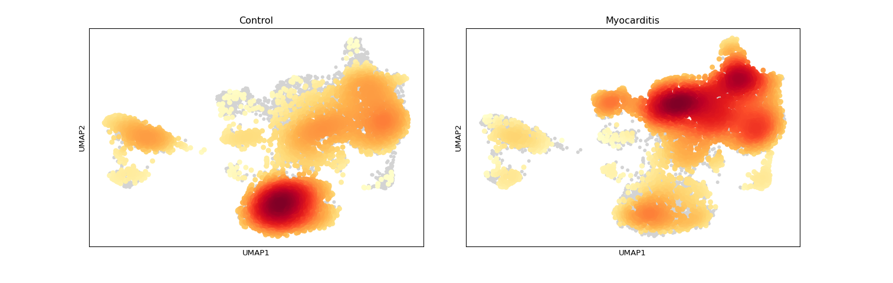
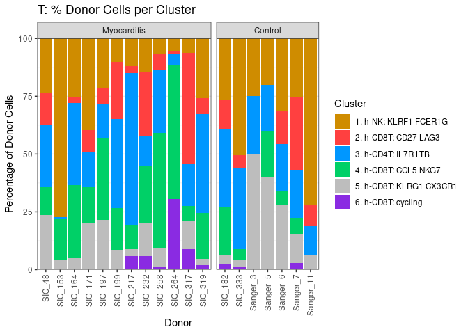
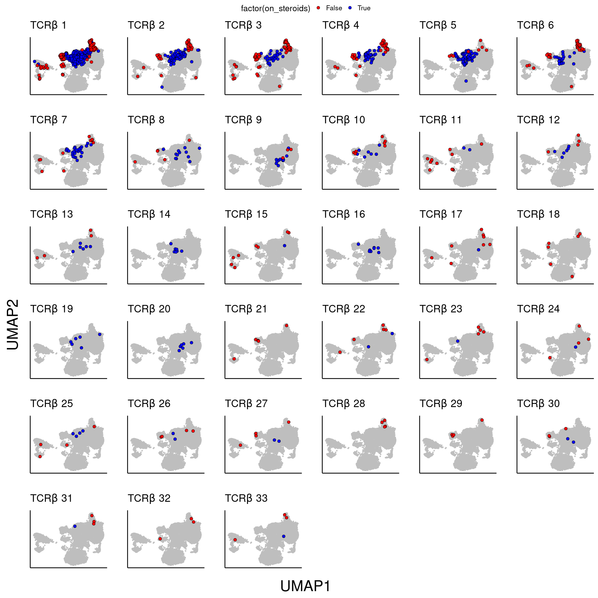
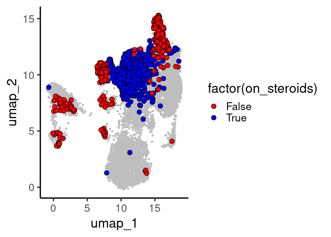
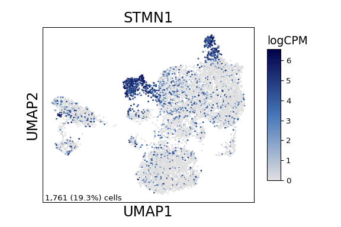
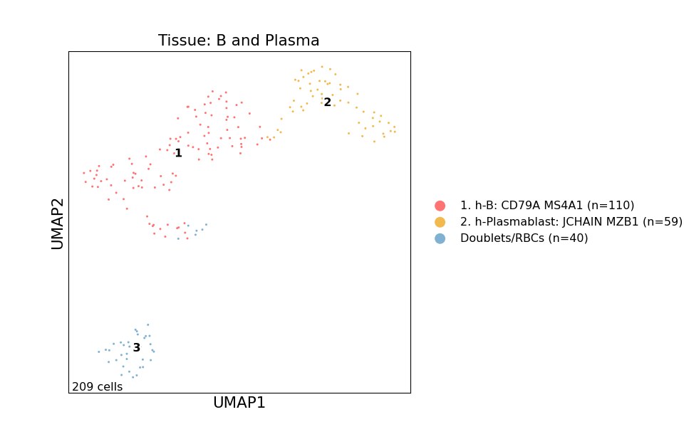

Supplemental Figure 2
================

## Setup

Load R libraries

``` r
library(tidyverse)
library(magrittr)
library(glue)
library(RColorBrewer)
library(ggpubr)
library(ggplot2)
library(grid)
library(reticulate)
use_python("/projects/home/nealpsmith/.conda/envs/updated_pegasus/bin/python")

setwd('/projects/home/ikernin/github_code/myocarditis/functions')
source('stacked_bar.R')
```

Load Python packages

``` python
import pegasus as pg
import scanpy as sc
import warnings
warnings.filterwarnings('ignore')

import sys
sys.path.append("/projects/home/ikernin/github_code/myocarditis/functions")
import python_functions
```

Read in single-cell data

``` python
tissue_t = pg.read_input('/projects/home/ikernin/projects/myocarditis/github_datasets/tissue_t.zarr')
```

``` python
tissue_b = pg.read_input('/projects/home/ikernin/projects/myocarditis/github_datasets/tissue_b.zarr')
```

Read in TCR data

``` r
tissue_cell_info <- read.csv("/projects/home/nealpsmith/projects/myocarditis/tissue/data/tcr/blood_tissue_comps/tissue_cell_info.csv",
                             row.names = 1)
```

## Supplemental Figure 2A

``` python
tissue_t.obs['Condition'] = [x.capitalize() for x in tissue_t.obs['condition']]
tissue_t_anndata = tissue_t.to_anndata()
sc.tl.embedding_density(tissue_t_anndata, groupby='Condition')
sc.pl.embedding_density(tissue_t_anndata, basis='umap', key=f'umap_density_Condition')
```

    ## ... storing 'Condition' as categorical



## Supplemental Figure 2B

``` python
stacked_bar_df = python_functions.get_stacked_bar_df(tissue_t, 't')
stacked_bar_order = tissue_t.obs['umap_name'].cat.categories.values
```

    ## Getting stacked bar info for: t

``` r
stacked_bar_order = py$stacked_bar_order[!str_detect(py$stacked_bar_order, 'Doublets')]
plot_clust_perc_by_donor(py$stacked_bar_df, 't', cluster_order = stacked_bar_order)
```

    ## Warning in py_to_r.pandas.core.frame.DataFrame(x): index contains duplicated
    ## values: row names not set

<!-- -->

## Supplemental Figure 2C

``` r
tissue_cell_info$samp_ster <- paste(tissue_cell_info$donor, tissue_cell_info$on_steroids, sep = "_")
# Re-calculate expaded clones by sample
tcr_props <- tissue_cell_info %>%
  dplyr::select(TRB_cdr3, samp_ster) %>%
  dplyr::filter(TRB_cdr3 != "") %>%
  group_by(samp_ster, TRB_cdr3) %>%
  summarise(n_cells = n()) %>%
  group_by(samp_ster) %>%
  mutate(n_total = sum(n_cells)) %>%
  mutate(perc = n_cells / n_total)

tcr_props$expanded_t_new <- ifelse(tcr_props$perc > 0.005 & tcr_props$n_cells > 1, TRUE, FALSE)

expanded_df <- tcr_props %>%
  dplyr::select(samp_ster, TRB_cdr3, expanded_t_new)

tissue_cell_info %<>%
  left_join(expanded_df, by = c("samp_ster", "TRB_cdr3"))

plot_df <- tissue_cell_info

expanded_clones_pre <- plot_df %>%
  dplyr::filter(donor == "SIC_264", on_steroids == "False", expanded_t_new == TRUE) %>%
  .$TRB_cdr3 %>%
  unique(.)


expanded_clones_post <- plot_df %>%
  dplyr::filter(donor == "SIC_264", on_steroids == "True", expanded_t_new == TRUE) %>%
  .$TRB_cdr3 %>%
  unique(.)

plot_order <- tcr_props %>%
  dplyr::filter(samp_ster %in% c("SIC_264_False", "SIC_264_True"), perc > 0.005, n_cells > 1) %>%
  group_by(TRB_cdr3) %>%
  summarise(n = sum(n_cells)) %>%
  arrange(desc(n)) %>%
  .$TRB_cdr3

plot_list <- list()
num <- 1
for (seq in plot_order){
  plot_df <- tissue_cell_info
  plot_df$clone_oi <- ifelse(plot_df$TRB_cdr3 == seq, TRUE, FALSE)
  plot <- ggplot(plot_df, aes(x = umap_1, y = umap_2)) +
    geom_point(data = select(plot_df, -clone_oi), color = "grey", size = 1) +
    geom_point(data = plot_df[plot_df$clone_oi == TRUE,], pch = 21, size = 3, aes(fill = factor(on_steroids))) +
    scale_fill_manual(values = c("False" = "red", "True" = "blue")) +
    ggtitle(as.expression(bquote(TCR*beta ~ .(num)))) +
    xlab("") + ylab("") +
    theme_classic(base_size = 20) +
    theme(plot.title = element_text(size=25),
          axis.ticks = element_blank(),
          axis.text = element_blank())
  plot_list <- c(plot_list, list(plot))
  num <- num + 1
}

all_plots <- ggarrange(plotlist = plot_list, common.legend = TRUE, legend = "top")
figure <- annotate_figure(all_plots, left = textGrob("UMAP2", rot = 90, vjust = 1, hjust = 1, gp = gpar(cex = 3)),
                          bottom = textGrob("UMAP1", vjust = 0, gp = gpar(cex = 3)))
figure
```

<!-- -->

# Supplemental Figure 2D

``` r
all_exp_clones <- unique(c(expanded_clones_post, expanded_clones_pre))
plot_df <- tissue_cell_info
plot_df$clone_oi <- ifelse(plot_df$TRB_cdr3 %in% all_exp_clones, TRUE, FALSE)
ggplot(plot_df, aes(x = umap_1, y = umap_2)) +
  geom_point(data = select(plot_df, -clone_oi), color = "grey", size = 1) +
  geom_point(data = plot_df[plot_df$clone_oi == TRUE,], pch = 21, size = 3, aes(fill = factor(on_steroids))) +
  scale_fill_manual(values = c("False" = "red", "True" = "blue")) +
  theme_classic(base_size = 20) +
  theme(plot.title = element_text(size=10))
```

<!-- -->

## Supplemental Figure 2E

``` python
python_functions.hex_featureplot(tissue_t, 'STMN1', cmap=python_functions.blues_cmap)
```



## Supplemental Figure 2F

``` python
python_functions.plot_umap(tissue_b, 'Tissue: B and Plasma', python_functions.tissue_b_pal, marker_multiplier=5)
```


