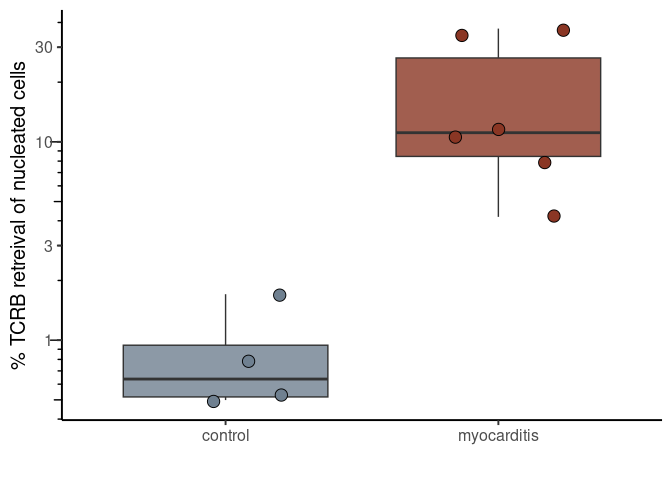
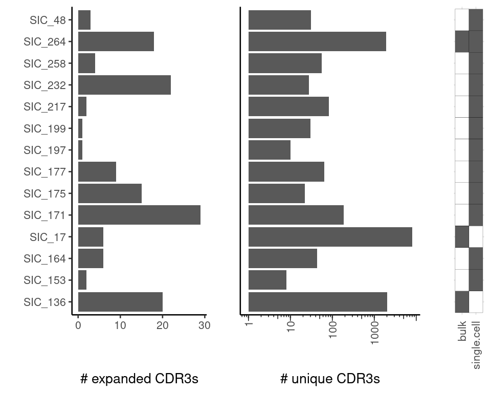
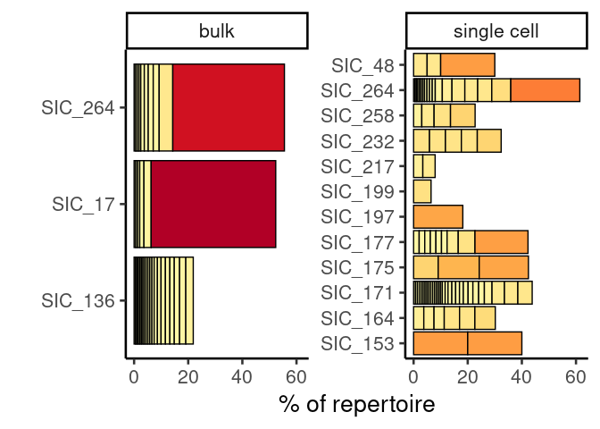
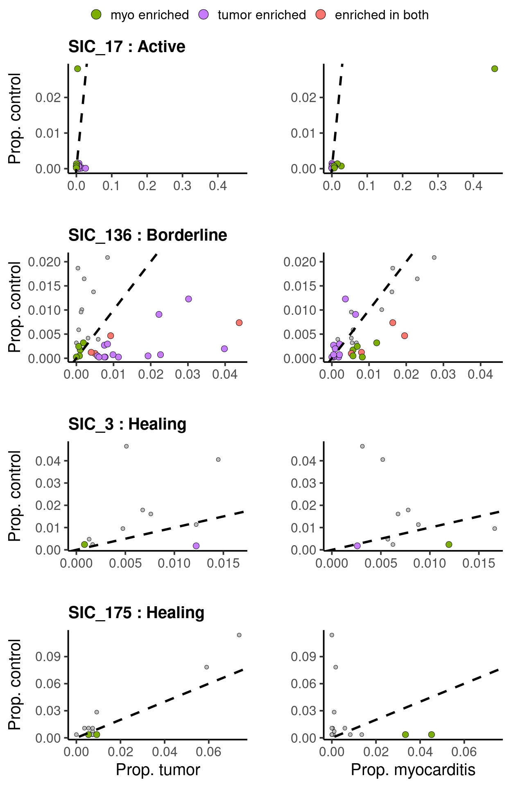
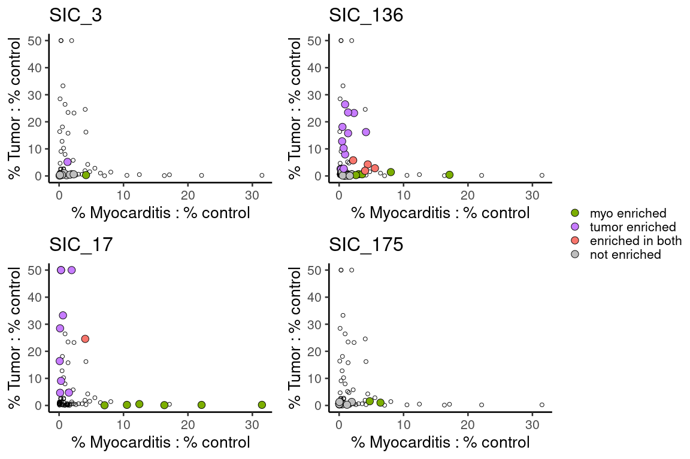

Supplemental Figure 3
================

## Setup

Load R libraries

``` r
library(tidyverse)
library(glue)
library(ggpubr)
library(ggplot2)
library(magrittr)
```

Read in the TCR data

``` r
bulk_tcr_df <- read.csv("/projects/home/nealpsmith/projects/myocarditis/data/adaptive/all_productive_tcrs.csv",
                        row.names = 1)
blood_sc_info = read.csv("/projects/home/nealpsmith/projects/myocarditis/tissue/data/tcr/blood_tissue_comps/cell_info.csv",
                     row.names = 1)
tissue_sc_info <- read.csv("/projects/home/nealpsmith/projects/myocarditis/tissue/data/tcr/blood_tissue_comps/tissue_cell_info.csv",
                             row.names = 1)
tissue_sc_info <- tissue_sc_info[tissue_sc_info$TRB_cdr3 != "",]
### Okay lets look at the overlap between tumor and myocarditis and tumor control in our subjects ###
bulk_tissue_samples = list("SIC_3" = list("tumor" = "A17-341_A2", "control" = "A17-341_A3", "myo" = "A17-341_A27"),
                           "SIC_232" = list("tumor" = "A19-395_A8", "control" = "A19-395_A7", "myo" = "A19-395_A53-1"),
                           "SIC_136" = list("tumor" = "A19-41_A10_Tumor", "control" = "A19-41_A10_Liver", "myo" = "A19-41_A33"),
                           "SIC_17" = list("tumor" = "A18-122_A51", "control" = "A18-122_A52", "myo" = "A18-122_A41"),
                           "SIC_175" = list("tumor" = "A19-230_A5", "control" = "T03054-11", "myo" = "A19-230_A48"),
                           "SIC_266" = list("myo" = "A20-363_A18"),
                           "SIC_264" = list("myo" = "A20-331_A1"),
                           # These are controls
                           "SIC_176" = list("myo" = "A19-213_A13"),
                           "SIC_14" = list("myo" = "T01708-11"),
                           "SIC_182" = list("myo" = "A19-240_A15"),
                           "T01241" = list("myo" = "A16-303_A5")
)
```

## Figure S3A

``` r
# This info was taken from the Adaptive immunoseq platform
plot_df <- read.csv("/projects/home/nealpsmith/projects/myocarditis/data/adaptive/perc_tcrb_of_nucleated_cells.csv")
plot_df$perc <- plot_df$perc * 100
plot_df$category[plot_df$category == "case"] <- "myocarditis"

ggplot(plot_df, aes(x = category, y = perc, fill = category)) +
  geom_boxplot(alpha = 0.8) +
  geom_jitter(width = 0.3, pch = 21, size = 4) +
  scale_fill_manual(values = c("#6f8090", "#8a3624")) +
  scale_y_log10() +
  annotation_logticks(side = "l", outside = TRUE) +
  coord_cartesian(clip = "off") +
  xlab("") +
  ylab("% TCRB retreival of nucleated cells") +
  theme_classic(base_size = 15) +
  theme(legend.position = "none")
```

<!-- -->

## Figure S3B

``` r
blood_overlap_subjs <- intersect(c(names(bulk_tissue_samples), unique(tissue_sc_info$donor)), unique(blood_sc_info$donor))

# Need to remove SIC_3, its healing myocarditis, so different
blood_overlap_subjs <- blood_overlap_subjs[blood_overlap_subjs != "SIC_3"]

# Don't include bulk healing
healing_ids <- c("SIC_3", "SIC_175", "SIC_266", "SIC_232")

myo_tcrs <- lapply(blood_overlap_subjs, function(s){
  subj_tcrs <- c()
  # See if they have bulk TCR
  if(s %in% names(bulk_tissue_samples)){
    if (!s %in% healing_ids){
      bulk_samp <- bulk_tissue_samples[[s]]$myo
      bulk_tcrs <- unique(bulk_tcr_df$amino_acid[bulk_tcr_df$sample == bulk_samp])
      subj_tcrs <- c(subj_tcrs, bulk_tcrs)
    }
  }
  # See if they have single cell TCR
  if (s %in% unique(tissue_sc_info$donor)){
    subj_sc <- tissue_sc_info[tissue_sc_info$donor == s,] %>%
      dplyr::filter(TRB_cdr3 != "")
    sc_tcrs <- unique(subj_sc$TRB_cdr3)
    subj_tcrs <- c(subj_tcrs, sc_tcrs)
  }
  return(subj_tcrs)
})
names(myo_tcrs) <- blood_overlap_subjs


n_tcrs <- lapply(myo_tcrs, function(x) length(x)) %>%
  as.data.frame() %>%
  t() %>%
  `colnames<-`(c("n")) %>%
  as.data.frame() %>%
  rownames_to_column(var = "subj")

bars <- ggplot(n_tcrs, aes(x = n, y = subj)) +
  geom_bar(stat = "identity") +
  scale_x_log10(breaks = c(1, 10, 100, 1000)) +
  annotation_logticks(side = "b", outside = TRUE) +
  coord_cartesian(clip = "off") +
  ylab("") +
  xlab("# unique CDR3s") +
  theme_classic(base_size = 20) +
  theme(axis.text.y = element_blank(),
        axis.ticks.y = element_blank(),
        axis.text.x = element_text(angle = 90, vjust = 0.5, hjust=1),
        legend.position = "none")

# Which datasets did each subject have?
dset_df <- data.frame()
for (s in blood_overlap_subjs){
  if (!s %in% healing_ids){
    bulk <- s %in% names(bulk_tissue_samples)
  } else {
    bulk <- FALSE
  }
  sc <- s %in% unique(tissue_sc_info$donor)
  dset_df <- rbind(dset_df, data.frame("subj" = s, "bulk" = bulk, "single cell" = sc))
}
dset_df <- reshape2::melt(dset_df, id.vars = "subj")
tiles <- ggplot(dset_df, aes(x = variable, y = subj, fill = value)) +
  geom_tile(color = "black") +
  scale_fill_manual(values = c("white", "#5A5A5A")) +
  ylab("") + xlab("") +
  # geom_rect(mapping = aes(xmin = variable, max - )) +
  theme_minimal(base_size = 20) +
  theme(axis.text.y = element_blank(),
        axis.ticks.y = element_blank(),
        axis.text.x = element_text(angle = 90, vjust = 0.5, hjust=1),
        legend.position = "none")

myo_exp_tcrs <- lapply(blood_overlap_subjs, function(s){
  subj_tcrs <- c()
  # See if they have bulk TCR
  if(s %in% names(bulk_tissue_samples)){
    bulk_samp <- bulk_tissue_samples[[s]]$myo
    bulk_tcrs <- bulk_tcr_df[bulk_tcr_df$sample == bulk_samp,] %>%
      dplyr::select(amino_acid, count_templates_reads) %>%
      group_by(amino_acid) %>%
      summarise(n = sum(count_templates_reads)) %>%
      mutate(perc = n / sum(n) * 100)
    bulk_exp <- bulk_tcrs$amino_acid[bulk_tcrs$perc > 0.5 & bulk_tcrs$n > 1]
    subj_tcrs <- c(subj_tcrs, bulk_exp)
  }
  # See if they have single cell TCR
  if (s %in% unique(tissue_sc_info$donor)){
    subj_sc <- tissue_sc_info[tissue_sc_info$donor == s,] %>%
      dplyr::filter(TRB_cdr3 != "") %>%
      dplyr::select(TRB_cdr3) %>%
      mutate("count" =  1) %>%
      group_by(TRB_cdr3) %>%
      summarise(n = sum(count)) %>%
      mutate(perc = n / sum(n) * 100)
    sc_exp <- subj_sc$TRB_cdr3[subj_sc$perc > 0.5 & subj_sc$n > 1]
    subj_tcrs <- c(subj_tcrs, sc_exp)
  }
  return(unique(subj_tcrs))
})
names(myo_exp_tcrs) <- blood_overlap_subjs

n_exp_tcrs <- lapply(myo_exp_tcrs, function(x) length(x)) %>%
  as.data.frame() %>%
  t() %>%
  `colnames<-`(c("n")) %>%
  as.data.frame() %>%
  rownames_to_column(var = "subj")

exp_bars <- ggplot(n_exp_tcrs, aes(x = n, y = subj)) +
  geom_bar(stat = "identity") +
  # scale_x_log10() +
  # annotation_logticks(side = "b", outside = TRUE) +
  # coord_cartesian(clip = "off") +
  ylab("") +
  xlab("# expanded CDR3s") +
  theme_classic(base_size = 20)

# Plot with everything combined
ggarrange(plotlist = list(exp_bars, bars, tiles), nrow = 1, ncol = 3, widths = c(1,1, 0.3), align = "h")
```

<!-- -->

## Figure S3C

``` r
dset_df <- data.frame()
for (s in blood_overlap_subjs){
  if (!s %in% healing_ids){
    bulk <- s %in% names(bulk_tissue_samples)
  } else {
    bulk <- FALSE
  }
  sc <- s %in% unique(tissue_sc_info$donor)
  dset_df <- rbind(dset_df, data.frame("subj" = s, "bulk" = bulk, "single cell" = sc))
}

bulk_subjs <- dset_df[dset_df$bulk == TRUE,]$subj


bulk_exp_props <- lapply(bulk_subjs, function(s){
  bulk_samp <- bulk_tissue_samples[[s]]$myo
  bulk_tcrs <- bulk_tcr_df[bulk_tcr_df$sample == bulk_samp,] %>%
    dplyr::select(amino_acid, count_templates_reads) %>%
    group_by(amino_acid) %>%
    summarise(n = sum(count_templates_reads)) %>%
    mutate(perc = n / sum(n) * 100) %>%
    filter(perc > 0.5, n > 1) %>%
    mutate(donor = s,dtype = "bulk")
  colnames(bulk_tcrs)[colnames(bulk_tcrs) == "amino_acid"] <- "TRB_cdr3"
  return(bulk_tcrs)
}) %>%
  do.call(rbind, .)

sc_subjs <- dset_df[dset_df$single.cell == TRUE,]$subj

sc_exp_props <- lapply(sc_subjs, function(s){
  subj_sc <- tissue_sc_info[tissue_sc_info$donor == s,] %>%
    dplyr::filter(TRB_cdr3 != "") %>%
    dplyr::select(TRB_cdr3) %>%
    mutate("count" =  1) %>%
    group_by(TRB_cdr3) %>%
    summarise(n = sum(count)) %>%
    mutate(perc = n / sum(n) * 100) %>%
    filter(perc > 0.5, n > 1) %>%
    mutate(donor = s, dtype = "single cell")
  return(subj_sc)
}) %>%
  do.call(rbind, .)

plot_df <- rbind(bulk_exp_props, sc_exp_props)
order <- plot_df %>%
  arrange(desc(perc)) %>%
  .$TRB_cdr3 %>%
  unique()
plot_df$TRB_cdr3 <- factor(plot_df$TRB_cdr3, levels = order)
plot_df <- plot_df %>%
  arrange(perc)

ggplot(plot_df, aes(y = donor, x = perc, fill = perc)) +
  geom_bar(position = "stack", stat = "identity", color = "black") +
  facet_wrap(~dtype, scales = "free_y") +
  # scale_fill_continuous(type = "viridis") +
  scale_fill_distiller(palette = "YlOrRd", direction = 1) +
  ylab("") +
  xlab("% of repertoire") +
  theme_classic(base_size = 20) +
  theme(legend.position = "none")
```

<!-- -->

## Figure S3D

``` r
fisher_res <- data.frame()
all_seq_info <- data.frame()

# Lets just look at subjects where we have control tissue
case_control_subjs <- c("SIC_3", "SIC_136", "SIC_17", "SIC_175")

for (subj in case_control_subjs){
  # Get the data for the subject
  subj_data <-  bulk_tcr_df %>%
    dplyr::filter(id == subj)

  subj_by_aa <- subj_data %>%
    dplyr::select(sample, tissue, amino_acid, count_templates_reads) %>%
    group_by(sample, tissue, amino_acid) %>%
    summarise("n_count_aa" = sum(count_templates_reads)) %>%
    group_by(sample) %>%
    dplyr::mutate("perc_of_samp" = n_count_aa / sum(n_count_aa)) # Lets get the proportion of each TCR AA seq in sample

  # Now make seperate dataframes
  subj_split <- split(subj_by_aa, f = subj_by_aa$sample)
  samp_info <- bulk_tissue_samples[[subj]]

  tumor_data <- subj_split[[samp_info$tumor]] %>%
    ungroup() %>%
    dplyr::select(amino_acid, perc_of_samp, n_count_aa) %>%
    `colnames<-`(c("amino_acid", "perc_tumor", "n_tumor"))

  control_data <- subj_split[[samp_info$control]] %>%
    ungroup %>%
    dplyr::select(amino_acid, perc_of_samp, n_count_aa) %>%
    `colnames<-`(c("amino_acid", "perc_control", "n_control"))

  myo_data <- subj_split[[samp_info$myo]] %>%
    ungroup %>%
    dplyr::select(amino_acid, perc_of_samp, n_count_aa) %>%
    `colnames<-`(c("amino_acid", "perc_myo", "n_myo"))

  info_df <- list(tumor_data, control_data, myo_data) %>%
    reduce(full_join, by = c("amino_acid"))
  info_df[is.na(info_df)] <- 0

  info_df$subj <- subj
  # Save all the seq info to a dataframe for a ranking plot
  all_seq_info <- rbind(all_seq_info, info_df)

  # Limit to TCRs found in at least tumor or myo, don't care about those exclusive to control
  info_df %<>%
    dplyr::filter(perc_tumor > 0.005 | perc_myo > 0.005) %>%
    dplyr::filter(n_control > 0) # Decided on this filter to be as strict as possible with analysis
  # Now that we have every TCR and its counts in the tumor, control, myo, lets do the stats
  stats_fisher <- lapply(info_df$amino_acid, function(seq){
    seq_info <- info_df %>% dplyr::filter(amino_acid == seq)
    d <- data.frame(group = c("ctrl", "myo", "tumor"),
                    tcr1_n = c(seq_info$n_control, seq_info$n_myo, seq_info$n_tumor),
                    tcr1_p = c(seq_info$perc_control, seq_info$perc_myo, seq_info$perc_tumor)) %>%
      dplyr::mutate(total_n = c(sum(control_data$n_control), sum(myo_data$n_myo), sum(tumor_data$n_tumor)))

    fisher_myo <- fisher.test(matrix(c(d$tcr1_n[d$group == "myo"],
                                       d$total_n[d$group == "myo"] - d$tcr1_n[d$group == "myo"],
                                       d$tcr1_n[d$group == "ctrl"],
                                       d$total_n[d$group == "ctrl"] - d$tcr1_n[d$group == "ctrl"]), nrow = 2))
    fisher_myo <- broom::tidy(fisher_myo) %>%
      `colnames<-`(paste("fisher", colnames(.), sep = "_")) %>%
      dplyr::mutate(term = "groupmyo")
    fisher_tumor <- fisher.test(matrix(c(d$tcr1_n[d$group == "tumor"],
                                       d$total_n[d$group == "tumor"] - d$tcr1_n[d$group == "tumor"],
                                       d$tcr1_n[d$group == "ctrl"],
                                       d$total_n[d$group == "ctrl"] - d$tcr1_n[d$group == "ctrl"]), nrow = 2))
    fisher_tumor <- broom::tidy(fisher_tumor) %>%
      `colnames<-`(paste("fisher", colnames(.), sep = "_")) %>%
      dplyr::mutate(term = "grouptumor")
    fish_res <- rbind(fisher_myo, fisher_tumor) %>%
      mutate(seq = seq)
    return(fish_res)
  }) %>%
    do.call(rbind, .) %>%
    mutate(subj = subj)

  fisher_by_seq <- data.frame()
  for(s in unique(stats_fisher$seq)){
  seq_info <- stats_fisher %>% dplyr::filter(seq == s)
  df <- data.frame(amino_acid = s,
                   subj = unique(seq_info$subj),
                   myo_log_fc = seq_info$fisher_estimate[seq_info$term == "groupmyo"],
                   tumor_log_fc = seq_info$fisher_estimate[seq_info$term == "grouptumor"],
                   myo_pval = seq_info$fisher_p.value[seq_info$term == "groupmyo"],
                   tumor_pval = seq_info$fisher_p.value[seq_info$term == "grouptumor"],
                   myo_estimate = seq_info$fisher_estimate[seq_info$term == "groupmyo"],
                   tumor_estimate = seq_info$fisher_estimate[seq_info$term == "grouptumor"])
  fisher_by_seq <- rbind(fisher_by_seq, df)
  }
  fisher_by_seq %<>%
    dplyr::left_join(info_df, by = c("amino_acid", "subj"))
  fisher_by_seq$tum_ctl_fc <- sapply(fisher_by_seq$amino_acid, function(s){

    # If it doesn't exist in either, fold-change is set to 1
    if (!s %in% tumor_data$amino_acid & !s %in% control_data$amino_acid){
      return(1)
    }

    # Adding pseudocunts to deal with zeros
    if (s %in% tumor_data$amino_acid){
      perc_tum <- (tumor_data$n_tumor[tumor_data$amino_acid == s] + 1) / (sum(tumor_data$n_tumor) + 1)
    } else {
      perc_tum <- 1 /  (sum(tumor_data$n_tumor) + 1)
    }

    if (s %in% control_data$amino_acid){
      perc_ctl <- (control_data$n_control[control_data$amino_acid == s] + 1) / (sum(control_data$n_control) + 1)
    } else {
      perc_ctl <- 1 / (sum(control_data$n_control) + 1)
    }
    return(perc_tum / perc_ctl)

  })
  fisher_by_seq$myo_ctl_fc <- sapply(fisher_by_seq$amino_acid, function(s){

    if (!s %in% myo_data$amino_acid & !s %in% control_data$amino_acid){
      return(1)
    }
    # Adding pseudocunts to deal with zeros
    if (s %in% myo_data$amino_acid){
      perc_myo <- (myo_data$n_myo[myo_data$amino_acid == s] + 1) / (sum(myo_data$n_myo) + 1)
    } else {
      perc_myo <- 1 /  (sum(myo_data$n_myo) + 1)
    }

    if (s %in% control_data$amino_acid){
      perc_ctl <- (control_data$n_control[control_data$amino_acid == s] + 1) / (sum(control_data$n_control) + 1)
    } else {
      perc_ctl <- 1 / (sum(control_data$n_control) + 1)
    }
    return(perc_myo / perc_ctl)

  })

  # fisher_by_seq$tum_ctl_fc <- fisher_by_seq$perc_tumor / fisher_by_seq$perc_control
  # fisher_by_seq$myo_ctl_fc <- fisher_by_seq$perc_myo / fisher_by_seq$perc_control
  # fisher_by_seq$myo_tum_fc <- fisher_by_seq$perc_myo / fisher_by_seq$perc_tumor

  fisher_res <- rbind(fisher_res, fisher_by_seq)

}

fisher_res$myo_padj <-p.adjust(fisher_res$myo_pval, method = "fdr")
fisher_res$tumor_padj <-p.adjust(fisher_res$tumor_pval, method = "fdr")


fisher_res$tum_ctl_fc[fisher_res$tum_ctl_fc > 50] <- 50
fisher_res$myo_ctl_fc[fisher_res$myo_ctl_fc > 50] <- 50

fisher_res$myo_enriched <- ifelse(fisher_res$myo_padj < 0.05 & fisher_res$myo_log_fc > 1, TRUE, FALSE)
fisher_res$tum_enriched <- ifelse(fisher_res$tumor_padj < 0.05 & fisher_res$tumor_log_fc > 1, TRUE, FALSE)
fisher_res$sig_cat <- ifelse(fisher_res$myo_enriched == TRUE,
                               ifelse(fisher_res$tum_enriched == TRUE, "enriched in both", "myo enriched"),
                               ifelse(fisher_res$tum_enriched == TRUE, "tumor enriched", "not enriched"))

fisher_res$sig_cat <- factor(fisher_res$sig_cat, levels = c("myo enriched", "tumor enriched", "enriched in both", "not enriched"))

order <- c("SIC_17", "SIC_136", "SIC_3", "SIC_175")
pheno_list <- c("SIC_17" = "Active", "SIC_136" = "Borderline", "SIC_3" = "Healing", "SIC_175" = "Healing")
plot_list <- list()
n_enriched_df <- data.frame()
for (subj in order){
  plot_df <- fisher_res[fisher_res$subj == subj,]
  pheno <- pheno_list[[subj]]
  # if (subj == "SIC_232"){
  #   xlab = "Prop. tumor"
  # } else {
  #   xlab = ""
  # }
  # xlab = "Prop. tumor"
  if (subj == "SIC_175"){
      xlab = "Prop. tumor"
    } else {
      xlab = ""
    }
  # plot_df$tum_enriched <- ifelse(plot_df$tum_enriched == TRUE, "TRUE", "FALSE")
  # plot_df$myo_enriched <- ifelse(plot_df$myo_enriched == TRUE, "TRUE", "FALSE")

  # plot_df$enriched <- apply(plot_df, 1, function(df){
  #   if (df[["myo_enriched"]] == TRUE){
  #     if (df[["tum_enriched"]] == TRUE){
  #       return("enriched in both")
  #     } else {
  #       return("myo enriched")
  #     }
  #   } else if (df[["tum_enriched"]] == "TRUE"){
  #     return("tumor enriched")
  #   } else {
  #     return("not enriched")
  #   }
  # })
  plot_df$enriched <- plot_df$sig_cat
  count_df <- data.frame("subj" = subj,
             "n_tumor" = nrow(plot_df[plot_df$enriched == "tumor enriched",]),
             "n_myo" = nrow(plot_df[plot_df$enriched == "myo enriched",]),
             "n_both" = nrow(plot_df[plot_df$enriched == "enriched in both",]))

  n_enriched_df <- rbind(n_enriched_df, count_df)

  xlimit <- max(c(plot_df$perc_tumor, plot_df$perc_myo))
  # plot_df$enriched <- factor(plot_df$enriched, levels = c("myo enriched", "tumor enriched", "enriched in both", "not enriched"))
  ctl_tumor <- ggplot(plot_df, aes(x = perc_tumor, y = perc_control, fill = enriched, size = enriched)) +
      geom_point(data = plot_df[plot_df$enriched == "not enriched",], pch = 21) +
      geom_point(data = plot_df[plot_df$enriched != "not enriched",], pch = 21) +

      geom_abline(slope = 1, size = 2, linetype = "dashed") +
      scale_fill_manual(name = "",  values = c("myo enriched" = '#7CAE00', "tumor enriched" = '#C77CFF',
                                               "enriched in both" = '#F8766D', "not enriched" = "grey")) +
      scale_size_manual(guide = "none", values = c("myo enriched" = 5, "tumor enriched" = 5,
                                                   "enriched in both" = 5, "not enriched" = 3)) +
      scale_x_continuous(limits = c(0, xlimit)) +
      # xlab("prop. tumor") +
      xlab(xlab) +
      ylab("Prop. control") +
      ggtitle(glue("{subj} : {pheno}")) +
      theme_classic(base_size = 30) +
      guides(fill = guide_legend(override.aes = list(size=8))) +
    theme(plot.title = element_text(size=30, face = "bold"))


  # if (subj == "SIC_232"){
  #   xlab = "Prop. myocarditis"
  # } else {
  #   xlab = ""
  # }
  # xlab = "Prop. myocarditis"
  if (subj == "SIC_175"){
    xlab = "Prop. myocarditis"
  } else {
    xlab = ""
  }
  myo_ctl <- ggplot(plot_df, aes(x = perc_myo, y = perc_control, fill = enriched, size = enriched)) +
       geom_point(data = plot_df[plot_df$enriched == "not enriched",], pch = 21) +
      geom_point(data = plot_df[plot_df$enriched != "not enriched",], pch = 21) +
      geom_abline(slope = 1, size = 2, linetype = "dashed") +
       scale_fill_manual(name = "", values = c("myo enriched" = '#7CAE00', "tumor enriched" = '#C77CFF',
                                               "enriched in both" = '#F8766D', "not enriched" = "grey")) +
      scale_size_manual(guide = "none", values = c("myo enriched" = 5, "tumor enriched" = 5,
                                                   "enriched in both" = 5, "not enriched" = 3)) +
      scale_x_continuous(limits = c(0, xlimit)) +
      xlab(xlab) +
      ylab("") +
      # ggtitle(subj) +
      theme_classic(base_size = 30) +
      guides(fill = guide_legend(override.aes = list(size=8))) #+
      # theme(legend.key.size = unit(12, 'cm'))

  plot_list <- c(plot_list, list(ctl_tumor, myo_ctl))

}

figure <- ggarrange(plotlist = plot_list, ncol = 2, nrow = 4, common.legend = TRUE, legend = "top", align = "hv")
figure
```

<!-- -->

## Figure S3E

``` r
plot_list = list()
for (subj in unique(fisher_res$subj)){
  print(subj)
  subj_plot <- fisher_res
  subj_plot$in_subj <- ifelse(subj_plot$subj == subj, "yes", "no")
  subj_plot$sig_cat <- as.character(subj_plot$sig_cat)
  subj_plot$sig_cat <- ifelse(subj_plot$in_subj == "yes", subj_plot$sig_cat, "no")
  subj_plot$sig_cat <- factor(subj_plot$sig_cat, levels = c("myo enriched", "tumor enriched", "enriched in both", "not enriched", "no"))

  p <- ggplot(subj_plot, aes(x = myo_ctl_fc, y = tum_ctl_fc)) +
    geom_point(data = subj_plot[subj_plot$sig_cat == "no",], pch = 21, size = 2) +
    geom_point(data = subj_plot[subj_plot$sig_cat != "no",], pch = 21, size = 4, aes(fill = sig_cat)) +
    scale_fill_manual(values = c("myo enriched" = "#7CAE00",
                                 "tumor enriched" = "#C77CFF",
                                 "enriched in both" = "#F8766D",
                                 "not enriched" = "grey")) +
    xlab("% Myocarditis : % control") +
    ylab("% Tumor : % control") +
    theme_classic(base_size = 20) +
    ggtitle(subj) +
    theme(legend.title = element_blank())

  if (subj == "SIC_136"){
    leg = get_legend(p)
  }

  plot_list <- c(plot_list, list(p))
}
```

    ## [1] "SIC_3"
    ## [1] "SIC_136"
    ## [1] "SIC_17"
    ## [1] "SIC_175"

``` r
ggarrange(plotlist = plot_list, common.legend = TRUE, legend.grob = leg, legend = "right")
```

<!-- -->
