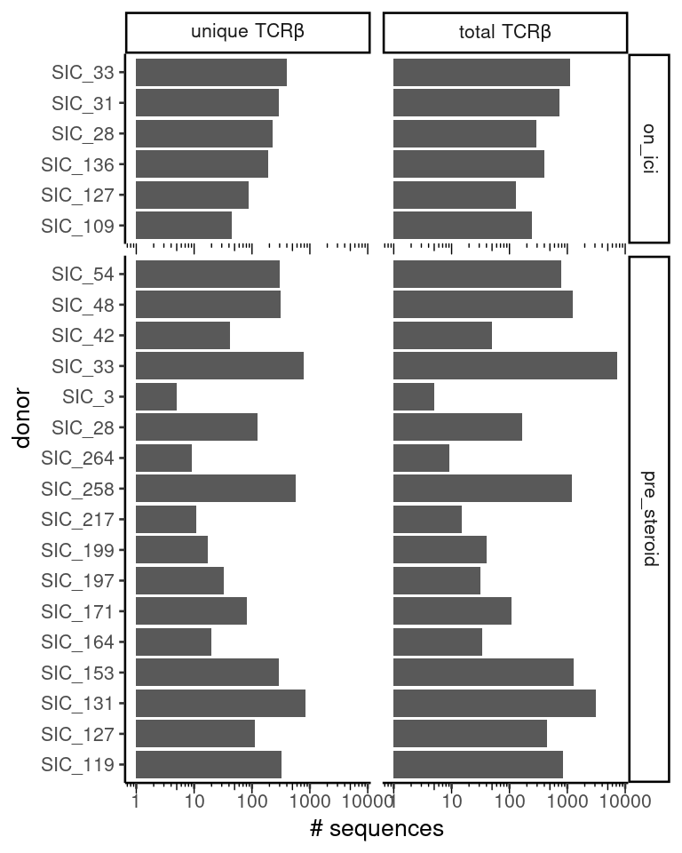
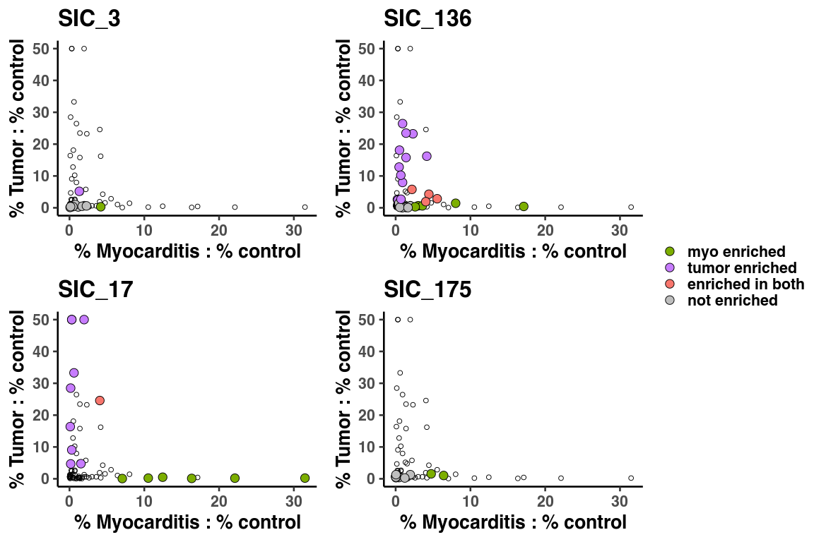
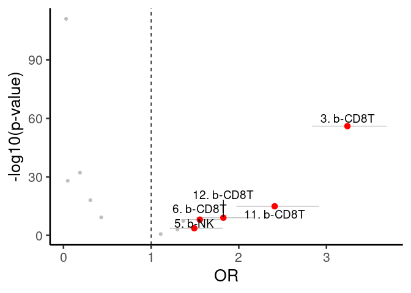
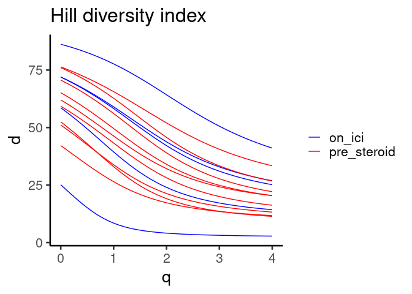
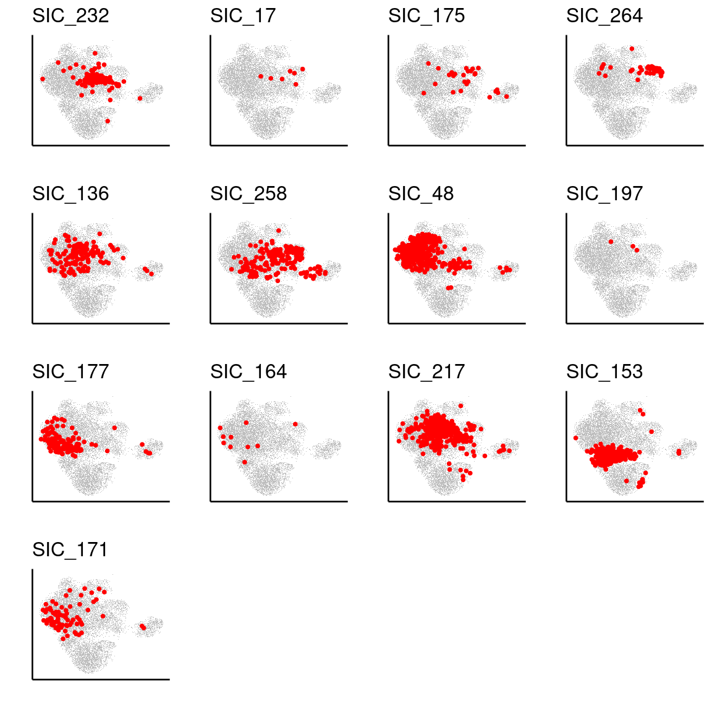
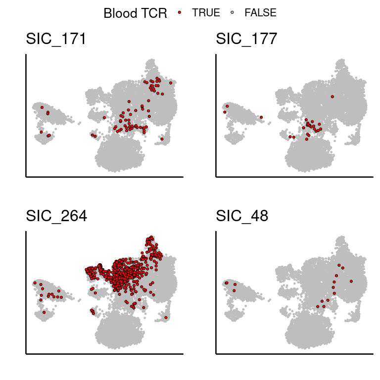

Supplemental Figure 4
================

## Setup

Load R libraries

``` r
library(tidyverse)
library(glue)
library(rlang)
library(parameters)
library(ggforestplot)
library(rmarkdown)
library(knitr)
library(scattermore)
library(magrittr)
library(alakazam)
library(ggrepel)
library(ggpubr)

library(reticulate)
use_python("/projects/home/nealpsmith/.conda/envs/updated_pegasus/bin/python")

setwd('../../functions')

source('stacked_bar.R')
source('blood_condition_abundance.R')
source('blood_fatal_abundance.R')
source('tcr_functions.R')
```

Load Python packages

``` python
import pegasus as pg
import warnings
warnings.filterwarnings('ignore')

import sys
sys.path.append("/projects/home/ikernin/github_code/myocarditis/functions")
import python_functions
```

Read in single-cell data

``` python
blood_cd8_nk = pg.read_input('/projects/home/ikernin/projects/myocarditis/github_datasets/blood_cd8.zarr')
```

``` python
tissue_t = pg.read_input('/projects/home/ikernin/projects/myocarditis/github_datasets/tissue_t.zarr')
```

Read in TCR data

``` r
# Blood TCR info
bulk_tcr_df <- read.csv("/projects/home/nealpsmith/projects/myocarditis/data/adaptive/all_productive_tcrs.csv",
                        row.names = 1)

blood_sc_info = read.csv("/projects/home/nealpsmith/projects/myocarditis/tissue/data/tcr/blood_tissue_comps/cell_info.csv",
                     row.names = 1)
tissue_sc_info <- read.csv("/projects/home/nealpsmith/projects/myocarditis/tissue/data/tcr/blood_tissue_comps/tissue_cell_info.csv",
                             row.names = 1)
tissue_sc_info <- tissue_sc_info[tissue_sc_info$TRB_cdr3 != "",]


bulk_tissue_samples = list("SIC_3" = list("tumor" = "A17-341_A2", "control" = "A17-341_A3", "myo" = "A17-341_A27"),
                           "SIC_232" = list("tumor" = "A19-395_A8", "control" = "A19-395_A7", "myo" = "A19-395_A53-1"),
                           "SIC_136" = list("tumor" = "A19-41_A10_Tumor", "control" = "A19-41_A10_Liver", "myo" = "A19-41_A33"),
                           "SIC_17" = list("tumor" = "A18-122_A51", "control" = "A18-122_A52", "myo" = "A18-122_A41"),
                           "SIC_175" = list("tumor" = "A19-230_A5", "control" = "T03054-11", "myo" = "A19-230_A48"),
                           "SIC_266" = list("myo" = "A20-363_A18"),
                           "SIC_264" = list("myo" = "A20-331_A1"),
                           # These are controls
                           "SIC_176" = list("myo" = "A19-213_A13"),
                           "SIC_14" = list("myo" = "T01708-11"),
                           "SIC_182" = list("myo" = "A19-240_A15"),
                           "T01241" = list("myo" = "A16-303_A5")
)
```

## Supplemental Figure 4A

``` python
# plot gene featureplots
supp_fig4a_genes = ['CD3D', 'CD8A', 'FCER1G', 'CD28']
python_functions.multi_hex_featureplot(blood_cd8_nk,
                      supp_fig4a_genes,
                      ncol=2,
                      cmap=python_functions.blues_cmap,
                      gridsize=200)

# plot percent_mito and n_genes
python_functions.hex_plot(blood_cd8_nk, '% Mito', n_genes=False, gridsize=200, cmap=python_functions.blues_cmap)
python_functions.hex_plot(blood_cd8_nk, 'N Genes', n_genes=True, gridsize=200, cmap=python_functions.blues_cmap)
```

    ##   0%|                                                                                                                                                                 | 0/4 [00:00<?, ?it/s] 25%|######################################2                                                                                                                  | 1/4 [00:00<00:02,  1.30it/s] 50%|############################################################################5                                                                            | 2/4 [00:01<00:01,  1.26it/s] 75%|##################################################################################################################7                                      | 3/4 [00:02<00:00,  1.29it/s]100%|#########################################################################################################################################################| 4/4 [00:03<00:00,  1.26it/s]


## Supplemental Figure 4B

``` r
# read in all blood cell metadata
blood_global_obs <- read_csv('/projects/home/ikernin/projects/myocarditis/github_datasets/blood_global_obs.csv')
condition_blood_obs_filtered <- condition_filter_df(blood_global_obs)

# fit cluster level model
condition_cluster_percents <- condition_get_percent_per_level(condition_blood_obs_filtered, level='cluster')
condition_cluster_model <- condition_fit_model(condition_cluster_percents, level='cluster')
condition_cluster_lineages <- condition_blood_obs_filtered %>% select(cluster_names, lineage_names) %>% distinct()

# get get cd8 lineage level results
cd8_order <- c('b-CD8T: ZNF683 GNLY',
               'b-CD8T: CX3CR1 IKZF2',
               'b-CD8T: TCF7 ITGb',
               'b-CD8T: HLA-DRA RGS1',
               'b-CD8T: IL7R GZMK',
               'b-CD8T: cycling',
               'b-CD8T: CCL3 IFNG',
               'b-CD8T/NK: MT-high',
               'b-MAIT: TRAV1-2 KLRb',
               "b-NK: SPON2 FCER1G",
               'b-NK: KIR2DL3 KLRC2',
               'b-NK: SPTSSB XCL1'
        )
condition_cd8_percents <- condition_cluster_percents %>% filter(cluster_names %in% cd8_order)
condition_cd8_percents <- set_factor_order(condition_cd8_percents , col_name = 'cluster_names', order = cd8_order)
condition_cd8_model <- condition_cluster_model %>% filter(cluster_names %in% cd8_order)
condition_cd8_model <- set_factor_order(condition_cd8_model , col_name = 'cluster_names', order = cd8_order)
kable(condition_cd8_model %>%
              select(!c(data, model)) %>%
              unnest(cols = c(condition_coef, condition_se, condition_pval)))

condition_plot_sample_perc(condition_cd8_percents, title='CD4')
```

    ## Warning: Transformation introduced infinite values in continuous y-axis

<!-- -->

``` r
condition_plot_ci_interval(condition_cd8_model, 'CD4', level='cluster')
```

<!-- -->

| cluster\_names       | condition\_coef | condition\_se | condition\_pval |      padj |     CI\_low |  CI\_high |
| :------------------- | --------------: | ------------: | --------------: | --------: | ----------: | --------: |
| b-CD8T: CCL3 IFNG    |       0.2770525 |     0.5260589 |       0.6037020 | 0.9780158 | \-0.8139268 | 1.3680319 |
| b-CD8T: CX3CR1 IKZF2 |     \-0.4388914 |     0.5292159 |       0.4158292 | 0.9780158 | \-1.5364180 | 0.6586352 |
| b-CD8T: cycling      |     \-0.0560976 |     0.3109941 |       0.8585044 | 0.9780158 | \-0.7010598 | 0.5888647 |
| b-CD8T: HLA-DRA RGS1 |     \-0.3309733 |     0.4843355 |       0.5015164 | 0.9780158 | \-1.3354236 | 0.6734769 |
| b-CD8T: IL7R GZMK    |     \-0.5560673 |     0.4136671 |       0.1925697 | 0.9780158 | \-1.4139602 | 0.3018257 |
| b-CD8T: TCF7 ITGb    |     \-0.2697246 |     0.4670818 |       0.5694870 | 0.9780158 | \-1.2383929 | 0.6989437 |
| b-CD8T: ZNF683 GNLY  |     \-0.7790764 |     0.5634364 |       0.1806255 | 0.9780158 | \-1.9475720 | 0.3894192 |
| b-CD8T/NK: MT-high   |       0.0864633 |     0.3689925 |       0.8169015 | 0.9780158 | \-0.6787804 | 0.8517069 |
| b-MAIT: TRAV1-2 KLRb |     \-0.1437570 |     0.2740497 |       0.6051313 | 0.9780158 | \-0.7121013 | 0.4245872 |
| b-NK: KIR2DL3 KLRC2  |     \-0.4684113 |     0.4359103 |       0.2942169 | 0.9780158 | \-1.3724341 | 0.4356114 |
| b-NK: SPON2 FCER1G   |     \-0.8931065 |     0.5347864 |       0.1090829 | 0.9780158 | \-2.0021856 | 0.2159727 |
| b-NK: SPTSSB XCL1    |     \-0.1356571 |     0.3260439 |       0.6813895 | 0.9780158 | \-0.8118308 | 0.5405165 |

## Supplemental Figure 4C

``` r
# read in all blood cell metadata
fatal_blood_obs_filtered <- fatal_filter_df(blood_global_obs)

# fit cluster level model
fatal_cluster_percents <- fatal_get_percent_per_level(fatal_blood_obs_filtered, level='cluster')
fatal_cluster_model <- fatal_fit_model(fatal_cluster_percents, level='cluster')
fatal_cluster_lineages <- fatal_blood_obs_filtered %>% select(cluster_names, lineage_names) %>% distinct()

# get get cd8 lineage level results
fatal_cd8_percents <- fatal_cluster_percents %>% filter(cluster_names %in% cd8_order)
fatal_cd8_percents <- set_factor_order(fatal_cd8_percents , col_name = 'cluster_names', order = cd8_order)
fatal_cd8_model <- fatal_cluster_model %>% filter(cluster_names %in% cd8_order)
fatal_cd8_model <- set_factor_order(fatal_cd8_model , col_name = 'cluster_names', order = cd8_order)
kable(fatal_cd8_model %>%
              select(!c(data, model)) %>%
              unnest(cols = c(fatal_coef, fatal_se, fatal_pval)))

fatal_plot_sample_perc(fatal_cd8_percents, title='CD4')
```

    ## Warning: Transformation introduced infinite values in continuous y-axis

<!-- -->

``` r
fatal_plot_ci_interval(fatal_cd8_model, 'CD4', level='cluster')
```

<!-- -->

| cluster\_names       | fatal\_coef | fatal\_se | fatal\_pval |      padj |     CI\_low |  CI\_high |
| :------------------- | ----------: | --------: | ----------: | --------: | ----------: | --------: |
| b-CD8T: CCL3 IFNG    |   1.1779975 | 0.7653599 |   0.1433111 | 0.3624134 | \-0.4444931 | 2.8004881 |
| b-CD8T: CX3CR1 IKZF2 |   0.3051770 | 0.7396030 |   0.6853592 | 0.7710291 | \-1.2627113 | 1.8730653 |
| b-CD8T: cycling      |   0.2652488 | 0.4198558 |   0.5364656 | 0.6474234 | \-0.6248057 | 1.1553033 |
| b-CD8T: HLA-DRA RGS1 | \-0.1960120 | 0.6631308 |   0.7713480 | 0.8414706 | \-1.6017864 | 1.2097624 |
| b-CD8T: IL7R GZMK    | \-0.8002777 | 0.5556965 |   0.1691099 | 0.3624134 | \-1.9783016 | 0.3777462 |
| b-CD8T: TCF7 ITGb    | \-0.5170473 | 0.6683901 |   0.4504635 | 0.6220665 | \-1.9339711 | 0.8998765 |
| b-CD8T: ZNF683 GNLY  | \-0.5383805 | 0.7217928 |   0.4665499 | 0.6220665 | \-2.0685129 | 0.9917518 |
| b-CD8T/NK: MT-high   |   1.1169777 | 0.4895270 |   0.0365316 | 0.2590841 |   0.0792267 | 2.1547287 |
| b-MAIT: TRAV1-2 KLRb | \-0.3944105 | 0.3869185 |   0.3231975 | 0.5058744 | \-1.2146410 | 0.4258200 |
| b-NK: KIR2DL3 KLRC2  |   0.0459472 | 0.6234044 |   0.9421597 | 0.9421597 | \-1.2756111 | 1.3675056 |
| b-NK: SPON2 FCER1G   | \-0.6573701 | 0.7431734 |   0.3895015 | 0.5608821 | \-2.2328274 | 0.9180871 |
| b-NK: SPTSSB XCL1    | \-0.5099790 | 0.4235856 |   0.2461159 | 0.4430086 | \-1.4079403 | 0.3879823 |

## Figure S4D

``` r
n_uniques <- blood_sc_info %>%
  dplyr::select(TRB_cdr3, donor, timepoint_cat) %>%
  dplyr::filter(TRB_cdr3 != "", timepoint_cat %in% c("on_ici", "pre_steroid")) %>%
  distinct() %>%
  group_by(donor, timepoint_cat) %>%
  summarise(n = n()) %>%
  mutate(dtype ="unique~TCR*beta")

# Now the total number
n_total <- blood_sc_info %>%
  dplyr::select(TRB_cdr3, donor, timepoint_cat) %>%
  dplyr::filter(TRB_cdr3 != "", timepoint_cat %in% c("on_ici", "pre_steroid")) %>%
  group_by(donor, timepoint_cat) %>%
  summarise(n = n()) %>%
  mutate(dtype = "total~TCR*beta")

plot_df <- rbind(n_total, n_uniques)
plot_df$dtype <- factor(plot_df$dtype, levels = c("unique~TCR*beta", "total~TCR*beta"))
# plot_df$timepoint_cat <- sapply(plot_df$timepoint_cat, function(x) sub("_", " ", x))
plot_df$timepoint_cat <- as.character(plot_df$timepoint_cat)

ggplot(plot_df, aes(x = n, y = donor)) +
  geom_bar(stat = "identity") +
  scale_x_log10() +
  annotation_logticks(side = "b", outside = TRUE) +
  coord_cartesian(clip = "off") +
  xlab("# sequences") +
  facet_grid(timepoint_cat~dtype, labeller = label_parsed, scales = "free_y", space = "free_y") +
  theme_classic(base_size = 20)
```

<!-- -->

## Supplemental figure 4E

``` r
blood_overlap_subjs <- intersect(c(names(bulk_tissue_samples), unique(tissue_sc_info$donor)), unique(blood_sc_info$donor))

# Don't include bulk healing
healing_ids <- c("SIC_3", "SIC_175", "SIC_266", "SIC_232")

myo_exp_tcrs <- lapply(blood_overlap_subjs, function(s){
  subj_tcrs <- c()
  # See if they have bulk TCR
  if(s %in% names(bulk_tissue_samples)){
    if (!s %in% healing_ids){
      bulk_samp <- bulk_tissue_samples[[s]]$myo
      bulk_tcrs <- bulk_tcr_df[bulk_tcr_df$sample == bulk_samp,] %>%
        dplyr::select(amino_acid, count_templates_reads) %>%
        group_by(amino_acid) %>%
        summarise(n = sum(count_templates_reads)) %>%
        mutate(perc = n / sum(n) * 100)
    bulk_exp <- bulk_tcrs$amino_acid[bulk_tcrs$perc > 0.5 & bulk_tcrs$n > 1]
    subj_tcrs <- c(subj_tcrs, bulk_exp)
    }

  }
  # See if they have single cell TCR
  if (s %in% unique(tissue_sc_info$donor)){
    subj_sc <- tissue_sc_info[tissue_sc_info$donor == s,] %>%
      dplyr::filter(TRB_cdr3 != "") %>%
      dplyr::select(TRB_cdr3) %>%
      mutate("count" =  1) %>%
      group_by(TRB_cdr3) %>%
      summarise(n = sum(count)) %>%
      mutate(perc = n / sum(n) * 100)
    sc_exp <- subj_sc$TRB_cdr3[subj_sc$perc > 0.5 & subj_sc$n > 1]
    subj_tcrs <- c(subj_tcrs, sc_exp)
  }
  return(unique(subj_tcrs))
})
names(myo_exp_tcrs) <- blood_overlap_subjs


# Now one for overall
plot_df <- blood_sc_info
plot_df$myo_clone <- FALSE
for (s in blood_overlap_subjs){
  myo_clones <- myo_exp_tcrs[[s]]
  plot_df$myo_clone[plot_df$donor == s & plot_df$TRB_cdr3 %in% myo_clones] <- TRUE

}

ggplot(plot_df, aes(x = umap_1, y = umap_2)) +
  geom_scattermore(data = plot_df[plot_df$myo_clone == FALSE,], color = "grey", size = 1) +
  geom_point(data = plot_df[plot_df$myo_clone == TRUE,], color = "red", size = 2) +
  xlab("UMAP1") + ylab("UMAP2") +
  theme_classic(base_size = 20) +
  theme(axis.ticks = element_blank(), axis.text = element_blank())
```

<!-- -->

## Supplemental Figure 4F

``` r
blood_overlap_subjs <- intersect(c(names(bulk_tissue_samples), unique(tissue_sc_info$donor)), unique(blood_sc_info$donor))
# Need to remove healing myocarditis (for which we have bulk TCR for), its different
healing_ids <- c("SIC_3", "SIC_175", "SIC_266")

myo_exp_tcrs <- lapply(blood_overlap_subjs, function(s){
  subj_tcrs <- c()
  # See if they have bulk TCR
  if(s %in% names(bulk_tissue_samples)){
    if (!s %in% healing_ids){
      bulk_samp <- bulk_tissue_samples[[s]]$myo
      bulk_tcrs <- bulk_tcr_df[bulk_tcr_df$sample == bulk_samp,] %>%
        dplyr::select(amino_acid, count_templates_reads) %>%
        group_by(amino_acid) %>%
        summarise(n = sum(count_templates_reads)) %>%
        mutate(perc = n / sum(n) * 100)
    bulk_exp <- bulk_tcrs$amino_acid[bulk_tcrs$perc > 0.5 & bulk_tcrs$n > 1]
    subj_tcrs <- c(subj_tcrs, bulk_exp)
    }

  }
  # See if they have single cell TCR
  if (s %in% unique(tissue_sc_info$donor)){
    subj_sc <- tissue_sc_info[tissue_sc_info$donor == s,] %>%
      dplyr::filter(TRB_cdr3 != "") %>%
      dplyr::select(TRB_cdr3) %>%
      mutate("count" =  1) %>%
      group_by(TRB_cdr3) %>%
      summarise(n = sum(count)) %>%
      mutate(perc = n / sum(n) * 100)
    sc_exp <- subj_sc$TRB_cdr3[subj_sc$perc > 0.5 & subj_sc$n > 1]
    subj_tcrs <- c(subj_tcrs, sc_exp)
  }
  return(unique(subj_tcrs))
})
names(myo_exp_tcrs) <- blood_overlap_subjs

info_df <- blood_sc_info[blood_sc_info$donor %in% blood_overlap_subjs,]
info_df$myo_clone <- "False"
for (s in blood_overlap_subjs){
  myo_clones <- myo_exp_tcrs[[s]]
  info_df$myo_clone[info_df$donor == s & info_df$TRB_cdr3 %in% myo_clones] <- "True"
}

df <- tcr_assoc_func(info_df, cluster = info_df$leiden_labels, contrast = "myo_clone")

new_names <- c("cluster1" = "2. b-NK",
               "cluster2" = "1. b-CD8T",
               "cluster3" = "3. b-CD8T",
               "cluster4" = "4. b-CD8T",
               "cluster5" = "5. b-NK",
               "cluster6" = "6. b-CD8T",
               "cluster7" = "7. b-CD8T",
               "cluster8" = "8. b-CD8T/NK",
               "cluster9" = "MNP/T doublets",
               "cluster10" = "9. b-MAIT",
               "cluster11" = "10.b-NK",
               "cluster12" = "11. b-CD8T",
               "cluster13" = "12. b-CD8T")
df$cluster <- sapply(df$cluster, function(x) new_names[[x]])


ggplot(df, aes(x = myo_clone.OR, y = -log10(model.pvalue))) +
  geom_errorbarh(data = df[df$model.padj < 0.05 & df$myo_clone.OR > 1.42,],
                 aes(xmax = myo_clone.OR.95pct.ci.upper, xmin = myo_clone.OR.95pct.ci.lower),
                 color = "grey", height = 0) +
  geom_point(data = df[df$model.padj > 0.05 | df$myo_clone.OR < 1.42,],
             color = "grey") +
  geom_point(data = df[df$model.padj < 0.05 & df$myo_clone.OR > 1.42,],
             color = "red", size = 3) +
  geom_text_repel(data = df[df$model.padj < 0.05 & df$myo_clone.OR > 1.42,],
                  aes(label = cluster), size = 5, direction = "y") +
  geom_vline(xintercept = 1, linetype = "dashed") +
  xlab("OR") + ylab("-log10(p-value)") +
  theme_classic(base_size = 20)
```

<!-- -->

## Supplemental Figure 4G

``` r
# Only take cells with full TCR info
cd8_info <- blood_sc_info[blood_sc_info$TRA_cdr3 != "" & blood_sc_info$TRB_cdr3 != "" &
                             blood_sc_info$TRA_v_gene != "" & blood_sc_info$TRB_v_gene != "",]

# Change the column name to be compatible
colnames(cd8_info)[colnames(cd8_info) == "clone"] <- "clone_id"

div_df <- cd8_info[,c("clone_id", "sample_id")]

div <- alphaDiversity(div_df, group = "sample_id", nboot = 100, min_n = 100)
```

    ## [1] "MADE IT!"
    ## # A tibble: 1,558 × 9
    ## # Groups:   sample_id [38]
    ##    sample_id       q     d  d_sd d_lower d_upper     e e_lower e_upper
    ##    <chr>       <dbl> <dbl> <dbl>   <dbl>   <dbl> <dbl>   <dbl>   <dbl>
    ##  1 SIC_109_368   0   25.1   3.18   18.9     31.4 1       0.752   1.25 
    ##  2 SIC_109_368   0.1 23.0   3.02   17.1     28.9 0.916   0.680   1.15 
    ##  3 SIC_109_368   0.2 20.9   2.84   15.4     26.5 0.833   0.612   1.05 
    ##  4 SIC_109_368   0.3 18.9   2.65   13.7     24.1 0.752   0.546   0.959
    ##  5 SIC_109_368   0.4 17.0   2.44   12.2     21.8 0.675   0.485   0.866
    ##  6 SIC_109_368   0.5 15.2   2.23   10.8     19.5 0.603   0.429   0.777
    ##  7 SIC_109_368   0.6 13.5   2.02    9.52    17.4 0.536   0.378   0.694
    ##  8 SIC_109_368   0.7 12.0   1.82    8.39    15.5 0.476   0.334   0.618
    ##  9 SIC_109_368   0.8 10.6   1.63    7.42    13.8 0.423   0.295   0.550
    ## 10 SIC_109_368   0.9  9.45  1.47    6.58    12.3 0.376   0.262   0.490
    ## # … with 1,548 more rows

``` r
# Add timepoint info
timepoint_info <- cd8_info %>%
  dplyr::select("sample_id", "timepoint_cat", "donor") %>%
  distinct()

div %<>%
  left_join(timepoint_info, by = "sample_id")
div$timepoint_cat <- factor(div$timepoint_cat)
div$donor <- factor(div$donor)

plot_df <- div[div$timepoint_cat %in% c("on_ici", "pre_steroid"),]

ggplot(plot_df, aes_string(x = "q", y = "d", group = "sample_id", color = "timepoint_cat")) +
  geom_line() +
  # facet_wrap(~donor) +
  scale_color_manual(values = c("blue", "red")) +
  ggtitle("Hill diversity index") + baseTheme() +
  xlab("q") + ylab("d") +
  theme_classic(base_size = 20) +
  theme(legend.title = element_blank())
```

<!-- -->

## Supplemental Figure 4H

``` r
subj_order <- c("SIC_232", "SIC_17", "SIC_175", "SIC_264", "SIC_136", "SIC_258", "SIC_48", "SIC_197",
                "SIC_177", "SIC_164", "SIC_217", "SIC_153", "SIC_171")

plot_list <- list()
for (s in subj_order){
  myo_clones <- myo_exp_tcrs[[s]]

  plot_df <- blood_sc_info
  plot_df$myo_clone <- ifelse(plot_df$donor == s & plot_df$TRB_cdr3 %in% myo_clones, TRUE, FALSE)

  plot <- ggplot(plot_df, aes(x = umap_1, y = umap_2)) +
    geom_scattermore(data = plot_df[plot_df$myo_clone == FALSE,], color = "grey", size = 1) +
    geom_point(data = plot_df[plot_df$myo_clone == TRUE,], color = "red", size = 2) +
    xlab("") + ylab("") +
    theme_classic(base_size = 20) +
    ggtitle(s) +
    theme(axis.ticks = element_blank(), axis.text = element_blank())
  plot_list <- c(plot_list, list(plot))

}
figure <- ggarrange(plotlist = plot_list, ncol = 4, nrow = 4, common.legend = TRUE, legend = "right")
figure
```

<!-- -->

## Supplemental Figure 4I

``` r
# This dataframe is the same as "tissue_sc_info",
# but includes all cells (not just those tissue cells with a recovered TCR)
tissue_cell_info <- read.csv("/projects/home/nealpsmith/projects/myocarditis/tissue/data/tcr/blood_tissue_comps/tissue_cell_info.csv",
                             row.names = 1)


# Make the associated UMAPs
subj_list <- tissue_cell_info %>%
  dplyr::filter(blood_clone == "True") %>%
  dplyr::select(donor, blood_clone) %>%
  group_by(donor) %>%
  summarise(n=n()) %>%
  dplyr::filter(n > 10) %>%
  .$donor

plot_list <- list()
for (s in subj_list){
  plot_df <- tissue_cell_info
  plot_df$blood_clone <- ifelse(plot_df$donor == s & plot_df$blood_clone == "True", "TRUE", "FALSE")

  plot <- ggplot(plot_df, aes(x = umap_1, y = umap_2)) +
    geom_point(data = plot_df[plot_df$blood_clone == "FALSE",], aes(fill = blood_clone), color = "grey", size = 1) +
    geom_point(data = plot_df[plot_df$blood_clone == "TRUE",], pch = 21, aes(fill = blood_clone), size = 1.5) +
    xlab("") + ylab("") +
    scale_fill_manual(name = "Blood TCR", breaks = c("TRUE", "FALSE"),
                      values = c("TRUE" = "red", "FALSE" = "grey")) +
    theme_classic(base_size = 20) +
    ggtitle(s) +
    theme(axis.ticks = element_blank(), axis.text = element_blank())
  plot_list <- c(plot_list, list(plot))

}
all_plots <- ggarrange(plotlist = plot_list, common.legend = TRUE)
all_plots
```

<!-- -->

## Supplemental Figure 4J

``` python

supp_fig4j_genes = ['CXCR3', 'CX3CR1']
python_functions.multi_hex_featureplot(tissue_t,
                      supp_fig4j_genes,
                      ncol=2,
                      cmap=python_functions.blues_cmap,
                      gridsize=200)
```

    ##   0%|                                                                                                                                                                 | 0/2 [00:00<?, ?it/s] 50%|############################################################################5                                                                            | 1/2 [00:00<00:00,  3.23it/s]100%|#########################################################################################################################################################| 2/2 [00:00<00:00,  3.62it/s]


