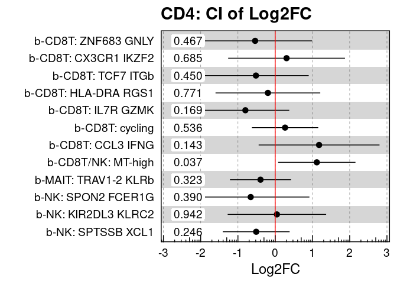

Supplemental Figure 4
================

## Setup

Load R libraries

``` r
library(tidyverse)
library(glue)
library(rlang)
library(parameters)
library(ggforestplot)
library(rmarkdown)
library(knitr)

library(reticulate)
use_python("/projects/home/nealpsmith/.conda/envs/updated_pegasus/bin/python")

setwd('/projects/home/ikernin/github_code/myocarditis/functions')
source('stacked_bar.R')
source('blood_condition_abundance.R')
source('blood_fatal_abundance.R')
```

Load Python packages

``` python
import pegasus as pg
import warnings
warnings.filterwarnings('ignore')

import sys
sys.path.append("/projects/home/ikernin/github_code/myocarditis/functions")
import python_functions
```

Read in single-cell data

``` python
blood_cd8_nk = pg.read_input('/projects/home/ikernin/projects/myocarditis/github_datasets/blood_cd8.zarr')
```

``` python
tissue_t = pg.read_input('/projects/home/ikernin/projects/myocarditis/github_datasets/tissue_t.zarr')
```

## Supplemental Figure 4A

``` python
# plot gene featureplots
supp_fig4a_genes = ['CD3D', 'CD8A', 'FCER1G', 'CD28']
python_functions.multi_hex_featureplot(blood_cd8_nk,
                      supp_fig4a_genes,
                      ncol=2,
                      cmap=python_functions.blues_cmap,
                      gridsize=200)

# plot percent_mito and n_genes
python_functions.hex_plot(blood_cd8_nk, '% Mito', n_genes=False, gridsize=200, cmap=python_functions.blues_cmap)
python_functions.hex_plot(blood_cd8_nk, 'N Genes', n_genes=True, gridsize=200, cmap=python_functions.blues_cmap)
```

    ##   0%|                                                                                               | 0/4 [00:00<?, ?it/s] 25%|#####################7                                                                 | 1/4 [00:01<00:03,  1.08s/it] 50%|###########################################5                                           | 2/4 [00:02<00:02,  1.12s/it] 75%|#################################################################2                     | 3/4 [00:03<00:01,  1.08s/it]100%|#######################################################################################| 4/4 [00:04<00:00,  1.11s/it]100%|#######################################################################################| 4/4 [00:04<00:00,  1.10s/it]


## Supplemental Figure 4B

``` r
# read in all blood cell metadata
blood_global_obs <- read_csv('/projects/home/ikernin/projects/myocarditis/github_datasets/blood_global_obs.csv')
condition_blood_obs_filtered <- condition_filter_df(blood_global_obs)

# fit cluster level model
condition_cluster_percents <- condition_get_percent_per_level(condition_blood_obs_filtered, level='cluster')
condition_cluster_model <- condition_fit_model(condition_cluster_percents, level='cluster')
condition_cluster_lineages <- condition_blood_obs_filtered %>% select(cluster_names, lineage_names) %>% distinct()

# get get cd8 lineage level results
cd8_order <- c('b-CD8T: ZNF683 GNLY',
               'b-CD8T: CX3CR1 IKZF2',
               'b-CD8T: TCF7 ITGb',
               'b-CD8T: HLA-DRA RGS1',
               'b-CD8T: IL7R GZMK',
               'b-CD8T: cycling',
               'b-CD8T: CCL3 IFNG',
               'b-CD8T/NK: MT-high',
               'b-MAIT: TRAV1-2 KLRb',
               "b-NK: SPON2 FCER1G",
               'b-NK: KIR2DL3 KLRC2',
               'b-NK: SPTSSB XCL1'
        )
condition_cd8_percents <- condition_cluster_percents %>% filter(cluster_names %in% cd8_order)
condition_cd8_percents <- set_factor_order(condition_cd8_percents , col_name = 'cluster_names', order = cd8_order)
condition_cd8_model <- condition_cluster_model %>% filter(cluster_names %in% cd8_order)
condition_cd8_model <- set_factor_order(condition_cd8_model , col_name = 'cluster_names', order = cd8_order)
kable(condition_cd8_model %>%
              select(!c(data, model)) %>%
              unnest(cols = c(condition_coef, condition_se, condition_pval)))

condition_plot_sample_perc(condition_cd8_percents, title='CD4')
```

    ## Warning: Transformation introduced infinite values in continuous y-axis

<!-- -->

``` r
condition_plot_ci_interval(condition_cd8_model, 'CD4', level='cluster')
```

    ## Warning: Using the `size` aesthetic with geom_rect was deprecated in ggplot2 3.4.0.
    ## ℹ Please use the `linewidth` aesthetic instead.

<!-- -->

| cluster\_names       | condition\_coef | condition\_se | condition\_pval |      padj |     CI\_low |  CI\_high |
| :------------------- | --------------: | ------------: | --------------: | --------: | ----------: | --------: |
| b-CD8T: CCL3 IFNG    |       0.2770525 |     0.5260589 |       0.6037020 | 0.9780158 | \-0.8139268 | 1.3680319 |
| b-CD8T: CX3CR1 IKZF2 |     \-0.4388914 |     0.5292159 |       0.4158292 | 0.9780158 | \-1.5364180 | 0.6586352 |
| b-CD8T: cycling      |     \-0.0560976 |     0.3109941 |       0.8585044 | 0.9780158 | \-0.7010598 | 0.5888647 |
| b-CD8T: HLA-DRA RGS1 |     \-0.3309733 |     0.4843355 |       0.5015164 | 0.9780158 | \-1.3354236 | 0.6734769 |
| b-CD8T: IL7R GZMK    |     \-0.5560673 |     0.4136671 |       0.1925697 | 0.9780158 | \-1.4139602 | 0.3018257 |
| b-CD8T: TCF7 ITGb    |     \-0.2697246 |     0.4670818 |       0.5694870 | 0.9780158 | \-1.2383929 | 0.6989437 |
| b-CD8T: ZNF683 GNLY  |     \-0.7790764 |     0.5634364 |       0.1806255 | 0.9780158 | \-1.9475720 | 0.3894192 |
| b-CD8T/NK: MT-high   |       0.0864633 |     0.3689925 |       0.8169015 | 0.9780158 | \-0.6787804 | 0.8517069 |
| b-MAIT: TRAV1-2 KLRb |     \-0.1437570 |     0.2740497 |       0.6051313 | 0.9780158 | \-0.7121013 | 0.4245872 |
| b-NK: KIR2DL3 KLRC2  |     \-0.4684113 |     0.4359103 |       0.2942169 | 0.9780158 | \-1.3724341 | 0.4356114 |
| b-NK: SPON2 FCER1G   |     \-0.8931065 |     0.5347864 |       0.1090829 | 0.9780158 | \-2.0021856 | 0.2159727 |
| b-NK: SPTSSB XCL1    |     \-0.1356571 |     0.3260439 |       0.6813895 | 0.9780158 | \-0.8118308 | 0.5405165 |

## Supplemental Figure 4C

``` r
# read in all blood cell metadata
fatal_blood_obs_filtered <- fatal_filter_df(blood_global_obs)

# fit cluster level model
fatal_cluster_percents <- fatal_get_percent_per_level(fatal_blood_obs_filtered, level='cluster')
fatal_cluster_model <- fatal_fit_model(fatal_cluster_percents, level='cluster')
fatal_cluster_lineages <- fatal_blood_obs_filtered %>% select(cluster_names, lineage_names) %>% distinct()

# get get cd8 lineage level results
fatal_cd8_percents <- fatal_cluster_percents %>% filter(cluster_names %in% cd8_order)
fatal_cd8_percents <- set_factor_order(fatal_cd8_percents , col_name = 'cluster_names', order = cd8_order)
fatal_cd8_model <- fatal_cluster_model %>% filter(cluster_names %in% cd8_order)
fatal_cd8_model <- set_factor_order(fatal_cd8_model , col_name = 'cluster_names', order = cd8_order)
kable(fatal_cd8_model %>%
              select(!c(data, model)) %>%
              unnest(cols = c(fatal_coef, fatal_se, fatal_pval)))

fatal_plot_sample_perc(fatal_cd8_percents, title='CD4')
```

    ## Warning: Transformation introduced infinite values in continuous y-axis

<!-- -->

``` r
fatal_plot_ci_interval(fatal_cd8_model, 'CD4', level='cluster')
```

<!-- -->

| cluster\_names       | fatal\_coef | fatal\_se | fatal\_pval |      padj |     CI\_low |  CI\_high |
| :------------------- | ----------: | --------: | ----------: | --------: | ----------: | --------: |
| b-CD8T: CCL3 IFNG    |   1.1779975 | 0.7653599 |   0.1433111 | 0.3624134 | \-0.4444931 | 2.8004881 |
| b-CD8T: CX3CR1 IKZF2 |   0.3051770 | 0.7396030 |   0.6853592 | 0.7710291 | \-1.2627113 | 1.8730653 |
| b-CD8T: cycling      |   0.2652488 | 0.4198558 |   0.5364656 | 0.6474234 | \-0.6248057 | 1.1553033 |
| b-CD8T: HLA-DRA RGS1 | \-0.1960120 | 0.6631308 |   0.7713480 | 0.8414706 | \-1.6017864 | 1.2097624 |
| b-CD8T: IL7R GZMK    | \-0.8002777 | 0.5556965 |   0.1691099 | 0.3624134 | \-1.9783016 | 0.3777462 |
| b-CD8T: TCF7 ITGb    | \-0.5170473 | 0.6683901 |   0.4504635 | 0.6220665 | \-1.9339711 | 0.8998765 |
| b-CD8T: ZNF683 GNLY  | \-0.5383805 | 0.7217928 |   0.4665499 | 0.6220665 | \-2.0685129 | 0.9917518 |
| b-CD8T/NK: MT-high   |   1.1169777 | 0.4895270 |   0.0365316 | 0.2590841 |   0.0792267 | 2.1547287 |
| b-MAIT: TRAV1-2 KLRb | \-0.3944105 | 0.3869185 |   0.3231975 | 0.5058744 | \-1.2146410 | 0.4258200 |
| b-NK: KIR2DL3 KLRC2  |   0.0459472 | 0.6234044 |   0.9421597 | 0.9421597 | \-1.2756111 | 1.3675056 |
| b-NK: SPON2 FCER1G   | \-0.6573701 | 0.7431734 |   0.3895015 | 0.5608821 | \-2.2328274 | 0.9180871 |
| b-NK: SPTSSB XCL1    | \-0.5099790 | 0.4235856 |   0.2461159 | 0.4430086 | \-1.4079403 | 0.3879823 |

## Supplemental Figure 4J

``` python
supp_fig4j_genes = ['CXCR3', 'CX3CR1']
python_functions.multi_hex_featureplot(tissue_t,
                      supp_fig4j_genes,
                      ncol=2,
                      cmap=python_functions.blues_cmap,
                      gridsize=200)
```

    ##   0%|                                                                                               | 0/2 [00:00<?, ?it/s] 50%|###########################################5                                           | 1/2 [00:00<00:00,  1.98it/s]100%|#######################################################################################| 2/2 [00:00<00:00,  2.86it/s]100%|#######################################################################################| 2/2 [00:00<00:00,  2.68it/s]


