Supplemental Figure 5
================

## Setup

Load R libraries

``` r
library(tidyverse)
library(glue)
library(rlang)
library(parameters)
library(ggforestplot)
library(rmarkdown)
library(knitr)

library(reticulate)
use_python("/projects/home/nealpsmith/.conda/envs/updated_pegasus/bin/python")

setwd('/projects/home/ikernin/github_code/myocarditis/functions')
source('stacked_bar.R')
source('blood_condition_abundance.R')
source('blood_fatal_abundance.R')
```

Load Python packages

``` python
import pegasus as pg
import warnings
warnings.filterwarnings('ignore')

import sys
sys.path.append("/projects/home/ikernin/github_code/myocarditis/functions")
import python_functions
```

Read in single-cell data

``` python
blood_b = pg.read_input('/projects/home/ikernin/projects/myocarditis/github_datasets/blood_b.zarr')
```

``` python
blood_cd4 = pg.read_input('/projects/home/ikernin/projects/myocarditis/github_datasets/blood_cd4.zarr')
```

``` python
blood_cd4_adt = pg.read_input('/projects/home/ikernin/projects/myocarditis/github_datasets/blood_cd4_adt.zarr')
```

## Supplementary Figure 5A

``` python
python_functions.plot_umap(blood_cd4, 'Blood: CD4', python_functions.blood_cd4_pal, wspace=1, marker_multiplier=12)
```

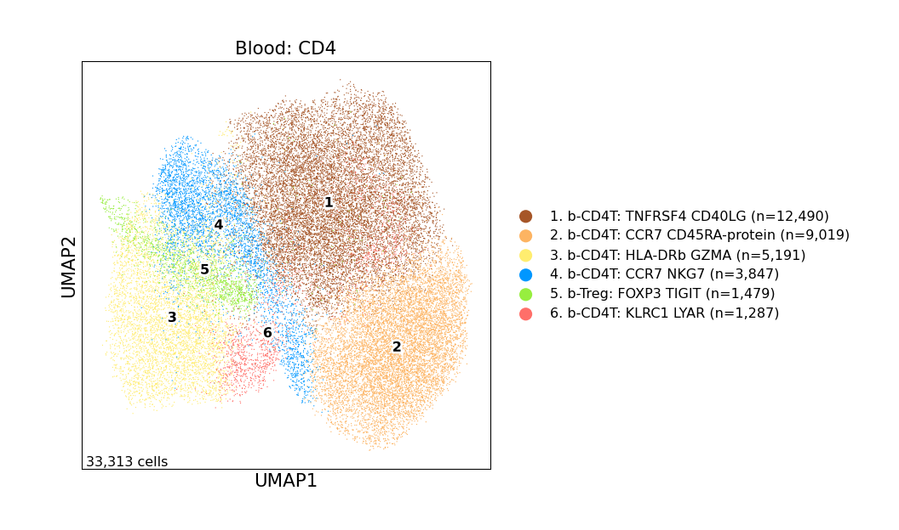

## Supplementary Figure 5B

``` python
python_functions.make_gene_dotplot(blood_cd4.to_anndata(),
                  cluster_order=['1. b-CD4T: TNFRSF4 CD40LG',
                                 '2. b-CD4T: CCR7 CD45RA-protein',
                                 '3. b-CD4T: HLA-DRb GZMA',
                                 '4. b-CD4T: CCR7 NKG7',
                                 '6. b-CD4T: KLRC1 LYAR',
                                 '5. b-Treg: FOXP3 TIGIT'],
             gene_order=['TNFRSF4', 'CD40LG', 'CCR7', 'HLA-DRB1', 'GZMA', 'NKG7',
                         'TNFAIP3', 'KLRC1', 'LYAR', 'FOXP3', 'TIGIT'],
             title='Blood: CD4')
```

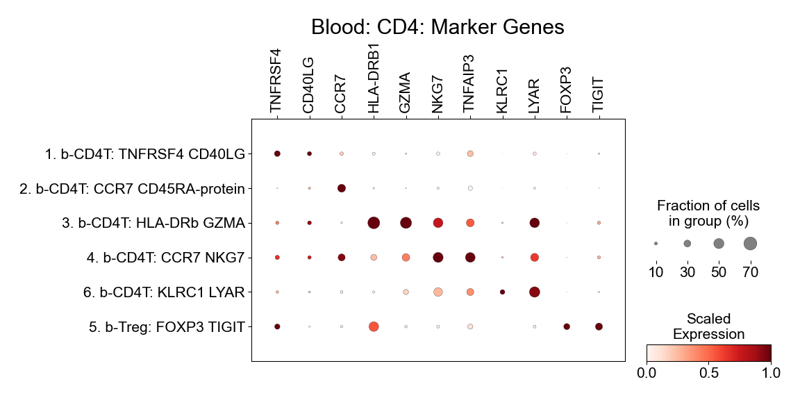

## Supplementary Figure 5C

``` r
# read in all blood cell metadata
blood_global_obs <- read_csv('/projects/home/ikernin/projects/myocarditis/github_datasets/blood_global_obs.csv')
condition_blood_obs_filtered <- condition_filter_df(blood_global_obs)

# fit cluster level model
condition_cluster_percents <- condition_get_percent_per_level(condition_blood_obs_filtered, level='cluster')
condition_cluster_model <- condition_fit_model(condition_cluster_percents, level='cluster')
condition_cluster_lineages <- condition_blood_obs_filtered %>% select(cluster_names, lineage_names) %>% distinct()

# get get cd4 lineage level results
cd4_order <- c('b-CD4T: TNFRSF4 CD40LG', 'b-CD4T: CCR7 CD45RA-protein', 'b-CD4T: HLA-DRb GZMA',
               'b-CD4T: CCR7 NKG7', 'b-CD4T: KLRC1 LYAR', 'b-Treg: FOXP3 TIGIT')
condition_cd4_percents <- condition_cluster_percents %>% filter(cluster_names %in% cd4_order)
condition_cd4_percents <- set_factor_order(condition_cd4_percents , col_name = 'cluster_names', order = cd4_order)
condition_cd4_model <- condition_cluster_model %>% filter(cluster_names %in% cd4_order)
condition_cd4_model <- set_factor_order(condition_cd4_model , col_name = 'cluster_names', order = cd4_order)
kable(condition_cd4_model %>%
              select(!c(data, model)) %>%
              unnest(cols = c(condition_coef, condition_se, condition_pval)))

condition_plot_sample_perc(condition_cd4_percents, title='CD4')
```

    ## Warning: Transformation introduced infinite values in continuous y-axis

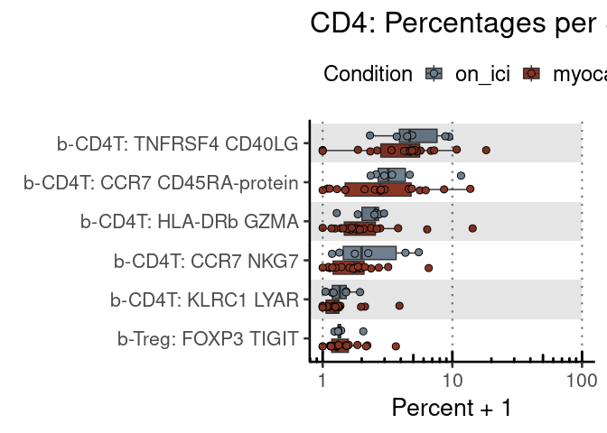<!-- -->

``` r
condition_plot_ci_interval(condition_cd4_model, 'CD4', level='cluster')
```

    ## Warning: Using the `size` aesthetic with geom_rect was deprecated in ggplot2 3.4.0.
    ## ℹ Please use the `linewidth` aesthetic instead.

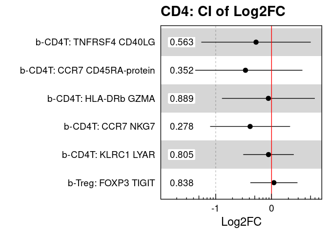<!-- -->

| cluster\_names              | condition\_coef | condition\_se | condition\_pval |      padj |     CI\_low |  CI\_high |
| :-------------------------- | --------------: | ------------: | --------------: | --------: | ----------: | --------: |
| b-CD4T: CCR7 CD45RA-protein |     \-0.4670385 |     0.4916641 |       0.3524756 | 0.9780158 | \-1.4866874 | 0.5526104 |
| b-CD4T: CCR7 NKG7           |     \-0.3837991 |     0.3452618 |       0.2783035 | 0.9780158 | \-1.0998281 | 0.3322300 |
| b-CD4T: HLA-DRb GZMA        |     \-0.0567060 |     0.4009087 |       0.8888067 | 0.9780158 | \-0.8881398 | 0.7747279 |
| b-CD4T: KLRC1 LYAR          |     \-0.0545127 |     0.2182511 |       0.8050824 | 0.9780158 | \-0.5071377 | 0.3981124 |
| b-CD4T: TNFRSF4 CD40LG      |     \-0.2778384 |     0.4726198 |       0.5626068 | 0.9780158 | \-1.2579919 | 0.7023151 |
| b-Treg: FOXP3 TIGIT         |       0.0422423 |     0.2036303 |       0.8375699 | 0.9780158 | \-0.3800612 | 0.4645457 |

## Supplementary Figure 5D

``` r
# read in all blood cell metadata
fatal_blood_obs_filtered <- fatal_filter_df(blood_global_obs)

# fit cluster level model
fatal_cluster_percents <- fatal_get_percent_per_level(fatal_blood_obs_filtered, level='cluster')
fatal_cluster_model <- fatal_fit_model(fatal_cluster_percents, level='cluster')
fatal_cluster_lineages <- fatal_blood_obs_filtered %>% select(cluster_names, lineage_names) %>% distinct()

# get get cd4 lineage level results
fatal_cd4_percents <- fatal_cluster_percents %>% filter(cluster_names %in% cd4_order)
fatal_cd4_percents <- set_factor_order(fatal_cd4_percents , col_name = 'cluster_names', order = cd4_order)
fatal_cd4_model <- fatal_cluster_model %>% filter(cluster_names %in% cd4_order)
fatal_cd4_model <- set_factor_order(fatal_cd4_model , col_name = 'cluster_names', order = cd4_order)
kable(fatal_cd4_model %>%
              select(!c(data, model)) %>%
              unnest(cols = c(fatal_coef, fatal_se, fatal_pval)))

fatal_plot_sample_perc(fatal_cd4_percents, title='CD4')
```

    ## Warning: Transformation introduced infinite values in continuous y-axis

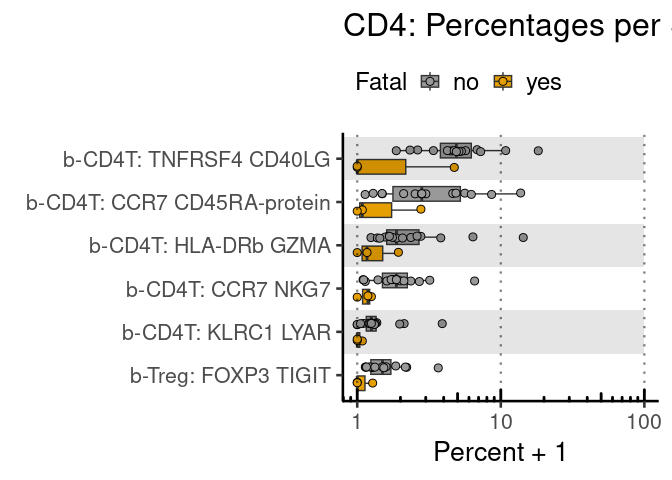<!-- -->

``` r
fatal_plot_ci_interval(fatal_cd4_model, 'CD4', level='cluster')
```

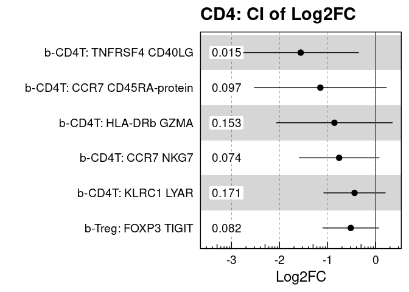<!-- -->

| cluster\_names              | fatal\_coef | fatal\_se | fatal\_pval |      padj |    CI\_low |    CI\_high |
| :-------------------------- | ----------: | --------: | ----------: | --------: | ---------: | ----------: |
| b-CD4T: CCR7 CD45RA-protein | \-1.1496895 | 0.6515858 |   0.0967353 | 0.3482471 | \-2.530990 |   0.2316108 |
| b-CD4T: CCR7 NKG7           | \-0.7579666 | 0.3959425 |   0.0736349 | 0.3270269 | \-1.597327 |   0.0813940 |
| b-CD4T: HLA-DRb GZMA        | \-0.8560761 | 0.5711575 |   0.1533846 | 0.3624134 | \-2.066876 |   0.3547237 |
| b-CD4T: KLRC1 LYAR          | \-0.4368870 | 0.3048995 |   0.1711397 | 0.3624134 | \-1.083245 |   0.2094710 |
| b-CD4T: TNFRSF4 CD40LG      | \-1.5584701 | 0.5720797 |   0.0150081 | 0.1571825 | \-2.771225 | \-0.3457152 |
| b-Treg: FOXP3 TIGIT         | \-0.5156441 | 0.2776150 |   0.0817567 | 0.3270269 | \-1.104162 |   0.0728734 |

## Supplementary Figure 5E

``` python
## plot cite-seq
sup_fig5e_cite = ['CD45RA', 'CD45RO']
python_functions.multi_hex_featureplot(blood_cd4_adt,
                      sup_fig5e_cite,
                      ncol=2,
                      cmap='YlGn',
                      gridsize=200)
## plot gex
```

    ##   0%|                                                    | 0/2 [00:00<?, ?it/s] 50%|######################                      | 1/2 [00:00<00:00,  1.78it/s]100%|############################################| 2/2 [00:01<00:00,  2.04it/s]100%|############################################| 2/2 [00:01<00:00,  2.00it/s]


``` python
supp_fig5e_gex = ['CCR7', 'TNFRSF4', 'HLA-DRB1', 'GZMA', 'FOXP3']
python_functions.multi_hex_featureplot(blood_cd4,
                      supp_fig5e_gex,
                      ncol=3,
                      cmap=python_functions.blues_cmap,
                      gridsize=200)
```

    ##   0%|                                                    | 0/5 [00:00<?, ?it/s] 20%|########8                                   | 1/5 [00:00<00:02,  1.41it/s] 40%|#################6                          | 2/5 [00:01<00:01,  1.56it/s] 60%|##########################4                 | 3/5 [00:01<00:01,  1.50it/s] 80%|###################################2        | 4/5 [00:02<00:00,  1.46it/s]100%|############################################| 5/5 [00:03<00:00,  1.54it/s]100%|############################################| 5/5 [00:03<00:00,  1.51it/s]

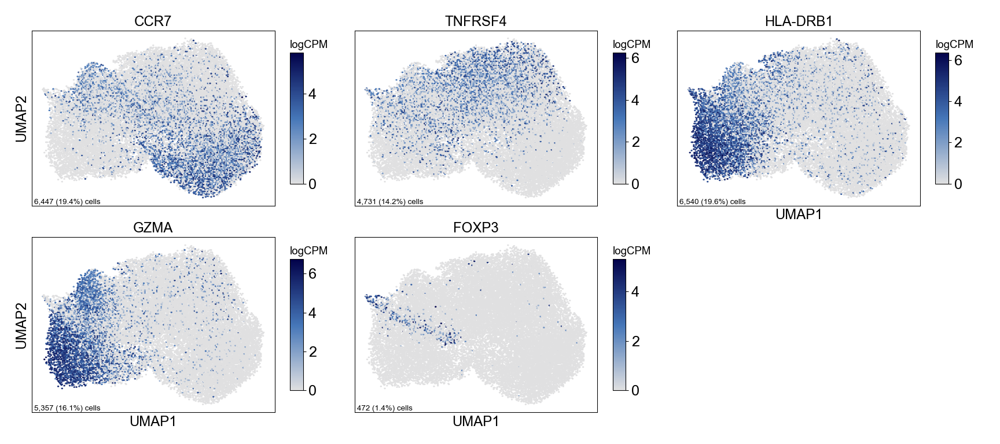

## Supplementary Figure 5F

``` python
python_functions.plot_umap(blood_b, 'Blood: B and Plasma', python_functions.blood_b_pal, wspace=.9, marker_multiplier=8)
```

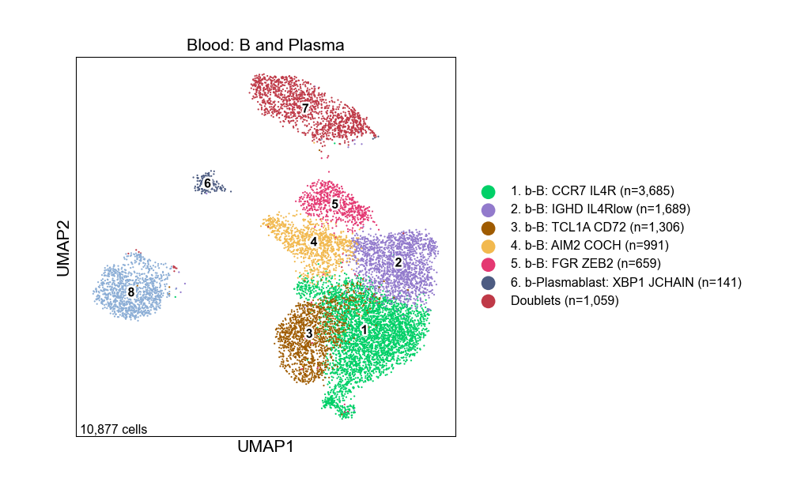

## Supplementary Figure 5G

``` python
python_functions.make_gene_dotplot(blood_b.to_anndata(),
             cluster_order=['1. b-B: CCR7 IL4R',
                            '2. b-B: IGHD IL4Rlow',
                            '3. b-B: TCL1A CD72',
                            '4. b-B: AIM2 COCH',
                            '5. b-B: FGR ZEB2',
                            '6. b-Plasmablast: XBP1 JCHAIN'],
             gene_order=['CCR7', 'IL4R', 'IGHD', 'TCL1A', 'CD72', 'AIM2', 'COCH',
                         'FGR', 'ZEB2', 'XBP1', 'JCHAIN'],
             title='Blood: B and Plasma')
```

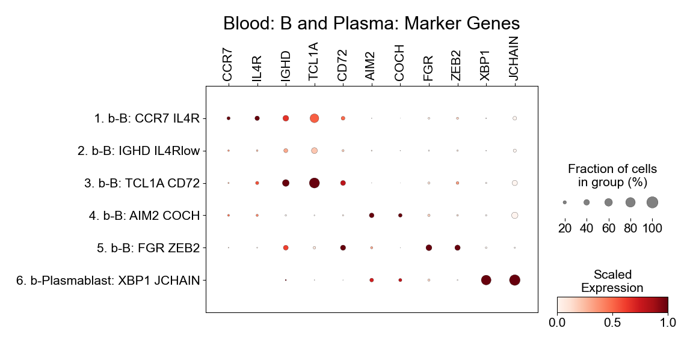

## Supplemental Figure 5H

``` r
# get get b lineage level results
b_order <- c('b-B: CCR7 IL4R', 'b-B: IGHD IL4Rlow', 'b-B: TCL1A CD72',
               'b-B: AIM2 COCH', 'b-B: FGR ZEB2', 'b-Plasmablast: XBP1 JCHAIN')
condition_b_percents <- condition_cluster_percents %>% filter(cluster_names %in% b_order)
condition_b_percents <- set_factor_order(condition_b_percents , col_name = 'cluster_names', order = b_order)
condition_b_model <- condition_cluster_model %>% filter(cluster_names %in% b_order)
condition_b_model <- set_factor_order(condition_b_model , col_name = 'cluster_names', order = b_order)
kable(condition_b_model %>%
              select(!c(data, model)) %>%
              unnest(cols = c(condition_coef, condition_se, condition_pval)))

condition_plot_sample_perc(condition_b_percents, title='B and Plasma')
```

    ## Warning: Transformation introduced infinite values in continuous y-axis

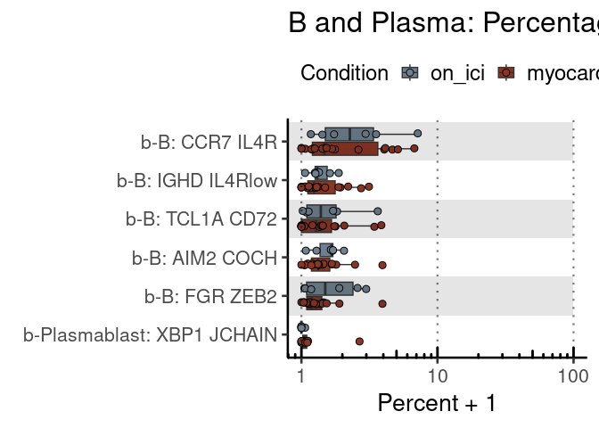<!-- -->

``` r
condition_plot_ci_interval(condition_b_model, 'B and Plasma', level='cluster')
```

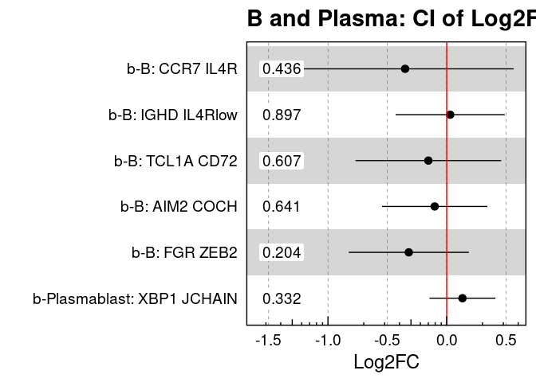<!-- -->

| cluster\_names             | condition\_coef | condition\_se | condition\_pval |      padj |     CI\_low |  CI\_high |
| :------------------------- | --------------: | ------------: | --------------: | --------: | ----------: | --------: |
| b-B: AIM2 COCH             |     \-0.1011715 |     0.2138158 |       0.6407522 | 0.9780158 | \-0.5445984 | 0.3422554 |
| b-B: CCR7 IL4R             |     \-0.3503280 |     0.4410580 |       0.4355114 | 0.9780158 | \-1.2650263 | 0.5643703 |
| b-B: FGR ZEB2              |     \-0.3195284 |     0.2439823 |       0.2038308 | 0.9780158 | \-0.8255167 | 0.1864599 |
| b-B: IGHD IL4Rlow          |       0.0291546 |     0.2215776 |       0.8965145 | 0.9780158 | \-0.4303692 | 0.4886784 |
| b-B: TCL1A CD72            |     \-0.1544607 |     0.2957970 |       0.6067602 | 0.9780158 | \-0.7679062 | 0.4589848 |
| b-Plasmablast: XBP1 JCHAIN |       0.1324811 |     0.1336719 |       0.3324170 | 0.9780158 | \-0.1447374 | 0.4096996 |

## Supplemental Figure 5I

``` r
# get get b lineage level results
fatal_b_percents <- fatal_cluster_percents %>% filter(cluster_names %in% b_order)
fatal_b_percents <- set_factor_order(fatal_b_percents , col_name = 'cluster_names', order = b_order)
fatal_b_model <- fatal_cluster_model %>% filter(cluster_names %in% b_order)
fatal_b_model <- set_factor_order(fatal_b_model , col_name = 'cluster_names', order = b_order)
kable(fatal_b_model %>%
              select(!c(data, model)) %>%
              unnest(cols = c(fatal_coef, fatal_se, fatal_pval)))

fatal_plot_sample_perc(fatal_b_percents, title='B and Plasma')
```

    ## Warning: Transformation introduced infinite values in continuous y-axis

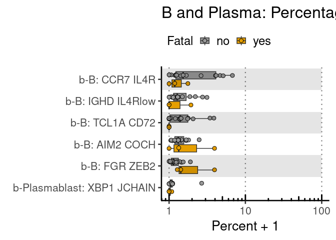<!-- -->

``` r
fatal_plot_ci_interval(fatal_b_model, 'B and Plasma', level='cluster')
```

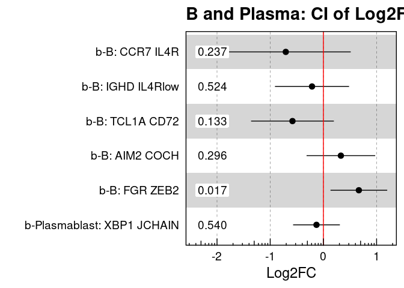<!-- -->

| cluster\_names             | fatal\_coef | fatal\_se | fatal\_pval |      padj |     CI\_low |  CI\_high |
| :------------------------- | ----------: | --------: | ----------: | --------: | ----------: | --------: |
| b-B: AIM2 COCH             |   0.3284929 | 0.3042562 |   0.2963011 | 0.4967208 | \-0.3165014 | 0.9734873 |
| b-B: CCR7 IL4R             | \-0.7073289 | 0.5760276 |   0.2372272 | 0.4430086 | \-1.9284529 | 0.5137951 |
| b-B: FGR ZEB2              |   0.6664746 | 0.2514879 |   0.0174647 | 0.1571825 |   0.1333440 | 1.1996052 |
| b-B: IGHD IL4Rlow          | \-0.2141181 | 0.3285963 |   0.5239002 | 0.6474234 | \-0.9107111 | 0.4824750 |
| b-B: TCL1A CD72            | \-0.5814042 | 0.3670951 |   0.1328037 | 0.3624134 | \-1.3596112 | 0.1968028 |
| b-Plasmablast: XBP1 JCHAIN | \-0.1300089 | 0.2073587 |   0.5395195 | 0.6474234 | \-0.5695897 | 0.3095720 |
