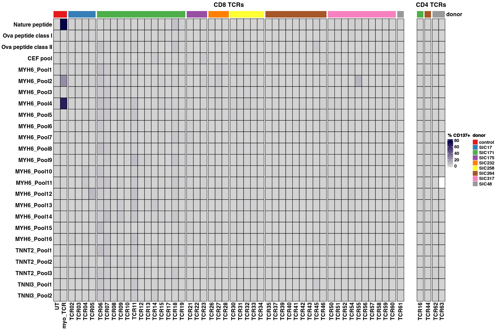

Supplemental Figure 6
================

## Setup

Load R libraries

``` r
library(tidyverse)
library(ComplexHeatmap)
library(circlize)
library(RColorBrewer)
library(ggplot2)
library(ggrepel)
```

## Supplemental figure 6B

``` r
colors <- brewer.pal(n = 10, "Set1")
```

    ## Warning in brewer.pal(n = 10, "Set1"): n too large, allowed maximum for palette Set1 is 9
    ## Returning the palette you asked for with that many colors

``` r
cd137_data <- read.csv("/projects/home/nealpsmith/projects/myocarditis/antigen_discovery/data/cd137_vals.csv", row.names = 1)
# Make the lowest value 0
# cd137_data[is.na(cd137_data)] <- 0
cd137_data[cd137_data < 0] <- 0
tcr_info <- read.csv("/projects/home/nealpsmith/projects/myocarditis/antigen_discovery/data/tcr_annotations.csv")

donor_colors <- colors[1:length(unique(tcr_info$donor))]
names(donor_colors) <- unique(tcr_info$donor)

cd8_tcrs <- tcr_info[tcr_info$subset == "CD8",]

heatmap_df_cd8 <- cd137_data[,cd8_tcrs$tcr]

# Need a continuous color scale
heatmap_col_fun = colorRamp2(c(min(heatmap_df_cd8), max(heatmap_df_cd8)), c("#D3D3D3", '#02024a'))

# Lets do the column split
donor_split <- factor(cd8_tcrs$donor)
annotation_cd8 <- HeatmapAnnotation(donor = cd8_tcrs$donor, col = list(donor = donor_colors), which = "column",
                                    show_annotation_name = FALSE)

cd8_hmap <- Heatmap(heatmap_df_cd8, col = heatmap_col_fun, cluster_columns = FALSE, cluster_rows = FALSE,
                    column_split = donor_split, column_title = "CD8 TCRs", name = "% CD137+",
                    top_annotation = annotation_cd8, rect_gp = gpar(col = "black"), row_names_side = "left", na_col = "white")
```

    ## Warning: The input is a data frame-like object, convert it to a matrix.

``` r
cd4_tcrs <- tcr_info[tcr_info$subset == "CD4",]

heatmap_df_cd4 <- cd137_data[,cd4_tcrs$tcr]

# Lets do the column split
donor_split <- factor(cd4_tcrs$donor)
annotation_cd4 <- HeatmapAnnotation(donor = cd4_tcrs$donor, col = list(donor = donor_colors), which = "column")

cd4_hmap <- Heatmap(heatmap_df_cd4, col = heatmap_col_fun, cluster_columns = FALSE, cluster_rows = FALSE,
                    column_split = donor_split, column_title = "CD4 TCRs", show_heatmap_legend = FALSE,
                    top_annotation = annotation_cd4, rect_gp = gpar(col = "black"), row_names_side = "left", na_col = "white")
```

    ## Warning: The input is a data frame-like object, convert it to a matrix.

``` r
hmap_list <- cd8_hmap + cd4_hmap

draw(hmap_list, ht_gap = unit(1, "cm"))
```

<!-- -->
