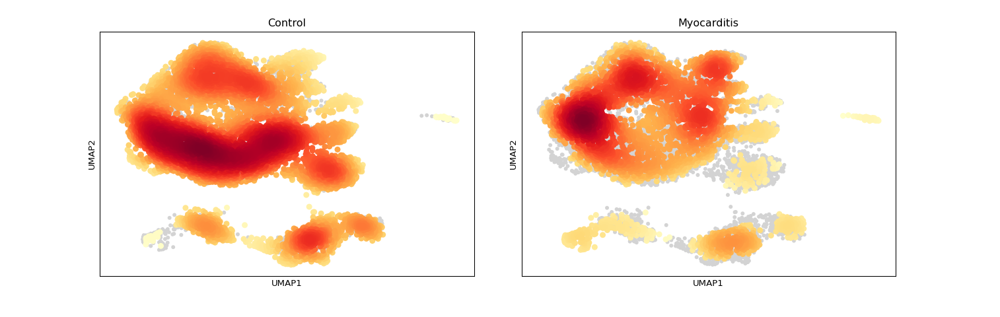
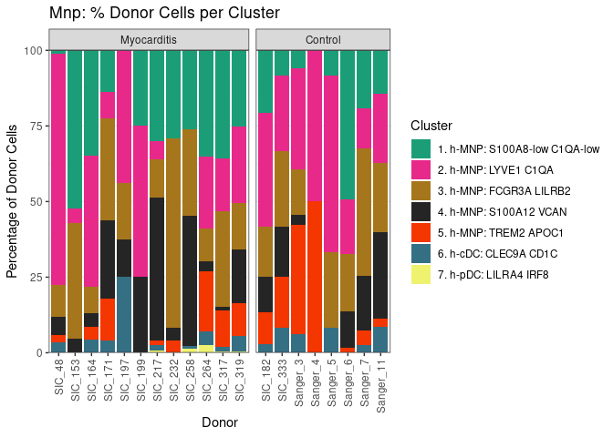
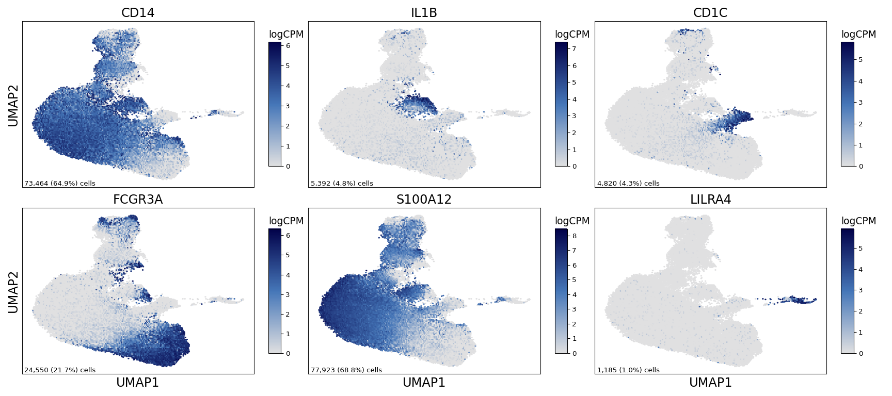
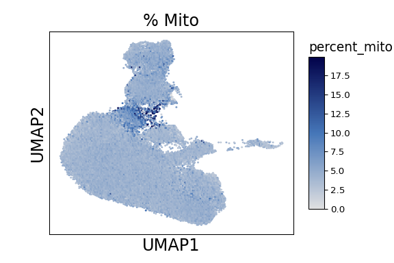
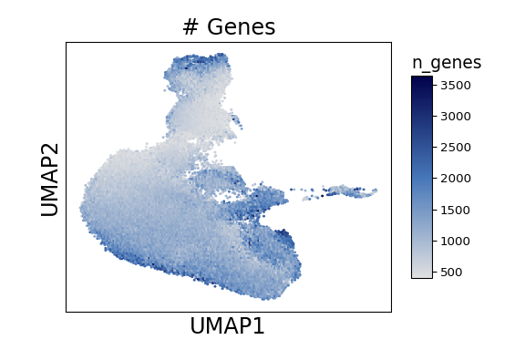
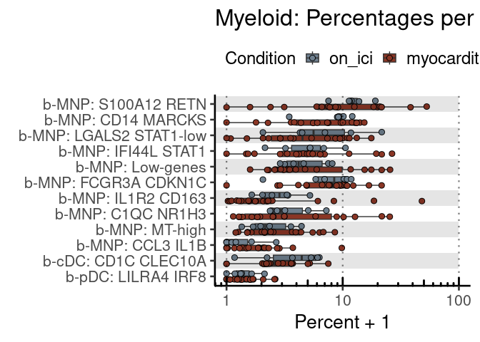
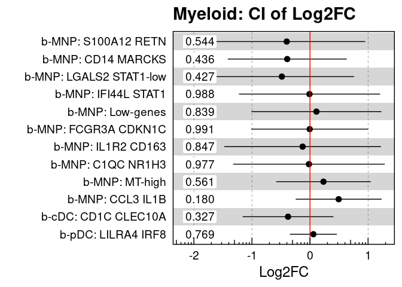

Supplemental Figure 6
================

## Setup

Load R libraries

``` r
library(tidyverse)
library(glue)
library(rlang)
library(parameters)
library(ggforestplot)
library(rmarkdown)
library(knitr)

library(reticulate)
use_python("/projects/home/nealpsmith/.conda/envs/updated_pegasus/bin/python")

setwd('/projects/home/ikernin/github_code/myocarditis/functions')
source('stacked_bar.R')
source('blood_condition_abundance.R')
```

Load Python packages

``` python
import pegasus as pg
import scanpy as sc
import warnings
warnings.filterwarnings('ignore')

import sys
sys.path.append("/projects/home/ikernin/github_code/myocarditis/functions")
import python_functions
```

Read in single-cell data

``` python
tissue_mnp = pg.read_input('/projects/home/ikernin/projects/myocarditis/github_datasets/tissue_myeloid.zarr')
```

``` python
blood_mnp = pg.read_input('/projects/home/ikernin/projects/myocarditis/github_datasets/blood_myeloid.zarr')
```

## Supplemental Figure 6A

``` python
tissue_mnp.obs['Condition'] = [x.capitalize() for x in tissue_mnp.obs['condition']]
tissue_mnp = tissue_mnp.to_anndata()
sc.tl.embedding_density(tissue_mnp, groupby='Condition')
```

    ## ... storing 'Condition' as categorical

``` python
sc.pl.embedding_density(tissue_mnp, basis='umap', key=f'umap_density_Condition', colorbar_loc=None)
```



## Supplemental Figure 6B

``` python
stacked_bar_df = python_functions.get_stacked_bar_df(tissue_mnp, 'mnp')
```

    ## Getting stacked bar info for: mnp
    ## 
    ## Trying to set attribute `.obs` of view, copying.

``` python
stacked_bar_order = tissue_mnp.obs['umap_name'].cat.categories.values
```

``` r
stacked_bar_order = py$stacked_bar_order[!str_detect(py$stacked_bar_order, 'Doublets')]
plot_clust_perc_by_donor(py$stacked_bar_df, 'mnp', cluster_order = stacked_bar_order)
```

    ## Warning in py_to_r.pandas.core.frame.DataFrame(x): index contains duplicated
    ## values: row names not set

<!-- -->

## Supplemental Figure 6E

``` python
supp_fig6e_genes = ['CD14','IL1B','CD1C','FCGR3A','S100A12','LILRA4']
python_functions.multi_hex_featureplot(blood_mnp, supp_fig6e_genes, ncol=3, cmap=python_functions.blues_cmap, gridsize=200)
```

    ##   0%|                                                                                               | 0/6 [00:00<?, ?it/s] 17%|##############5                                                                        | 1/6 [00:01<00:06,  1.34s/it] 33%|#############################                                                          | 2/6 [00:02<00:04,  1.25s/it] 50%|###########################################5                                           | 3/6 [00:03<00:03,  1.27s/it] 67%|##########################################################                             | 4/6 [00:05<00:02,  1.25s/it] 83%|########################################################################5              | 5/6 [00:06<00:01,  1.28s/it]100%|#######################################################################################| 6/6 [00:07<00:00,  1.25s/it]100%|#######################################################################################| 6/6 [00:07<00:00,  1.26s/it]



## Supplemental Figure 6F

``` python
python_functions.hex_plot(blood_mnp, "% Mito", n_genes=False, cmap=python_functions.blues_cmap)
```



``` python
python_functions.hex_plot(blood_mnp, "# Genes", n_genes=True, cmap=python_functions.blues_cmap)
```



## Supplemental Figure 6G

``` r
# read in all blood cell metadata
blood_global_obs <- read_csv('/projects/home/ikernin/projects/myocarditis/github_datasets/blood_global_obs.csv')
blood_obs_filtered <- condition_filter_df(blood_global_obs)

# fit cluster level model
cluster_percents <- condition_get_percent_per_level(blood_obs_filtered, level='cluster')
cluster_model <- condition_fit_model(cluster_percents, level='cluster')
cluster_lineages <- blood_obs_filtered %>% select(cluster_names, lineage_names) %>% distinct()

# get get myeloid lineage level results
myeloid_order <- c('b-MNP: S100A12 RETN', 'b-MNP: CD14 MARCKS', 'b-MNP: LGALS2 STAT1-low',
                   'b-MNP: IFI44L STAT1', 'b-MNP: Low-genes', 'b-MNP: FCGR3A CDKN1C',
                   'b-MNP: IL1R2 CD163', 'b-MNP: C1QC NR1H3', 'b-MNP: MT-high',
                   'b-MNP: CCL3 IL1B',"b-cDC: CD1C CLEC10A", "b-pDC: LILRA4 IRF8")
myeloid_percents <- cluster_percents %>% filter(cluster_names %in% myeloid_order)
myeloid_percents <- set_factor_order(myeloid_percents , col_name = 'cluster_names', order = myeloid_order)
myeloid_model <- cluster_model %>% filter(cluster_names %in% myeloid_order)
myeloid_model <- set_factor_order(myeloid_model , col_name = 'cluster_names', order = myeloid_order)
kable(myeloid_model %>%
              select(!c(data, model)) %>%
              unnest(cols = c(condition_coef, condition_se, condition_pval)))

condition_plot_sample_perc(myeloid_percents, title='Myeloid')
```

    ## Warning: Transformation introduced infinite values in continuous y-axis

<!-- -->

``` r
condition_plot_ci_interval(myeloid_model, 'Myeloid', level='cluster')
```

    ## Warning: Using the `size` aesthetic with geom_rect was deprecated in ggplot2 3.4.0.
    ## ℹ Please use the `linewidth` aesthetic instead.

<!-- -->

| cluster\_names          | condition\_coef | condition\_se | condition\_pval |      padj |     CI\_low |  CI\_high |
| :---------------------- | --------------: | ------------: | --------------: | --------: | ----------: | --------: |
| b-cDC: CD1C CLEC10A     |     \-0.3782286 |     0.3770728 |       0.3267352 | 0.9780158 | \-1.1602298 | 0.4037725 |
| b-MNP: C1QC NR1H3       |     \-0.0182256 |     0.6294799 |       0.9771628 | 0.9913612 | \-1.3236869 | 1.2872358 |
| b-MNP: CCL3 IL1B        |       0.4937004 |     0.3565200 |       0.1800051 | 0.9780158 | \-0.2456767 | 1.2330776 |
| b-MNP: CD14 MARCKS      |     \-0.3921465 |     0.4937881 |       0.4355859 | 0.9780158 | \-1.4162004 | 0.6319074 |
| b-MNP: FCGR3A CDKN1C    |     \-0.0053271 |     0.4864422 |       0.9913612 | 0.9913612 | \-1.0141465 | 1.0034923 |
| b-MNP: IFI44L STAT1     |     \-0.0085520 |     0.5863273 |       0.9884941 | 0.9913612 | \-1.2245204 | 1.2074163 |
| b-MNP: IL1R2 CD163      |     \-0.1270904 |     0.6505645 |       0.8469088 | 0.9780158 | \-1.4762786 | 1.2220977 |
| b-MNP: LGALS2 STAT1-low |     \-0.4849065 |     0.5991103 |       0.4269655 | 0.9780158 | \-1.7273851 | 0.7575722 |
| b-MNP: Low-genes        |       0.1108164 |     0.5398684 |       0.8392520 | 0.9780158 | \-1.0088021 | 1.2304350 |
| b-MNP: MT-high          |       0.2320371 |     0.3931272 |       0.5610481 | 0.9780158 | \-0.5832588 | 1.0473330 |
| b-MNP: S100A12 RETN     |     \-0.4011386 |     0.6516514 |       0.5444930 | 0.9780158 | \-1.7525808 | 0.9503035 |
| b-pDC: LILRA4 IRF8      |       0.0578457 |     0.1948931 |       0.7693977 | 0.9780158 | \-0.3463379 | 0.4620294 |
