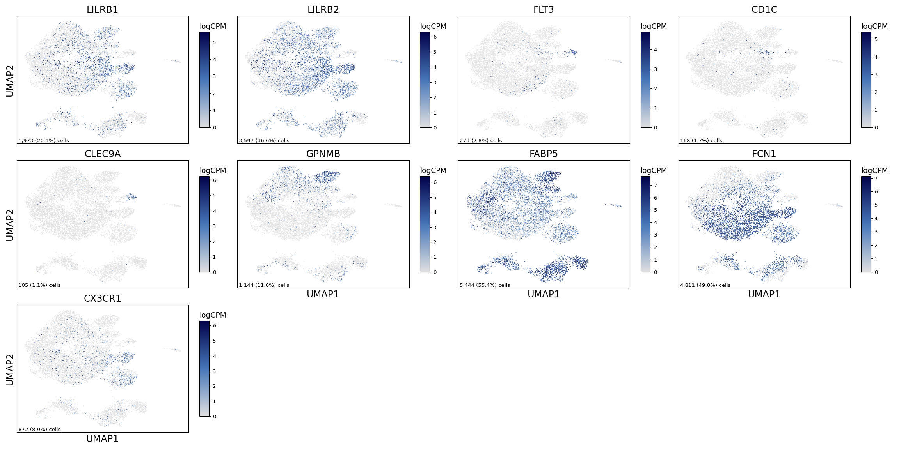
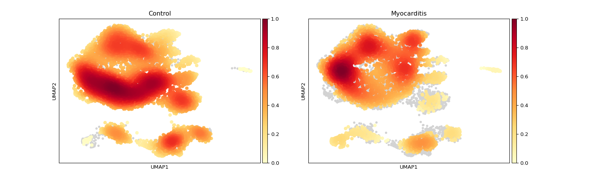
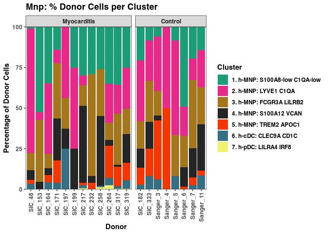

Supplemental Figure 7
================

## Setup

Load R libraries

``` r
library(tidyverse)
library(glue)
library(rlang)
library(parameters)
library(ggforestplot)
library(rmarkdown)
library(knitr)

library(reticulate)
use_python("/projects/home/nealpsmith/.conda/envs/updated_pegasus/bin/python")

setwd('/projects/home/nealpsmith/publication_githubs/myocarditis/functions')
source('stacked_bar.R')
source('blood_condition_abundance.R')
```

Load Python packages

``` python
import pegasus as pg
import scanpy as sc
import warnings
warnings.filterwarnings('ignore')

import sys
sys.path.append("/projects/home/nealpsmith/publication_githubs/myocarditis/functions")
import python_functions
```

Read in single-cell data

``` python
tissue_mnp = pg.read_input('/projects/home/ikernin/projects/myocarditis/github_datasets/tissue_myeloid.zarr')
```

## Supplemental Figure 7A

``` python

supp_7a_genes = ["LILRB1", "LILRB2", "FLT3", "CD1C", "CLEC9A", "GPNMB", "FABP5", "FCN1", "CX3CR1"]
python_functions.multi_hex_featureplot(tissue_mnp,
                      supp_7a_genes,
                      ncol=4,
                      cmap=python_functions.blues_cmap,
                      gridsize=200)
```

    ##   0%|                                                                                                                                                                                                                 | 0/9 [00:00<?, ?it/s] 11%|######################3                                                                                                                                                                                  | 1/9 [00:00<00:02,  3.07it/s] 22%|############################################6                                                                                                                                                            | 2/9 [00:00<00:02,  3.13it/s] 33%|###################################################################                                                                                                                                      | 3/9 [00:00<00:01,  3.50it/s] 44%|#########################################################################################3                                                                                                               | 4/9 [00:01<00:01,  3.44it/s] 56%|###############################################################################################################6                                                                                         | 5/9 [00:01<00:01,  3.76it/s] 67%|######################################################################################################################################                                                                   | 6/9 [00:01<00:00,  3.62it/s] 78%|############################################################################################################################################################3                                            | 7/9 [00:01<00:00,  3.90it/s] 89%|##################################################################################################################################################################################6                      | 8/9 [00:02<00:00,  3.69it/s]100%|#########################################################################################################################################################################################################| 9/9 [00:02<00:00,  3.98it/s]



## Supplemental Figure 7B

``` python
tissue_mnp.obs['Condition'] = [x.capitalize() for x in tissue_mnp.obs['condition']]
tissue_mnp = tissue_mnp.to_anndata()
sc.tl.embedding_density(tissue_mnp, groupby='Condition')
sc.pl.embedding_density(tissue_mnp, basis='umap', key=f'umap_density_Condition')
```



## Supplemental Figure 7C

``` python
tissue_mnp = pg.read_input('/projects/home/ikernin/projects/myocarditis/github_datasets/tissue_myeloid.zarr')
```

    ## 2024-01-09 16:22:33,682 - pegasusio.readwrite - INFO - zarr file '/projects/home/ikernin/projects/myocarditis/github_datasets/tissue_myeloid.zarr' is loaded.
    ## 2024-01-09 16:22:33,682 - pegasusio.readwrite - INFO - Function 'read_input' finished in 0.15s.

``` python
stacked_bar_df = python_functions.get_stacked_bar_df(tissue_mnp, 'mnp')
```

    ## Getting stacked bar info for: mnp

``` python
stacked_bar_order = tissue_mnp.obs['umap_name'].cat.categories.values
```

``` r
stacked_bar_order = py$stacked_bar_order[!str_detect(py$stacked_bar_order, 'Doublets')]
plot_clust_perc_by_donor(py$stacked_bar_df, 'mnp', cluster_order = stacked_bar_order)
```

    ## Warning in py_to_r.pandas.core.frame.DataFrame(x): index contains duplicated
    ## values: row names not set

<!-- -->
