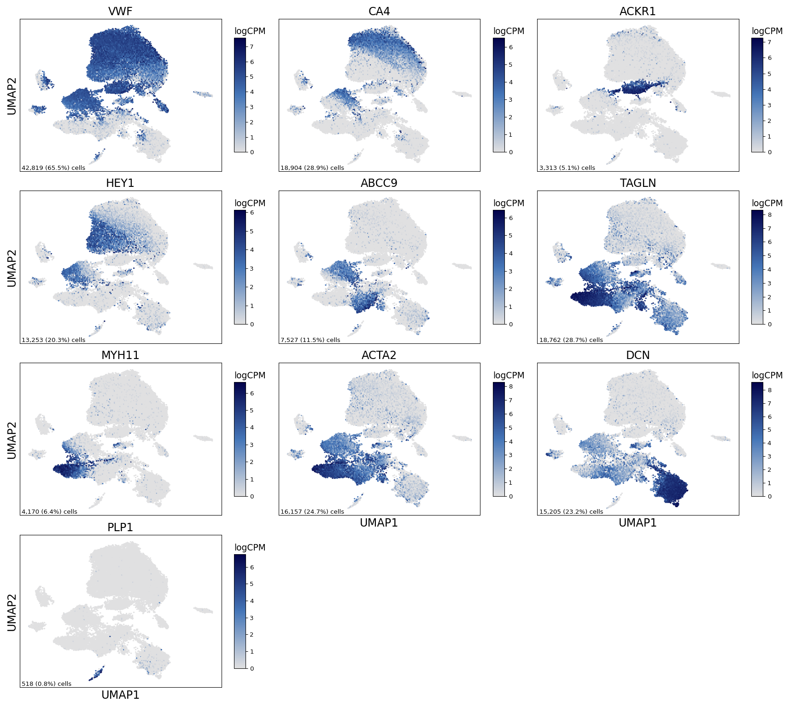
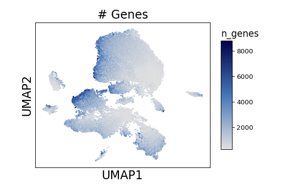
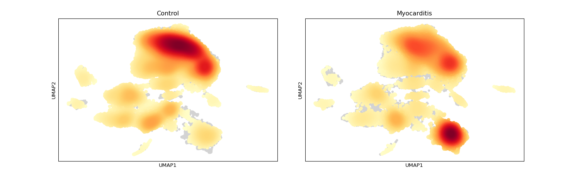
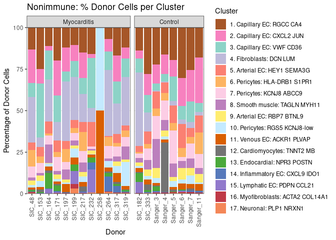

Supplementary Figure 7
================

## Setup

Load R libraries

``` r
## load required R packages
library(tidyverse)
library(glue)
library(RColorBrewer)
library(reticulate)
use_python("/projects/home/nealpsmith/.conda/envs/updated_pegasus/bin/python")

setwd('/projects/home/ikernin/github_code/myocarditis/functions')
source('stacked_bar.R')
```

Load Python packages

``` python
import pegasus as pg
import scanpy as sc
import warnings
warnings.filterwarnings('ignore')

import sys
sys.path.append("/projects/home/ikernin/github_code/myocarditis/functions")
import python_functions
```

Read in single-cell data

``` python
tissue_nonimmune = pg.read_input('/projects/home/ikernin/projects/myocarditis/github_datasets/tissue_nonimmune.zarr')
```

## Supplementary Figure 7A

``` python
supp_fig7a_genes = ['VWF', 'CA4', 'ACKR1', "HEY1", "ABCC9", "TAGLN", "MYH11", "ACTA2", "DCN", "PLP1"]
python_functions.multi_hex_featureplot(tissue_nonimmune, supp_fig7a_genes, ncol=3, cmap=python_functions.blues_cmap, gridsize=200)
```

    ##   0%|                                                   | 0/10 [00:00<?, ?it/s] 10%|####3                                      | 1/10 [00:01<00:09,  1.01s/it] 20%|########6                                  | 2/10 [00:01<00:07,  1.07it/s] 30%|############9                              | 3/10 [00:02<00:06,  1.04it/s] 40%|#################2                         | 4/10 [00:03<00:05,  1.08it/s] 50%|#####################5                     | 5/10 [00:04<00:04,  1.05it/s] 60%|#########################8                 | 6/10 [00:05<00:03,  1.08it/s] 70%|##############################1            | 7/10 [00:06<00:02,  1.05it/s] 80%|##################################4        | 8/10 [00:07<00:01,  1.08it/s] 90%|######################################7    | 9/10 [00:08<00:00,  1.05it/s]100%|##########################################| 10/10 [00:09<00:00,  1.08it/s]100%|##########################################| 10/10 [00:09<00:00,  1.06it/s]



## Supplementary Figure 7B

``` python
python_functions.hex_plot(tissue_nonimmune, "% Mito", n_genes=False, cmap=python_functions.blues_cmap)
```


``` python
python_functions.hex_plot(tissue_nonimmune, "# Genes", n_genes=True, cmap=python_functions.blues_cmap)
```



## Supplementary Figure 7C

``` python
tissue_nonimmune.obs['Condition'] = [x.capitalize() for x in tissue_nonimmune.obs['condition']]
tissue_nonimmune = tissue_nonimmune.to_anndata()
sc.tl.embedding_density(tissue_nonimmune, groupby='Condition')
```

    ## ... storing 'Condition' as categorical

``` python
sc.pl.embedding_density(tissue_nonimmune, basis='umap', key=f'umap_density_Condition', colorbar_loc=None)
```



## Supplementary Figure 7D

``` python
stacked_bar_df = python_functions.get_stacked_bar_df(tissue_nonimmune, 'nonimmune')
```

    ## Getting stacked bar info for: nonimmune
    ## 
    ## Trying to set attribute `.obs` of view, copying.

``` python
stacked_bar_order = tissue_nonimmune.obs['umap_name'].cat.categories.values
```

``` r
stacked_bar_order = py$stacked_bar_order[!str_detect(py$stacked_bar_order, 'Doublets')]
plot_clust_perc_by_donor(py$stacked_bar_df, 'nonimmune', cluster_order = stacked_bar_order)
```

    ## Warning in py_to_r.pandas.core.frame.DataFrame(x): index contains duplicated
    ## values: row names not set

<!-- -->
